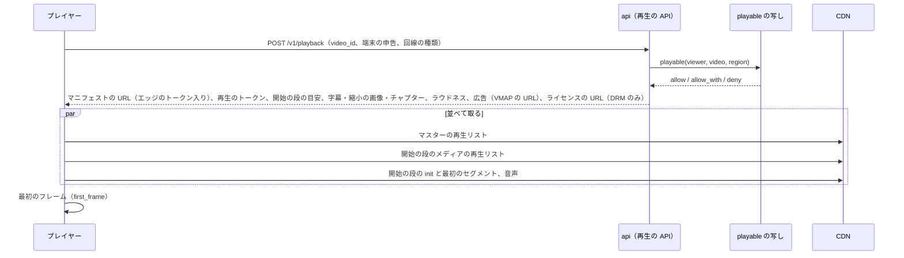
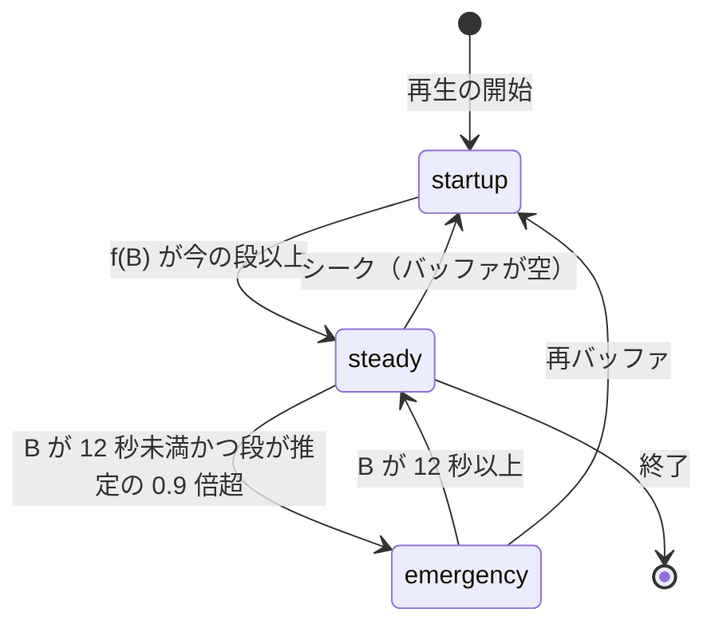

# Playback and ABR: YouTube

視聴者の端末で動画を再生するところを決める。プレイヤーの構成（Web・Android・iOS・テレビ）、再生の API と再生のトークン、開始の段の選び方、ABR（バッファに基づく形）と具体の値と模擬の例、ライブの低遅延のモードの ABR、再生の品質の計測（開始の時間・再バッファ・画質）、広告の枠の挿入、プレイヤーの外部送信を扱う。

前提となる決定は次のとおり。

- 見える範囲は `playable()`。再生の API はマニフェストの短い期限の署名つきの URL、広告の枠、DRM のライセンスの URL を返す（[ADR-0009](../decisions/0009-single-tenant-and-playable.md)）
- CMAF のセグメント 4 秒、マニフェストは能力の組ごと（[ADR-0004](../decisions/0004-cmaf-packaging-and-drm-scope.md)、[ADR-0020](../decisions/0020-manifest-generation-and-capability-classes.md)）
- 視聴の出来事（`play_start`、心拍、`seek`、`quality_change`、`rebuffer`、`ad_*`、`end`）と再生のトークン（10 時間）は [ADR-0007](../decisions/0007-two-phase-view-counting.md)
- Web と Android は自前の ABR、iOS は AVPlayer（[architecture/README.md](README.md) の 6 節）
- ライブの低遅延は LL-HLS、部分 0.5 秒（[ADR-0006](../decisions/0006-live-ingest-and-latency.md)）

この文書で決めたことは次の ADR にある。

| ADR | 決定 |
| --- | --- |
| [0022](../decisions/0022-buffer-based-abr.md) | Web と Android の ABR は、開始の間は回線の推定（推定 × 0.7 以下の最上段）、その後はバッファの量の写像（貯め 8 秒、緩め 32 秒）で選ぶ。バッファ 12 秒未満では推定 × 0.9 で頭を抑え、取得の途中で間に合わないと分かったら捨てて下の段で取り直す。低遅延のライブは回線の推定（× 0.7）と再生の速さの調整（0.95〜1.05 倍）で選ぶ |
| [0023](../decisions/0023-playback-token-and-qoe-metrics.md) | 再生の API は、Ed25519 で署名した再生のトークン（10 時間）と、エッジのトークン（6 時間）を返す。QoE は `play_intent` から `first_frame` までを開始の時間とし、広告の時間を除く。再バッファの割合は「止まった時間 ÷（再生の時間 ＋ 止まった時間）」で、シークの待ちと開始を除く。出来事は `watch-events` に載せ、視聴の計測と同じ流れで集める |
| [0024](../decisions/0024-client-side-ad-insertion.md) | 広告はクライアントの側で挿入する（VMAP と VAST をプレイヤーが読み、本編と別に再生する）。サーバーの側の挿入（SSAI）は MVP で作らない。途中の広告の位置は 4 秒のセグメントの境に丸める |

## 1. 範囲

- 扱う：
  - プレイヤーの構成と、端末ごとの ABR の担い手
  - 再生の API の要求と応答、再生のトークン、能力の組の決め方
  - 開始の段の選び方と、開始の時間の予算
  - ABR の方式・値・模擬、ライブの ABR
  - QoE の指標の定義と出来事
  - 広告の枠の挿入の方式（売り方と分配は monetization-and-payouts の領域）
  - プレイヤーの外部送信の枠組み（**法務の確認待ち：L6**）
- 扱わない：
  - マニフェストとセグメントの形（[packaging-and-drm.md](packaging-and-drm.md)）
  - エッジの署名と拒否の一覧（[cdn-and-delivery.md](cdn-and-delivery.md)）
  - 視聴回数の判定（view-counting-and-analytics の領域）。この文書は出来事を出す側だけ
  - QoE のダッシュボードと SLI（observability の領域）
  - プレイヤーの画面の配置（**法務の確認待ち：L9**）

## 2. 要件

| 要件 | 目標 | NFR |
| --- | --- | --- |
| 開始の時間 | 再生の要求から最初のフレームまで p50 1.0 秒・p95 2.5 秒（日本、CDN のヒット） | NFR-003、K3 |
| 開始の失敗 | 0.5% 以下 | NFR-003 |
| 再バッファ | 総再生時間の 0.5% 以下。再生 100 分あたり 0.3 回以下 | NFR-004 |
| 画質 | 平均の VMAF（画面の大きさで重み付け）80 以上 | NFR-004 |
| 再生の API | 月間 99.95% | NFR-010 |
| ライブの遅延 | 低遅延のモードで撮影から画面まで p50 4 秒・p95 6 秒 | NFR-005 |

## 3. プレイヤーの構成

| 端末 | プレイヤー | ABR | DRM |
| --- | --- | --- | --- |
| Web（Chrome・Edge・Firefox） | 自前（React と MSE）。DASH を既定、HLS も読める | 自前（`abr-core`） | Widevine、PlayReady（Edge） |
| Web（Safari） | 自前（MSE、HLS）。MSE の使えない iPhone の Safari は `<video>` に HLS を渡す | 自前。`<video>` の HLS は OS | FairPlay |
| Android | Media3（ExoPlayer）＋自前の `abr-core`（Kotlin へ移した同じ判断の部分） | 自前 | Widevine |
| iOS | AVPlayer（HLS） | OS。`preferredPeakBitRate`・`preferredMaximumResolution` と能力の組で頭を抑える | FairPlay |
| テレビ | Web の形（テレビのブラウザ） | 自前 | 機種による |

- `abr-core` は、時計とネットワークを外から渡す純粋な判断の部分にする。Web（TypeScript）を正本にし、Android（Kotlin）は同じ試験のベクトルを通す。`abr-sim` は同じコードを仮想の時計で動かす（[quality.md](../quality.md) の 2.2.1 節 B）。
- 本家のプレイヤーのコードと形式は使わない（[リポジトリ共通の ADR-0007](../../../../docs/decisions/0007-no-reuse-of-original-implementation.md)）。

## 4. 再生の API とトークン（ADR-0023）

### 4.1 流れ



- 再生の API の応答に「開始の段の目安」（6.1 節の規則で API の側が出したもの）と、その段の URL を含める。プレイヤーはマスターの再生リストを待たずに、開始の段の取得を始められる。往復を 1 回減らす。
- `deny` は理由を出さない一般の応答にする（非公開の動画の有無を推測させない。[quality.md](../quality.md) の 2.2.1 節 G）。

### 4.2 トークン

| トークン | 中身 | 署名・期限 | 確かめる側 |
| --- | --- | --- | --- |
| 再生のトークン | `v`（`video_id`）、`u`（利用者の ID のハッシュ、匿名は端末の識別子のハッシュ）、`d`（端末の識別子のハッシュ）、`caps`、`rg`（地域）、`drm`、`sid`（再生のセッション）、`iat`、`exp` | Ed25519、10 時間（ADR-0007） | `event-collector`、`license-proxy`、`api` |
| エッジのトークン | `video_id`、`caps`、許す地域、`exp`、鍵の番号 | HMAC-SHA256、6 時間（ADR-0005） | CDN のエッジの関数（[cdn-and-delivery.md](cdn-and-delivery.md) の 5 節） |

- 2 つに分けるのは、エッジの関数で公開鍵の署名を確かめられる保証がないためである（**未検証**。`cdn-cost-poc` で確かめ、できれば 1 つにまとめる）。
- エッジのトークンの期限の 10 分前に、プレイヤーは再生の API を呼び直す。`playable()` をもう一度通るので、措置と会員の終わりがここでも効く。
- ヘッダー：`<Brand>-Playback-Token`（リポジトリ共通の ADR-0006）。

### 4.3 能力の組の決め方

1. 端末の申告（`MediaCapabilities` の AV1 の復号、画面の大きさと画素の密度、DRM の方式と守りの段）を受ける。
2. 既知の機種の表（申告と実際が違う機種の上書き）を当てる。
3. コーデック：AV1 をハードウェアで復号できるか、ソフトウェアでも 1080p を落とさず復号できる端末だけ `a`。電池で動く端末のソフトウェアの復号は `h`。
4. 段の上限：短い辺 × 画素の密度 ≤ 1,080 の電話は `m`、他は `1080`、4K の画面は `2160`。
5. 利用者が画質を手で選んだら、上限を外して取り直す。

## 5. ABR（ADR-0022）

### 5.1 値（VOD）

| 値 | 既定 | 意味 |
| --- | --- | --- |
| `SEG` | 4 秒 | セグメントの長さ |
| `r`（貯め） | 8 秒 | これ以下のバッファでは最下段 |
| `c`（緩め） | 32 秒 | `r` から `r + c` の間で、最下段から最上段へ直線で写す |
| バッファの上限 | 60 秒（携帯の回線は 30 秒） | これを超えたら取得を待つ |
| 開始の係数 | 推定 × 0.6（最初の 1 セグメント）、× 0.7（開始の間） | — |
| 非常の頭 | バッファ 12 秒未満で、推定 × 0.9 を超える段を選ばない | — |
| 捨てる規則 | 取得の経過が `SEG / 2` 以上で、残りの予測の時間がバッファ − `r` を超える | 捨てて、測った速さ × 0.8 以下の段で取り直す |
| 推定 | セグメントごとの速さの指数の移動平均。速い（α 0.5）と遅い（α 0.2）の小さいほう | — |
| 最初の推定 | 端末に残した前回の推定（回線の種類ごと、24 時間）。なければ 1.5 Mbps | — |

### 5.2 規則

```
f(B) = R_min                                   （B ≤ r）
     = R_min + (B − r) / c × (R_max − R_min)   （r < B < r + c）
     = R_max                                   （B ≥ r + c）

開始の間：段 = 推定 × 0.7 以下の最上段。f(B) ≥ 今の段 になったら定常へ移る
定常：R+ = 今の 1 つ上、R− = 今の 1 つ下
      f(B) ≥ R+ なら、f(B) 未満の最上段（f(B) ≥ R_max なら最上段）
      f(B) ≤ R− なら、f(B) を超える最下の段
      その他は今の段のまま
非常：B < 12 秒 かつ 段 > 推定 × 0.9 なら、推定 × 0.9 以下の最上段
```

- 段の候補は、能力の組で絞ったマニフェストの段から、さらに画面の高さ × 画素の密度を超える段を除いたもの。
- 定常の規則はバッファの量だけで決まり、推定の揺れに引きずられない（バッファに基づく形の考え方は Huang らの論文による。出典は末尾）。

### 5.3 状態



### 5.4 模擬の例

ゲームの実況のラダー（170・330・560・1,100・2,300・4,500 kbps。[transcoding-pipeline.md](transcoding-pipeline.md) の 5.2 節で 4.3 Mbps の段を 4.5 Mbps に丸めた）を、次の回線で再生する。0〜30 秒は 6 Mbps、30〜80 秒はトンネルで 0.6 Mbps、80 秒の後は 5 Mbps。往復の遅れ 80 ms。前回の推定はない（1.5 Mbps）。

| # | 取得の開始（秒） | 段（kbps） | 取得の時間（秒） | 取得の後のバッファ（秒） | 推定（kbps） | 状態 | 出来事 |
| --- | --- | --- | --- | --- | --- | --- | --- |
| 1 | 0.0 | 560 | 0.45 | 4.0 | 6,000 | 開始 | 最初のフレーム 0.45 秒（＋API とマニフェスト） |
| 2 | 0.5 | 2,300 | 1.61 | 6.4 | 6,000 | 開始 | 推定 × 0.7 = 4,200 以下の最上段 |
| 3〜10 | 2.1〜13.4 | 2,300 | 1.61 | 8.8〜25.5 | 6,000 | 開始 | 1 セグメントで 2.4 秒ずつ貯まる |
| 11 | 15.0 | 2,300 | 1.61 | 27.9 | 6,000 | 定常 | f(25.5) ≈ 2,538 ≥ 2,300 で定常へ |
| 12〜17 | 16.6〜24.7 | 2,300 | 1.61 | 30.3〜42.2 | 6,000 | 定常 | f が 4,500 に届かない |
| 18 | 26.3 | 4,500 | 3.08 | 43.1 | 6,000 | 定常 | f(42.2) ≥ 4,500 で最上段 |
| 19 | 29.3 | 4,500 | 24.68 | 22.4 | 3,366 | 定常 | トンネルに入る。バッファが厚いので捨てない |
| 20 | 56.1 | 330 | 2.28 | 22.1 | 1,983 | 定常 | 2,300 を取り始め 2.1 秒で捨て、0.6 × 0.8 以下の 330 で取り直す |
| 21〜22 | 58.4〜65.8 | 1,100 | 7.41 | 18.7〜15.2 | 1,291〜946 | 定常 | f が 1,100〜2,300 の間 |
| 23〜24 | 75.3〜79.7 | 330 | 2.28・0.61 | 14.9〜16.2 | 773〜1,636 | 定常 | 1,100 を捨てて 330 |
| 25〜27 | 80.3〜82.2 | 1,100 | 0.96 | 19.2〜25.3 | 2,923〜3,671 | 定常 | トンネルを出る |
| 28〜35 | 83.1〜96.6 | 2,300 | 1.92 | 27.4〜42.0 | 3,937〜4,777 | 定常 | — |
| 36〜 | 98.5〜 | 4,500 | 3.68 | 42.3〜 | 4,822〜 | 定常 | 最上段に戻る |

- 50 秒のトンネル（0.6 Mbps）の間に再バッファは 0 回。捨てる規則が 3 回効いた。
- 最上段に上がったのは 26 秒の後で、開始の直後に高い段へ急がない。開始の時間と再バッファを優先する。
- この表は `abr-sim` の試験のベクトルにする（同じ入力で同じ列）。

### 5.5 ライブの ABR

| モード | 規則 |
| --- | --- |
| 低遅延（LL-HLS、目標の遅れ 3 秒前後） | バッファは 1〜3 秒しかないので、バッファの写像を使わない。推定 × 0.7 以下の最上段。推定は、部分の取得のうち、要求から最初のバイトまでが 50 ms 未満のもの（すでにでき上がっていた部分）だけで測る。要求の保留の待ちを速さに数えない |
| 低遅延の速さの調整 | 目標の遅れ（`PART-HOLD-BACK` ＋ 0.5 秒）より 0.5 秒以上遅れたら 1.05 倍で再生して追いつく。バッファが 0.5 秒未満なら 0.95 倍。音声のピッチは保つ |
| 通常（2 秒のセグメント） | VOD と同じ規則で、`r` = 4 秒、`c` = 8 秒、バッファの上限 = 3 セグメント以上（ADR-0006） |
| DVR（ライブの端から 30 秒以上戻った） | VOD の規則 |

- 低遅延のモードで再バッファが 1 分に 2 回を超えたら、プレイヤーは目標の遅れを 1 秒延ばす（最大で通常のモードの遅れ）。

## 6. 開始の速さ

### 6.1 開始の段

- 再生の API が、前回の推定（端末が申告）から、推定 × 0.6 以下の最上段を「開始の段の目安」として返す。推定がなければ 1.5 Mbps とみなし、560 kbps 前後の段になる。
- 最初の 1 セグメント（4 秒）を取ったら再生を始める。

### 6.2 予算（p50、CDN のヒット）

| 区間 | 時間 |
| --- | --- |
| 再生の API（`playable()` を含む） | 80 ms |
| マスター、メディアの再生リスト、`init`、最初のセグメント（並べて取る。560 kbps の 4 秒 ≈ 280 KB、10 Mbps の回線） | 300 ms |
| 音声の最初のセグメント（並べる） | 0 ms（上と重なる） |
| 復号と最初のフレームの描画 | 100 ms |
| 画面の準備（プレイヤーの部品の読み込みは前もって行う） | 100 ms |
| 合計 | 約 0.6 秒 |

- p95 2.5 秒は、遅い回線（2 Mbps）と CDN の外れ（`origin-cache` から 200 ms）を含めて見込む。メンバー限定の動画はライセンスの先取りで p95 ＋300 ms 以内（[packaging-and-drm.md](packaging-and-drm.md) の 8.4 節）。
- 再生の前の広告は、開始の時間に数えず、広告の開始の時間として別に測る（7 節）。

## 7. QoE の計測（ADR-0023）

### 7.1 出来事

ADR-0007 の出来事に次を足す。どれも再生のトークンを付けて `event-collector` に送る。

| 出来事 | いつ | 中身 |
| --- | --- | --- |
| `play_intent` | 利用者の再生の操作、または自動の再生の開始 | `sid`、時刻、自動か |
| `first_frame` | 本編の最初のフレームの描画（ADR-0007 の `play_start` と同じ時点。同じ出来事を兼ねる） | 開始の時間、開始の段 |
| `start_failure` | 最初のフレームの前のエラー、または 30 秒で最初のフレームが出ない | エラーのコード |
| `rebuffer` | 最初のフレームの後の、シークでない止まり。再開の時に送る | 止まった時間、段、バッファ |
| 心拍の追加の値 | 心拍ごと | 区間の段ごとの秒数、捨てたバイト、推定 |

- 本文・題・検索の語・IP アドレスを出来事に入れない。`event-collector` が IP アドレスを粗くする（ADR-0007）。

### 7.2 指標の定義

| 指標 | 定義 | 目標 |
| --- | --- | --- |
| 開始の時間 | `first_frame − play_intent`。再生の前の広告の時間を除く | p50 1.0 秒・p95 2.5 秒 |
| 開始の失敗 | `start_failure` の数 ÷ `play_intent` の数。利用者が 30 秒より前に離れたもの（開始の前の離脱）は別に数える | 0.5% 以下 |
| 再バッファの割合 | Σ 止まった時間 ÷（Σ 再生の時間 ＋ Σ 止まった時間）。開始とシークの待ちを除く | 0.5% 以下 |
| 再バッファの回数 | 再生 100 分あたりの `rebuffer` の数 | 0.3 回以下 |
| 平均の VMAF | 再生した秒ごとの段の VMAF（`ladders` の値。電話はスマートフォンのモデル）の時間の加重平均 | 80 以上 |
| 段の切り替え | 再生 1 分あたりの `quality_change` | 記録だけ |

- 集計は、同じ `watch-events` から observability の領域が行う。CDN ごと・ISP（ASN）ごと・端末ごとに分ける。S2 の複数の CDN の振り分けは、この値を使う（[cdn-and-delivery.md](cdn-and-delivery.md) の 12 節）。

## 8. 広告の枠（ADR-0024）

- 方式：クライアントの側の挿入。プレイヤーは再生の API が返した VMAP の URL（本システムの広告の判断の口。monetization-and-payouts の領域）を読み、広告の枠の位置と VAST を得る。広告の動画は本編と別の再生として流し、本編のバッファは保つ。
- VAST・VMAP の読み取りは自前の実装（公開の標準。AGENTS.md）。
- 枠の位置：再生の前、途中、後。途中の枠は、創作者の指定かチャプターの境を、近い 4 秒のセグメントの境に丸める。8 分未満の動画は途中の枠を置かない（本システムの値。本家の値は**未検証**）。
- `playable()` が `allow_with: no_ads`（子ども向けなど）を返した動画は、VMAP を取らない。
- 広告の表示の出来事（`ad_*`）は、本システムの `event-collector` に送る。VAST に書かれた第三者の計測の URL への送信は、外部送信に当たる（8.1 節）。

### 8.1 外部送信（**法務の確認待ち：L6**）

| 送り先 | 中身 | MVP |
| --- | --- | --- |
| 本システムの `event-collector` | 7.1 節の出来事 | 送る |
| 外部の広告サーバー（VAST の要求） | 広告の要求の値（monetization-and-payouts の領域で決める） | 送る（通知・公表の文言は法務の確認待ち） |
| VAST の第三者の計測の URL | 表示の通知 | 送る（同上） |
| 第三者の解析のタグ | — | 置かない |

## 9. 失敗と回復

| 失敗 | 起きること | 回復 |
| --- | --- | --- |
| 再生の API の失敗 | 開始できない | 指数の後退で 2 回やり直す。`start_failure` を送る |
| マニフェストの 403（エッジのトークンの期限切れ） | 取得が止まる | 再生の API を呼び直し、新しい URL で続ける（位置は保つ） |
| セグメントの 404・5xx | 取得の失敗 | 同じ段で 1 回、次に 1 つ下の段で取り直す。3 回続けば、S2 では別の CDN のホストへ（[cdn-and-delivery.md](cdn-and-delivery.md) の 12 節） |
| 復号のエラー | 再生が止まる | その段を候補から外し、下の段で続ける。`start_failure` か `rebuffer` に記録 |
| AV1 の復号の遅れ（フレームの落ち 5% 超） | 画質が落ちる | そのセッションで `h` の組に切り替える（トークンを取り直す） |
| ライセンスの失敗 | メンバー限定の動画が開始できない | 1 回やり直す。だめなら開始の失敗 |
| 出来事の送信の失敗 | 計測が欠ける | 端末に 100 件まで貯めて送り直す。順序と重複は `view-rules` が扱う（ADR-0007） |

## 10. 上限

| 対象 | 値 |
| --- | --- |
| バッファの上限 | 60 秒（携帯の回線は 30 秒） |
| 再生の API の要求 | 端末あたり 1 分に 60 回（超えたら 429） |
| 出来事の送信 | 端末あたり 1 分に 120 件、1 件 4 KB |
| 再生のトークン | 10 時間 |
| エッジのトークン | 6 時間 |

## 11. data-model への項目

列・キー・索引の正本は [data-model.md](data-model.md) と [data-model/](data-model/) の各ファイルである。この節は提案の記録として残す（2026-10-10 のデータモデルの工程）。

| 表・置き場 | 中身 | 節 |
| --- | --- | --- |
| MSK `watch-events` に足す型 | `play_intent`、`start_failure`、心拍の段ごとの秒数と捨てたバイト | 7.1 |
| `device_overrides`（運用の表） | 機種の識別、AV1 の可否の上書き、段の上限の上書き | 4.3 |
| 署名の鍵 | 再生のトークンの Ed25519 の鍵（2 つを並べて回す）、エッジのトークンの HMAC の鍵（[cdn-and-delivery.md](cdn-and-delivery.md)） | 4.2 |
| 端末（ローカル） | 回線の種類ごとの前回の推定（24 時間） | 5.1 |

## 12. テストと性質

| ID | 性質・試験 |
| --- | --- |
| PROP-ABR-001 | 帯域が十分に長く最上段を上回るとき、段は最上段に達する（[quality.md](../quality.md) の 2.2.1 節 B） |
| PROP-ABR-002 | バッファが `r` 以下のとき、最下段より上の段を選ばない |
| PROP-ABR-003 | 定常で、バッファが単調に増える間に段は下がらない |
| PROP-ABR-004 | 同じ入力（回線の記録、段の表、時計）から同じ判断の列が出る（Web と Android で同じ） |
| PROP-QOE-001 | 任意の出来事の列（順序の入れ替え、重複、欠け）で、開始の時間と再バッファの割合の集計が、出来事の順序によらず同じ |
| DT-QOE-001 | 指標の定義の決定表：広告の前・シーク・開始の前の離脱・30 秒の失敗 |
| `abr-sim` | 回線の記録 500 本（PR）・5,000 本（夜間）で NFR-003・NFR-004 を満たし、前のバージョンより再バッファの割合が 10% 以上悪くならない。5.4 節の表を試験のベクトルにする |
| 端末の試験 | 代表の機種で、開始の時間、DRM、LL-HLS の遅れ |
| 合成監視 | 見張りの動画の再生（AZ・ISP の代表） |

## 13. Story の候補

| Epic | Story | 中身 |
| --- | --- | --- |
| E4 | `playback-api-and-token` | 4 節（ADR-0023） |
| E4 | `abr-algorithm` | 5 節（ADR-0022、PROP-ABR-001〜004） |
| E4 | `abr-sim` | 5.4 節と回線の記録 |
| E4 | `web-player`、`android-player`、`ios-player` | 3 節（画面の配置は**法務の確認待ち：L9**） |
| E4 | `qoe-telemetry` | 7 節（PROP-QOE-001、DT-QOE-001。外部送信の公表は**法務の確認待ち：L6**） |
| E14 | `client-side-ads` | 8 節（ADR-0024） |
| E12 | `ll-hls-abr` | 5.5 節（`ll-hls-poc` の結果を受けて） |

## 14. 未解決の問い

### 決定（2026-10-10、既定案）

- **ABR**：開始は回線、定常はバッファ（8 秒・32 秒）、非常の頭、捨てる規則（ADR-0022）。
- **トークン**：再生のトークン（Ed25519、10 時間）とエッジのトークン（HMAC、6 時間）の 2 つ（ADR-0023）。
- **QoE の定義**：開始は `play_intent` から、広告を除く（ADR-0023）。
- **広告**：クライアントの側の挿入。SSAI は MVP の後（ADR-0024）。

### 持ち越し

| 問い | いつ・どう決めるか |
| --- | --- |
| エッジの関数で Ed25519 を確かめられるか（**未検証**） | `cdn-cost-poc`。できればトークンを 1 つにする |
| `r`・`c`・係数の値 | `abr-sim` の回線の記録の集まりで調整する。値の変更は ABR のバージョンとして出す |
| LL-HLS の端末ごとの振る舞い | `ll-hls-poc` |
| プレイヤーの外部送信の通知・公表の文言 | **法務の確認待ち：L6** |
| プレイヤーの画面の配置 | **法務の確認待ち：L9** |
| 途中の広告の最短の動画の長さ（8 分） | monetization-and-payouts の領域 |

## 出典

いずれも 2026-10-10 に確認。

- IETF, [draft-pantos-hls-rfc8216bis-22](https://datatracker.ietf.org/doc/html/draft-pantos-hls-rfc8216bis)（`PART-HOLD-BACK`、要求の保留）
- T.-Y. Huang ほか, A Buffer-Based Approach to Rate Adaptation: Evidence from a Large Video Streaming Service, ACM SIGCOMM 2014（バッファの写像の考え方。論文の数値は使わない。本文の確認は**未検証**）
- IAB Tech Lab, VAST・VMAP（公開の標準。バージョンの細部は monetization-and-payouts の領域で確かめる：**未検証**）
