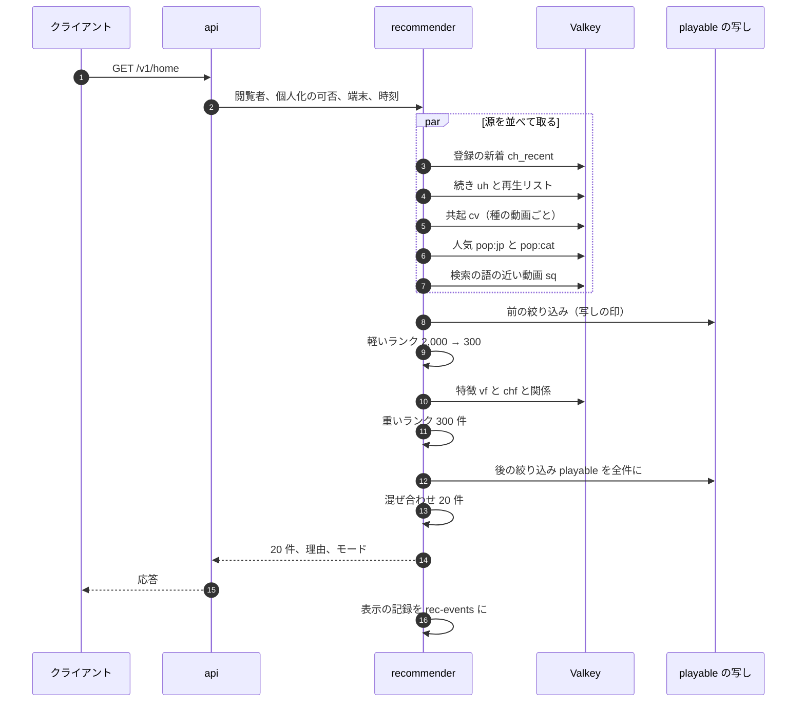

# Recommendations: YouTube

ホームと「次の動画」のおすすめを決める。候補の源（共起の作り方を含む）、前の絞り込み、特徴、2 段のスコア（軽いランクと重いランク）、後の絞り込みとガードレール、混ぜ合わせ（多様さの規則）、理由と表示の記録、視聴の履歴の操作と個人化しない並び（子ども向けの制限を含む）、オフラインの評価と A/B、学習の範囲（**法務の確認待ち：L5・L8**）を扱う。

前提となる決定は次のとおり。

- 自前の段のパイプライン。ML は取り出しとスコアだけ。`playable()`・年齢・子ども向け・照合・措置を ML で変えない。S1 は規則と手の式、S2 から学習済みのモデル（[ADR-0010](../decisions/0010-recommendation-boundary.md)。X の題材の境界 [ranking-and-recommendation.md](../../../x/docs/architecture/ranking-and-recommendation.md) に寄せる）
- 人気と特徴の視聴の数は確定の数（[ADR-0007](../decisions/0007-two-phase-view-counting.md)、[view-counting-and-analytics.md](view-counting-and-analytics.md) の 5.2 節）
- 見える範囲は `playable()` の 1 か所。索引や候補の写しで絞った後、返す前にもう一度通す（[ADR-0009](../decisions/0009-single-tenant-and-playable.md)）
- 遅延はホームの最初のページ p99 400 ms、次の動画 p99 300 ms。落ちたら個人化しない並び（NFR-012）

この文書で決めたことは次の ADR にある。

| ADR | 決定 |
| --- | --- |
| [0038](../decisions/0038-candidate-sources-covisitation-and-two-stage-ranking.md) | 候補の源は登録・続き・共起・人気・検索の 5 つ（次の動画は今の動画を種にする）。共起は 28 日の確定のエンゲージ ビューのセッションから余弦の値で作り、動画ごとに上位 100 を持つ。軽いランク（2,000 → 300、源の加点と確定の人気）と重いランク（S1 は「表示からの再生の率 × log2(1 ＋ 期待の視聴の分) × 関係 × 質 × 新しさ」）の 2 段で並べる |
| [0039](../decisions/0039-diversity-mixer-history-controls-and-non-personalized-feed.md) | 混ぜ合わせは 1 ページ 20 件で、同じチャンネル 2 件まで・続けない、同じカテゴリ 6 件まで、60 分を超える動画 5 件まで、新しい創作者の枠 1 件。履歴の停止・消去は 24 時間以内に特徴と候補から消す。子ども向けの動画の視聴中、履歴の停止、ログインしていない利用者は、個人化しない源（人気・今のチャンネル・カテゴリ）だけにする |

## 1. 範囲

- 扱う：
  - ホーム（ログインの有無）と「次の動画」（再生の画面の横と、終わりの自動の再生）
  - 候補の源、共起の作り方、特徴、スコア、絞り込み、混ぜ合わせ
  - 理由と表示の記録、表示からの再生の率
  - 視聴の履歴の停止・消去と、個人化しない並び
  - オフラインの評価、A/B、ガードレール、学習の範囲
- 扱わない：
  - 登録のフィード（時刻の順。[channels-subscriptions-and-notifications.md](channels-subscriptions-and-notifications.md) の 5 節）
  - 検索の順位（[search.md](search.md)）
  - 視聴の数の判定（[view-counting-and-analytics.md](view-counting-and-analytics.md)）
  - 措置・年齢の制限・子ども向けの印の付け方（[comments-and-moderation.md](comments-and-moderation.md) の 7・8 節）。この文書はそれを読む
  - 広告（再生の中だけ。おすすめの並びに広告の枠を持たない）

## 2. 要件

| 要件 | 目標 | NFR・根拠 |
| --- | --- | --- |
| ホームの最初のページ | p99 400 ms（20 件） | NFR-012 |
| 次の動画 | p99 300 ms（20 件） | NFR-012 |
| 可用性 | スコアが落ちても、代わりの並びで返す。どちらで返したかを記録する | NFR-012、[ADR-0010](../decisions/0010-recommendation-boundary.md) |
| 見える範囲 | `playable()` が `deny` の動画を返さない。年齢の確かめのない利用者に年齢の制限の動画を返さない | NFR-014、[ADR-0009](../decisions/0009-single-tenant-and-playable.md) |
| 子ども向け | 子ども向けの動画の視聴中は、視聴の履歴を使った源の候補 0 件 | [ADR-0010](../decisions/0010-recommendation-boundary.md)、**法務の確認待ち：L3** |
| 履歴の消去 | 消した履歴を 24 時間以内に特徴と候補から消す | [ADR-0010](../decisions/0010-recommendation-boundary.md)、**法務の確認待ち：L5** |
| 水増しへの強さ | 人気と特徴に仮の数を使わない | [ADR-0007](../decisions/0007-two-phase-view-counting.md) |

## 3. 本家の形（確かめたこと）

| 項目 | 本家 | 出典 |
| --- | --- | --- |
| 信号 | クリック、視聴の時間、アンケートの回答（「価値のある視聴の時間」）、共有、高評価、低評価 | [On YouTube's recommendation system](https://blog.youtube/inside-youtube/on-youtubes-recommendation-system/)（2021-09-15） |
| 境界の動画 | 規約の違反に近い動画を分類し、おすすめで順位を下げる。境界の動画の視聴をおすすめからの視聴の 0.5% 未満にする目標 | 同上 |
| 履歴の停止と消去 | 停止の間に見た動画は履歴に入らない。消した履歴をおすすめの元にしない。履歴を止めていて意味のある履歴がない人には、ホームのおすすめを出さない | [View, delete, or pause watch history](https://support.google.com/youtube/answer/95725) |
| 自動の消去の期間 | ページに期間の値が書かれていない（**未検証**） | 同上 |

いずれも 2026-10-10 に確認。

**本家との違い**：本家は、履歴を止めていて履歴のない利用者にホームのおすすめを出さない。本システムは、個人化しない並び（人気・カテゴリ）を出す（[ADR-0010](../decisions/0010-recommendation-boundary.md)。[architecture/README.md](README.md) の 1.4 節への行の追加は 16 節の持ち越し）。

## 4. 全体の流れ

### 4.1 ホーム



### 4.2 次の動画

- 種は今見ている動画 `v0`。源は、`v0` の共起（上位 200）、`v0` のチャンネルの新しい動画と人気の動画（20）、再生リストやシリーズの次（1〜5）、`v0` のカテゴリの人気（100）。
- ログインしていて履歴を止めていない利用者は、ホームの源（登録の新着、続き）も少し混ぜる（最大 4 件）。
- 終わりの自動の再生は、並びの 1 件目。1 件目は「続き（再生リストの次）」があればそれにする。
- `v0` が子ども向けなら、11.3 節の個人化しない並びにする。

### 4.3 遅延の予算

| 区間 | ホーム p99 | 次の動画 p99 |
| --- | --- | --- |
| 入口（認証、個人化の可否） | 30 ms | 30 ms |
| 源の取り出し（並べる） | 120 ms | 80 ms |
| 前の絞り込み | 30 ms | 20 ms |
| 軽いランク | 20 ms | 15 ms |
| 特徴の付加 | 70 ms | 50 ms |
| 重いランク | 40 ms | 30 ms |
| 後の絞り込み（`playable()`） | 30 ms | 25 ms |
| 混ぜ合わせ・組み立て | 10 ms | 10 ms |
| 余裕 | 50 ms | 40 ms |

- 源ごとに締め切りを置く。間に合わない源は捨てて、残りで続ける（`partial`）。

## 5. 候補の源（ADR-0038）

| 源 | 中身 | 件数の上限 | 個人化 |
| --- | --- | --- | --- |
| `subs_new` | 登録したチャンネルの直近 14 日の公開の動画（`ch_recent:`、[channels-subscriptions-and-notifications.md](channels-subscriptions-and-notifications.md) の 5 節） | 200 | 使う |
| `continue` | 直近 30 日に 5〜90% まで見た動画、再生リスト・シリーズの次 | 20 | 使う |
| `covisit` | 直近 20 本のエンゲージ ビューの動画を種に、各種の共起の上位（種ごと 40） | 600 | 使う |
| `popular` | 日本の人気（24 時間と 7 日の確定のエンゲージ ビュー）、カテゴリごとの人気 | 200 | 使わない |
| `search_rel` | 直近 7 日の検索の語の上位 3 つで、検索の上位 20（[search.md](search.md) の 6 節の組み立てを使う） | 60 | 使う |
| `channel_ctx` | 今見ている動画のチャンネルの動画（次の動画と、子ども向けの並び） | 20 | 使わない |
| `category` | 今見ている動画のカテゴリの人気 | 100 | 使わない |

### 5.1 共起の作り方

- 元：直近 28 日の 1 日の確定の `watch_sessions`（[view-counting-and-analytics.md](view-counting-and-analytics.md) の 7.2 節）のうち、エンゲージ ビュー。子ども向けの動画の視聴と、履歴を止めた利用者の視聴は含めない。
- 視聴者ごとに、2 時間の窓の中の連続したエンゲージ ビューを 1 つのセッションにする。セッションの中の組 `(a, b)` に重み `1 / log2(1 + n)` を足す（`n` はセッションの動画の数。長いセッションの重みを下げる）。
- 値：`cv(a, b) = c(a, b) / sqrt(c(a) · c(b))`（`c(a)` は動画 `a` の重みの和）。組を作った別の視聴者が 5 人未満の組は捨てる（少ない人の行動を写さない）。
- 動画ごとに上位 100 を Valkey の `cv:{video_id}` と S3 に置く。毎日 JST 7:00（1 日の確定の後）に DataFusion で作る。
- 共起は多くの人の行動の集計で、個人の履歴そのものではない。ただし、種（直近に見た動画）は個人の履歴なので、`covisit` の源は個人化として扱う。

### 5.2 例

利用者 U は直近に「パンの作り方 A」「パンの作り方 B」「キャンプの料理 C」を見た。`cv:A` の上位は「パンの作り方 B」（0.41、既に見た）、「天然酵母 D」（0.33）、「オーブンの選び方 E」（0.21）。`cv:C` の上位は「キャンプの道具 F」（0.38）。前の絞り込みで B（見終わった）を落とし、D・E・F が `covisit` の候補になる。

## 6. 前の絞り込みと特徴

### 6.1 前の絞り込み

| 規則 | 扱い |
| --- | --- |
| `playable()` の写しの印（状態、公開の範囲、措置、年齢、照合のブロック、子ども向け） | 写しで `deny` が明らかなものを落とす（安く減らすため。正の判定は 8 節で） |
| 見終わった | 90% 以上見た動画を、直近 30 日のものは落とす（`continue` を除く） |
| 利用者の否定 | 「興味なし」を付けた動画、「このチャンネルをおすすめしない」のチャンネル |
| ブロック | 利用者がブロックしたチャンネル |
| 重複 | 同じ `video_id` は源の加点の高いほうを残す |
| 公開の範囲 | 公開だけ（限定公開・非公開は出さない。メンバー限定は、そのチャンネルの会員にだけ `subs_new` から出す） |

### 6.2 特徴

| 群 | 特徴 | 元 |
| --- | --- | --- |
| 動画 | 長さ、公開からの日数、確定の視聴とエンゲージ ビュー（1・7・28 日）、平均の視聴の分、表示からの再生の率（平滑化）、高評価の率、「興味なし」の率、カテゴリ、言語、字幕の有無 | `vf:{video_id}`（1 日の確定から作る写し） |
| チャンネル | 登録者の数、公開の頻度、創作者の段（新しい創作者か） | `chf:{channel_id}` |
| 関係 | 登録しているか、直近 30 日のそのチャンネルのエンゲージ ビューの数、通知を開いた数 | `ua:{user_id}`（履歴を止めた利用者は読まない） |
| 文脈 | 端末の種類、時間帯、今見ている動画との共起の値 | 要求 |

- 表示からの再生の率は、`(再生 ＋ α) / (表示 ＋ α ＋ β)`、`α = 2`、`β = 48`（事前の値 4%）。表示と再生は 10 節の記録から作る。

## 7. スコア（ADR-0038）

### 7.1 軽いランク（2,000 → 300）

```
light = b_source + 0.15 · ln(1 + engaged_7d) + 2.0 · cv_max + 1.0 · subscribed
b_source：continue 3.0、subs_new 2.0、covisit 1.0、search_rel 0.8、channel_ctx 0.8、popular 0.5、category 0.5
```

- 上位 300 を残す。源ごとに最低 20 件（候補があれば）を残す。
- `engaged_7d` は確定のエンゲージ ビュー（仮の数を使わない）。

### 7.2 重いランク（S1 の式）

```
p_play = (plays + 2) / (impressions + 50)
watch  = log2(1 + E_watch_min)            （平均の視聴の分。長い動画への偏りを抑える）
rel    = 0.5 · subscribed + min(0.5, ch_engaged_30d / 10)
q      = 1 − min(0.5, 10 · not_interested_rate)
fresh  = 0.3 + 0.7 · 0.5^(age_days / 14)
score  = p_play · watch · (1 + rel) · q · fresh
```

- 係数は本システムの初期値で、AppConfig の `experiment.recs.weights.*` に置き、A/B で決める（[ADR-0010](../decisions/0010-recommendation-boundary.md)）。本家の値ではない。
- 点が `NaN`・無限大なら軽いランクの点に置き換え、`score_invalid` を数える。点がどうであっても 8 節は通る。

### 7.3 例

| 動画 | 源 | 表示 / 再生 | `p_play` | 平均の視聴 | `watch` | `rel` | `q` | 経過 | `fresh` | `score` |
| --- | --- | --- | --- | --- | --- | --- | --- | --- | --- | --- |
| V1 | `subs_new` | 2,000 / 160 | 0.0790 | 12 分 | 3.700 | 0.8 | 0.98 | 1 日 | 0.966 | 0.498 |
| V2 | `covisit` | 50,000 / 3,000 | 0.0600 | 25 分 | 4.700 | 0 | 0.95 | 30 日 | 0.459 | 0.123 |
| V3 | `popular` | 200 / 30 | 0.128 | 4 分 | 2.322 | 0 | 1.00 | 0.5 日 | 0.983 | 0.292 |

- 並びは V1、V3、V2。V2 は長く見られるが、`log2` で長さの効きを抑え、30 日の経過で下がる。
- V3 は表示が少なく率が揺れやすいが、事前の値（`α`・`β`）で 0.15 から 0.128 に引き戻される。

### 7.4 段階

| 段階 | 軽いランク | 重いランク | 取り出し |
| --- | --- | --- | --- |
| S1 | 7.1 節の式 | 7.2 節の式 | 5 節の規則の源 |
| S2 | S1 と同じ | 勾配ブースティング（見る確率と視聴の時間の 2 つの目的）を ONNX Runtime で | ＋ 2 つの塔の埋め込みと近傍の探索 |
| S3 | 小さな勾配ブースティング | ニューラルネットワークの多目的のランク | ＋ 系列のモデル |

## 8. 後の絞り込みとガードレール

| 規則 | 扱い |
| --- | --- |
| 見える範囲 | `playable(viewer, video, region)` を全件に通す。`allow` と `allow_with` だけを残す。`allow_with: age_check` は年齢を確かめた利用者にだけ残す |
| 子ども向け | 11.3 節の並びのとき、源が個人化のものを落とす（二重の守り） |
| 境界の動画 | 境界の印（[comments-and-moderation.md](comments-and-moderation.md) の 7.2 節の `limited`）は、登録の源を除いて落とす。登録の源でも点を 0.3 倍 |
| 照合 | 照合のブロック（その地域）は `playable()` が落とす。追跡・収益化の一致は順位に影響しない |
| 措置 | 措置した動画とチャンネルは `playable()` が落とす |

- 落とす判断は規則で行う。ML の点で戻さない（[ADR-0010](../decisions/0010-recommendation-boundary.md)）。

## 9. 混ぜ合わせ（ADR-0039）

上から 1 件ずつ選ぶ貪欲の方式で、1 ページ 20 件を作る。

1. 同じチャンネルは 1 ページに 2 件まで。続けて並べない。
2. 同じカテゴリは 1 ページに 6 件まで。
3. 60 分を超える動画は 1 ページに 5 件まで（長さの偏りの抑え）。
4. ログインしていて登録の候補があれば、最初の 4 件に `subs_new` を 1 件以上入れる。
5. 新しい創作者の枠：登録者 1,000 未満のチャンネルの動画を 1 ページに 1 件（8〜20 位の間）。表示からの再生の率の事前の値で点を付け、質の下限（`q ≥ 0.8`、措置なし）を満たすものだけ。
6. 規則を満たす候補がなくなったら、残りの候補を点の順に入れる（規則 1 だけは破らない）。

- 個人化しない並び（11.3 節）でも、1〜3 を同じに使う。
- 値は `ops.recs.mixer.*` に置く。

## 10. 理由と表示の記録

- 返した動画ごとに `(request_id, viewer_key, video_id, position, source, reason_code, model_version, mode)` を MSK `rec-events` に書く。`mode` は `full`・`partial`・`fallback`・`non_personalized`。
- 表示の出来事：クライアントは、動画の枠が画面に 50% 以上・1 秒以上見えたら `impression` を送る（[search.md](search.md) の結果も同じ）。再生は `play_intent` の `src`（[view-counting-and-analytics.md](view-counting-and-analytics.md) の 4.1 節）と `request_id` で結ぶ。
- 表示からの再生の率（6.2 節）、創作者の分析の表示の数（[view-counting-and-analytics.md](view-counting-and-analytics.md) の 7.1 節）、S2 の学習のデータは、この記録から作る。
- 「この動画が表示される理由」は `reason_code`（例：`SUBSCRIBED`、`WATCHED_SIMILAR`、`POPULAR_JP`）で出す。説明の範囲は**法務の確認待ち：L5**。
- 本文・題・検索の語を記録に入れない（AGENTS.md）。

## 11. 視聴の履歴と個人化しない並び（ADR-0039）

### 11.1 履歴の置き場

| 置き場 | 中身 | 寿命 |
| --- | --- | --- |
| Aurora `watch_history`（本人の表、FORCE RLS） | `user_id`、`video_id`、`last_watched_at`、`progress_ms`、`source` | 利用者が消すか、自動の消去の期間まで |
| Valkey `uh:{user_id}` | 直近 200 本（種と `continue` の源） | 30 日。正本から作り直せる |
| Valkey `ua:{user_id}` | チャンネルとの関係の特徴 | 7 日 |
| S3（S2 の学習のデータ） | 10 節の記録と、確定の `watch_sessions` の結合 | 13 か月（**法務の確認待ち：L5・L8**） |

- 履歴は `watch-events` の `first_frame` と心拍から `history-writer` が書く（ログインした利用者、履歴を止めていないとき、子ども向けの動画でないとき）。

### 11.2 操作

| 操作 | 効果 | 期限 |
| --- | --- | --- |
| 履歴を止める | 以後の視聴を履歴に入れない。止めている間、ホームと次の動画は 11.3 節の並び | すぐ |
| 1 本を消す | `watch_history` の行を消し、`uh:` と `ua:` を作り直す。S3 の学習のデータから消す | 24 時間以内 |
| 全部を消す・期間を消す | 同上。検索の履歴も消すかを選べる | 24 時間以内 |
| 自動の消去（3・18・36 か月から選ぶ。本システムの値） | 毎日、期間を過ぎた行を消す | 1 日 |
| 「興味なし」・「このチャンネルをおすすめしない」 | 6.1 節の絞り込みに入れる | すぐ |

- 消去は outbox の `history_deleted` で、`uh:`・`ua:`・学習のデータの消去の作業に配る。作業の完了を記録し、24 時間を超えたら Ops を呼ぶ。
- 共起の値（5.1 節）は多くの人の集計なので、1 人の消去で作り直さない。28 日で入れ替わる。この扱いは**法務の確認待ち：L5**。

### 11.3 個人化しない並び

| きっかけ | 源 | 並べ方 |
| --- | --- | --- |
| 子ども向けの動画を見ている間（次の動画） | `channel_ctx`、子ども向けのカテゴリの `category`、`popular`（子ども向けの印の動画だけ） | 重いランクから `rel` を外した式 |
| 履歴を止めた利用者 | `popular`、`category`、`channel_ctx`（次の動画）、登録の新着（登録は履歴ではないため使う） | 同上 |
| ログインしていない利用者 | `popular`、`category`、`channel_ctx` | 同上 |

- 子ども向けの動画の視聴は、履歴・`uh:`・共起の元・学習のデータのどれにも入れない（**法務の確認待ち：L3**）。
- 子ども向けの並びの中に、子ども向けでない動画を混ぜるかは、法務の L3 の後に決める。MVP は混ぜない。

## 12. 評価と A/B

- **オフラインの評価**：前の日の表示と再生の記録で、新しい式・重みの並びを作り直し、上位 20 件の中のエンゲージ ビューの数（重み付きの再現率）と、期待の視聴の時間を前のバージョンと比べる。CI で回す。
- **A/B**：利用者の単位、7 日以上。主な指標は「利用者・日あたりのエンゲージ視聴時間」と 7 日の再訪。
- **ガードレール**（悪くなったら止める）：

| 指標 | 止める幅 |
| --- | --- |
| 「興味なし」の率 | ＋10% |
| 通報の率 | ＋10% |
| 境界の動画の表示の割合 | 0.5% を超える |
| 子ども向けの視聴での個人化の源の候補 | 1 件でも |
| 新しい創作者の表示の割合 | −20% |
| 代わりの並びの割合 | 1 時間で 1% を超える |

## 13. 失敗と回復

| 失敗 | 起きること | 回復 |
| --- | --- | --- |
| 1 つの源が締め切りに間に合わない | その源の候補がない | 残りで続ける（`partial`） |
| 重いランクの失敗・予算超え | 点がない | 軽いランクの点で並べる（`partial`） |
| `recommender` が落ちる、全体の締め切り 350 ms（ホーム）・260 ms（次の動画）を超える、`ops.recs.fallback = true` | 並びがない | `api` が `subs_new` の時刻の順と `popular` を交互に混ぜた並びを作る（`fallback`）。`playable()` は同じく通す |
| `cv:` の作成の失敗 | 共起が古い | 前の日の値を使い続ける。3 日を超えたら Ops |
| Valkey の喪失 | 写しが消える | `uh:` と `ua:` は Aurora から、`cv:`・`vf:` は S3 から作り直す。作り直しの間は `popular` を多めにする |
| 履歴の消去の作業の遅れ | 24 時間を超えうる | Ops を呼び、作業を足す |

## 14. 上限

| 対象 | 値 |
| --- | --- |
| 1 回の候補 | 2,000 件 |
| 1 ページ | 20 件、続きのページは 5 ページまで（ホーム） |
| 種の動画 | 直近 20 本 |
| 共起の上位 | 動画ごとに 100 |
| 要求 | 利用者あたり 1 分に 60 回 |
| `rec-events` の保持 | 90 日（学習のデータに使う範囲は**法務の確認待ち：L5・L8**） |

## 15. data-model への項目

| 表・置き場 | 中身 | 主キー・索引 | 節 |
| --- | --- | --- | --- |
| `watch_history`（本人の表、FORCE RLS） | 11.1 節 | `(user_id, video_id)`。`(user_id, last_watched_at DESC)` | 11.1 |
| `history_settings`（本人の表） | `paused`、`auto_delete_months` | `(user_id)` | 11.2 |
| `rec_feedback`（本人の表） | `user_id`、`kind`（`not_interested`・`dont_recommend_channel`）、`target_id`、`created_at` | `(user_id, kind, target_id)` | 6.1 |
| Valkey | `uh:{user_id}`、`ua:{user_id}`、`cv:{video_id}`、`vf:{video_id}`、`chf:{channel_id}`、`pop:jp`、`pop:cat:{category}`、`sq:{user_id}` | — | 5・6 |
| MSK `rec-events` | 10 節の記録、`impression` | 鍵 `viewer_key` | 10 |
| S3 | `recs/covisit/{date}/`、`recs/features/{date}/` | — | 5.1 |
| AppConfig | `experiment.recs.weights.*`、`ops.recs.mixer.*`、`ops.recs.fallback` | — | 7・9・13 |
| outbox | `history_deleted`、`history_paused` | — | 11.2 |

## 16. テストと性質

| ID | 性質・試験 |
| --- | --- |
| PROP-REC-001 | 任意の候補と点で、出力に `playable()` が `deny` の動画がない（[ADR-0010](../decisions/0010-recommendation-boundary.md) の Confirmation） |
| PROP-REC-002 | 子ども向けの動画の視聴中・履歴の停止・ログインなしの要求で、出力の源が 11.3 節の源だけ |
| PROP-REC-003 | 任意の候補で、混ぜ合わせの出力は規則 1（同じチャンネル 2 件、続けない）を破らない。候補が足りるとき規則 2・3 も破らない |
| PROP-REC-004 | 履歴を消した後、24 時間の時計を進めた模擬で、その動画が種・`continue`・`ua:` に出ない |
| PROP-REC-005 | 点に `NaN`・無限大・極端な値を入れても、出力は 20 件以下で、PROP-REC-001 を満たす |
| DT-REC-001 | 個人化の可否の決定表：ログイン × 履歴の停止 × 子ども向けの視聴 × 年齢の確かめ |
| オフラインの評価 | 12 節の指標を CI で前のバージョンと比べる |
| 負荷 | ホーム 5,000 件/秒で NFR-012。源の 1 つを遅らせて `partial` になる |

## 17. Story の候補

| Epic | Story | 中身 |
| --- | --- | --- |
| E11 | `recs-pipeline-skeleton` | 4 節の段、予算、代わりの並び、10 節の記録 |
| E11 | `candidate-sources-s1` | 5 節（ADR-0038） |
| E11 | `covisitation-batch` | 5.1 節 |
| E11 | `scoring-s1` | 7 節（ADR-0038） |
| E11 | `mixer` | 9 節（ADR-0039、PROP-REC-003） |
| E11 | `watch-history` | 11.1・11.2 節（PROP-REC-004）。**法務の確認待ち：L5** |
| E11 | `non-personalized-feed` | 11.3 節（PROP-REC-002、DT-REC-001）。**法務の確認待ち：L3** |
| E11 | `recs-offline-eval-and-ab` | 12 節 |

## 18. 未解決の問い

### 決定（2026-10-10、既定案）

- **源**：登録・続き・共起・人気・検索。共起は 28 日、余弦の値、5 人の下限（ADR-0038）。
- **スコア**：軽いランク 2,000 → 300、重いランクは 7.2 節の式（ADR-0038）。
- **混ぜ合わせ**：9 節の規則（ADR-0039）。
- **履歴**：24 時間以内の消去、子ども向けの視聴は履歴に入れない（ADR-0039）。
- **履歴を止めた利用者のホーム**：個人化しない並びを出す（本家と違う）。

### 持ち越し

| 問い | いつ・どう決めるか |
| --- | --- |
| 学習のデータの範囲と保持、仮名加工情報の使い方 | **法務の確認待ち：L5・L8** |
| 子ども向けの並びの範囲、子ども向けでない動画を混ぜるか | **法務の確認待ち：L3** |
| 「表示される理由」の説明の範囲 | **法務の確認待ち：L5** |
| 履歴を止めた利用者にホームを出すことを、[architecture/README.md](README.md) の 1.4 節の「本家との意図した違い」に足す | architecture/README.md の持ち主（Dev）が行を足す |
| 重みと係数 | A/B |
| S2 のモデルと埋め込みの取り出し | S2 の前に ADR を書く |

## 出典

いずれも 2026-10-10 に確認。

- YouTube Official Blog, [On YouTube's recommendation system](https://blog.youtube/inside-youtube/on-youtubes-recommendation-system/)（2021-09-15）
- YouTube Help, [View, delete, or pause watch history](https://support.google.com/youtube/answer/95725)
