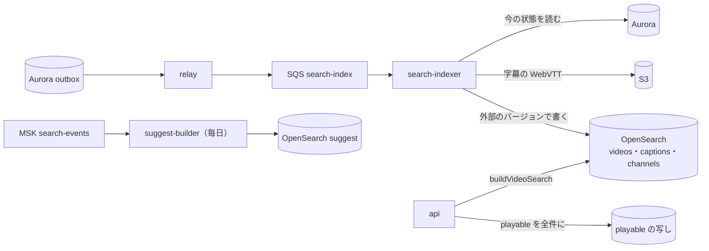

# Search: YouTube

動画とチャンネルの日本語の検索を決める。索引の形（動画・字幕の区切り・チャンネル・候補の補完）、正規化と日本語の解析（kuromoji と N-gram）、問い合わせの組み立てと `playable()` での絞り込み、順位、候補の補完、索引の更新と新しさを扱う。

前提となる決定は次のとおり。

- 検索は Amazon OpenSearch Service（kuromoji と N-gram）。X の題材の形（[X の ADR-0025](../../../x/docs/decisions/0025-search-engine-and-japanese-analysis.md)、[search-and-trends.md](../../../x/docs/architecture/search-and-trends.md)）に寄せる（[architecture/README.md](README.md) の 4 節）
- 索引は outbox から作る。見える範囲は返す前に `playable()` で判定し直す（[ADR-0009](../decisions/0009-single-tenant-and-playable.md)）
- 人気の値は確定の数（[ADR-0007](../decisions/0007-two-phase-view-counting.md)）
- 字幕は手動の字幕と、日本語・英語の自動の字幕（[transcoding-pipeline.md](transcoding-pipeline.md) の 8 節）

この文書で決めたことは次の ADR にある。

| ADR | 決定 |
| --- | --- |
| [0041](../decisions/0041-search-index-layout-and-caption-chunks.md) | 索引は `videos`・`captions`・`channels`・`suggest` の 4 つ。字幕は 30 秒の区切り（前の 3 秒を重ねる）ごとに 1 文書にし、動画の ID で畳む。一致の判定は N-gram（題・説明は 1〜2 文字、字幕は 2 文字だけ）、関連度は kuromoji で付ける。正規化は X の題材と同じ `normalizeForSearch` |
| [0042](../decisions/0042-search-query-builder-ranking-and-suggest.md) | 問い合わせは `buildVideoSearch` の 1 か所で作り、`videos` と `captions` を並べて引いて上位 200 を合わせ、`playable()` を通してから並べ直す。点は「関連度（正規化）× 人気 × 新しさ × 題の完全一致」。候補の補完は 7 日に 20 人以上が検索した語だけを、読み（カタカナ）の前方一致で出す |

## 1. 範囲

- 扱う：
  - 索引の形とフィールド、正規化、日本語の解析
  - 字幕の索引と区切り、時刻への飛び
  - 問い合わせの構文、組み立て、絞り込み、`playable()` の判定
  - 順位と並べ替え、絞り込みの条件（長さ、日付、種類）
  - 候補の補完、本人の検索の履歴
  - 索引の更新、作り直し、新しさ
- 扱わない：
  - おすすめ（[recommendations.md](recommendations.md)。`search_rel` の源として 6 節の組み立てを使う）
  - 字幕を作ること（[transcoding-pipeline.md](transcoding-pipeline.md) の 8 節）
  - 措置の付け方（[comments-and-moderation.md](comments-and-moderation.md) の 7 節）
  - OpenSearch の構成と台数（infrastructure・capacity の領域）

## 2. 要件

| 要件 | 目標 | NFR・根拠 |
| --- | --- | --- |
| 応答 | p95 300 ms（20 件）。候補の補完 p95 50 ms | NFR-011 |
| 新しさ | 公開から検索に出るまで 10 分。字幕は 1 時間 | NFR-011 |
| 取りこぼし | 題・説明・チャンネルの名前の日本語の部分一致で取りこぼさない（評価の集まりで 0 件） | [quality.md](../quality.md) の E10 |
| 見える範囲 | 措置・非公開・限定公開・年齢・地域・メンバー限定の動画を、索引の遅れの間も返さない | NFR-014、[quality.md](../quality.md) の 2.2.1 節 G |
| 中身をログに出さない | 検索の語をログ・トレースに書かない。長さと文字の種類だけを計測する | AGENTS.md |

## 3. 本家の形（確かめたこと）

本家の検索の順位の信号と、字幕を検索の対象にするかは、公式の資料で確かめられなかった（**未検証**）。この文書の値と方式は本システムのものである。

## 4. 構成



- 索引は正本ではない。Aurora と S3 から作り直せる。
- `search-indexer` は出来事の中身を信じず、Aurora の今の状態を読んで書く（遅れた出来事で古い状態に戻さない）。

## 5. 正規化と解析（ADR-0041）

### 5.1 正規化

- X の題材と同じ `normalizeForSearch`（`packages/text`）を、索引の本文・問い合わせ・候補の補完に同じくかける：NFKC、小文字、長音と波の記号の統一、幅のない文字の除去、連続する空白の 1 つ化（[search-and-trends.md](../../../x/docs/architecture/search-and-trends.md) の 5.1 節）。
- ひらがなとカタカナは本文の一致で同一視しない。候補の補完だけは読み（カタカナ）で前方一致させる（8 節）。
- 正規化のバージョンを `norm_version` として文書に持つ。変えたら作り直す（9.3 節）。

### 5.2 索引とフィールド

**`videos-v{n}`**（公開の範囲が「公開」の動画だけ。1 動画 1 文書）

| フィールド | 解析 | 役割 |
| --- | --- | --- |
| `title.gram`・`description.gram`・`chapters.gram`・`channel_name.gram` | 1〜2 文字の N-gram | 一致の判定 |
| `title`・`description`・`chapters`・`tags`・`channel_name` | kuromoji（`search` の分け方、`kuromoji_baseform`、品詞の除外、`ja_stop`） | 関連度 |
| `title.word`・`description.word` | `standard` と小文字 | 英字の語の一致 |
| `tags.kw` | `keyword` | タグの完全一致 |
| 絞り込みの印 | `state`、`visibility`、`age_restricted`、`made_for_kids`、`mod_flags`、`blocked_regions`、`members_only`、`search_version` | 前の絞り込み（正の判定は `playable()`） |
| 数と時刻 | `published_at`、`duration_s`、`engaged_30d`（確定）、`has_captions`、`is_live` | 順位と条件 |

- 説明は先頭 5,000 文字だけを索引に入れる。

**`captions-v{n}`**（1 区切り 1 文書）

| フィールド | 中身 |
| --- | --- |
| `video_id`、`lang`、`kind`（`manual`・`auto`）、`start_ms`、`end_ms` | 区切りの位置 |
| `text.gram` | 2 文字の N-gram（1 文字の字句を作らない） |
| `text` | kuromoji |
| 絞り込みの印 | `videos` と同じ（動画の状態の変化で区切りの文書を全部書き直す） |

- 区切り：字幕の手がかりを時刻の順に読み、30 秒ごとに切る。区切りの境の語を取りこぼさないため、前の区切りの最後の 3 秒の手がかりを次の区切りの頭に重ねる。
- 1 文字の語（「猫」）は字幕を引かない。題・説明・チャンネルで引く。

**`channels-v{n}`**：ハンドル、チャンネルの名前（gram と kuromoji）、説明、登録者の数（丸めた値）、措置の印。

**`suggest-v{n}`**：8 節。

### 5.3 量の見積もり（S1）

- 動画：1 日 約 7,200 本（1,440 時間 ÷ 平均 12 分）、1 年 約 260 万本。
- 字幕：日本語の話し言葉で 1 時間あたり約 1.8 万字。1 日 約 2,600 万字、1 年 約 95 億字。2 文字の N-gram の位置で約 95 億、kuromoji の字句が約 40 億。原文の保存（強調の表示のため）を含め、1 年で約 100 GB（写しを除く）。
- N-gram の索引の大きさの公式の目安はない（**未検証**）。`search-poc` で測る。

## 6. 問い合わせ（ADR-0042）

### 6.1 構文

| 構文 | 意味 |
| --- | --- |
| `語 語` | すべての語を含む（AND）。日本語は部分一致 |
| `"語 語"` | 連続する文字列として一致 |
| `-語` | 含まない |
| `#タグ` | タグの完全一致 |
| `@handle` | そのチャンネルの動画 |

- 絞り込みの条件：長さ（4 分未満・4〜20 分・20 分超）、公開の日（1 時間・今日・今週・今月・今年）、種類（動画・ライブ・チャンネル・再生リスト）、字幕あり。
- 並べ替え：関連度（既定）、公開の日、視聴回数（確定）。
- 語は 1 回に 16 まで、全体で 256 文字まで。肯定の語がなければ 400。

### 6.2 組み立て

問い合わせは `buildVideoSearch(viewer, query)` の 1 か所だけで作る。OpenSearch のクライアントを他から呼ぶことを lint で禁止する（X の題材と同じ）。

1. 語ごとに、英字と数字だけなら `*.word`、日本語を含むなら `*.gram` の `match_phrase` を、題・説明・チャプター・チャンネルの名前・タグの `should`（最低 1 つ）にする。全部の語を `must` で結ぶ。
2. 関連度：kuromoji のフィールドの `multi_match`（`best_fields`）を `should` に置く。重み：題 3.0、チャンネルの名前 2.0、タグ 1.5、チャプター 1.2、説明 1.0。
3. 絞り込み（`filter`）：`state = published`、`visibility = public`、`mod_flags` に `removed`・`limited_search` がない、`blocked_regions` に閲覧者の地域がない。年齢を確かめていない閲覧者は `age_restricted = false`。
4. `captions` へ同じ語で問い合わせ、`video_id` で畳む（区切りの一致の最もよいもの 1 つ）。字幕の重みは手動 0.5、自動 0.3。
5. 2 つを並べて引き、それぞれ上位 200 を取る。字幕だけで当たった動画は `videos` から文書を束ねて読む。

### 6.3 絞り込みと `playable()`

- 合わせた候補の全部に `playable(viewer, video, region)` を通し、`allow` と、閲覧者が満たす `allow_with` だけを残す（[ADR-0009](../decisions/0009-single-tenant-and-playable.md)）。
- 索引の印は粗い絞り込みにすぎない。索引の遅れ（最大 10 分）の間に措置された動画は、`playable()` の写し（60 秒）が落とす。
- メンバー限定の動画は索引に入れない（S1）。限定公開・非公開も入れない。

## 7. 順位（ADR-0042）

```
rel_n  = rel / max(rel)                           （候補の中の最大で割る）
pop    = 1 + 0.25 · log10(1 + engaged_30d)
fresh  = 1 + 0.2 · exp(−age_days / 7)
exact  = 1.3（題が問い合わせの語を全部、語順のまま連続して含む）、それ以外 1.0
sub    = 1.1（閲覧者がそのチャンネルを登録している）、それ以外 1.0
score  = rel_n · pop · fresh · exact · sub
```

- `engaged_30d` は 1 日の確定のエンゲージ ビュー（仮の数を使わない）。
- `sub` は登録の一覧を使う（視聴の履歴ではない）。ログインしていない閲覧者は 1.0。

### 7.1 例

問い合わせ「ラーメン 作り方」。

| 動画 | 一致 | `rel` | `rel_n` | 確定の 30 日のエンゲージ | `pop` | 経過 | `fresh` | `exact` | `score` |
| --- | --- | --- | --- | --- | --- | --- | --- | --- | --- |
| A「家で作る醤油ラーメンの作り方」 | 題 | 18.0 | 1.00 | 12,000 | 2.020 | 200 日 | 1.000 | 1.0 | 2.02 |
| B「ラーメン 作り方 完全版」 | 題（連続） | 16.2 | 0.90 | 800 | 1.726 | 3 日 | 1.130 | 1.3 | 2.28 |
| C「料理の配信 #12」 | 字幕（自動）だけ | 4.5 | 0.25 | 50,000 | 2.175 | 30 日 | 1.003 | 1.0 | 0.55 |

- 並びは B、A、C。C は人気が高いが、字幕だけの一致で関連度が低い。結果の行に字幕の一致の時刻（例：12:34）を出し、そこから再生できる。

## 8. 候補の補完（ADR-0042）

- 元：MSK `search-events`（正規化した語、`viewer_key`、時刻、結果の数）。ログではなく、保持を決めたデータの流れとして扱う（**法務の確認待ち：L5**）。
- `suggest-builder` が毎日、直近 7 日の語ごとに別の視聴者の数を数え、**20 人以上**の語だけを `suggest` に入れる（少ない人の語を他人に見せない）。
- 次の語は入れない：結果が 0 件、または `playable()` を通る結果が 0 件の語。T&S の拒否の一覧の語。個人の名前らしい語の扱いは**法務の確認待ち：L5**。
- 一致：語の正規化の文字列と、kuromoji の読み（カタカナ）の両方に `edge_ngram`（1〜20 文字）を持つ。入力はひらがなをカタカナに直して読みでも引く（「らーめ」で「ラーメン」と「拉麺」の語が出る）。
- 並べ方：別の視聴者の数（7 日）× 新しさ。T&S は語を即座に外せる（`suggest_blocklist`、反映 60 秒）。
- 本人の検索の履歴（ログインした利用者、本人の表）を補完の上に出す。履歴を止める・消すは、視聴の履歴と同じ操作の画面で行う（[recommendations.md](recommendations.md) の 11.2 節）。

## 9. 索引の更新

### 9.1 出来事

| outbox の出来事 | 索引の作業 |
| --- | --- |
| `video_state_changed`、`video_metadata_updated`、`moderation_action_applied`、`claim_policy_changed` | `videos` の文書を今の状態で書く。公開でなくなったら消す。字幕の区切りの印も書き直す |
| `captions_ready`、`captions_updated` | `captions` の区切りを作り直す（動画の区切りを全部消してから書く） |
| `channel_updated` | `channels` と、そのチャンネルの動画の `channel_name` |
| 毎日の確定の後 | `engaged_30d` を束ねて更新する |

- 書き込みは `search_version`（動画ごとに単調に増えるバージョンの番号）を外部のバージョンにする。古いバージョンで上書きしない。
- 公開から索引まで：outbox → relay → SQS → `search-indexer` → `refresh_interval` 5 秒。目標 10 分に対して p95 1 分を見込む。字幕は ASR の後に `captions_ready` が出る（1 時間の目標の大部分は ASR の時間）。

### 9.2 消す

- 公開でなくなった動画（非公開・削除・措置の `removed`）は、`videos` と `captions` から消す。消すまでの間は `playable()` が落とす。

### 9.3 作り直し

- 解析や `norm_version` を変えたら、新しい索引（`videos-v{n+1}`）を作り、Aurora と S3 から全部を書き、評価の集まり（12 節）で比べてから別名を切り替える。古い索引は 7 日残す。

## 10. 失敗と回復

| 失敗 | 起きること | 回復 |
| --- | --- | --- |
| `search-indexer` の遅れ | 新しい動画が出ない、措置した動画が索引に残る | 索引に残った動画は `playable()` が落とす。遅れが 10 分を超えたら作業を足す |
| OpenSearch の遅れ・一部の分片の失敗 | 結果が欠ける | 250 ms で打ち切り、取れた分片で返す（`partial` を応答に付ける） |
| OpenSearch の全体の障害 | 検索できない | 503 と「検索が使えません」。おすすめの `search_rel` は空にする |
| 字幕の取り込みの失敗 | 字幕で当たらない | 作業をやり直す。5 回で DLQ と Ops |
| `suggest-builder` の失敗 | 補完が古い | 前の日の索引を使い続ける |

## 11. 上限

| 対象 | 値 |
| --- | --- |
| 問い合わせ | 256 文字、16 語、`OR` なし（S1） |
| 結果 | 1 ページ 20 件、10 ページまで |
| 要求 | 利用者・端末あたり 1 分に 60 回 |
| 説明の索引 | 先頭 5,000 文字 |
| 字幕の区切り | 30 秒（重ね 3 秒）、1 動画 1,500 区切りまで（12 時間） |
| 候補の補完 | 7 日に 20 人以上の語、1 回 10 件 |

## 12. data-model への項目

| 表・置き場 | 中身 | 節 |
| --- | --- | --- |
| `videos` に足す列 | `search_version`（単調に増える） | 9.1 |
| `search_history`（本人の表、FORCE RLS） | `user_id`、`query_norm`、`searched_at` | 8 |
| `suggest_blocklist`（運用の表） | 語、理由のコード、登録した担当、時刻 | 8 |
| OpenSearch | `videos-v{n}`、`captions-v{n}`、`channels-v{n}`、`suggest-v{n}` と別名 | 5.2 |
| MSK `search-events` | 正規化した語、`viewer_key`、結果の数、`request_id` | 8 |
| outbox | 9.1 節の出来事を `search-index` の待ち行列へ | 9.1 |

## 13. テストと性質

| ID | 性質・試験 |
| --- | --- |
| PROP-SRCH-001 | 任意の索引の状態（遅れ、古い文書）と任意の `playable()` の状態で、結果に `deny` の動画がない |
| PROP-SRCH-002 | 任意の題の文字列と、その部分の文字列（2 文字以上、正規化の後）を語にした問い合わせで、その動画が候補 200 件に入る（取りこぼさない） |
| PROP-SRCH-003 | 任意の出来事の順序・重複で、索引の文書は Aurora の最新の `search_version` の中身になる |
| PROP-SRCH-004 | 字幕の区切りの境をまたぐ 3 秒以内の語句が、どちらかの区切りで一致する |
| DT-SRCH-001 | 絞り込みの決定表：状態 × 公開の範囲 × 年齢 × 地域 × 措置 × メンバー限定 |
| 評価の集まり | 生成した日本語の動画の題・説明・字幕の 5 万本と、判定つきの問い合わせ 500 個。nDCG@10 と、部分一致の取りこぼし 0 件（[quality.md](../quality.md) の E10） |
| 負荷 | 検索 1,000 件/秒で p95 300 ms |

## 14. Story の候補

| Epic | Story | 中身 |
| --- | --- | --- |
| E10 | `search-poc` | N-gram と kuromoji の索引の大きさ、字幕の区切りの長さ、応答の時間 |
| E10 | `search-index` | 4・5・9 節（ADR-0041、PROP-SRCH-003・004） |
| E10 | `japanese-analysis` | 5.1 節（X の題材の `normalizeForSearch` を共有） |
| E10 | `search-ranking-and-filter` | 6・7 節（ADR-0042、PROP-SRCH-001・002、DT-SRCH-001） |
| E10 | `search-suggest` | 8 節（**法務の確認待ち：L5**） |
| E10 | `search-eval-set` | 13 節の評価の集まり |

## 15. 未解決の問い

### 決定（2026-10-10、既定案）

- **索引**：動画・字幕の区切り・チャンネル・補完の 4 つ。字幕は 30 秒と 3 秒の重ね（ADR-0041）。
- **一致と関連度**：N-gram で一致、kuromoji で点。字幕は 2 文字の N-gram だけ（ADR-0041）。
- **順位**：7 節の式（ADR-0042）。
- **補完**：7 日に 20 人以上の語、読みの前方一致（ADR-0042）。
- **検索はログインなしでも使える**（X の題材と違う。動画の検索は視聴の入口のため）。

### 持ち越し

| 問い | いつ・どう決めるか |
| --- | --- |
| 検索の語と履歴の保持、補完に出す語の範囲（個人の名前など） | **法務の確認待ち：L5** |
| 索引の大きさと分片の数 | `search-poc` と capacity の領域 |
| Sudachi と kuromoji の比べ | `search-poc`（X の題材の持ち越しと同じ） |
| メンバー限定の動画を会員に検索で出すか | S2 で決める |
| 順位の係数 | 評価の集まりと A/B |

## 出典

いずれも 2026-10-10 に確認。

- OpenSearch Documentation, [Kuromoji analyzer](https://docs.opensearch.org/latest/analyzers/language-analyzers/kuromoji/)（kuromoji の解析器。同じ文書の目次に読みの字句の絞り込み `kuromoji_readingform` がある。細部は `search-poc` で確かめる）
