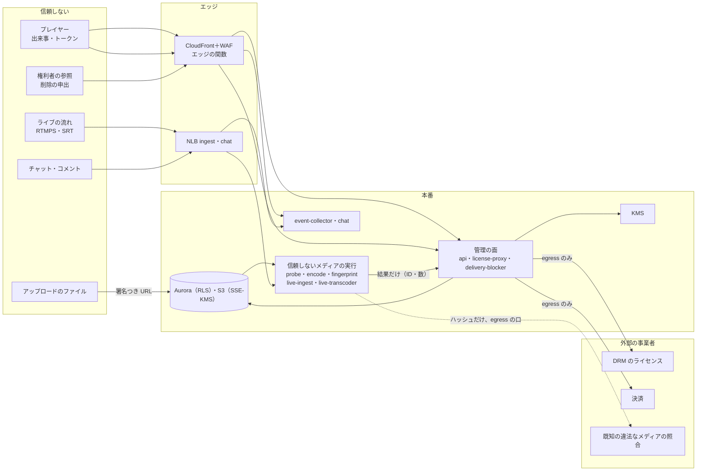

# Security: YouTube

脅威モデル（ストリームキーの漏えい、悪意のあるアップロード、CDN のトークンの抜き取り、視聴の水増しのボット、大きなチャンネルの乗っ取り、偽りの著作権の申し立て、DRM の鍵）、信頼境界、暗号化と鍵の置き方、本システムの監査、データのライフサイクル（保持、消去、法的な保全）、社内の運用者のアクセス、開示の請求の枠を決める。法務の判断が要るもの（L1・L2・L3・L5・L6・L10）は枠だけを作り、結論を出さない。

この文書で決めたことは次の ADR にある。

| ADR | 決定 |
| --- | --- |
| [0062](../decisions/0062-threat-mitigations-and-key-layout.md) | 信頼しない入力（アップロード、ライブの流れ、出来事、チャット）を扱う部品は、すべて「信頼しないメディア」の実行の形（外への経路なし、IMDS なし、読み取りだけのルート、seccomp、復号器の許可リスト）で動かす。鍵はデータの種類ごと・リージョンごとの KMS の鍵にし、署名の鍵（再生のトークン、エッジのトークン、Webhook）は 2 つを並べて 30 日で回す。悪用の分かったエッジのトークンは KeyValueStore の `t:` で個別に拒む |
| [0063](../decisions/0063-operator-access-audit-retention-and-legal-hold.md) | 運用者は日常の権限で元のファイル・隔離のファイル・生の IP アドレス・チャットの本文を読めない。読むときは JIT と 2 人の承認と監査の 3 つを要る。監査の記録は outbox から log-archive の Object Lock へ書く。保持の期間は `retention_policies` の 1 つの表に持ち、法的な保全（`legal_holds`）はすべての消去の経路より先に効く。開示の請求と捜査機関の照会は法務と Ops だけが扱う |

前提：単一のテナントと RLS と `playable()`（[ADR-0009](../decisions/0009-single-tenant-and-playable.md)）、検査の隔離（[ADR-0012](../decisions/0012-media-probe-and-admission-checks.md)）、元のファイルの消去の経路（[ADR-0013](../decisions/0013-original-retention-and-deletion-paths.md)）、DRM の鍵（[ADR-0021](../decisions/0021-drm-key-hierarchy-and-license-proxy.md)）、トークン（[ADR-0023](../decisions/0023-playback-token-and-qoe-metrics.md)、[ADR-0025](../decisions/0025-edge-token-signing-and-cache-keys.md)）、配信の停止（[ADR-0027](../decisions/0027-takedown-deny-list-within-60s.md)）、ストリームキー（[ADR-0028](../decisions/0028-live-ingest-keys-backup-and-source-recording.md)）。アカウントと認証は [accounts-and-safety.md](accounts-and-safety.md)、アカウントとネットワークは [infrastructure.md](infrastructure.md) にある。

## 1. 目標と前提

- **守るもの**：
  - 預かった動画（元のファイル、未公開の動画、メンバー限定の動画）
  - 見える範囲（措置・照合のブロック・年齢・地域・非公開）
  - 創作者のチャンネル（乗っ取り、ライブの乗っ取り）
  - 数の正しさ（視聴回数、収益）
  - 権利の判定（偽りの申し立て）
  - 利用者の個人に関する情報（視聴の履歴、IP アドレス、年齢、電話番号、本人の確認の結果）
- **目標**：
  - 見えてはいけない動画が、どの経路にも出ない（NFR-014、[quality.md](../quality.md) の 2.2.1 節 G）。
  - 悪意のあるファイル・流れが、復号器の脆弱性を突いても、他の動画・鍵・ネットワークに届かない。
  - ストリームキーが漏れても、配信の乗っ取りを分の単位で止められる。
  - 社内の運用者が、日常の権限で預かった動画の元のファイルと個人に関する情報を読めない。
  - 保持の期間を過ぎたデータを確実に消し、保全のあるデータは消さない。
- **前提**：物理の保存と AWS の基盤は AWS の責任の範囲。暗号化はサーバー側（KMS）。

## 2. 信頼境界

| 境界 | 守り |
| --- | --- |
| ファイル → 検査・符号化 | S3 の署名つきの URL（部分ごと 15 分）。信頼しないメディアの実行（3.2 節） |
| ライブの流れ → 取り込み | RTMPS・SRT（暗号必須）、ストリームキー、入力の上限（[live-streaming.md](live-streaming.md) の 4.3 節）、受け口のファジング |
| プレイヤー → 再生の API・出来事 | CloudFront＋WAF、レート制限、再生のトークン（Ed25519）、`playable()` |
| プレイヤー → セグメント | エッジのトークン（HMAC）、拒否の一覧（[cdn-and-delivery.md](cdn-and-delivery.md) の 5・10 節） |
| 管理の面 → DB | FORCE RLS と `SET LOCAL`（[ADR-0009](../decisions/0009-single-tenant-and-playable.md)） |
| 本番 → 外部の事業者 | egress のサブネットの専用の口と許可リスト（[infrastructure.md](infrastructure.md) の 3.1 節）。事業者へ送るのは決めた項目だけ（6 節） |
| 運用者 → 本番 | JIT、復号の権限を人に与えない（8 節） |

## 3. 脅威モデル

### 3.1 ストリームキーの漏えい

ストリームキーは配信のソフトの設定・画面の録画・配信の画面の映り込み・共有の PC・マルウェアから漏れやすい。漏れると、他人がチャンネルで配信できる（乗っ取りの配信、詐欺の配信）。

| 脅威 | 対策 |
| --- | --- |
| 漏れたキーで配信する | キーの表示は作成の時の 1 回と、2 要素の再確認（[accounts-and-safety.md](accounts-and-safety.md) の 5 節）の後だけ。予約の配信ごとのキー（`event`）を既定に勧め、使い回すキー（`default`）は 90 日使われなければ失効を勧める |
| 公開のリポジトリ・貼り付けのサイトへの漏えい | キーの形（`<brand>_sk_`＋チェックサム。[ADR-0028](../decisions/0028-live-ingest-keys-backup-and-source-recording.md)）をシークレットスキャンの提携に登録する。通報を受けたら**すぐに**失効し、所有者と管理者に知らせる。書き込みだけのキーと違い、被害がチャンネルの名で公開される配信なので、猶予を置かない |
| 見慣れない場所からの配信 | 配信の開始で、送り元の ASN・国が直近 30 日の配信と違えば、所有者と管理者に通知し、Studio に「止める」を出す。止める操作は配信の切断とキーの失効を 1 回で行う（5 秒以内。[live-streaming.md](live-streaming.md) の 4.2 節） |
| 総当たり | 認証の失敗は IP あたり 1 分 10 回（同じ節）。キーは約 190 ビットで、総当たりは成り立たない |
| アカウントの乗っ取りの後のキーの持ち出し | アカウントの回復・パスワードの再設定・乗っ取りの疑いの判定で、チャンネルのすべてのキーを失効する（[accounts-and-safety.md](accounts-and-safety.md) の 5.4 節） |
| キーのログへの混入 | キーを URL のパスに含む RTMPS の要求を、NLB・`live-ingest` のログに書かない。`live-ingest` はキーを SHA-256 にしてから扱う（AGENTS.md） |
| SRT のパスフレーズ | キーごとに 32 文字。`kms-live` で包んで `stream_keys` に持つ（[live-streaming.md](live-streaming.md) の 12 節） |

### 3.2 悪意のあるアップロードと流れ（復号器の脆弱性）

アップロードのファイルとライブの流れは、復号器（libavformat・libavcodec、x264 の入力の側、NVDEC）の脆弱性を突く入力になりうる。検査（`probe`）だけでなく、指紋・符号化・ASR・ライブの変換も、同じ信頼しない入力を復号する。

ADR-0062 で、次の部品をすべて「信頼しないメディア」の実行の形にする：`probe`、`encode-worker`、`fingerprinter`、`asr-worker`、`packager`（字幕の読み込み）、`live-ingest`、`live-transcoder`。

| 守り | 中身 |
| --- | --- |
| ネットワーク | media のサブネット（外への経路なし。[infrastructure.md](infrastructure.md) の 3.1 節）。`probe` はネットワークなし（[ADR-0012](../decisions/0012-media-probe-and-admission-checks.md)） |
| IMDS | IMDSv2 必須・ホップの上限 1。タスクのロールは段ごとに分け、S3 の権限は接頭辞で絞る（`encode-worker` は `orig/{video_id}` の読み出しと `r/` の書き込みだけ） |
| プロセス | 非 root、読み取りだけのルート、`/tmp` は大きさの上限つきの tmpfs、seccomp の許可リスト（`execve` を許さない）、`no_new_privileges` |
| 復号器 | FFmpeg のライブラリを、許す形式（MP4・MOV・Matroska・WebM・MPEG-TS・AVI・FLV。[upload-and-ingest.md](upload-and-ingest.md) の 5.1 節）と許す符号の復号器だけで組み立てる。ネットワークのプロトコル（`http`、`rtmp` など）とファイルの外部の参照（HLS の入力、`concat`）を組み立てから外す |
| 上限 | 時間・メモリー・出力の大きさの上限（同じ節の 5.2）。ライブは入力の上限（[live-streaming.md](live-streaming.md) の 4.3 節） |
| ファジング | コンテナの解析、RTMP・SRT の受け口、字幕の読み込み（[quality.md](../quality.md) の 2.2 節） |
| 依存の更新 | FFmpeg・x264・SVT-AV1・NVIDIA のドライバーの脆弱性の告知を週ごとに見る。復号の側の修正は、出力を変えないので、`enc_build` を上げずに急ぎで出せる（[delivery.md](delivery.md) の 6.2 節） |
| GPU | `live-transcoder` は 1 つの GPU に複数の配信を詰める。配信ごとにプロセスを分け、GPU のメモリーの隔離は NVIDIA の仕組み（MIG は L4 にない。**未検証**）に頼らない前提で、1 つの配信の乗っ取りが同じ GPU の他の配信の流れを読みうることを残りのリスクとして受け入れる。予備の取り込みの入力は同じプロセスで扱う |

- 既知の違法なメディアの照合（[upload-and-ingest.md](upload-and-ingest.md) の 5.3 節）は、照合の提供者へハッシュだけを送る。ファイルの本体を外へ出さない。
- 画面での注入：題・説明・字幕・コメント・チャットは、すべてテキストとして描く（`innerHTML` を使わない lint、厳しい CSP）。WebVTT の字幕の中のタグは、許すもの（`<b>`・`<i>`・`<u>`・`<ruby>`・`<rt>`・`<c>`）だけを残す。

### 3.3 CDN のトークンの抜き取り

エッジのトークンは `video_id` に結び付き、視聴者に結び付かない（[cdn-and-delivery.md](cdn-and-delivery.md) の 5.1 節）。抜き取ったマニフェストの URL で、他のサイトが 6 時間まで再配信できる（転送の費用は本システムが払う）。

| 脅威 | 対策 |
| --- | --- |
| 再生の API を大量に呼んでトークンを作る | `api` の WAF の IP ごとのレート制限（5 分 3,000）、端末あたり 1 分 60 回（[playback-and-abr.md](playback-and-abr.md) の 10 節）、匿名の再生の API は ASN のデータセンターの一覧で強く絞る |
| 1 つのトークンの使い回し（他のサイトへの埋め込み） | CDN のリアルタイムのログの抜き取り（[observability.md](observability.md) の 3.2 節）で、トークンの `sig` の先頭 16 文字ごとの要求の数と ASN の数を数える。1 時間に 1 万の要求か 50 の ASN を超えたトークンを `token-abuse` の候補にする |
| 悪用の分かったトークン | KeyValueStore に `t:{sig16}` を、トークンの期限まで置き、エッジの関数が 403 を返す（ADR-0062）。置き場の容量は拒否の鍵と共有で、`t:` は同時に 2,000 件まで（約 200 KB） |
| メンバー限定の動画 | DRM（[ADR-0021](../decisions/0021-drm-key-hierarchy-and-license-proxy.md)）。トークンを抜いても鍵は出ない |
| 公開の動画の再配信そのもの | 公開の動画は誰でも見られるので、守るのは転送の費用だけ。費用の急増（`cost-anomaly.md`）で見る |

- エッジの関数の確かめの順に、`t:` の引きを 1 回足す（KeyValueStore の読み出しは 100 万回 0.03 USD。[infrastructure.md](infrastructure.md) の 11.2 節）。

### 3.4 視聴の水増しのボット

数の判定は [view-counting-and-analytics.md](view-counting-and-analytics.md) と [ADR-0007](../decisions/0007-two-phase-view-counting.md) にある。この節は入口の守りを足す。

| 脅威 | 対策 |
| --- | --- |
| 再生のトークンの偽造・使い回し | Ed25519 の署名、`sid` ごとの `seq`、期限 10 時間（[ADR-0023](../decisions/0023-playback-token-and-qoe-metrics.md)）。偽造の数を `watch-events-rejected` で見る |
| 大量の匿名の再生 | 3.3 節のレート制限。止めるのは要求の量だけで、数の判定は `view-rules` に任せる（入口で正しい視聴を落とさない） |
| アプリの偽装 | iOS・Android の端末の正当性の確かめ（OS の提供する仕組み）の結果を、出来事の信号として `view-rules` に渡す。結果で再生を止めない。端末の識別子の扱いは**法務の確認待ち：L5** |
| 規則の推測 | 規則の ID と理由のコードを創作者に見せるが、しきい値は見せない（[view-counting-and-analytics.md](view-counting-and-analytics.md) の 5 節） |

### 3.5 大きなチャンネルの乗っ取り

創作者の乗っ取りの多くは、マルウェアによるセッションの cookie の盗み出しと、偽の協業の依頼である（本家の事例の公式の統計は**未検証**）。

| 脅威 | 対策 |
| --- | --- |
| セッションの盗み出し | アクセスのトークン 15 分、更新のトークンの回転と再利用の検出、セッションの使用の場所（ASN・国）の急な変化で再認証（[accounts-and-safety.md](accounts-and-safety.md) の 5.3 節） |
| 盗んだセッションでの破壊（名前・動画の削除・配信） | 重い操作（チャンネルの名前とハンドル、役割の付与、ストリームキー、支払いの口座、動画の一括の削除・公開の範囲の一括の変更）は、直近 10 分の 2 要素の再確認を要る。新しい端末からは 24 時間の待ち |
| 乗っ取りの後の回復 | 運用者の「チャンネルの安全の保留」：公開・名前の変更・削除・配信を止め、監査の記録から前の状態（名前、ハンドル、リンク、公開の範囲）を戻す。削除した動画は 30 日の猶予の中で戻せる（[ADR-0013](../decisions/0013-original-retention-and-deletion-paths.md)） |
| 登録者 1 万以上のチャンネル | 所有者と管理者に 2 要素を必須にする（[accounts-and-safety.md](accounts-and-safety.md) の 5.2 節） |

### 3.6 偽りの著作権の申し立て

照合と申し立ての手続きは [copyright-matching.md](copyright-matching.md) と [copyright-claims-and-disputes.md](copyright-claims-and-disputes.md) の領域にある。この節は悪用の守りの枠を書く。

| 脅威 | 対策 |
| --- | --- |
| 権利を持たない者が参照を登録し、他人の動画を収益化・ブロックする | 権利者の審査（[accounts-and-safety.md](accounts-and-safety.md) の 8 節）。審査の後 90 日の見習いの期間は、ブロックの方針を人の確認の後にだけ効かせる |
| 公有の素材・他人の素材を参照に入れる | 所有の衝突の待ち行列（[ADR-0008](../decisions/0008-fingerprinting-and-match-engine.md)）、参照ごとの一致の数の急増の監視（[runbooks](../runbooks/README.md) の `claims-anomaly.md`） |
| 削除の申出の悪用（競合の動画を消す） | 申出の様式に、権利の根拠と、偽りの申出の責任の確認を求める。申出者の本人の確認。申出の通知と反論の手続き（**法務の確認待ち：L1・L2**） |
| 誤りの多い権利者 | 異議で取り消された一致の割合を権利者ごとに見る（[quality.md](../quality.md) の 4.2 節）。権利者の方針の一時の停止は運営の担当と法務の判断（[runbooks](../runbooks/README.md) の 4 節） |
| 権利者のアカウントの乗っ取り | 権利者の管理者にも 2 要素を必須にする |

### 3.7 DRM の鍵

[ADR-0021](../decisions/0021-drm-key-hierarchy-and-license-proxy.md) の守りに、次を足す。

| 脅威 | 対策 |
| --- | --- |
| 内容の鍵の持ち出し | `drm-content` の KMS の鍵の復号を許すのは `packager` と `license-proxy` のタスクのロールだけ。人のロールに与えない。KMS の鍵の方針で、呼び出し元のロールを 2 つに絞る |
| `license-proxy` のメモリー | 復号した鍵は 10 分だけメモリーに持つ（[packaging-and-drm.md](packaging-and-drm.md) の 9 節）。コアダンプを無効にし、ログに鍵・KID を書かない |
| DRM の事業者 | 鍵を要求ごとに渡すので、事業者は鍵を見る。事業者を信頼境界の内側として契約で扱う（保存しない約束、監査）。契約の文言は調達と法務 |
| 鍵の漏えい | 新しい KID で作り直し（世代を上げる）、古い KID のライセンスを止める（同じ ADR） |
| ライセンスの乱用 | `license-proxy` は再生のトークンと `playable()` を確かめる。利用者ごとのライセンスの数（1 時間に 20）を超えたら 429 |

### 3.8 社内の運用者と供給網

- 運用者のアクセスは 8 節。
- 供給網：依存の固定、SBOM、脆弱性の走査、本家の実装の依存の禁止（[ADR-0001](../decisions/0001-platform-and-stack.md)）。CI は GitHub Actions の OIDC で長い期限の鍵を持たない。アプリの署名の鍵は OS のストアの仕組みと、2 人の承認（[delivery.md](delivery.md) の 4 節）。

## 4. 暗号化と鍵

ADR-0062。

### 4.1 転送中

| 経路 | 方式 |
| --- | --- |
| 視聴者 → CloudFront | TLS 1.2 以上（CloudFront のセキュリティの方針 `TLSv1.2_2021`） |
| CloudFront → オリジン | VPC オリジン（AWS の中の私的な接続。[infrastructure.md](infrastructure.md) の 3.1 節）。`origin-cache`・`alb-app` で TLS を終える |
| 配信者 → 取り込み | RTMPS（TLS 1.2 以上、`live-ingest` で終える）、SRT（AES-128 以上。[live-streaming.md](live-streaming.md) の 4.1 節） |
| チャット | NLB の TLS のリスナー、Gateway まで TLS |
| サービスの間 | 管理の面の HTTP は TLS。Aurora・Valkey・MSK・OpenSearch は TLS 必須 |
| アップロード | S3 の署名つきの URL（HTTPS だけを許すバケットの方針） |

### 4.2 保存時

| データ | 置き場 | 鍵（東京・大阪で別） |
| --- | --- | --- |
| 元のファイル、レンディション、DVR、ライブの元の流れ | `<media-bucket>` | `kms-media`（バケットキー） |
| 隔離のファイル | `<quarantine-bucket>` | `kms-quarantine`（media-quarantine のアカウント） |
| 指紋と参照の索引 | `<fp-bucket>` | `kms-fp` |
| 出来事の Parquet、MSK | `<events-bucket>`、MSK | `kms-events` |
| 生の IP アドレス（1 時間） | `event-collector` のメモリーと `watch-events` の `ip_raw_enc` | 1 時間ごとのデータの鍵（`kms-events` で作り、1 時間で捨てる。[view-counting-and-analytics.md](view-counting-and-analytics.md) の 4.2 節） |
| 管理の正本 | Aurora | `kms-aurora` |
| キャッシュ | Valkey | `kms-cache` |
| DRM の内容の鍵 | Aurora の `drm_keys` | `drm-content`（封筒の暗号化） |
| SRT のパスフレーズ、TOTP の秘密、外部の事業者の資格 | Aurora・Secrets Manager | `kms-secrets` |
| 本人の確認の結果、電話番号 | Aurora | `kms-pii`（封筒の暗号化。電話番号は照合用の HMAC と暗号文） |
| 監査の記録、CDN のログ | `<logs-bucket>` | `kms-audit` |
| NVMe（`origin-cache`） | インスタンスストア | ハードウェアの暗号化（Nitro の NVMe の暗号化。仕様の確認は**未検証**）。再起動で中身を捨てる |

- 大阪への写しは、大阪の鍵で暗号化し直す（複製のロールに両方の鍵の権限）。
- 利用者ごとの鍵（BYOK）は持たない。

### 4.3 署名の鍵とアプリの秘密

| 鍵 | 方式 | 回し方 | 置き場 |
| --- | --- | --- | --- |
| 再生のトークン | Ed25519 | 2 つを並べ 30 日で回す（`kid`） | 秘密の鍵は `kms-secrets` で包んで Secrets Manager。`api` が起動の時に読む。KMS の Ed25519 の署名の対応は**未検証**（対応していれば KMS の中で署名する形を `cdn-cost-poc` と合わせて比べる） |
| エッジのトークン | HMAC-SHA256 | 2 つを並べ 30 日で回す | KeyValueStore の `k:`（[ADR-0025](../decisions/0025-edge-token-signing-and-cache-keys.md)） |
| Webhook・外部への通知の署名 | HMAC-SHA256（`<Brand>-Signature`） | 鍵の ID つきで 2 つ | Secrets Manager |
| アップロードの部分の URL | S3 の署名（SigV4） | タスクのロールの一時の資格 | — |
| ストリームキー | 乱数（SHA-256 だけを持つ） | 失効と再発行 | `stream_keys` |

## 5. 本システムの監査

ADR-0063。

| 対象の操作 | 記録する項目 |
| --- | --- |
| 創作者の重い操作 | 役割の付与と外し、ストリームキーの表示・再発行・失効、公開の範囲の変更、動画の削除と戻し、チャンネルの名前・ハンドル、支払いの口座、2 要素の変更 |
| 運用者の操作 | JIT の権限の取得、措置の決定と取り消し、照合の方針の手動の上書き、権利者の審査、所有の衝突の解決、安全の保留、元のファイル・隔離のファイルの参照、法的な保全の付与と外し、開示の請求への応答 |
| 自動の措置 | 配信の停止（`delivery_blocks`）、ストリームキーの自動の失効、アカウントの状態の変更 |

- 記録は `audit_events`（Aurora、180 日。Studio で 180 日見せるため）に書き、同じトランザクションの outbox から log-archive の S3（Object Lock のコンプライアンスのモード）へ写す。保持の期間は 6 節。
- 記録に入れるのは、主体の ID、操作、対象の ID、理由のコード、時刻、送り元の ASN。IP アドレスは別の表（`login_records`。6 節）に置き、監査の本文に入れない。
- 創作者には、チャンネルの操作の記録（自分のチャンネルの創作者の操作と自動の措置）を Studio で 180 日見せる。運用者の操作のうち創作者に知らせるもの（措置）は通知で知らせる。

## 6. データのライフサイクル

ADR-0063。

### 6.1 保持の期間（既定の案）

値は `retention_policies` の 1 つの表に持ち、消去の作業はこの表だけを読む。法務の結論で変わる値は「法務」の列に書いた。

| データ | 既定 | 法務 | 根拠 |
| --- | --- | --- | --- |
| 元のファイル | 動画が残る間（消去の 3 つの経路） | L1・L10（法的な削除） | [ADR-0013](../decisions/0013-original-retention-and-deletion-paths.md) |
| 削除した動画 | 30 日の猶予の後に全部（レンディション、指紋、字幕、大阪の写し） | — | 同上 |
| 生の IP アドレス（視聴） | 1 時間 | L5 | [view-counting-and-analytics.md](view-counting-and-analytics.md) の 8 節 |
| 出来事の Parquet | 13 か月 | L5 | 同上 |
| ログインの記録（IP アドレス、時刻、端末の種類） | 180 日 | **L10**（開示の請求に備える期間） | 開示の請求で、投稿の時やログインの時の記録を求められうる |
| 投稿の記録（アップロード・コメント・チャットの送信の時の IP アドレス） | 180 日 | **L10** | 同上 |
| チャットの記録（`chat-log`） | 90 日（アーカイブのある配信はリプレイの間） | **L10**、L6 | [live-chat.md](live-chat.md) の 11 節 |
| CDN の標準のログ（視聴者の IP アドレスを含む） | 7 日。その後は IP を落とした集計だけ | L5 | 視聴者の IP は開示の請求の対象（投稿者）でないため短くする |
| CDN のリアルタイムのログ（Kinesis） | 24 時間（IP の欄を選ばない。[observability.md](observability.md) の 3.2 節） | — | — |
| アカウントの情報 | アカウントの削除の後 30 日 | L5 | — |
| 本人の確認の結果（年齢・身元） | 確認の結果と方法だけを持ち、証明書の画像は持たない（事業者の側で消す） | L3・L5 | [accounts-and-safety.md](accounts-and-safety.md) の 6 節 |
| 監査の記録 | 3 年（Object Lock） | L10 | — |
| 隔離のファイル | 保全の期限まで | L3・L10 | [upload-and-ingest.md](upload-and-ingest.md) の 5.3 節 |
| DRM のライセンスの記録 | 90 日 | — | [packaging-and-drm.md](packaging-and-drm.md) の 11 節 |

### 6.2 消去

- 消去の作業（`retention-sweeper`）は、`retention_policies` と `legal_holds` を読み、保全のある対象を除いてから消す。元のファイルは `original-deleter` だけが消す（ADR-0013）。
- 消したことの記録（対象の種類、ID、件数、時刻）を残す。中身は残さない。
- 大阪の写しも明示に消す（[infrastructure.md](infrastructure.md) の 7.2 節）。

### 6.3 アカウントの削除

- 利用者の削除の依頼から 30 日の猶予（戻せる）。猶予の後に、本人だけの表（視聴の履歴、検索の履歴、登録、設定）を消し、チャンネルの動画は動画の削除の経路で消す。
- 確定の視聴回数と集計は変えない（個人を特定しない値。**法務の確認待ち：L5**）。
- 支払いと税の記録は、法令の保存の期間で残す（**法務の確認待ち：L7**）。

### 6.4 法的な保全

- `legal_holds`（対象：動画、チャンネル、アカウント、配信、権利者。範囲：元のファイル、レンディション、チャット、ログインの記録、投稿の記録、監査）。保全はすべての消去の経路より先に効く（元のファイルの消去も止める。[upload-and-ingest.md](upload-and-ingest.md) の 7.2 節）。
- 保全の付与と外しは法務の承認を要り、監査に残す。
- 保全の中のデータを、本システムの通常の機能（再生、検索）に戻さない。保全は消さないだけで、見せることではない。

## 7. 個人に関する情報とログ

- 本システム自身のログ・トレース・指標に、題・説明・字幕の本文、コメント・チャットの本文、検索の語、IP アドレス、ストリームキー、電話番号を書かない（AGENTS.md）。
- CI の lint（ログの関数への文字列の欄の禁止の型）と、本番のログの抜き取りの走査（電話番号・IP の形）で確かめる（[observability.md](observability.md) の 5 節）。
- 外部の事業者へ送る項目：
  - DRM：challenge と鍵と方針。利用者の ID は送らない。
  - 決済：決済に要る項目だけ（monetization-and-payouts の領域）。
  - 既知の違法なメディア：ハッシュだけ。
  - 広告：VAST の要求の項目は monetization-and-payouts の領域（**法務の確認待ち：L5・L6**）。

## 8. 社内の運用者のアクセス

ADR-0063。

| 役割 | できること | できないこと |
| --- | --- | --- |
| `ops-readonly`（日常） | 指標、ログ（ID と数）、構成の参照 | S3 のメディアの読み出し、KMS の復号、Aurora の本人だけの表の読み出し、MSK の読み出し |
| `ops-jit-admin` | 構成の変更（Terraform を通す）、群れの操作 | 同上 |
| `moderation-review` | 措置の審査の画面（管理の面のアプリ）で、措置した動画・非公開の動画を見る | 画面の外の取得。見た動画と理由を監査に残す |
| `safety-review` | 隔離のファイルの確認（2 人の承認、1 回ごと） | 他のメディアの読み出し |
| `legal-response` | 開示の請求・照会への応答のための書き出し（2 人の承認） | 法務の承認のない書き出し |
| `break-glass` | すべて（封をした資格、使ったら Security に通知） | — |

- 審査の画面は `playable()` を通さない専用の経路で動画を出す。この経路を [quality.md](../quality.md) の 2.2.1 節 G の漏れの経路の表に「運用者の審査の画面」として足し、役割と監査のない取得が 0 であることを確かめる（QA に提案）。
- 運用者が RLS を外す役割は作らない（[ADR-0009](../decisions/0009-single-tenant-and-playable.md)）。調べものは、監査つきの管理の API で、対象を指定して行う。

## 9. 開示の請求と照会（**法務の確認待ち：L10**）

- 受け付けは法務の窓口だけ。エージェントと一般の運用者は扱わない（[roadmap.md](../roadmap.md) の「エージェントに任せないこと」）。
- `legal_requests`（種類：発信者情報開示の請求・命令、捜査機関の照会・差押え、緊急の照会、保全の依頼。状態、期限、対象、応答の記録）。
- 緊急の照会（ライブでの生命の危険）の手順の骨子：受け付け → 法務と Ops の責任者の判断 → 対象の配信の確認と保全 → 応答。応じる範囲と、利用者へ知らせるかは L10 の結論の後に決める。
- 応答のための書き出しは `legal-response` の役割で、2 人の承認と監査を要る。

## 10. セキュリティの試験とインシデント

| 試験 | 頻度 |
| --- | --- |
| 外部のペンテスト（アップロード、再生の API、トークンと署名、DRM、ストリームキー、RLS、チャット） | GA の前（E15 の `pentest-external`）と年 1 回 |
| ファジング（コンテナ、RTMP・SRT、字幕、出来事） | 夜間 |
| 漏れの監査（[runbooks](../runbooks/README.md) の 1 節） | 常時 |
| 依存の脆弱性の走査 | PR と日次 |
| IAM の権限の検査（人のロールに復号がない、`orig/` の削除の許可リスト） | Terraform の plan の検査（[infrastructure.md](infrastructure.md) の 8 節）と週次 |

- インシデントの手順は `incident-response.md`（E1）に、ストリームキーの大量の漏えい・チャンネルの乗っ取り・トークンの悪用・DRM の鍵の漏えいの手順を足す。

## 11. テストと性質

| ID | 性質・試験 |
| --- | --- |
| PROP-SEC-001 | 任意の消去の作業の入力（保持の期限、削除の依頼）と `legal_holds` の組で、保全のある対象は消されない |
| PROP-SEC-002 | 任意のトークンと KeyValueStore の `b:`・`t:` の組で、エッジの関数が通すのは、署名が正しく、期限内で、`b:` にも `t:` にもないものだけ |
| PROP-SEC-003 | 任意のストリームキーの状態の列（作成、表示、失効、乗っ取りの疑い）で、失効したキーでの配信の受け付けが 0、失効から切断まで 5 秒以内 |
| DT-SEC-001 | 運用者の役割 × 操作の決定表（8 節） |
| 構成の検査 | 信頼しないメディアの実行の形（3.2 節）を、タスクの定義の検査で CI に入れる：外への経路、IMDS、root、読み取りだけのルート、seccomp |
| 結合 | 隔離の作業者から外への接続・IMDS・他の動画の接頭辞への読み出しが失敗する |
| 漏れの経路 | 運用者の審査の画面の行（8 節） |

## 12. Story の候補

| Epic | Story | 中身 |
| --- | --- | --- |
| E1 | `kms-and-secrets-baseline` | 4 節の鍵、署名の鍵の回し |
| E1 | `untrusted-media-runtime` | 3.2 節の実行の形と構成の検査 |
| E1 | `audit-trail` | 5 節（ADR-0063） |
| E1 | `retention-and-legal-hold` | 6 節、PROP-SEC-001 |
| E1 | `operator-access` | 8 節、DT-SEC-001 |
| E5 | `token-abuse-detection` | 3.3 節、PROP-SEC-002 |
| E12 | `stream-key-protection` | 3.1 節、PROP-SEC-003（`stream-keys` と合わせる） |
| E15 | `pentest-external` | 10 節 |
| E15 | `legal-request-workflow` | 9 節（法務：L10） |

## 13. 未解決の問い

### 決定（2026-10-10、既定案）

- **信頼しないメディアの実行の形**を、検査だけでなく復号するすべての部品に当てる（ADR-0062）。
- **鍵**：データの種類ごと・リージョンごとの KMS の鍵（ADR-0062）。
- **トークンの個別の拒否**：KeyValueStore の `t:`（ADR-0062）。
- **運用者**：日常の権限で復号できない。JIT と 2 人と監査（ADR-0063）。
- **保持**：`retention_policies` の 1 つの表、保全が先（ADR-0063）。

### 持ち越し

| 問い | いつ・どう決めるか |
| --- | --- |
| ログインの記録・投稿の記録・チャットの記録の保持の期間、開示の請求の手順 | **法務の確認待ち：L10** |
| 生の IP・端末の識別子・出来事の保持 | **法務の確認待ち：L5** |
| 削除の申出の様式と偽りの申出の扱い | **法務の確認待ち：L1・L2** |
| 隔離のファイルの報告と保全の期間 | **法務の確認待ち：L3・L10** |
| KMS で Ed25519 の署名ができるか | E4 の `playback-api-and-token`（**未検証**） |
| L4 の GPU での配信の隔離の強さ | `ll-hls-poc` と外部のペンテスト（**未検証**） |
| Nitro の NVMe の暗号化の仕様 | E1 で AWS の文書を確かめる（**未検証**） |

## 14. quality.md・runbooks・data-model への項目

### quality.md

- 2.2.1 節 G に「運用者の審査の画面」の行を足す（8 節）。
- E1 の合否基準に、信頼しないメディアの実行の形の構成の検査を足す。

### runbooks

- `stream-key-compromise.md`：3.1 節（通報での自動の失効、大量の漏えい）。
- `channel-takeover.md`：3.5 節の安全の保留と戻し。
- `token-abuse.md`：3.3 節の `t:` の追加と外し。
- `legal-request.md`：9 節（L10 の後に確定）。

### data-model への項目

列・キー・索引の正本は [data-model.md](data-model.md) と [data-model/](data-model/) の各ファイルである。この節は提案の記録として残す（2026-10-10 のデータモデルの工程）。

| 表・置き場 | 中身 | 主キー・索引 | 節 |
| --- | --- | --- | --- |
| `audit_events` | `event_id`（UUIDv7）、`actor_kind`（`user`・`operator`・`system`）、`actor_id`、`action`、`target_kind`、`target_id`、`reason_code`、`asn`、`at` | `(event_id)`、`(target_kind, target_id, at)`。180 日で Aurora から消す（S3 が正本） | 5 |
| `retention_policies` | `data_kind`、`retention`、`legal_ref`（L の番号）、`updated_by`、`updated_at` | `(data_kind)` | 6.1 |
| `legal_holds` | `hold_id`、`target_kind`、`target_id`、`scope[]`、`reason`、`approved_by`、`created_at`、`released_at` | `(hold_id)`、`(target_kind, target_id) WHERE released_at IS NULL` | 6.4 |
| `login_records`（本人だけの表の外。運用の表、FORCE RLS で `legal-response` だけ） | `account_id`、`ip_enc`、`asn`、`device_class`、`at` | `(account_id, at)`、180 日で消す | 6.1 |
| `post_records`（同上） | `account_id`、`object_kind`（`upload`・`comment`・`chat`）、`object_id`、`ip_enc`、`at` | `(object_kind, object_id)` | 6.1 |
| `legal_requests` | `request_id`、`kind`、`state`、`deadline`、`targets`、`approved_by[]`、`responded_at` | `(request_id)` | 9 |
| `operator_access_grants` | `grant_id`、`operator_id`、`role`、`approvers[]`、`target`、`expires_at` | `(grant_id)` | 8 |
| KeyValueStore `edge-kv` | `t:{sig16}` → `{"exp":<epoch>}`（悪用のトークン） | — | 3.3 |

## 出典

いずれも 2026-10-10 に確認。

- AWS, [Restrict access with VPC origins](https://docs.aws.amazon.com/AmazonCloudFront/latest/DeveloperGuide/private-content-vpc-origins.html)
- AWS, [CloudFront Quotas](https://docs.aws.amazon.com/AmazonCloudFront/latest/DeveloperGuide/cloudfront-limits.html)（KeyValueStore の大きさ）
- W3C, [Web Authentication Level 3](https://www.w3.org/TR/webauthn-3/)（2026-08-25 の W3C 勧告）
- 法令の判断は書かない。L1〜L10 は [intent.md](../intent.md) の「法務の確認待ち」
