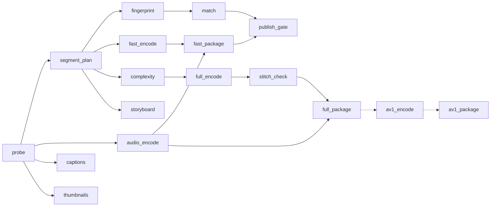
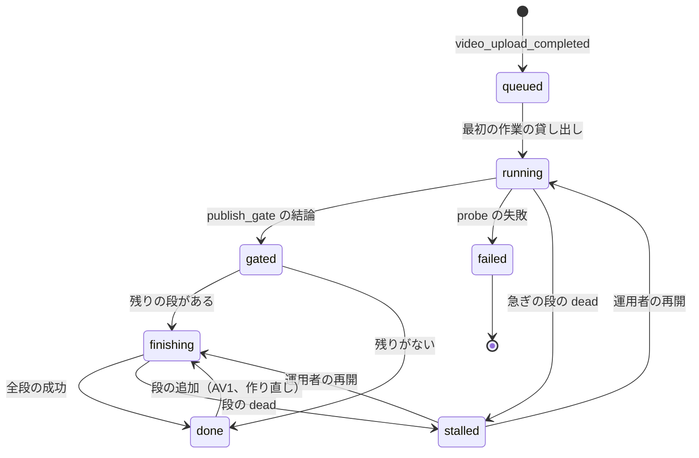
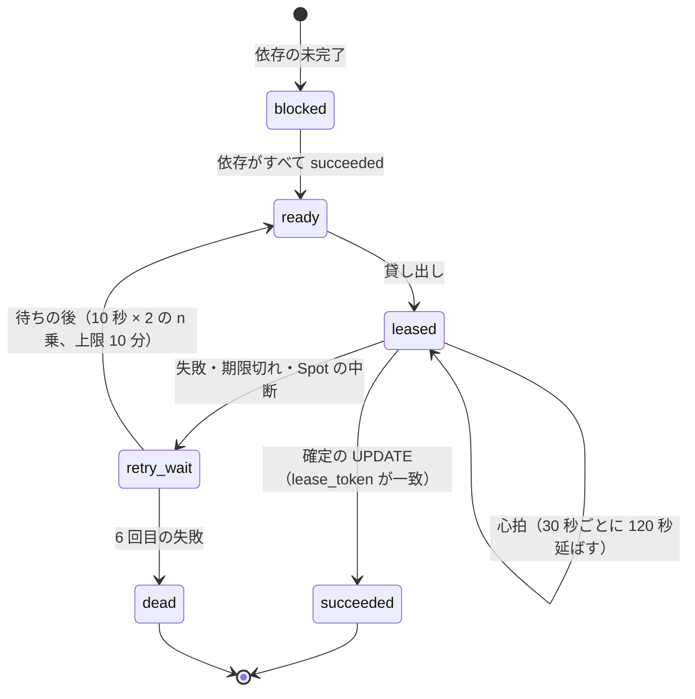

# Transcoding pipeline: YouTube

アップロードの完了から、全部のレンディションがそろうまでを決める。段の状態の機械、作業の貸し出しとやり直し、冪等な出力、区切り（チャンク）と並列の符号化、継ぎ目の検査、動画ごとのラダー（per-title）と `ladder_version`、AV1 への上げ、音声とラウドネス、字幕と ASR、サムネイル・シークの縮小の画像・チャプター、Spot の中断、時間と費用の予算を扱う。

前提となる決定は次のとおり。

- 段の状態の機械は自前（Aurora の状態の行と SQS の作業の配り）。段は冪等。元のファイルを保持する（[ADR-0002](../decisions/0002-upload-and-pipeline-orchestration.md)）
- H.264 を全動画、AV1 を人気の動画にだけ。VP9 なし。ラダーは試しの符号化と VMAF で動画ごとに決める。VOD は CPU の Spot、MediaConvert は使わない（[ADR-0003](../decisions/0003-codecs-and-per-title-ladder.md)）
- VOD のセグメントは 4 秒、GOP 2 秒、全段でキーフレームを揃える（[ADR-0004](../decisions/0004-cmaf-packaging-and-drm-scope.md)）
- 照合の結果が出るまで公開しない（[ADR-0008](../decisions/0008-fingerprinting-and-match-engine.md)）
- AV1 の時機に使う視聴は確定の数（[ADR-0007](../decisions/0007-two-phase-view-counting.md)）

この文書で決めたことは次の ADR にある。

| ADR | 決定 |
| --- | --- |
| [0014](../decisions/0014-pipeline-task-leases-and-idempotent-outputs.md) | 段の作業は Aurora の行の貸し出し（120 秒、30 秒ごとの心拍）で受ける。出力は（`video_id`、段、設定の要約、入力の要約、区切り）で決まるキーへ `If-None-Match: *` で書き、412 なら置かれたものを採る。確定は貸し出しの印を条件にした `UPDATE` で 1 回だけ。やり直しは 5 回まで、尽きたら `dead` にして run を `stalled` にする |
| [0015](../decisions/0015-per-title-ladder-convex-hull.md) | `ladder_version` 1 のラダーは、場面の切り替えで選んだ 10 秒の区間 6 つを、5 つの解像度 × 6 つの CRF で試しに符号化し、VMAF の凸包から上の段から順に選ぶ。上の段は VMAF 95 を満たす最小の点（段の上限で頭を抑える）、次の段はビットレートが 1/1.5 以下かつ VMAF が 4 以上低い点のうち VMAF の最も高いもの。最下段が 200 kbps 以下で止める |
| [0016](../decisions/0016-av1-promotion-rule-and-cost.md) | AV1 は ADR-0003 の 4 つの条件で作る。1 時間を超える動画は、7 日の確定の総再生時間が損益の分かれ目の半分以上という条件を足す。元のファイルが Deep Archive にあれば戻しの後に作り、6 時間の目標は戻しの時間を除いて数える |
| [0017](../decisions/0017-audio-loudness-and-asr-adapter.md) | 音声は区切らずにトラックの全体を 1 回で符号化する。ラウドネスは ITU-R BS.1770 の積分の値を測り、再生の側で -14 LUFS へ下げるだけにする（上げない）。自動の字幕は `AsrEngine` の口の後ろに置き、既定は GPU で自前でホストする公開の重みのモデル、Amazon Transcribe を 2 つ目の実装にする |
| [0018](../decisions/0018-encode-worker-pools-and-spot-interruption.md) | 作業者のプールを急ぎ・通常・後ろの 3 つに分ける。急ぎは On-Demand の下限と Spot、通常と後ろは複数の型の Spot（容量を優先する配分）。区切りは 10 GOP（約 20 秒）、5 分未満の動画は 4 GOP。Spot の中断の通知で貸し出しをすぐ返す |

## 1. 範囲

- 扱う：
  - `pipeline_runs`・`pipeline_tasks` の状態と遷移、段の依存、貸し出し、やり直し、優先度
  - 出力のキーと冪等、`stitch_check`
  - 区切りの計画、区切りの符号化、端数のあるフレームレート
  - per-title のラダー、`ladder_version`、試しの符号化と VMAF
  - AV1 への上げの判定と費用
  - 音声の符号化とラウドネス、手動の字幕、自動の字幕（ASR）
  - サムネイル、シークの縮小の画像、チャプター
  - 作業者のプール、Spot の中断、時間と費用の予算
- 扱わない：
  - アップロードと `probe` の中身（[upload-and-ingest.md](upload-and-ingest.md)）。この文書は段としての位置だけを書く
  - CMAF の書き手、セグメントの索引、マニフェスト（[packaging-and-drm.md](packaging-and-drm.md)）
  - 指紋と照合の方式（copyright-matching の領域）。この文書は `fingerprint`・`match` を段として並べるだけ
  - ライブの変換（[live-streaming.md](live-streaming.md)）
  - EC2 のプールの構成と AMI（infrastructure の領域）、単価（capacity の領域）

## 2. 要件

| 要件 | 目標 | NFR |
| --- | --- | --- |
| 再生できるまで | 10 分の 1080p：完了から p50 60 秒・p95 3 分。1 時間の 1080p：p95 10 分（照合の待ちを含む） | NFR-002、K2 |
| 全段まで | 10 分の 1080p：p95 10 分。1 時間の 1080p：p95 40 分 | NFR-002 |
| AV1 | しきい値を超えてから 6 時間以内 | NFR-002 |
| 画質 | 同じ VMAF での配信のビットレートが固定のラダーより 20% 低い。平均の VMAF（画面の大きさで重み付け）80 以上 | K5、NFR-004 |
| 冪等 | 任意の位置で作業者を止めても、出力が 1 回だけ行った場合と同じ | NFR-009、ADR-0002 |
| 決定的なラダー | 同じ入力・同じ `ladder_version` から同じラダー | intent の「守るべき振る舞い」 |
| 継ぎ目 | フレームの数・表示の時刻・音声のサンプルの数が元と一致。音声と映像のずれ 20 ms 以内 | [quality.md](../quality.md) の 2.2.1 節 A |

## 3. 段の状態の機械（ADR-0014）

### 3.1 段と依存



- 実線は同じ run の中の依存、点線は人気のしきい値の後に足す段（6 節）。
- `full_encode` は公開を待たない（ADR-0002）。`publish_gate` が `blocked` なら、`full_encode` 以降を後ろの組に下げる（異議で戻ったときのために作り切る）。
- `*_package` は CMAF の書き手と索引の作成（[packaging-and-drm.md](packaging-and-drm.md)）。

### 3.2 run の状態



- `gated` は `publish_gate` の結果（`publish`・`block`・`hold`）を記録した状態である。動画の状態（`ready`・`blocked`）への反映は同じトランザクションで outbox に書く（[upload-and-ingest.md](upload-and-ingest.md) の 6.1 節）。
- `done` の後に段を足すとき（AV1、新しい `ladder_version` での作り直し、新しい `fp_version`）は、同じ run に作業の行を足して `finishing` に戻す。run を作り直さない。

### 3.3 作業の状態



- 貸し出し：`UPDATE pipeline_tasks SET state='leased', lease_token=$new, lease_until=now()+'120s', attempt=attempt+1 WHERE task_id=$id AND (state='ready' OR (state='leased' AND lease_until < now()))`。1 行が変わった作業者だけが進む。SQS のメッセージは「この作業を見よ」の合図で、正本は行である。
- 心拍：30 秒ごとに `lease_until` を 120 秒先へ。行が自分の `lease_token` でなくなっていたら、作業をやめる。
- 確定：`UPDATE ... SET state='succeeded', output_key=$k, output_crc=$c WHERE task_id=$id AND lease_token=$mine`。0 行なら、別の作業者が先に確定したか、貸し出しを失った。出力はキーが同じなので捨ててよい。
- 依存の解放：確定と同じトランザクションで、依存先の `blocked` の行のうち依存がそろったものを `ready` にし、outbox に SQS への合図を書く。
- やり直しの上限：5 回（計 6 回の試み）。`probe`・`fast_encode`・`fingerprint`・`match` の `dead` は run を `stalled` にして Ops を呼ぶ。他の段の `dead` は翌営業日の対応にする。

### 3.4 出力のキーと冪等

```
s3://<media-bucket>/r/{video_id}/{stage}/{cfg}/{inp}/{chunk:05}.{ext}
  cfg = 設定の要約（ladder_version、符号化器のバージョン、段の設定）の SHA-256 の先頭 16 文字
  inp = 入力の要約（元のファイルの CRC64NVME、probe_version、区切りの範囲）の SHA-256 の先頭 16 文字
```

- 書き込みは `If-None-Match: *` の PUT にする。412 なら、置かれたオブジェクトのチェックサム（`x-amz-checksum-crc64nvme`）を読み、それを出力として確定する。符号化器の出力がバイトの単位で決定的でなくても（SVT-AV1 のスレッドなど）、1 つのキーには最初の 1 つの中身だけが残る。
- 中間の出力（区切りのビット列）は 7 日で消す（ライフサイクル）。パッケージした CMAF のファイルが正本になる（[packaging-and-drm.md](packaging-and-drm.md)）。

### 3.5 優先度の組

| 組 | 段 | SQS | 作業者 |
| --- | --- | --- | --- |
| 急ぎ | `probe`、`segment_plan`、`fingerprint`、`match`、`fast_encode`、`audio_encode`、`complexity`、`fast_package`、`publish_gate` | `pipe-urgent` | 急ぎのプール（10 節） |
| 通常 | `full_encode`、`stitch_check`、`full_package`、`captions`、`thumbnails`、`storyboard` | `pipe-normal` | 通常のプール |
| 後ろ | `av1_encode`、`av1_package`、作り直し、`blocked` の動画の残り | `pipe-back` | 後ろのプール（Spot だけ） |

- 1 つのチャンネルが同時に急ぎの組を使える作業は 200 まで。超えた分は `ready` のまま待つ（多数のアップロードを一度に上げるチャンネルが、他の公開を遅らせない）。

## 4. 区切りと符号化

### 4.1 区切りの計画

- 出力の GOP は 2 秒の閉じた GOP（ADR-0003）。フレームの数で決める：`G = round(2 × fps)`。
- 区切りは `10 × G` フレーム（約 20 秒、VOD のセグメント 5 つ）。5 分未満の動画は `4 × G`（約 8 秒）にして並びを増やす。
- 端数のあるフレームレートは、フレームの数で揃える。

| 入力 | `G` | GOP の長さ | セグメント（2 GOP） | 区切り（10 GOP） |
| --- | --- | --- | --- | --- |
| 24 fps | 48 | 2.000 秒 | 4.000 秒 | 20.000 秒 |
| 23.976 fps（24000/1001） | 48 | 2.002 秒 | 4.004 秒 | 20.020 秒 |
| 25 fps | 50 | 2.000 秒 | 4.000 秒 | 20.000 秒 |
| 29.97 fps（30000/1001） | 60 | 2.002 秒 | 4.004 秒 | 20.020 秒 |
| 59.94 fps | 120 | 2.002 秒 | 4.004 秒 | 20.020 秒 |

- 4.004 秒のセグメントは、HLS の `EXT-X-TARGETDURATION:4` に収まる（四捨五入で 4。[packaging-and-drm.md](packaging-and-drm.md) の 4 節）。

### 4.2 区切りの符号化

1. 区切りの開始のフレームより前の、元のファイルの最も近いキーフレームから復号を始め、開始より前のフレームは捨てる。
2. 区切りのフレームを全段で同時に縮小し（1 回の復号で全段）、各段を x264 で符号化する。
3. 設定：`keyint = min-keyint = G`、`scenecut` なし、閉じた GOP、先頭は IDR。上限つきの CRF（5 節で決めた CRF、`maxrate`、`bufsize = 2 × maxrate`、`vbv-init 0.9`）。
4. 区切りの最後のフレームの数を確かめて出力する。

- `fast_encode` は 360p と 720p を x264 `veryfast` で、CRF 23・`maxrate` は ADR-0003 の上限で作る（ラダーを待たない）。全段ができたら、マニフェストを新しい世代へ切り替える（[packaging-and-drm.md](packaging-and-drm.md) の 3.3 節）。
- 音声は区切らない（7 節）。

### 4.3 継ぎ目の検査（`stitch_check`）

| 検査 | 条件 | 合わないとき |
| --- | --- | --- |
| フレームの数 | 区切り k のフレームの数が計画と一致。合計が元（壊れた区間の埋めを含む）と一致 | その区切りをやり直す |
| 先頭 | 各区切りの先頭が IDR、GOP の境が `G` ごと | 同上 |
| 時刻 | 区切り k の最初の表示の時刻 = `k × 10G × フレームの長さ` | 同上 |
| 境の画質 | 最上段で、各境の前後 2 フレームの PSNR が、区切りの中の平均より 6 dB 以上低くない（本番の抜き取り。VMAF の全数の検査は黄金の動画の試験で行う） | 同上。2 回続けば `dead` |
| VBV | 段の `maxrate` と `bufsize` で、区切りをつないだ列の HRD の模擬で溢れない | 記録だけ（VOD のプレイヤーはバッファが厚い） |

## 5. ラダー（ADR-0015）

### 5.1 手順（`ladder_version` 1）

1. **区間を選ぶ**：動画を 6 つの等しい窓に分け、各窓で、`probe` の場面の切り替えの点の密度が最も高い 10 秒を選ぶ（同点は早いほう）。5 分未満の動画は全体を使う。乱数を使わないので、同じ入力から同じ区間が出る。
2. **試しの符号化**：6 区間をつないだ 60 秒を、元の解像度を超えない {1080, 720, 480, 360, 240}p × CRF {18, 21, 24, 27, 30, 33} で、x264 `faster` で符号化する（最大 30 本）。
3. **測る**：各点の平均のビットレートと、VMAF（`vmaf_v0.6.1`、1080p に拡大して測る）、スマートフォンのモデルの VMAF を測る。
4. **凸包**：全点の（ビットレート、VMAF）の上側の凸包を作る。凸包の上にない点は使わない。
5. **段を選ぶ**：
   - 上の段：VMAF 95 以上の凸包の点のうち最もビットレートの低いもの。ビットレートが段の上限（ADR-0003 の表、30 fps の 1080p は 4.5 Mbps）を超えるなら、上限以下の凸包の点で最も VMAF の高いもの。
   - 次の段：直前の段のビットレートの 1/1.5 以下で、VMAF が 4 以上低い凸包の点のうち、VMAF の最も高いもの。
   - 最下段のビットレートが 200 kbps 以下になったら止める。最下段が 150 kbps を超えるなら、144p・0.1 Mbps の固定の段を足す。
   - スマートフォンのモデルで VMAF 93 を最初に満たす段を `mobile_top` として記録する（マニフェストで画面の小さい端末の上限に使う。[packaging-and-drm.md](packaging-and-drm.md) の 5.2 節）。
6. **全段の設定**：各段を（解像度、CRF、`maxrate = min(段の上限, 2 × 試しのビットレート)`）にする。`full_encode` は x264 `slow` で同じ CRF を使う。`slow` は同じ CRF で `faster` より少ないビットになる。
7. **記録**：`ladders`（`video_id`、`ladder_version`、段の一覧、試しの点の全部）に書く。

### 5.2 例 1：ゲームの実況（10 分、1080p30、動きが多い）

試しの点（kbps / VMAF。凸包の上の点に ★）：

| CRF | 1080p | 720p | 480p | 360p | 240p |
| --- | --- | --- | --- | --- | --- |
| 18 | 9,800 / 97.5 ★ | 5,000 / 93.6 | — | — | — |
| 21 | 6,400 / 96.0 ★ | 3,300 / 91.8 ★ | 1,650 / 84.0 | — | — |
| 24 | 4,300 / 93.8 ★ | 2,300 / 89.4 ★ | 1,150 / 79.6 | 650 / 68.2 | — |
| 27 | 2,900 / 90.6 | 1,600 / 85.7 ★ | 800 / 75.0 ★ | 460 / 63.0 | 230 / 48.1 |
| 30 | 2,000 / 86.2 | 1,100 / 80.9 ★ | 560 / 69.1 ★ | 330 / 57.0 ★ | 170 / 42.0 ★ |
| 33 | — | 780 / 75.2 | 400 / 62.8 | 240 / 50.3 | 125 / 36.0 ★ |

選び方：

| 段 | 条件 | 選んだ点 |
| --- | --- | --- |
| 1 | VMAF 95 の最小は 1080p CRF 21（6.4 Mbps）。上限 4.5 Mbps を超えるので、上限以下で VMAF 最大 | 1080p CRF 24、4.3 Mbps、93.8 |
| 2 | ≤ 2,867 kbps かつ ≤ 89.8 | 720p CRF 24、2.3 Mbps、89.4 |
| 3 | ≤ 1,533 kbps かつ ≤ 85.4 | 720p CRF 30、1.1 Mbps、80.9 |
| 4 | ≤ 733 kbps かつ ≤ 76.9 | 480p CRF 30、560 kbps、69.1 |
| 5 | ≤ 373 kbps かつ ≤ 65.1 | 360p CRF 30、330 kbps、57.0 |
| 6 | ≤ 220 kbps かつ ≤ 53.0 | 240p CRF 30、170 kbps、42.0（200 kbps 以下なので止める） |
| 7 | 最下段 170 kbps > 150 | 144p 固定、100 kbps |

- 720p が 2 つの段に出る。凸包では、この動画の 1.1 Mbps は 480p より 720p の CRF 30 のほうが画質が高い。
- 上の段は上限で抑えたので VMAF 95 に届かない。動きの多い動画は 1080p の H.264 で 4.5 Mbps が限界で、より高い画質は AV1 で出す。

### 5.3 例 2：スライドの講座（10 分、1080p30、静か）

| 段 | 選んだ点 | 固定のラダー（ADR-0003 の上限）との比べ |
| --- | --- | --- |
| 1 | 1080p CRF 24、620 kbps、VMAF 95.6 | 4.5 Mbps → 0.62 Mbps（-86%） |
| 2 | 720p CRF 24、380 kbps、91.0 | 2.5 Mbps → 0.38 Mbps |
| 3 | 480p CRF 27、160 kbps、80.2 | 1.0 Mbps → 0.16 Mbps（200 kbps 以下なので止める） |
| 4 | 144p 固定、100 kbps（最下段 160 kbps > 150） | — |

- 静かな動画は段が少なく、上の段の帯域も小さい。ABR は上の段にすぐ届く。
- K5（固定のラダーより 20% 低い）は、黄金の動画の集まりの全体で、同じ VMAF での平均のビットレートを比べて確かめる。

### 5.4 費用と時間

- 試しの符号化：60 秒 × 最大 30 本を `faster` で。1080p の `faster` を 1 vCPU で約 40 fps と見込み、解像度で重み付けした合計は約 0.3 vCPU 時間。VMAF の計算が同じくらい。動画の長さによらず約 0.6 vCPU 時間（1 時間の動画では ADR-0003 の「約 1 vCPU 時間/時間」より小さい）。
- 30 本を 30 の作業に分け、`fast_encode` と並べて 2 分以内に終える。`full_encode` はこの後に始まる。

### 5.5 `ladder_version`

- `ladder_version` は、段の上限の表、CRF の格子、区間の選び方、VMAF のモデルとしきい値、x264 と SVT-AV1 の設定、`G` の決め方を 1 つに結び付ける。値を変えるときは新しい番号を足す（AGENTS.md）。
- 新しい番号は新しいアップロードから使う。既存の動画の作り直しは後ろの組で、確定の視聴の多い順に行う（[runbooks](../runbooks/README.md) のバージョンの更新の順序）。
- 黄金の動画の集まりで、前の番号より平均の VMAF が 1 以上下がるか、平均のビットレートが 5% 以上上がったら、番号を出さない（[quality.md](../quality.md) の 2.2.1 節 A）。

## 6. AV1 への上げ（ADR-0016）

### 6.1 条件

`av1_encode` を出すのは次のどれか（ADR-0003）。判定は `view-verifier` の確定の数の更新（1 時間ごと）と、急な人気の検知（仮の数）で行う。

| 条件 | 判定に使う数 | 組 |
| --- | --- | --- |
| 公開から 7 日で確定の視聴が 1,000 回を超えた（1 時間を超える動画は、7 日の確定の総再生時間が損益の分かれ目の半分以上も満たす） | 確定 | 後ろ |
| 1 時間に 200 回を超える視聴の急な上がり | 仮 | 後ろの組の先頭 |
| 登録者 10 万以上のチャンネルの新しい動画 | — | 公開の時に後ろの組 |
| 元のファイルが 1440p 以上 | — | 公開の時に後ろの組 |

- 仮の数で始めた AV1 は、後で確定の数が減っても取り消さない（作った出力は使える）。費用の集計で、仮の数で始めた割合を毎月見る。

### 6.2 費用の計算

| 項目 | 1 時間の動画あたり | 前提 |
| --- | --- | --- |
| AV1 の符号化 | 0.80 USD | SVT-AV1 preset 6、約 40 vCPU 時間 × Spot 約 0.02 USD（[architecture/README.md](README.md) の 2.1 節） |
| AV1 の試しの符号化 | 0.05 USD | 5.1 節と同じ手順を SVT-AV1 の速い preset で |
| AV1 の保存（1 年） | 約 0.20 USD | 2.5 GB。最初の 30 日 S3 Standard（約 0.025 USD/GB・月）、その後は低い層（約 0.005 USD/GB・月） |
| 合計の費用 `K` | 約 1.05 USD | — |
| 視聴 1 時間あたりの節約 `s` | 約 0.0044 USD | H.264 の平均 0.9 GB/時 × AV1 の削減 35% × AV1 を復号できる再生の割合 0.7（**未検証**、`av1-cost-poc`）× 配信の単価 0.02 USD/GB（S1 の予算） |
| 損益の分かれ目 `W = K / s` | 約 240 視聴時間 | 配信の単価 0.01 USD/GB なら約 480 視聴時間 |

例：10 分の動画（1/6 時間）。

- `K` = 1.05 / 6 ≈ 0.175 USD、`W` ≈ 40 視聴時間。
- 1 回の視聴の平均が 5 分なら、損益の分かれ目は約 480 回。
- 公開から 7 日の確定の視聴が 1,000 回の動画は、1 年の視聴が 7 日の 2 倍以上になると見込む（**未検証**。`av1-cost-poc` で自前の分布から確かめる）。2,000 回 × 5 分 ≈ 167 視聴時間で、分かれ目の約 4 倍になる。しきい値 1,000 回は安全の側にある。

例：3 時間のゲームの実況。

- `K` ≈ 3.15 USD、`W` ≈ 716 視聴時間。7 日で 1,000 回・平均 20 分なら 333 視聴時間で、分かれ目の半分（358）に届かない。1 時間を超える動画に総再生時間の条件を足したのはこのためである。

**[architecture/README.md](README.md) の 2.1 節との差**：2.1 節は「10 分の動画なら約 1,500 回」と書いていたが、これは 1 時間の動画の費用（0.80 USD）を 10 分の動画に当てた値だった。統合の工程で約 480 回に直した。しきい値（1,000 回）は変えない。

### 6.3 古い動画

- 元のファイルは公開の後 90 日で Deep Archive に移る（ADR-0002）。それより古い動画で条件を満たしたら、標準の取り出し（12 時間以内）で戻してから `av1_encode` を出す。NFR-002 の「6 時間以内」は、戻しが終わった時から数える。
- 戻しの費用と待ちを避けるため、レンディション（H.264 の最上段）から AV1 を作る形は取らない。損失のある符号の再符号化で画質が落ちる。

## 7. 音声とラウドネス（ADR-0017）

- `audio_encode` は、既定の音声トラックの全体を 1 回で符号化する。区切らないので、AAC の前置きのサンプル（プライミング）が区切りごとに入らず、継ぎ目に無音や重なりが出ない。
- 出力：AAC-LC 128 kbps（48 kHz、ステレオ）と、HE-AAC v1 48 kbps（低い段の組）。5.1 は 2 チャンネルに下ろす（ADR-0003）。Opus は MVP の後。
- セグメントへの分け方：48 kHz の AAC の 1 フレームは 1,024 サンプル（約 21.3 ms）。4 秒は 187.5 フレームなので、映像のセグメントの境に最も近いフレームの境で切り、187 と 188 フレームのセグメントが交互になる。ずれは 1 フレーム未満で、たまらない（[packaging-and-drm.md](packaging-and-drm.md) の 2.2 節）。
- ラウドネス：ITU-R BS.1770 の積分のラウドネス（LUFS）と、真のピークを測り、`audio_loudness` に持つ。再生の側は -14 LUFS より大きい動画だけを下げ、小さい動画は上げない（上げるとピークで歪む）。-14 は本システムの値（本家の値は**未検証**）。

## 8. 字幕と ASR（ADR-0017）

### 8.1 手動の字幕

- 受ける形：SRT と WebVTT（UTF-8）。上限は 5 MB、5 万の手がかり（cue）。時刻は単調に増え、動画の長さを超えない。
- タグは `<b>`・`<i>`・`<u>`・`<c>`・`<v>` だけを残し、他は文字として扱う。WebVTT に正規化して置く。
- 言語は BCP 47 の値で持つ。1 動画 1 言語 1 本（上書き）。

### 8.2 自動の字幕

- 口 `AsrEngine.transcribe(audio, lang) -> [{start_ms, end_ms, text, confidence}]`。Zoom の題材の ASR Adapter の形に寄せる（[Zoom の ADR-0026](../../../zoom/docs/decisions/0026-asr-engine-amazon-transcribe-with-adapter.md)）。
- 既定の実装：`asr-worker`（GPU の L4）で自前でホストする公開の重みのモデル。2 つ目の実装：Amazon Transcribe。どちらを既定にするかは `asr-engine-poc` の日本語の文字の誤りの率と費用で確かめる。比べの目安：GPU の自前は 1 時間の音声で約 0.03 USD（[architecture/README.md](README.md) の 2.1 節）。Transcribe の分あたりの価格は**未検証**。
- 言語：創作者の設定の言語（日本語・英語）。設定がなければ、最初の 30 秒で判定する。日本語と英語以外は作らない。
- 長さ：12 時間まで。30 分ごとに分けて並べ、境の前後 5 秒を重ねて、重なりの中の文の境でつなぐ。
- 出力の整形：1 つの手がかりは 2 行・1 行は日本語 20 文字か英語 42 文字まで、表示 1〜7 秒。
- 自動の字幕を検索の索引に使う（search の領域）。モデルの学習には使わない（**法務の確認待ち：L8**。結論までは推論だけ）。

## 9. サムネイル・シークの縮小の画像・チャプター

| 出力 | 作り方 | 置き場 |
| --- | --- | --- |
| 自動のサムネイルの候補 3 枚 | 長さの 25%・50%・75% の付近の場面の切り替えの後 1 秒から、黒い画面でなく、ラプラシアンの分散（鮮明さ）が最大のフレーム | 1280×720 の JPEG と WebP、ほかに 320・480・640 の幅 |
| 手動のサムネイル | 2 MB まで、JPEG・PNG・WebP。`HashMatcher` を通す（[upload-and-ingest.md](upload-and-ingest.md) の 5.3 節） | 同上 |
| シークの縮小の画像 | 1 時間以下は 2 秒ごと、3 時間以下は 5 秒ごと、それより長いと 10 秒ごとに 160×90 のフレーム。10×10 のスプライトの JPEG と、`#xywh` の WebVTT の索引 | `storyboard/` |
| チャプター | 説明の行のうち `^((\d{1,2}):)?(\d{1,2}):(\d{2})\s+(.+)$` に合うもの。最初が 0:00、3 つ以上、各 10 秒以上のときだけ作る（本家の規則は**未検証**。本システムの値） | `chapters.json` |

- サムネイルとシークの縮小の画像は、セグメントと同じく配信の停止の対象である（[cdn-and-delivery.md](cdn-and-delivery.md) の 10 節）。

## 10. 作業者のプールと Spot の中断（ADR-0018）

| プール | 作業 | 容量 | インスタンス |
| --- | --- | --- | --- |
| 急ぎ | 急ぎの組 | On-Demand の下限（平常のピークの 30%。S1 は急増の最初の 5 分を受けるため 8 台）＋ Spot | x86 の計算に強い型を 6 つ以上（[infrastructure.md](infrastructure.md) の 4.2 節） |
| 通常 | 通常の組 | Spot だけ、容量を優先する配分、6 つ以上の型 | 同上 |
| 後ろ | 後ろの組 | Spot だけ。後ろの組の待ちが 24 時間を超えたら、通常のプールの空きも使う | AV1 に向く大きな型を含む |
| 検査 | `probe` | 急ぎと同じ。ネットワークを持たないタスク（ADR-0012） | — |

- Spot の中断の通知（2 分前）を受けたら、作業者は新しい作業を取らず、作業中の貸し出しを `lease_until = now()` に戻す。別の作業者がすぐ取る。失うのは区切り 1 つの途中の計算だけ。
- 区切り 1 つの全段の符号化は、8 vCPU で約 20〜40 秒（全段の x264 `slow` を 8 vCPU 時間/時間と見込む）。中断で失う計算は小さい。
- 中断の率が 1 時間に 10% の作業者でも、出力が変わらないことを障害の注入で確かめる（[quality.md](../quality.md) の 2.2.1 節 F）。

## 11. 時間の予算

10 分の 1080p30（約 1 GB）の、完了から再生できるまで（p50）。

| 区間 | 時間 | 中身 |
| --- | --- | --- |
| 完了 → 最初の貸し出し | 2 秒 | outbox → relay → SQS |
| `probe` | 15 秒 | 分離 2 秒、抜き取りの復号 10 秒、`HashMatcher` 3 秒 |
| `segment_plan` | 1 秒 | 30 の区切り |
| `fast_encode` | 15 秒 | 30 の作業を並べる。1 作業 約 10 秒（360p と 720p、`veryfast`）＋待ち |
| `audio_encode` | 10 秒 | 並べる |
| `fast_package` | 3 秒 | CMAF の書き手と索引 |
| `fingerprint` → `match` | 30 秒 | 並べる（copyright-matching の領域） |
| `publish_gate` → `playable()` の写し | 2 秒 | outbox |
| 合計 | 約 50 秒 | 照合が律速。p95 3 分はピークの待ちを含む |

- 1 時間の動画は、区切りが 180 になり、急ぎの組の上限（チャンネルあたり 200 作業）の中で並べる。照合の p95 5 分（NFR-007）が律速で、再生できるまで p95 10 分に入る。
- 全段（p95 10 分）：`complexity`（2 分）→ `full_encode`（30 区切りを並べて 1 分）→ `stitch_check` → `full_package`。待ちを含めて p95 10 分。

## 12. 費用

| 段 | 1 時間の動画あたり | 前提 |
| --- | --- | --- |
| `probe` | 0.1 vCPU 時間 | — |
| `fast_encode` | 0.5 vCPU 時間 | 2 段、`veryfast` |
| `complexity` | 0.6 vCPU 時間 | 5.4 節 |
| `full_encode` | 8 vCPU 時間 | ADR-0003 |
| `fingerprint` | 0.5 vCPU 時間 | ADR-0008 |
| `audio_encode`、`thumbnails`、`storyboard` | 0.2 vCPU 時間 | — |
| `captions` | GPU 約 0.03 USD | 8.2 節 |
| 合計（H.264 の道） | 約 9.9 vCPU 時間 ≈ 0.20 USD、急ぎの段の On-Demand の分 約 0.04 USD、ASR 約 0.03 USD で約 0.27 USD | Spot 約 0.02 USD/vCPU 時間（**未検証**）。[infrastructure.md](infrastructure.md) の 11.3 節、[architecture/README.md](README.md) の 2.1 節 |

- MediaConvert との比べ：MediaConvert の分あたりの価格は**未検証**のため、式だけを置く。`MediaConvert の 1 時間の費用 = 60 × 分あたりの価格 × 段の数の係数`。capacity の領域で、公開の価格を入れて比べる（ADR-0003 は使わないと決めた。比べは費用の確かめのため）。

## 13. 失敗と回復

| 失敗 | 起きること | 回復 |
| --- | --- | --- |
| 作業者の停止・Spot の中断 | 貸し出しが切れる | 120 秒で他の作業者が取る。中断は即時に返す |
| S3 の PUT の後、確定の前に停止 | 出力はあるが行は `leased` | 次の作業者が同じキーへ PUT し 412、置かれたものを採って確定 |
| 2 つの作業者が同じ作業をする | どちらも出力を作る | キーへの最初の PUT だけが残り、確定は 1 回だけ |
| 区切りの継ぎ目の不一致 | `stitch_check` の失敗 | その区切りだけをやり直す |
| ラダーの試しの失敗（VMAF の計算の失敗） | `complexity` の失敗 | やり直し。5 回尽きたら、ADR-0003 の上限の表（固定のラダー）で `full_encode` を進め、`ladders.fallback = true` を記録する |
| ASR の失敗 | 自動の字幕がない | やり直し。尽きたら字幕なしで公開を続ける（公開を止めない） |
| `match` の停止 | `publish_gate` が待つ | 公開に倒さない（ADR-0008）。30 分で Ops |
| Aurora の切り替え | 確定と貸し出しが失敗 | 作業者は確定をやり直す（キーが同じなので安全） |
| Deep Archive の戻しの遅れ | AV1・作り直しが待つ | 後ろの組なので待つ。12 時間を超えたら翌営業日の対応 |

## 14. 上限

| 対象 | 値 |
| --- | --- |
| 1 run の区切り | 12 時間 ÷ 20 秒 = 2,160 |
| チャンネルあたりの急ぎの組の同時の作業 | 200 |
| 作業のやり直し | 5 回 |
| 貸し出し | 120 秒、心拍 30 秒 |
| ラダーの段 | 8（H.264 は 1080p まで、AV1 は 2160p まで） |
| 試しの符号化 | 30 本 |
| 手動の字幕 | 5 MB、5 万の手がかり、1 言語 1 本 |
| 中間の出力の保持 | 7 日 |

## 15. data-model への項目

列・キー・索引の正本は [data-model.md](data-model.md) と [data-model/](data-model/) の各ファイルである。この節は提案の記録として残す（2026-10-10 のデータモデルの工程）。

| 表・置き場 | 中身 | 主キー・索引 | 節 |
| --- | --- | --- | --- |
| `pipeline_runs` | `run_id`、`kind`（`video`・`reference`）、`video_id`・`reference_id`（どちらか 1 つ）、`state`、`gate_result`（`publish`・`block`・`hold`）、`created_at`、`gated_at`、`done_at` | `(run_id)`、一意 `(video_id)`・`(reference_id)` | 3.2 |
| `pipeline_tasks` | `task_id`、`run_id`、`stage`、`chunk`、`priority`、`state`、`deps_left`、`attempt`、`lease_token`、`lease_until`、`cfg_hash`、`inp_hash`、`output_key`、`output_crc`、`error_code`、`stage_times`（JSON） | `(task_id)`、`(run_id, stage, chunk, cfg_hash)` 一意（作り直しを同じ run に足すため）、依存の辺は `pipeline_task_deps`、部分索引 `(lease_until) WHERE state='leased'` | 3.3 |
| `ladders` | `video_id`、`ladder_version`、`codec`、`rungs`（JSON：解像度、CRF、`maxrate`、試しの VMAF）、`mobile_top`、`trial_points`（S3 のキー）、`fallback` | `(video_id, codec, ladder_version)` | 5 |
| `renditions` | `video_id`、`gen`、`name`、`codec`、`height`、`target_bps`、`ladder_version`、`state` | `(video_id, gen, name)` | 5、[packaging-and-drm.md](packaging-and-drm.md) |
| `av1_promotions` | `video_id`、`reason`（`views_7d`・`spike`・`channel`・`hires`）、`triggered_by`（`confirmed`・`provisional`）、`requested_at`、`restore_started_at`、`done_at` | `(video_id)` | 6 |
| `audio_loudness` | `video_id`、`integrated_lufs`、`true_peak_dbtp` | `(video_id)` | 7 |
| `captions` | `video_id`、`lang`、`kind`（`manual`・`auto`）、`engine`、`s3_key`、`created_at` | `(video_id, lang, kind)` | 8 |
| `thumbnails`、`chapters` | 候補と選択、チャプターの一覧 | `(video_id, ...)` | 9 |
| SQS | `pipe-urgent`、`pipe-normal`、`pipe-back`（合図だけ。正本は `pipeline_tasks`） | — | 3.5 |
| S3 | `r/{video_id}/{stage}/{cfg}/{inp}/{chunk}`（7 日）、`ladder/{video_id}/trial/` | — | 3.4 |

## 16. テストと性質

| ID | 性質・試験 |
| --- | --- |
| PROP-PIPE-001 | 任意の位置（PUT の前後、確定の前後、依存の解放の前後）で作業者を止め、任意の数の作業者を並べても、各（段、区切り）の確定はちょうど 1 回で、出力のキーの中身は 1 つ（ADR-0002 の Confirmation） |
| PROP-PIPE-002 | 任意の作業の完了の順序で、依存が全部 `succeeded` になる前に `ready` にならない |
| PROP-PIPE-003 | 任意の状態の列で、`match` の結果がない run の `publish_gate` は `publish` を出さない |
| PROP-PIPE-004 | 任意のフレームレート（1000/1001 の系を含む）と長さで、区切りのフレームの数の合計が元と一致し、区切りの境が GOP の境と一致する |
| PROP-LADDER-001 | 同じ試しの点の集まりから、同じ段の列が出る（点の並びの順序を入れ替えても） |
| PROP-LADDER-002 | 出た段の列は、ビットレートが厳密に減り、各段が段の上限以下で、凸包の上にある（固定の 144p を除く） |
| PROP-AV1-001 | 確定の視聴と総再生時間の任意の列で、`av1_encode` の要求は動画あたり 1 回だけ |
| DT-PIPE-001 | 作業の状態の遷移表（3.3 節）の全行 |
| DT-AV1-001 | AV1 の条件の決定表（6.1 節）：条件 × 長さ（1 時間の前後）× 元の層（Deep Archive か） |
| 黄金の動画 | 継ぎ目、音声と映像のずれ 20 ms、ラダーの VMAF の下限と、`ladder_version` の比べ（[quality.md](../quality.md) の 2.2.1 節 A） |
| 障害の注入 | Spot の中断を 1 時間に 10% の作業者に。出力が同じ |
| ASR | 評価の音声の集まりで、日本語の文字の誤りの率（`asr-engine-poc`） |

## 17. Story の候補

| Epic | Story | 中身 |
| --- | --- | --- |
| E2 | `pipeline-state-machine` | 3 節（ADR-0014、PROP-PIPE-001〜003、DT-PIPE-001） |
| E3 | `per-title-ladder-poc` | 5 節の格子と VMAF の目標を、黄金の動画の集まりで固定のラダーと比べる |
| E3 | `av1-cost-poc` | 6.2 節の AV1 を復号できる割合、preset ごとの費用と VMAF、7 日と 1 年の視聴の比 |
| E3 | `asr-engine-poc` | 8.2 節 |
| E3 | `segment-parallel-encode` | 4 節（ADR-0018、PROP-PIPE-004） |
| E3 | `fast-encode-path` | 4.2 節 |
| E3 | `per-title-ladder` | 5 節（ADR-0015、PROP-LADDER-001・002） |
| E3 | `av1-promotion` | 6 節（ADR-0016、PROP-AV1-001、DT-AV1-001） |
| E3 | `audio-and-loudness` | 7 節（ADR-0017） |
| E3 | `manual-captions`、`auto-captions` | 8 節 |
| E3 | `thumbnails-and-storyboard`、`chapters-from-description` | 9 節 |
| E3 | `golden-media-suite` | 16 節の黄金の動画 |

## 18. 未解決の問い

### 決定（2026-10-10、既定案）

- **貸し出しと冪等**：行の貸し出しと、`If-None-Match` のキー（ADR-0014）。
- **ラダーの選び方**：凸包、VMAF 95、1/1.5 と 4 の差、200 kbps で止める（ADR-0015）。
- **AV1 の長い動画の条件**：総再生時間の条件を足す（ADR-0016）。
- **音声**：区切らずに 1 回で。ラウドネスは下げるだけ（ADR-0017）。
- **ASR**：自前でホストするモデルを既定の案に、Transcribe を 2 つ目に（ADR-0017）。
- **区切り**：10 GOP、5 分未満は 4 GOP（ADR-0018）。

### 持ち越し

| 問い | いつ・どう決めるか |
| --- | --- |
| AV1 を復号できる再生の割合、7 日と 1 年の視聴の比（**未検証**） | `av1-cost-poc` |
| VMAF の目標（95・93）と、段の差（1/1.5・4） | `per-title-ladder-poc`。K5 に届かなければ `ladder_version` 2 |
| ASR のエンジン | `asr-engine-poc` |
| 古い動画の AV1 の 6 時間の数え方（戻しを除く） | 統合の工程で NFR-002 に書いた（閉じた） |
| 自動の字幕の学習への利用 | **法務の確認待ち：L8** |
| MediaConvert との費用の比べ | capacity の領域（価格は**未検証**） |

## 出典

いずれも 2026-10-10 に確認。

- YouTube Official Blog, [Reimagining video infrastructure to empower YouTube](https://blog.youtube/inside-youtube/new-era-video-infrastructure/)（2021-04-21）
- YouTube Help, [Recommended upload encoding settings](https://support.google.com/youtube/answer/1722171)
- AWS, [Conditional writes](https://docs.aws.amazon.com/AmazonS3/latest/userguide/conditional-writes.html)
- ITU-R BS.1770（ラウドネスの測り方。改訂の細部は本文で使わない。規格の本文は確かめていない：**未検証**）
- VMAF のモデル（`vmaf_v0.6.1` と、スマートフォンのモデル）の振る舞いは、libvmaf の公開のリポジトリの記述による（本文の数値は本システムの例。**未検証**の値を含む）
