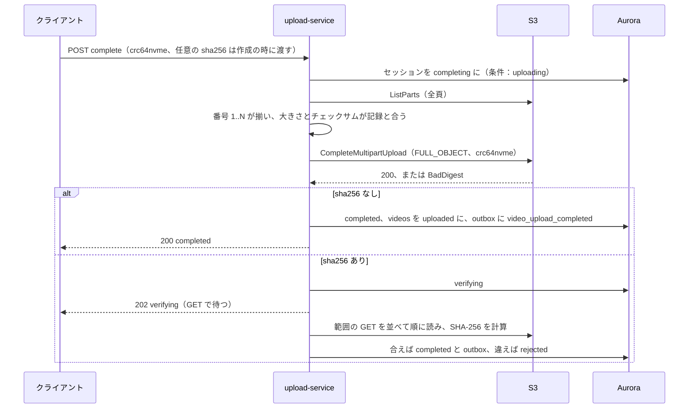
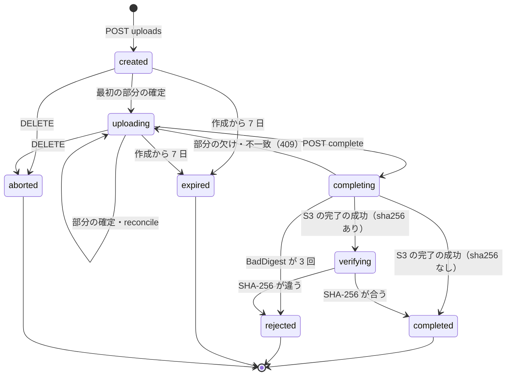
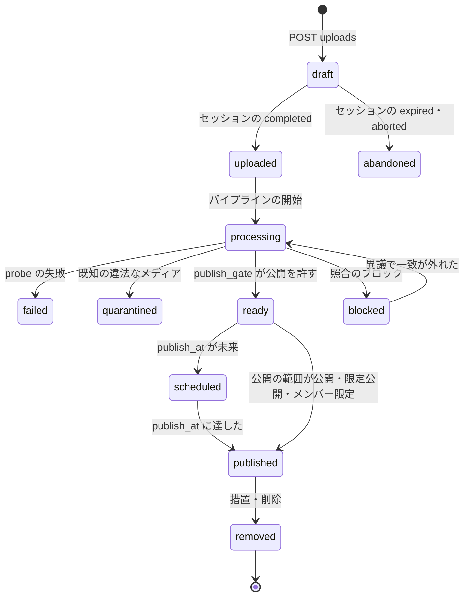

# Upload and ingest: YouTube

創作者のファイルを受け取り、パイプラインへ渡すまでを決める。再開できるアップロードのセッション（部分の大きさ、部分と全体のチェックサム、位置の問い合わせ、期限）、アプリの背景のアップロード、検査（形式、長さ、壊れた区間、既知の違法なメディア）、下書きと予約の公開、元のファイルの保持と消去の経路を扱う。

前提となる決定は次のとおり。

- アップロードは S3 のマルチパートの上の自前のセッションで、全体のハッシュが合ってから完了を返す。元のファイルを保持する（[ADR-0002](../decisions/0002-upload-and-pipeline-orchestration.md)）
- 照合の結果が出るまで公開しない（[ADR-0008](../decisions/0008-fingerprinting-and-match-engine.md)）
- 見える範囲は `playable()` の 1 か所で決める（[ADR-0009](../decisions/0009-single-tenant-and-playable.md)）
- 管理の面は TypeScript（`upload-service`）、検査はメディアの面の Rust（[ADR-0001](../decisions/0001-platform-and-stack.md)）

この文書で決めたことは次の ADR にある。

| ADR | 決定 |
| --- | --- |
| [0011](../decisions/0011-upload-session-protocol-and-checksums.md) | 部分の大きさは 8・16・32・64 MiB から選び、部分の数が 10,000 を超えない最小の値以上にする。マルチパートは CRC64NVME の全体のチェックサム（`FULL_OBJECT`）で作り、部分ごとに `Content-MD5` と CRC64NVME を署名に含めて S3 に確かめさせる。完了は S3 の全体のチェックサムの照合が通ってから返す。任意の SHA-256 は `verifying` の状態で読み直して確かめる |
| [0012](../decisions/0012-media-probe-and-admission-checks.md) | 検査は、ネットワークを持たない隔離した作業者で、時間とメモリーの上限を付けて行う。壊れた区間は合計 1% 以下・1 か所 10 秒以下なら除いて進め、超えたら失敗にする。既知の違法なメディアの照合は差し替えられる口の後ろに置き、結果が出るまで先へ進めない |
| [0013](../decisions/0013-original-retention-and-deletion-paths.md) | 元のファイルの消去は、`original-deleter` の役割だけが行える。IAM の拒否と S3 のバージョンの管理（30 日）で他の経路を塞ぐ。創作者の削除は 30 日の猶予の後に消す。大阪の写しも同じ経路で消す |

## 1. 範囲

- 扱う：
  - アップロードのセッションの API と状態、部分の大きさの決め方、チェックサム、再開、期限と掃除
  - Web の分割の送信、iOS・Android の背景の転送
  - 検査（`probe` の段の中身）と、受け付けの上限
  - 既知の違法なメディアのハッシュの照合の口
  - 動画の状態（下書き、処理中、予約、公開）と、予約の公開の時刻の扱い
  - 元のファイルの置き場、層の移し、消去の 3 つの経路
- 扱わない：
  - 段の状態の機械と符号化（[transcoding-pipeline.md](transcoding-pipeline.md)）
  - 指紋と照合（copyright-matching の領域）。この文書は `publish_gate` の条件だけを使う
  - 長い動画を上げられる創作者の確認、権利者の審査（accounts-and-safety の領域）
  - 公開の範囲の判定そのもの（`playable()`、[ADR-0009](../decisions/0009-single-tenant-and-playable.md)）
  - S3 のバケットとネットワークの全体の構成、大阪の DR（infrastructure の領域）
  - 単価（capacity の領域）

## 2. 要件

| 要件 | 目標 | NFR |
| --- | --- | --- |
| 部分の受け取りの確定 | 部分の PUT の後の確定の要求が p99 2 秒（転送の時間を除く） | NFR-001 |
| 再開 | 切断・再起動・URL の期限切れの後、受け取り済みの部分を送り直さない | NFR-001 |
| 上限 | 1 ファイル 256 GB・12 時間まで。セッションの期限 7 日 | NFR-001 |
| 完了の正しさ | 全部の部分が揃い、全体のチェックサムが合うまで完了を返さない | NFR-009、K1 |
| 公開までの速さ | 10 分の 1080p：完了から再生できるまで p50 60 秒・p95 3 分。そのうちこの文書の範囲（完了の処理と検査）に p95 30 秒 | NFR-002、K2 |
| 耐久性 | 完了を返した元のファイルの消失 0。消すのは 3 つの経路だけ | NFR-009、K1 |
| 可用性 | 部分の受け取りと完了の要求 月間 99.9% | NFR-010 |

## 3. 本家の形と標準（確かめたこと）

いずれも 2026-10-10 に確認。

| 項目 | 内容 | 出典 |
| --- | --- | --- |
| 本家の上限 | 256 GB か 12 時間の小さいほう。15 分を超えるのは確認済みのアカウント | [Upload videos longer than 15 minutes](https://support.google.com/youtube/answer/71673) |
| 本家の推奨の形 | MP4（moov を先頭）、H.264 High、閉じた GOP、AAC-LC か Opus | [Recommended upload encoding settings](https://support.google.com/youtube/answer/1722171) |
| 本家の再開の方式、1 日のアップロードの本数の上限 | 公式の資料で確かめられなかった（**未検証**） | — |
| S3 のマルチパート | 部分は 1〜10,000 番、1 部分 5 MiB〜5 GiB（最後の部分は下限なし）、オブジェクトは最大 48.8 TiB。`ListParts` は 1 回に 1,000 部分まで | [Amazon S3 multipart upload limits](https://docs.aws.amazon.com/AmazonS3/latest/userguide/qfacts.html) |
| S3 の全体のチェックサム | マルチパートで「全体（full object）」の型を使えるのは CRC64NVME・CRC32・CRC32C だけ。SHA-256・MD5 は「部分の合成（composite）」だけ。全体の値は `CompleteMultipartUpload` で渡し、合わなければ S3 が `BadDigest` で失敗させる | [Checking object integrity for data uploads](https://docs.aws.amazon.com/AmazonS3/latest/userguide/checking-object-integrity-upload.html) |
| `Content-MD5` | 部分の要求に付けられる。ただし SSE-KMS の部分の ETag は MD5 にならない。署名つきの URL に `Content-MD5` と CRC64NVME の両方を含めたときの振る舞いは文書で確かめられなかった（**未検証**。`presigned-part-checksum-poc` で確かめる） | 同上 |
| S3 の条件つきの書き込み | `If-None-Match: *` で、同じキーがあれば 412 を返す | [Conditional writes](https://docs.aws.amazon.com/AmazonS3/latest/userguide/conditional-writes.html) |

**ADR-0002 との関係**：ADR-0002 は「全体の SHA-256 は任意、部分ごとに `Content-MD5`」と決めた。S3 は SHA-256 の全体の値をマルチパートで確かめない。そこで、必須の全体のチェックサムを CRC64NVME にし（S3 が部分の値から全体を求めて照合する）、任意の SHA-256 は完了の前にサーバーが読み直して確かめる形にした（[ADR-0011](../decisions/0011-upload-session-protocol-and-checksums.md)）。ADR-0002 の「全体のハッシュが合ってから完了を返す」は変えない。

## 4. アップロードのセッション（ADR-0011）

### 4.1 部分の大きさ

部分の大きさ `P` は、セッションの作成の時に 1 つに決め、最後の部分のほかは全部同じにする。

```
P = max(回線の希望, 下限)
  回線の希望：携帯の回線 8 MiB、既定 16 MiB、クライアントが 100 Mbps 以上を測ったら 32 MiB
  下限：8・16・32・64 MiB のうち、ceil(size / P) ≤ 10,000 になる最小のもの
```

| ファイル | 回線の希望 | 下限 | `P` | 部分の数 |
| --- | --- | --- | --- | --- |
| 10 分の 1080p（約 1.0 GB） | 既定 16 MiB | 8 MiB | 16 MiB | 60 |
| 2 時間のゲームの実況（約 12 GB） | 携帯 8 MiB | 8 MiB | 8 MiB | 1,431 |
| 4K の 3 時間（約 120 GB） | 既定 16 MiB | 16 MiB（8 MiB では 14,306 部分） | 16 MiB | 7,153 |
| 上限 256 GB | 既定 16 MiB | 32 MiB（16 MiB では 15,259 部分） | 32 MiB | 7,630 |

- 16 MiB で扱える最大は 160 GiB（約 171.8 GB）、32 MiB で 312.5 GiB。256 GB の上限は 32 MiB で収まる。64 MiB は上限を上げたときの余地として残す。
- 1 部分の転送が長すぎると、切れたときの送り直しが大きい。携帯の回線（下り 20 Mbps・上り 5 Mbps を想定）で 8 MiB は約 13 秒、32 MiB は約 54 秒。

### 4.2 API

| 要求 | 中身 | 応答 |
| --- | --- | --- |
| `POST /v1/uploads` | `size`、`mime`、`filename_ext`、`client_net`（`cellular`・`default`・`fast`）、任意の `sha256` | `video_id`（UUIDv7）、`upload_id`、`part_size`、`part_count`、`checksum_algorithm`（`CRC64NVME`）、`expires_at`（作成から 7 日） |
| `POST /v1/uploads/{upload_id}/part-urls` | 部分の番号と、各部分の `md5`・`crc64nvme`（最大 100 部分） | 部分ごとの署名つきの URL（15 分）。署名に `content-length`・`content-md5`・`x-amz-checksum-crc64nvme` を含める |
| （S3 へ直接）`PUT` | 部分の本体 | S3 の `ETag` |
| `PUT /v1/uploads/{upload_id}/parts/{n}` | `etag` | 202。`upload_parts` の行を `received` にする。S3 を呼ばない（NFR-001 の p99 2 秒） |
| `GET /v1/uploads/{upload_id}` | `reconcile=1`（再開の時） | 状態、受け取り済みの部分（連続の範囲の列）、次に送る番号、期限。`reconcile=1` なら S3 の `ListParts`（1,000 部分ごとに頁）と記録を突き合わせる |
| `POST /v1/uploads/{upload_id}/complete` | 全体の `crc64nvme` | 下の 4.3 節 |
| `DELETE /v1/uploads/{upload_id}` | — | 中止。S3 の `AbortMultipartUpload` |

- 署名に部分のチェックサムを含めるので、クライアントは URL を取る前に部分を読み、MD5 と CRC64NVME を計算する。S3 は本体がこの値と合わなければ PUT を拒む。サーバーは「どの部分が、どの値で来るか」を先に記録する。
- URL は 1 回に 100 部分までまとめて出す。クライアントは、送る直前の部分のぶんだけ取る（先取りは 8 部分まで）。15 分で切れたら取り直す。

### 4.3 完了



- 部分が足りない・合わないときは、S3 を呼ばずに 409 と、足りない・合わない番号を返す。セッションは `uploading` に戻る。
- `CompleteMultipartUpload` が `BadDigest` を返したら、どこかの部分が壊れている。部分ごとの値は S3 が確かめ済みなので、ふつうは起きない（クライアントの全体の値の計算の誤り）。`rejected_checksum` にし、クライアントには全体を送り直させず、全部分の `reconcile` からやり直させる。3 回続いたら `rejected` にする。
- `CompleteMultipartUpload` は大きなオブジェクトで時間がかかることがある。25 秒で終わらなければ 202 `completing` を返し、クライアントは `GET` で待つ。
- SHA-256 の読み直しは、8 本の範囲の GET（各 64 MiB）を先読みし、順に計算する。1 GB/秒を見込み、256 GB で約 4 分 20 秒、1 GB で約 1 秒。
- **完了**は、セッションが `completed` になった時をいう。outbox の `video_upload_completed` は、この遷移と同じトランザクションで書く。パイプラインはこれで始まる（[transcoding-pipeline.md](transcoding-pipeline.md)）。

### 4.4 セッションの状態



- 遷移は条件つきの `UPDATE ... WHERE state = 前の状態` で行う。2 つの `complete` が同時に来ても、一方だけが `completing` に進む。他方は 409 `in_progress`。
- `rejected` の SHA-256 の不一致では、S3 にできたオブジェクトを `original-deleter` が消す（[ADR-0013](../decisions/0013-original-retention-and-deletion-paths.md) の「完了の前の不良」。元のファイルの消去の 3 つの経路の外ではない。完了を返していないため）。
- 期限：作成から 7 日（ADR-0002）。期限の掃除は 1 時間ごとに `expires_at < now()` のセッションを `expired` にし、`AbortMultipartUpload` を呼ぶ。保険として、S3 のライフサイクルの `AbortIncompleteMultipartUpload` を 8 日に置く。

### 4.5 クライアントの送り方

| クライアント | 同時の部分 | 再開 |
| --- | --- | --- |
| Web | 4（携帯の回線は 2） | ファイルの名前・大きさ・最終更新の時刻と、最初と最後の 1 MiB の SHA-256 を `IndexedDB` に `upload_id` と結び付けて持つ。同じファイルを選び直したら、`GET ?reconcile=1` で続きから送る |
| iOS | 背景の URL セッションで 2 | 部分ごとに一時のファイルを作って背景の転送に渡す（背景の転送はファイルからだけ送れる）。完了の通知で起きたら、次の部分の URL を取り、確定を送る |
| Android | WorkManager で 2 | 部分ごとに 1 つの作業。作業の入力に `upload_id` と部分の番号を持つ |

- 再送は、指数の後退（1 秒から倍、上限 60 秒、ゆらぎ付き）。403（URL の期限切れ）は URL を取り直すだけで、後退に数えない。
- 背景の転送が OS の都合で 15 分を超えて遅れると、URL が切れて 403 になる。アプリは起きたときに取り直す。URL の期限を延ばさないのは、ADR-0002 の値を守り、漏れた URL の悪用の窓を狭くするためである。頻度は `presigned-part-checksum-poc` で測る。

## 5. 検査（ADR-0012）

### 5.1 流れ

`probe` の段（[transcoding-pipeline.md](transcoding-pipeline.md) の 3 節）が次を行う。作業者はネットワークを持たない隔離したタスクで、S3 の読み出しは親が範囲の GET で流し込む。

1. **コンテナの解析**：先頭と末尾の 4 MiB を読み、形式を判定する。許す形式は MP4・MOV、Matroska・WebM、MPEG-TS、AVI、FLV。拡張子と MIME は信じない。
2. **全体の分離（デマックス）**：全パケットを読み、復号はしない。時刻の飛び、壊れたパケット、長さ、トラックの一覧、キーフレームの位置を記録する。12 時間の 1080p でも数分で終わる。
3. **抜き取りの復号**：60 秒ごとのキーフレームから 2 秒を復号し、復号の失敗・色の範囲・HDR の印・回転の印・可変のフレームレートを確かめる。
4. **場面の切り替えの点**：抜き取りの間に、キーフレームの大きさの変化から場面の切り替えの候補を作る（ラダーの試しの区間の選び方に使う）。
5. **既知の違法なメディアの照合**：5.3 節。
6. 結果を `probe_results` に書く。

### 5.2 受け付けの上限

| 項目 | 上限 | 超えたとき |
| --- | --- | --- |
| 大きさ | 256 GB | セッションの作成で 400 `file_too_large` |
| 長さ | 12 時間（確認していない創作者は 15 分） | `failed`（`duration_exceeded`） |
| 解像度 | 長い辺 7,680 px | `failed`（`resolution_exceeded`）。出す段は 2160p まで |
| フレームレート | 120 fps | 60 fps を超えるものは 60 fps に落とす |
| 音声のチャンネル | 8 | 2 チャンネルに下ろす（5.1 の配信は MVP の後） |
| トラック | 映像 1、音声 8 | 最初の映像と、既定の音声だけを使う |
| 壊れた区間 | 合計 1% 以下、かつ 1 か所 10 秒以下 | 超えたら `failed`（`corrupt_media`）。以下なら除いて進め、創作者に区間を示す |
| 映像なし | 音声だけのファイル | 静止画（チャンネルの画像）と組んで動画にする |
| 処理の時間 | 10 分＋長さ 1 時間あたり 5 分 | `failed`（`probe_timeout`）。1 回だけやり直す |
| メモリー | 4 GiB | `failed`（`probe_oom`）。1 回だけやり直す |

- 壊れた区間を除くときは、区間の前後のキーフレームで切り、時刻を詰めずに黒い画面と無音で埋める（音声と映像のずれを作らない）。
- 可変のフレームレートは、最も近い標準の値（24、25、30、48、50、60 と 1000/1001 の系）に直す。

### 5.3 既知の違法なメディアの照合

- 口は `HashMatcher`（X の題材の形に寄せる：[X の media.md](../../../x/docs/architecture/media.md) の 9 節）。入力は、ファイルの暗号のハッシュと、1 秒 1 枚のフレームの知覚ハッシュ。提供者は未定（**法務の確認待ち：L3**）。
- 照合の結果が出るまで、`probe` の段を成功にしない（閉じる側に倒す）。提供者が止まったら、動画は「処理中」のまま待つ。30 分を超えたら Ops を呼ぶ。
- 一致したら、動画を `quarantined` にし、元のファイルを隔離の置き場（別の KMS の鍵）へ移す。創作者には一般の失敗だけを見せる。報告と保全の手順は accounts-and-safety の領域（**法務の確認待ち：L3**）。

## 6. 動画の状態と予約の公開

### 6.1 状態

動画の状態（`videos.state`）は、公開の範囲（`visibility`：公開・限定公開・非公開・メンバー限定）と別に持つ。



- `ready` は「公開してよい」が決まった状態である。公開の範囲が非公開なら `ready` のまま止まる。
- `publish_gate` の条件は、`fast_encode` の成功、`match` の結果（一致なし、またはブロック以外の方針の適用）、`probe` の成功（[transcoding-pipeline.md](transcoding-pipeline.md) の 3 節）。
- 状態の遷移と outbox の `video_state_changed` は同じトランザクションで書く。`playable()` の写し（Valkey）は outbox から 60 秒以内に更新される（[ADR-0009](../decisions/0009-single-tenant-and-playable.md)）。

### 6.2 予約の公開

- `publish_at` を持つ動画は、`ready` になった後に `scheduled` で待つ。予約の実行は 10 秒ごとに `scheduled` かつ `publish_at ≤ now()` の行を `published` にする（`FOR UPDATE SKIP LOCKED`、1 回 500 行）。
- `publish_at` に達しても `publish_gate` を通っていなければ、`processing` のまま待ち、通ったときに公開する。時間で公開に倒さない（[ADR-0008](../decisions/0008-fingerprinting-and-match-engine.md)）。創作者には「予約の時刻を過ぎたが確認中」と見せる。
- 予約の公開から 5 分前に、AV1 の作成の対象（登録者 10 万以上のチャンネル）と、急な人気の事前の配置（[cdn-and-delivery.md](cdn-and-delivery.md) の 8 節）を始める。
- プレミア公開（予約の公開を配信のように見せる）は [live-streaming.md](live-streaming.md) の 9 節で扱う。

## 7. 元のファイルの保持と消去（ADR-0013）

### 7.1 置き場と層

| キー | 中身 | 層 |
| --- | --- | --- |
| `s3://<media-bucket>/orig/{video_id}/source` | 元のファイル | 公開の後 30 日は Glacier Instant Retrieval、90 日で Glacier Deep Archive（[architecture/README.md](README.md) の 2.1 節） |
| `s3://<media-bucket>/orig/{video_id}/probe.json` | 検査の結果 | Standard |
| `s3://<quarantine-bucket>/orig/{video_id}/source` | 隔離した元のファイル | Standard、別の KMS の鍵 |

- 元のファイルの層の移しは、S3 のライフサイクルの規則（タグ `published_at` の日付で振り分ける）で行う。
- Deep Archive からの戻しは、古い動画の AV1（[transcoding-pipeline.md](transcoding-pipeline.md) の 6.3 節）と DR は標準（12 時間以内）、作り直しのバッチは大量（48 時間以内）にする（[infrastructure.md](infrastructure.md) の 6.2 節）。
- 大阪へは元のファイルだけを CRR で写す（ADR-0002）。

### 7.2 消去の 3 つの経路

| 経路 | きっかけ | 消すまで |
| --- | --- | --- |
| 創作者の削除 | 創作者の削除の操作 | 30 日の猶予（戻せる）。猶予の後に `original-deleter` が東京と大阪の両方で全バージョンを消す |
| 保持の期限 | `failed`・`abandoned` の動画 | 30 日の後 |
| 法的な削除の手続き | 法務の承認つきの依頼 | 承認から 24 時間以内。猶予なし（**法務の確認待ち：L1・L10**。期限と保全の扱い） |

- `original-deleter` 以外の役割は、`orig/` の接頭辞への `DeleteObject`・`DeleteObjectVersion`・ライフサイクルの規則の変更を IAM で拒む。作業者・`upload-service`・運用者の通常の役割も含む。
- バケットはバージョンの管理を有効にし、古いバージョンは 30 日で消える。誤った上書きと削除のマーカーを 30 日戻せる。
- 消去は `original_deletions`（`video_id`、経路、承認、実行の時刻、S3 のバージョンの一覧）に記録してから行う。保全（legal hold）のある動画は、どの経路でも消さない（保全の表は security の領域）。
- 完了の前の不良（4.4 節の `rejected`）と期限切れの未完了のマルチパートは「元のファイル」ではない。完了を返していないため、3 つの経路の外で消してよい。

## 8. 失敗と回復

| 失敗 | 起きること | 回復 |
| --- | --- | --- |
| クライアントの切断 | 部分の PUT が途中で止まる | S3 は不完全な部分を受けない。`reconcile` で続きから送る |
| 部分の本体の破損 | S3 が `BadDigest` で拒む | クライアントがその部分を読み直して送る |
| 確定の要求の取りこぼし | S3 にはあるが記録が `pending` | `reconcile` で `ListParts` から記録を直す |
| URL の期限切れ | 403 | URL を取り直す |
| `upload-service` の停止 | 確定と完了が失敗する | 状態は Aurora にある。別のタスクが続ける。`completing` で止まった行は、5 分ごとの見直しで `ListParts` と S3 の状態から進めるか戻す |
| S3 の完了の後、記録の前に落ちる | オブジェクトはあるが `completing` | 見直しが `HeadObject` で完成を確かめ、`completed` と outbox を書く |
| `verifying` の作業者の停止 | 読み直しが止まる | 作業は SQS の貸し出しで、別の作業者が最初から読み直す |
| 検査の作業者の停止・Spot の中断 | `probe` の作業が戻る | 冪等なので最初からやり直す |
| `HashMatcher` の提供者の停止 | 検査が止まる | 公開に倒さない。30 分で Ops を呼ぶ |
| 東京の S3 の障害 | アップロードの受け付けが止まる | `ops.upload_enabled` で新しいセッションを止め、創作者に知らせる。受け取り済みの部分は残る。大阪へのアップロードは MVP で持たない |

## 9. 上限

| 対象 | 値 | 超えたとき |
| --- | --- | --- |
| ファイルの大きさ | 256 GB | 400 `file_too_large` |
| 部分の数 | 10,000 | 部分の大きさを上げる（4.1 節） |
| 部分の大きさ | 8・16・32・64 MiB | 他の値は 400 |
| 1 回の URL の要求 | 100 部分 | 400 |
| 部分の URL の期限 | 15 分 | 取り直し |
| セッションの期限 | 作成から 7 日 | `expired` |
| 同時のセッション | チャンネルあたり 10、利用者あたり 10 | 429 |
| 1 日のアップロード | チャンネルあたり 100 本（本家の値は**未検証**） | 429 `daily_limit` |
| 完了の再試行 | `BadDigest` 3 回 | `rejected` |
| 検査の時間 | 10 分＋1 時間あたり 5 分 | `failed` |

## 10. data-model への項目

| 表・置き場 | 中身 | 主キー・索引 | 節 |
| --- | --- | --- | --- |
| `upload_sessions`（チャンネルの表、FORCE RLS） | `upload_id`（UUIDv7）、`video_id`、`channel_id`、`actor_id`、`size`、`part_size`、`part_count`、`s3_upload_id`、`crc64nvme`、`sha256`、`state`、`reject_count`、`created_at`、`expires_at`、`completed_at` | `(upload_id)`。`(state, expires_at)` | 4 |
| `upload_parts` | `upload_id`、`part_no`、`md5`、`crc64nvme`、`etag`、`state`（`pending`・`received`）、`received_at` | `(upload_id, part_no)` | 4.2 |
| `videos` に足す列 | `state`、`visibility`、`publish_at`、`published_at`、`duration_ms`、`source_size`、`source_s3_key` | 部分索引 `(publish_at) WHERE state='scheduled'` | 6 |
| `probe_results` | `video_id`、`container`、`tracks`（JSON）、`duration_ms`、`width`、`height`、`fps_num`・`fps_den`、`hdr`、`corrupt_ranges`、`scene_cuts`（S3 のキー）、`hash_match`（`none`・`matched`）、`probe_version` | `(video_id, probe_version)` | 5 |
| `original_deletions` | `video_id`、`path`（`creator`・`retention`・`legal`）、`approved_by`、`requested_at`、`executed_at`、`s3_versions` | `(video_id, requested_at)` | 7.2 |
| S3 | `orig/{video_id}/source`、`orig/{video_id}/probe.json`、隔離のバケット | — | 7.1 |
| outbox | `video_upload_completed`、`video_state_changed` | — | 4.3、6.1 |

- `upload_sessions`・`upload_parts` はファイルの名前を持たない（拡張子だけ）。題と説明は `videos` にあり、ログに出さない。

## 11. テストと性質

| ID | 性質・試験 |
| --- | --- |
| PROP-UPL-001 | 任意の部分の順序・重複・欠け・再送・URL の期限切れ・確定の取りこぼしの列で、セッションが `completed` になるのは、1..N の全部分が揃い、全体の CRC64NVME が合い、`sha256` があればそれも合うときだけ（ADR-0002 の Confirmation） |
| PROP-UPL-002 | 任意の位置で `upload-service` を止めて再起動しても、`completed` の行と outbox の `video_upload_completed` はちょうど 1 つずつ |
| PROP-UPL-003 | 任意のファイルの大きさ（1 B〜256 GB）で、`part_count ≤ 10,000` かつ `part_size ∈ {8,16,32,64} MiB` |
| PROP-UPL-004 | 任意の再開の列で、`received` の部分を 2 回 PUT しない |
| PROP-UPL-005 | 任意の状態の列で、`publish_gate` を通っていない動画は `published` にならない。`publish_at` を過ぎても同じ |
| DT-UPL-001 | 完了の決定表：部分の揃い × 部分の値の一致 × 全体の CRC の一致 × `sha256` の有無と一致 × 同時の `complete` |
| DT-UPL-002 | 動画の状態の遷移表（6.1 節）の全行 |
| 結合 | LocalStack と実の S3：署名に含めたチェックサムと違う本体の PUT が拒まれる。`FULL_OBJECT` の CRC64NVME の照合 |
| ファジング | コンテナの解析（MP4・MOV・MKV・WebM・TS・AVI・FLV）。展開の爆弾、偽の拡張子、壊れた `moov` |
| 障害の注入 | S3 の完了の後・記録の前、`verifying` の途中、検査の途中で止める |
| 耐久性 | 消去の経路の検査：`orig/` へ削除を呼ぶコードの許可リスト。毎週の S3 Inventory とカタログの突き合わせ（[quality.md](../quality.md) の 2.2.1 節 F） |

テストの名前には要件 ID（`REQ-...`）と性質 ID（`PROP-...`）を含める。

## 12. Story の候補

| Epic | Story | 中身 |
| --- | --- | --- |
| E2 | `presigned-part-checksum-poc` | 署名に `Content-MD5` と CRC64NVME を含めた部分の PUT、`FULL_OBJECT` の完了、SSE-KMS での振る舞い、背景の転送での URL の期限切れの頻度 |
| E2 | `upload-sessions` | 4 節（ADR-0011、PROP-UPL-001〜004、DT-UPL-001） |
| E2 | `upload-clients` | 4.5 節 |
| E2 | `media-probe` | 5.1・5.2 節（ADR-0012） |
| E2 | `known-illegal-media-hash` | 5.3 節（**法務の確認待ち：L3**） |
| E2 | `original-retention` | 7 節（ADR-0013） |
| E2 | `video-metadata-and-visibility` | 6 節（PROP-UPL-005、DT-UPL-002） |

## 13. 未解決の問い

### 決定（2026-10-10、既定案）

- **全体のチェックサム**：CRC64NVME の `FULL_OBJECT`。SHA-256 は任意で、完了の前に読み直す（ADR-0011）。
- **部分の大きさ**：8・16・32・64 MiB から、部分の数が 10,000 以下になる値（ADR-0011）。
- **URL の期限**：15 分のまま（ADR-0002）。背景の転送は取り直しで受ける。
- **壊れた区間**：合計 1% 以下・1 か所 10 秒以下なら除いて進める（ADR-0012）。
- **創作者の削除の猶予**：30 日（ADR-0013）。

### 持ち越し

| 問い | いつ・どう決めるか |
| --- | --- |
| 署名つきの URL に `Content-MD5` と CRC64NVME を両方含める形が通るか（**未検証**） | `presigned-part-checksum-poc`。通らなければ CRC64NVME だけにする。AGENTS.md の言い回しは統合の工程で ADR-0011 に合わせて直した |
| 既知の違法なメディアのハッシュの提供者と、報告の手順 | **法務の確認待ち：L3** |
| 法的な削除の期限と、保全との関係 | **法務の確認待ち：L1・L10** |
| 1 日のアップロードの本数の上限 | 本家の値は**未検証**。E15 の負荷と悪用の計測で見直す |
| 大阪でアップロードを受けるか | S2 で infrastructure の領域が決める |

## 出典

いずれも 2026-10-10 に確認。

- YouTube Help, [Upload videos longer than 15 minutes](https://support.google.com/youtube/answer/71673)
- YouTube Help, [Recommended upload encoding settings](https://support.google.com/youtube/answer/1722171)
- AWS, [Amazon S3 multipart upload limits](https://docs.aws.amazon.com/AmazonS3/latest/userguide/qfacts.html)
- AWS, [Checking object integrity for data uploads in Amazon S3](https://docs.aws.amazon.com/AmazonS3/latest/userguide/checking-object-integrity-upload.html)
- AWS, [Checking object integrity in Amazon S3](https://docs.aws.amazon.com/AmazonS3/latest/userguide/checking-object-integrity.html)
- AWS, [Conditional writes](https://docs.aws.amazon.com/AmazonS3/latest/userguide/conditional-writes.html)（条件つきの書き込みの細部は本文で使う範囲だけ。**未検証**の点は `presigned-part-checksum-poc` で確かめる）
