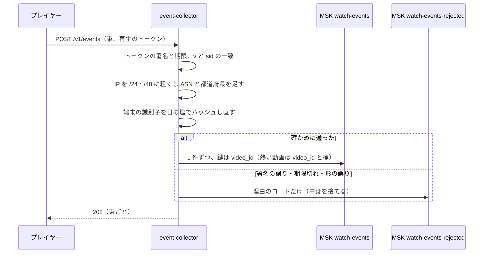
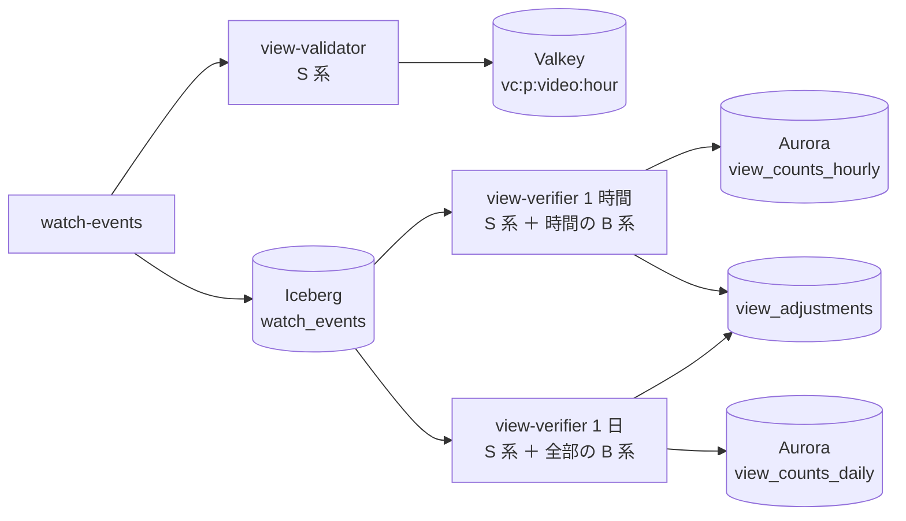

# View counting and analytics: YouTube

視聴の出来事を受けてから、公開の視聴回数・エンゲージ ビュー・総再生時間・維持率・創作者の分析を出すまでを決める。出来事の形と受け口、仮の数と確定の数の 2 段、`view-rules` の規則の一覧と判定、不正の信号と遅れた調整、総再生時間と維持率の計算、創作者の分析の置き場と新しさ、保持（**法務の確認待ち：L5**）を扱う。

前提となる決定は次のとおり。

- 視聴回数は仮の数と確定の数の 2 段。規則は `view-rules` の 1 つのクレート。公開の数は再生の開始で数え、収益はエンゲージ ビュー（30 秒）で数える（[ADR-0007](../decisions/0007-two-phase-view-counting.md)）
- 出来事は MSK の `watch-events` に流し、S3 の Parquet（Iceberg の表）に置く。検証のバッチは Rust と DataFusion（[ADR-0001](../decisions/0001-platform-and-stack.md)）
- 再生のトークンは Ed25519、10 時間。`first_frame` が ADR-0007 の `play_start` を兼ねる。QoE の出来事も同じ流れに載せる（[ADR-0023](../decisions/0023-playback-token-and-qoe-metrics.md)、[playback-and-abr.md](playback-and-abr.md) の 7 節）
- 広告の表示の出来事は同じ受け口に送り、無効なトラフィックは同じ規則で除く（[ADR-0024](../decisions/0024-client-side-ad-insertion.md)）
- 見える範囲は `playable()`。分析はチャンネルの RLS（[ADR-0009](../decisions/0009-single-tenant-and-playable.md)）

この文書で決めたことは次の ADR にある。

| ADR | 決定 |
| --- | --- |
| [0034](../decisions/0034-watch-event-envelope-and-ingest.md) | 出来事は `(sid, seq)` を重複の鍵にした封筒で送り、`event-collector` が署名を確かめ、IP アドレスを粗くしてから MSK に書く。分割の鍵は `video_id`。熱い動画だけ視聴者の桶を足す。生の IP アドレスは流れの判定の 1 時間だけ持つ |
| [0035](../decisions/0035-view-rules-catalog-and-public-count-composition.md) | `view-rules` は流れの規則（S 系）と集団の規則（B 系）を ID とバージョンで持つ。判定は「仮 → 1 時間の確定 → 1 日の確定」の 3 層で、公開の数は「1 日の確定 ＋ 1 時間の確定 ＋ 仮」の和にする。各層の差は理由のコードつきで `view_adjustments` に書く |
| [0036](../decisions/0036-watch-time-retention-and-analytics-store.md) | 総再生時間は再生した区間の和集合の長さ、維持率は最大 200 の桶の覆いで数える。分析は、動画×日の合計とチャンネル×日の切り口を Aurora に置き、動画の切り口の細部と任意の期間は Iceberg を DataFusion で引く |

## 1. 範囲

- 扱う：
  - 出来事の封筒、受け口（`event-collector`）、MSK のトピックと分割の鍵、Parquet の表
  - `view-rules` の規則の一覧、仮の段（`view-validator`）、確定の段（`view-verifier`）
  - 公開の数の組み立て、調整の記録、規則の変更の後の作り直し
  - エンゲージ ビュー、総再生時間、維持率
  - 創作者の分析（指標、切り口、新しさ、置き場、API）
  - 出来事と分析の保持（**法務の確認待ち：L5**）
- 扱わない：
  - 出来事をプレイヤーが出す側、QoE の指標の定義（[playback-and-abr.md](playback-and-abr.md) の 7 節）
  - 広告の収益の計算と台帳（[monetization-and-payouts.md](monetization-and-payouts.md)）。この文書は有効な広告の表示の数を渡す
  - おすすめの表示の記録（[recommendations.md](recommendations.md) の 10 節）。この文書は表示の数を切り口の入力として読むだけ
  - QoE のダッシュボードと SLI（observability の領域）

## 2. 要件

| 要件 | 目標 | NFR |
| --- | --- | --- |
| 仮の数が公開の数に出るまで | p95 60 秒 | NFR-006 |
| 確定の数 | 再生から 24 時間以内（p99） | NFR-006 |
| 創作者の分析 | 仮の数で 2 時間、確定で 48 時間以内 | NFR-006 |
| 不正の除外 | 不正の場面の水増しの 99% 以上を確定の数から除く。正しい視聴を除く割合 0.5% 以下。偏った正しい視聴の場面で 1% 以下 | NFR-006、K6 |
| 受け口の量 | S1 のピーク 5,000 件/秒の 2 倍で、仮の数の遅れ p95 60 秒 | [quality.md](../quality.md) の 2.2.1 節 H |
| 収益の入力 | 収益は 1 日の確定の数だけを使う | NFR-015、[ADR-0007](../decisions/0007-two-phase-view-counting.md) |
| 中身をログに出さない | 出来事・ログ・トレースに、題・検索の語・IP アドレスの生の値を書かない | AGENTS.md |

## 3. 本家の形（確かめたこと）

| 項目 | 本家 | 出典 |
| --- | --- | --- |
| 数え方 | 2026-08-24 から、Shorts・長い動画・ライブの視聴を再生の開始で数える | [How video views are counted](https://support.google.com/youtube/answer/2991785) |
| 確かめと調整 | 人の視聴かを確かめるため、数を遅らせ・止め・直すことがある。複数の端末・窓での同じ動画の再生などの質の低い再生を除く | 同上 |
| 収益の数 | 「エンゲージ ビュー」と「エンゲージ視聴時間」で決まる。しきい値は公開されていない（**未検証**） | 同上 |
| 収益化の条件の視聴時間 | 直近 12 か月の「公開の動画の有効な視聴時間」4,000 時間。Shorts の視聴時間は数えない | [YouTube Partner Program overview & eligibility](https://support.google.com/youtube/answer/72851) |

いずれも 2026-10-10 に確認。検証の規則の中身、エンゲージ ビューの秒数、分析の新しさの値は本システムの値である。

## 4. 出来事と受け口（ADR-0034）

### 4.1 封筒

プレイヤーは出来事を最大 50 件の束にして `POST /v1/events` に送る。ヘッダーに `<Brand>-Playback-Token`（[ADR-0023](../decisions/0023-playback-token-and-qoe-metrics.md)）を付ける。

| 欄 | 中身 |
| --- | --- |
| `sid` | 再生のセッション（トークンの `sid`）。同じ再生の間は同じ |
| `seq` | セッションの中の通し番号（0 から）。`(sid, seq)` が重複の鍵 |
| `type` | `play_intent`・`first_frame`・`hb`（心拍）・`seek`・`quality_change`・`rebuffer`・`start_failure`・`ad_impression`・`ad_quartile`・`ad_complete`・`ad_click`・`end` |
| `t_client` | 端末の時刻（ミリ秒）。順序の参考だけに使い、窓の判定には使わない |
| `pos_ms` | 本編の位置 |
| `iv` | 心拍と `end`：前の心拍からの再生した区間の列 `[[from_ms, to_ms], ...]`（最大 8 区間）。本編だけ。広告の時間を含めない |
| `rate` | 再生の速さ（1.0、1.5 など） |
| `vis`・`muted` | 心拍の区間で、画面に見えていた秒数と、音を消していた秒数 |
| `src` | `play_intent` だけ：流入の元（`home`・`next`・`search`・`subs`・`notif`・`channel`・`playlist`・`embed`・`external`・`other`） |
| `ad` | 広告の出来事だけ：`imp_id`（VAST の要求に渡した表示の ID）、`break`（`pre`・`mid`・`post`） |

- 心拍は最初の 1 分は 10 秒ごと、その後は 30 秒ごと（[ADR-0007](../decisions/0007-two-phase-view-counting.md)）。止めている間は送らない。
- 端末は送れなかった出来事を 100 件まで貯めて送り直す（[playback-and-abr.md](playback-and-abr.md) の 9 節）。順序と重複は受け口と規則が扱う。

### 4.2 `event-collector`



- 受け口は確かめて書くだけで、数えない。束の中の 1 件の形が誤っていても、他の件は書く。
- 署名に失敗した出来事は捨てるが、数を `watch-events-rejected` に理由のコードで残す（偽造の量を見るため）。
- 1 秒に 1 端末 2 件、1 セッション 2,000 件を超えた分は 429 で返す（[playback-and-abr.md](playback-and-abr.md) の 10 節の 1 分 120 件と合わせる）。
- 生の IP アドレスは、流れの判定のため `ip_raw_enc`（KMS のデータキーで暗号化、1 時間ごとに鍵を捨てる）として 1 時間だけ持つ。Parquet には粗くした値だけを書く（**法務の確認待ち：L5**）。

### 4.3 分割の鍵

- 鍵は `video_id`（ADR-0007）。`view-rules` の「同じ視聴者と同じ動画」の状態を 1 つの分割で持てる。
- 急な人気の動画は 1 つの分割に偏る。S1 の 10 万の同時の視聴では心拍が約 1 万件/秒、1 件 300 バイトで 3 MB/秒になり、1 つの分割で受けられる。
- S2 からは、仮の数が 1 分に 5 万を超えた動画を `hot` の印（Valkey の `vh:{video_id}`、1 時間）にし、鍵を `video_id#bucket`（`bucket = hash(viewer_key) mod 16`）にする。同じ視聴者は同じ桶に入るので、組の状態は 1 つの分割にとどまる。

### 4.4 Parquet の表

- `watch_events`（Iceberg）：5 分ごとに書き出す。分割は `event_date`（JST）と `hour`、並びは `video_id`。
- 列：封筒の欄、`viewer_key`（ログインなら利用者の ID のハッシュ、なければ端末の識別子のハッシュ）、`ip_prefix`、`asn`、`pref`（都道府県）、`ua_class`、`device_model`、`recv_at`。
- 遅れた出来事：`recv_at` が再生の時刻より 70 分以上遅い出来事は、`late` の印を付けて同じ表に書く。1 時間の確定には入らず、1 日の確定で扱う（5.3 節）。

## 5. 2 段の判定（ADR-0035）

### 5.1 規則の一覧

`view-rules` は Rust のクレート 1 つで、規則に ID とバージョンを付ける。規則の組（`ruleset_version`、例：`1.0`）はコードのバージョンとして出す。フラグで切り替えない（AGENTS.md）。

| ID | 種類 | 規則 | 既定の値 | 結果 |
| --- | --- | --- | --- | --- |
| S01 | 流れ | トークンの署名・期限・`video_id` の一致（受け口で確かめ済みのものを、もう一度確かめる） | — | 数えない |
| S02 | 流れ | `(sid, seq)` の重複 | — | 2 件目以降を捨てる |
| S03 | 流れ | 1 つの `sid` で視聴は 1 回（最初の `first_frame` だけ） | — | 2 回目は数えない |
| S04 | 流れ | 同じ `viewer_key` と動画の組で、24 時間の窓に 4 回まで（ADR-0007） | 4 | 5 回目から数えない |
| S05 | 流れ | 同じ組で、前の視聴の `first_frame` から 30 秒以内の `first_frame` | 30 秒 | 数えない |
| S06 | 流れ | データセンターの ASN の一覧（自前で保守する一覧） | — | 数えない |
| S07 | 流れ | 自動の操作の端末の型（ヘッドレスの信号、既知のボットの `ua_class`） | — | 数えない |
| S08 | 流れ | 1 つの `viewer_key` の 1 時間の視聴（動画をまたぐ） | 60 | 61 件目から数えない |
| B01 | 集団 | 同じ動画の同じ時間で、1 つの `ip_prefix` の視聴が期待の 5 倍かつ 20 件を超え、その視聴の再生の中央値が 10 秒未満 | 5 倍、20 件、10 秒 | その集団の視聴を数えない |
| B02 | 集団 | 同じ時間で、同じ `asn` と `device_model` の組が動画の視聴の 30% を超え、その組の動画の集合が他の 20 以上の端末と Jaccard 0.8 以上で重なる（視聴の工場の型） | 30%、20 端末、0.8 | その端末の 24 時間の視聴を数えない |
| B03 | 集団 | 埋め込みの自動の再生：`src = embed` で、全区間で `muted` かつ `vis = 0` | — | 数えない |
| B04 | 集団 | 同じ利用者が同じ動画を、壁の時計で重なる 2 つより多い `sid` で再生（複数の窓・端末） | 2 | 重なる 3 つ目以降を数えない |
| B05 | 集団 | 1 日に 50 件以上の視聴を持つ `viewer_key` で、その 90% 以上が再生 1 秒未満 | 50、90%、1 秒 | その日の視聴を数えない |
| B06 | 集団 | ボットの点：B01〜B05 の特徴と端末の信号の線形の点が 0.9 以上（重みは規則のバージョンに含める） | 0.9 | 数えない |
| B07 | 集団 | 広告の無効なトラフィック：上のどれかで数えない視聴の中の広告の表示、`vis = 0` の広告の表示 | — | 有効な表示に数えない |

- 流れの規則は 1 件ずつ判定できる。集団の規則は 1 時間か 1 日の出来事を集めて判定する。
- **同じ規則を両方で使う**：S 系は `view-validator` と `view-verifier` の両方で同じ関数を呼ぶ。`view-verifier` は S 系を全部やり直してから B 系を当てる。
- **偏った正しい視聴**（学校の授業、イベントの会場、急な人気）を除かないため、B01 は再生の短さを、B02 は動画の集合の重なりを条件に含める。1 つの回線から多く見られるだけでは除かない。

### 5.2 3 つの層



| 層 | いつ | 規則 | 置き場 | 使い道 |
| --- | --- | --- | --- | --- |
| 仮 | 出来事を受けてすぐ | S 系 | Valkey `vc:p:{video_id}:{hour}` | 公開の数の表示、急な人気の検知 |
| 1 時間の確定 | 時間 `H` の終わりから 70 分の後 | S 系、B01・B03・B04 | Aurora `view_counts_hourly` | 公開の数、分析の速報 |
| 1 日の確定 | 翌日の JST 6:00 | S 系、B01〜B07 | Aurora `view_counts_daily` | 収益、収益化の条件、AV1 の時機、おすすめと検索の人気 |

- 収益と収益化の条件は 1 日の確定だけを使う（[ADR-0007](../decisions/0007-two-phase-view-counting.md)、AGENTS.md）。1 時間の確定は「確定の数」に含めるが、収益には使わない。
- 1 日の確定は、遅れた出来事（4.4 節）を含めて、その日の全部の出来事をもう一度判定する。

### 5.3 公開の数の組み立て

```
public(video) = Σ daily_final(d)          （d ≤ 最後に締めた日 D）
              + Σ hourly_verified(h)       （D の後で、1 時間の確定が済んだ時間）
              + Σ provisional(h)           （それより後の時間。Valkey）
```

- 3 つの層は時間で重ならない。同じ視聴（`sid`）は 1 つの層にだけ入る。
- 表示の値は `api` が 30 秒ごとに作り直し、Valkey の `vc:pub:{video_id}` に置く。動画のページはこの値を読む。
- 1 時間の確定が遅れたら、その時間は仮の数のまま出す。数は止まらない。

### 5.4 例

10 分の動画 X。時刻はすべて JST。

| 時点 | 1 日の確定 | 1 時間の確定 | 仮 | 公開の数 |
| --- | --- | --- | --- | --- |
| 11:59（10 時台と 11 時台は仮） | 120,000（前日まで） | 0 | 10 時台 10,000 ＋ 11 時台 4,000 | 134,000 |
| 11:10 の 1 時間の確定（10 時台）の後 | 120,000 | 10 時台 8,800 | 11 時台 4,000 | 132,800 |
| 翌日 6:00 の 1 日の確定の後 | 120,000 ＋ 当日 22,600 | 0 | 6 時台 300 | 142,900 |

- 10 時台の仮 10,000 は、流れの規則で既に 800 件を除いた後の数（S02 の重複 500、S06 のデータセンター 300）。
- 1 時間の確定は B01 で 1 つの `/24` の 1,150 件（期待の 4 件の 280 倍、再生の中央値 6 秒）を除き、B04 で 50 件を除いて 8,800 にした。公開の数は 1,200 減る。`view_adjustments` に `(X, 10 時台, provisional→hourly, −1,150, B01)` と `(…, −50, B04)` を書く。
- 1 日の確定で、B02 が同じ機種と ASN の端末の集まり（23 端末、動画の集合の Jaccard 0.86）を見つけ、10 時台からさらに 300 件を除いた（10 時台は 8,500）。`(X, 10 時台, hourly→daily, −300, B02)` を書く。
- 10 時台の 8,500 のうち、30 秒以上を再生した 5,100 件がエンゲージ ビュー（6.1 節）。

### 5.5 調整と作り直し

- `view_adjustments` は、層の移りで減った（または増えた）数を、規則の ID・`ruleset_version`・層の組で記録する。創作者の分析で「確かめで除いた視聴」として、規則の ID と理由のコードを見せる。しきい値は見せない（規則の推測を防ぐ。[security.md](security.md) の守り）。
- **規則の変更**：新しい `ruleset_version` は、過去 30 日の 1 日の確定を Parquet から作り直せる（[ADR-0007](../decisions/0007-two-phase-view-counting.md)）。作り直しは影の表に書き、前のバージョンとの差を QA が確かめてから入れ替える。
- **締めた月**：収益の月を締めた後の差は、数を書き換えず、翌月の調整の仕訳にする（[monetization-and-payouts.md](monetization-and-payouts.md) の 7.5 節）。
- 確定の数が仮より多くなる（遅れた出来事が 1 日の確定で入る）こともある。その差も理由のコード `LATE` で記録する。

## 6. エンゲージ ビュー・総再生時間・維持率（ADR-0036）

### 6.1 エンゲージ ビュー

- 有効な視聴（1 日の確定で残った視聴）のうち、本編の再生した区間の和集合が 30 秒以上のもの。30 秒未満の動画は、和集合が長さの 90% 以上のもの（[ADR-0007](../decisions/0007-two-phase-view-counting.md)）。
- 境の扱い（DT-VIEW-001）：

| 動画の長さ | 和集合 | 結果 |
| --- | --- | --- |
| 600 秒 | 29.9 秒 | エンゲージでない |
| 600 秒 | 30.0 秒 | エンゲージ |
| 20 秒 | 17.9 秒（89.5%） | エンゲージでない |
| 20 秒 | 18.0 秒（90%） | エンゲージ |
| 30 秒 | 27.0 秒（90%） | エンゲージでない（30 秒ちょうどの動画は 30 秒の規則に入る。90% の規則は 30 秒未満の動画だけ） |
| 30 秒 | 30.0 秒 | エンゲージ |
| 600 秒、広告 30 秒を見て本編 5 秒 | 5 秒 | エンゲージでない（広告の時間を含めない） |

### 6.2 総再生時間

- セッションごとに、心拍と `end` の `iv` の区間の和集合を取り、その長さを総再生時間に足す（同じ区間の見直しは 1 回だけ数え、速さの倍率で割り戻さない。ADR-0007）。
- 例：`iv` が `[0, 45]`、`[30, 90]`（戻って見直した）、`[300, 320]` なら、和集合は `[0, 90]` と `[300, 320]` で 110 秒。
- 心拍が欠けた区間は数えない（端末から来なかった区間を推測で埋めない）。
- 収益化の条件の視聴時間（[monetization-and-payouts.md](monetization-and-payouts.md) の 3 節）は、公開の動画の 1 日の確定の総再生時間の和にする。

### 6.3 維持率

- 動画を `n = min(200, ceil(長さ / 1 秒))` の桶に分ける（10 分の動画は 3 秒の桶が 200）。
- 桶 `b` の覆い：有効な視聴のうち、和集合が桶の 50% 以上を覆うものの数。
- 維持率 `R(b) = 覆い(b) ÷ 有効な視聴の数`。1 日の確定ごとに `int4[]` で持ち、期間の維持率は日ごとの覆いと視聴の数を足してから割る（割った値を平均しない）。
- 例：10 分の動画で有効な視聴 1,000。桶 0（0〜3 秒）の覆い 980、桶 100（300〜303 秒）の覆い 410 なら、`R(0) = 98%`、`R(100) = 41%`。

## 7. 創作者の分析（ADR-0036）

### 7.1 指標と切り口

| 指標 | 元 | 層 |
| --- | --- | --- |
| 視聴回数、エンゲージ ビュー、総再生時間、平均の視聴の時間 | 5・6 節 | 速報は 1 時間の確定と仮、正式は 1 日の確定 |
| 維持率の曲線 | 6.3 節 | 1 日の確定 |
| 登録者の増減 | [channels-subscriptions-and-notifications.md](channels-subscriptions-and-notifications.md) の 4 節 | 1 日 |
| 表示の数と表示からの再生の率 | [recommendations.md](recommendations.md) と [search.md](search.md) の表示の記録 | 1 日 |
| 収益の見込み | [monetization-and-payouts.md](monetization-and-payouts.md) の 7 節 | 1 日（月の締めで正式） |
| 確かめで除いた視聴 | 5.5 節の `view_adjustments` | 1 時間と 1 日 |

- 切り口：日付、流入の元（`src`）、端末の種類、都道府県、字幕の有無、登録しているか。
- 年齢・性別の切り口は持たない（利用者の属性の推定と利用は**法務の確認待ち：L5**）。
- 1 つの切り口の値の視聴が 50 未満の行は「その他」にまとめて見せる（少ない視聴から個人を推測させない）。

### 7.2 置き場

| 置き場 | 中身 | 量（S1） |
| --- | --- | --- |
| Aurora `video_stats_daily` | 動画 × 日の合計（視聴、エンゲージ、総再生時間、維持率の覆い） | 見られた動画 約 100 万 × 日。月ごとに分割、13 か月 |
| Aurora `channel_stats_daily_dim` | チャンネル × 日 × 切り口 × 値（動画をまたいだ合計） | 1 日 約 300 万行。90 日の後は S3 へ |
| Aurora `video_stats_hourly` | 動画 × 時間の 1 時間の確定（直近 72 時間） | 速報の画面 |
| Iceberg `watch_sessions` | セッションごとの判定の結果（有効、エンゲージ、和集合の長さ、切り口） | 1 日の確定の出力 |

- 動画ごとの切り口の細部と、任意の期間の集計は、`analytics-query`（Rust と DataFusion）が `watch_sessions` を引く。結果は 1 時間キャッシュする。応答 p95 3 秒。
- 分析の API は `channel_id` の RLS の中で読む（[ADR-0009](../decisions/0009-single-tenant-and-playable.md)）。`analytics-query` は、API が RLS で確かめたチャンネルの動画の ID の一覧だけを受け取って引く。

### 7.3 新しさ

| 画面 | 元 | 遅れ |
| --- | --- | --- |
| 直近 48 時間の速報（時間ごと） | 仮（Valkey）と 1 時間の確定 | 仮で 2 分、1 時間の確定で 2 時間以内（NFR-006） |
| 日ごとの正式の値 | 1 日の確定 | 48 時間以内（NFR-006） |

- 画面の値には層（仮・速報・確定）を示す印を付ける。仮の値が後で減ることを文言で示す。

## 8. 保持（**法務の確認待ち：L5**）

| データ | 既定の案 | 理由 |
| --- | --- | --- |
| 生の IP アドレス | 1 時間（暗号化した値。鍵を捨てて消す） | S06 と B01 の流れの判定 |
| `watch_events` の Parquet | 13 か月 | 規則の作り直し（30 日）と、年の比べの分析 |
| `watch_sessions` | 25 か月 | 分析の期間 |
| `viewer_key` | 端末の識別子は 30 日ごとに塩を回す | 長い期間で 1 人を追えないようにする |
| 集計の表 | 動画とチャンネルが残る間 | 分析 |

- 利用者が視聴の履歴を消しても、確定の数と集計は変えない（集計は個人を特定しない値として扱う）。この扱いは**法務の確認待ち：L5**。
- 不正の判定のための端末の識別子の扱いは**法務の確認待ち：L5**。

## 9. 失敗と回復

| 失敗 | 起きること | 回復 |
| --- | --- | --- |
| MSK の書き込みの失敗 | 受け口が書けない | 受け口の手元のディスクに 15 分まで貯める。超えたら 503 で、端末が貯めて送り直す |
| `view-validator` の遅れ | 仮の数が止まる | 公開の数は前の値のまま。5 分の遅れで Ops を呼ぶ。消費者を足す |
| Valkey の喪失 | 仮の数が消える | MSK（保持 7 日）を、最後の 1 時間の確定の後から読み直して作り直す |
| `view-verifier` の失敗 | 確定が遅れる | 仮の数で表示を続ける。1 日の確定が 24 時間（p99）を超えそうなら Ops を呼ぶ |
| 規則の誤り（多く除きすぎ） | 公開の数が大きく減る | 前の `ruleset_version` で作り直し、差を `view_adjustments` に戻しの理由で書く |
| 確定と仮の差が全体で 3% を超える | 規則か攻撃の変化 | 規則のリリースを止め、調べる（[quality.md](../quality.md) の 4.1 節） |
| 遅れた出来事が 30 時間を超える | 1 日の確定に入らない | 数えず、件数だけを記録する |

## 10. 上限

| 対象 | 値 |
| --- | --- |
| 1 回の送信の束 | 50 件、64 KB |
| 1 件の大きさ | 4 KB（[playback-and-abr.md](playback-and-abr.md) の 10 節） |
| 1 セッションの出来事 | 2,000 件 |
| 心拍の区間の数 | 1 件に 8 |
| 遅れて受ける出来事 | 再生の時刻から 30 時間 |
| 規則の作り直し | 過去 30 日 |
| 分析の任意の期間の問い合わせ | 1 回 2 年まで、チャンネルあたり 1 分に 30 回 |

## 11. data-model への項目

| 表・置き場 | 中身 | 主キー・索引 | 節 |
| --- | --- | --- | --- |
| MSK `watch-events` | 4.1 節の封筒と受け口が足した欄 | 鍵 `video_id`（熱い動画は `video_id#bucket`） | 4 |
| MSK `watch-events-rejected` | 理由のコード、時刻、`video_id` | — | 4.2 |
| Iceberg `watch_events` | 4.4 節 | 分割 `event_date`・`hour` | 4.4 |
| Iceberg `watch_sessions` | `sid`、`video_id`、`viewer_key`、`valid`、`engaged`、`watched_ms`、`reasons[]`、`ruleset_version`、切り口 | 分割 `event_date` | 7.2 |
| Valkey | `vc:p:{video_id}:{hour}`（仮）、`vc:pub:{video_id}`（表示）、`vd:{video_id}:{viewer_key}`（S04・S05 の状態、24 時間）、`vh:{video_id}`（熱い印） | — | 4.3、5.2 |
| `view_counts_hourly`・`view_counts_daily` | `video_id`、`hour`・`date`、`views`、`engaged_views`、`watch_ms`、`ruleset_version`、`computed_at` | `(video_id, hour)`・`(video_id, date)`。月ごとの分割 | 5.2 |
| `view_adjustments` | `video_id`、`period`、`stage`（`provisional_to_hourly`・`hourly_to_daily`・`recompute`）、`delta`、`rule_id`、`ruleset_version`、`created_at` | `(video_id, period, stage, rule_id)` | 5.5 |
| `video_stats_daily` | 6・7 節の合計と維持率の覆い（`int4[]`） | `(video_id, date)` | 7.2 |
| `channel_stats_daily_dim`（チャンネルの表、FORCE RLS） | `channel_id`、`date`、`dim`、`value`、指標 | `(channel_id, date, dim, value)` | 7.2 |
| 運用の一覧 | データセンターの ASN、ボットの `ua_class` | — | 5.1 |

## 12. テストと性質

| ID | 性質・試験 |
| --- | --- |
| PROP-VIEW-001 | 同じ出来事の集まりを `view-validator` と `view-verifier` で判定したとき、S 系の規則の結果が一致する（ADR-0007 の Confirmation） |
| PROP-VIEW-002 | 出来事を任意の順・重複・遅れ（30 時間以内）で流しても、1 日の確定の数が同じ |
| PROP-VIEW-003 | 任意の時点で、公開の数の 3 つの層は時間で重ならず、同じ `sid` を 2 回数えない |
| PROP-VIEW-004 | エンゲージ ビュー ⊆ 有効な視聴 ⊆ `first_frame` のあるセッション。総再生時間 ≤ 有効な視聴の数 × 動画の長さ |
| PROP-VIEW-005 | 層の移りの差の和（`view_adjustments` の `delta` の和）が、仮の数と確定の数の差に等しい |
| PROP-VIEW-006 | 区間の和集合：任意の区間の列で、和集合の長さは列の順序によらず、各区間の長さの和以下で、最も長い区間以上 |
| DT-VIEW-001 | エンゲージ ビューの境（6.1 節）。29.9・30.0 秒、短い動画の 90%、30 秒ちょうどの動画、広告の時間 |
| DT-VIEW-002 | 規則の一覧（5.1 節）の各行の当たる・当たらない |
| `view-fraud-sim` | [quality.md](../quality.md) の 2.2.1 節 C の全場面で、確定の数から不正の 99% 以上を除き、正しい視聴を除く割合 0.5% 以下、偏った正しい視聴（学校、会場、急な人気）で 1% 以下。場面ごとに、どの規則で除いたかを記録する |
| 不正の場面の追加 | 規則を足す変更は、その規則が狙う場面と、その規則が誤って当たりうる正しい場面の 2 つを生成器に足す |
| 結合 | Kafka（Testcontainers）と LocalStack：受け口 → MSK → 仮の数 → Parquet → 1 時間の確定。消費者の再起動とブローカーの停止で確定の数が変わらない |
| 負荷 | S1 のピークの 2 倍（1 万件/秒）と、1 つの動画に 10 万の同時の視聴で、仮の数の遅れ p95 60 秒 |

テストの名前には要件 ID と性質 ID を含める。

## 13. Story の候補

| Epic | Story | 中身 |
| --- | --- | --- |
| E7 | `watch-event-collector` | 4 節（ADR-0034）。IP の保持は**法務の確認待ち：L5** |
| E7 | `view-rules-crate` | 5.1 節の規則、ID とバージョン、DT-VIEW-002 |
| E7 | `provisional-view-counts` | 5.2 節の仮の層、5.3 節の組み立て |
| E7 | `verified-view-counts` | 1 時間と 1 日の確定、`view_adjustments`、作り直し（ADR-0035、PROP-VIEW-001〜003・005） |
| E7 | `watch-time-and-retention` | 6 節（ADR-0036、PROP-VIEW-004・006、DT-VIEW-001） |
| E7 | `creator-analytics` | 7 節、`analytics-query` |
| E7 | `view-fraud-sim` | 12 節の生成器と合否 |

## 14. 未解決の問い

### 決定（2026-10-10、既定案）

- **封筒と重複の鍵**：`(sid, seq)`。分割は `video_id`、熱い動画は桶を足す（ADR-0034）。
- **層**：仮・1 時間の確定・1 日の確定の 3 つ。収益は 1 日の確定だけ（ADR-0035）。
- **規則の初期の値**：5.1 節の値。どれも本システムの値で、`view-fraud-sim` で調整する。
- **総再生時間と維持率**：区間の和集合、200 の桶（ADR-0036）。
- **分析の置き場**：Aurora の合計と切り口、細部は Iceberg と DataFusion（ADR-0036）。

### 持ち越し

| 問い | いつ・どう決めるか |
| --- | --- |
| 生の IP アドレス・端末の識別子・Parquet の保持の期間 | **法務の確認待ち：L5** |
| 利用者の属性（年齢・性別）の切り口を持つか | **法務の確認待ち：L5** |
| 外部送信としての計測の通知・公表 | **法務の確認待ち：L6**（[playback-and-abr.md](playback-and-abr.md) の 8.1 節） |
| `channel_stats_daily_dim` の量が Aurora に収まるか | E7 の負荷試験。収まらなければ S2 で分析の専用の置き場を ADR にする |
| B06 のボットの点の重み | `view-fraud-sim` と本番の抜き取りの監査 |
| 熱い動画の桶の切り替えの値（1 分に 5 万）と、大きな催しの配信で S1 から桶を使うか | `view-validator` の 1 分割の処理の速さを測って決める（[capacity.md](capacity.md) の持ち越しと同じ） |

## 出典

いずれも 2026-10-10 に確認。

- YouTube Help, [How video views are counted](https://support.google.com/youtube/answer/2991785)
- YouTube Help, [YouTube Partner Program overview & eligibility](https://support.google.com/youtube/answer/72851)
