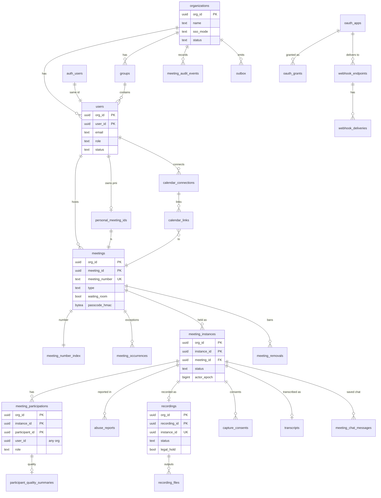

# Data model: Zoom

データモデルの正本。Aurora の表・列・キー・索引・パーティション・保持と、DB の外の置き場所（Valkey、S3、SQS、Firehose、Meeting Actor と Media Node のメモリ、端末）の形を、ここにまとめる。

- 会議の状態の置き場所は [ADR-0005](../decisions/0005-meeting-state-and-signaling.md)・[ADR-0007](../decisions/0007-meeting-actor-lease-and-epoch.md)、組織の分け方は [ADR-0058](../decisions/0058-tenant-tables-with-force-rls.md)、鍵は [ADR-0047](../decisions/0047-keys-and-operator-access-to-media.md)、監査と保持は [ADR-0046](../decisions/0046-audit-logs-and-data-lifecycle.md) に従う。
- **形（表・列・キー）はこの文書を正とする。** 振る舞い（いつ書くか、誰が読めるか）は、各領域の文書を正とする。両者が食い違ったら、実装を止めて Dev（テックリード）に確かめる。
- 各領域の文書の「data-model への項目」は提案である。確定した形はここにある。
- 実装の変更（`changes/`）でマイグレーションを書くときは、この文書と各領域の文書を同じ PR で直す。

## 1. 文書の構成

量が多いので、領域ごとにファイルを分けた。

| ファイル | 内容 | 表の数 |
| --- | --- | --- |
| この文書 | 規約、全体の ER 図、表の索引、横断的な不変条件、組織の文脈、設定の項目の名前、統合で決めたこと | — |
| [data-model/identity.md](data-model/identity.md) | 組織、ドメイン、認証（Better Auth）、ユーザー、グループ、招待、SSO、設定の階層 | 15 |
| [data-model/scheduling.md](data-model/scheduling.md) | 会議、会議の番号、繰り返しの例外、招待、代わりの主催者、PMI、カレンダーの連携、冪等のキー | 10 |
| [data-model/meeting-runtime.md](data-model/meeting-runtime.md) | 開催、参加、Media Node の割り当て、E2EE の資格情報、チャットの保存とファイル、品質の要約 | 8 |
| [data-model/safety.md](data-model/safety.md) | 退出させた人の ban、報告、全体の端末の ban | 5 |
| [data-model/recording.md](data-model/recording.md) | 録画、区間、成果物、共有、再生の記録、削除の記録、同意、文字起こし、語彙 | 9 |
| [data-model/platform-api.md](data-model/platform-api.md) | OAuth のアプリ・コード・承認・許可・トークン、Webhook の受け口と配送 | 7 |
| [data-model/telephony.md](data-model/telephony.md) | 電話番号、通話、ダイヤルアウトの集計（E14、MVP の後） | 3 |
| [data-model/governance.md](data-model/governance.md) | 利用の集計、レポートの書き出し、監査ログ 3 系統とハッシュの連鎖、outbox、リーガルホールド、サポートの参照の許可、クライアントのバージョン | 11 |
| [data-model/stores.md](data-model/stores.md) | Valkey のキー、S3 の置き場所、SQS・Firehose、品質の記録、シグナリングのメッセージ、outbox・Webhook の封筒、Actor と Media Node のメモリ、鍵と秘密、端末 | — |

合計 68 表。ER 図は、全体図 1 つ（3 節）と、領域ごとの図 12 個（各ファイルの冒頭）。

## 2. 規約

### 2.1 置き場所

| 置き場所 | 何を置くか | 正本か | 失ったとき | 決定 |
| --- | --- | --- | --- | --- |
| Aurora PostgreSQL 18（`prod`、東京。大阪へ Global Database）の `app` スキーマ | 組織に属する業務の行（会議、開催と参加、録画の索引、同意、保存したチャット、設定、利用の集計、監査、Webhook）。FORCE RLS | 正本 | 失ってはならない（RPO 1 分） | [ADR-0001](../decisions/0001-platform-and-stack.md)、[ADR-0050](../decisions/0050-disaster-recovery-and-edge-migration.md)、[ADR-0058](../decisions/0058-tenant-tables-with-force-rls.md) |
| Aurora の `global` スキーマ | 組織に属さない行（2.4 節）。RLS の外 | 正本 | 同上 | 同上 |
| Meeting Actor のメモリ | 会議の中の状態の正本（参加者、待合室、ミュート、購読、`seq`、MLS のエポック） | 会議の間の正本 | スナップショット・Aurora・Media Node の一覧・クライアントの申告から戻す | [ADR-0005](../decisions/0005-meeting-state-and-signaling.md) |
| Valkey（ElastiCache、`prod`） | Actor のリースと `epoch`、スナップショット、会議の間のチャット、流量の制限、Node・TURN・Actor Host の心拍 | 正本ではない | 失ってよい。大阪へ複製しない | [ADR-0007](../decisions/0007-meeting-actor-lease-and-epoch.md) |
| Media Node のメモリ | router・transport・producer・consumer、会議ごとの最大の `epoch`、音声の枠の転送器 | 転送の状態の正本 | 付け替える | [ADR-0013](../decisions/0013-media-node-failover-and-reattach.md)、[ADR-0057](../decisions/0057-audio-slots-for-large-meetings.md) |
| S3（`media-prod`、録画のバケット） | 録画の生の区切りと成果物、文字起こし | 実体の正本（索引は Aurora） | 失ってはならない（成功を知らせた録画） | [ADR-0025](../decisions/0025-recording-per-track-capture-and-offline-compose.md) |
| S3（`prod`、ファイルのバケット） | チャットのファイル、報告の添付、レポートの書き出し | 実体の正本 | 期限まで失ってはならない | [stores.md](data-model/stores.md) の 3 節 |
| S3（`prod`、観測のバケット）＋ Athena | 品質の生の記録（参加者ごと 10 秒）、日次の集計 | 正本 | 失ってよい | [ADR-0051](../decisions/0051-qos-telemetry-pipeline.md) |
| S3（log-archive、Object Lock） | 監査ログ 3 系統、CloudTrail、Media Node・TURN・ALB・WAF のログ | 正本 | 失ってはならない（7 年） | [ADR-0046](../decisions/0046-audit-logs-and-data-lifecycle.md) |
| S3（shared） | Web のバージョンごとの資産（`/app/<version>/`）、Terraform の状態、AMI の配布 | — | 作り直せる | [ADR-0056](../decisions/0056-client-release-trains-and-meeting-scoped-flags.md) |
| SQS | Worker のジョブ（[stores.md](data-model/stores.md) の 6 節） | 正本ではない | outbox と表から作り直せる | — |
| Kinesis Data Firehose | `qos.report` と Media Node の要約の流れ | 正本ではない | 失ってよい | [ADR-0051](../decisions/0051-qos-telemetry-pipeline.md) |
| AMP、CloudWatch Logs、X-Ray | メトリクス、アプリのログ、トレース（内容と IP を含めない） | — | 失ってよい | [observability.md](observability.md) |
| KMS、Secrets Manager、AWS Private CA | 鍵と秘密 | 正本 | 失ってはならない | [ADR-0047](../decisions/0047-keys-and-operator-access-to-media.md) |
| IPAM（`media-prod`） | BYOIP の範囲、EIP のプール、隔離した EIP のタグ | 正本 | 失ってはならない | [ADR-0049](../decisions/0049-media-node-fleet.md) |
| AWS AppConfig | release・meeting・ops・experiment のフラグ、`client-config`（Web のバージョンの割合と最低のバージョン） | フラグの正本 | 既定の値で動く | [ADR-0056](../decisions/0056-client-release-trains-and-meeting-scoped-flags.md) |
| 公開の `ip-ranges.json` | Media Node と TURN の範囲、更新の日付 | — | 作り直せる | [ADR-0016](../decisions/0016-media-edge-addressing-and-security-groups.md) |
| 利用者の端末 | 端末の鍵、前回の経路、端末の選択、仮想背景、ショートカット。E2EE の鍵はワーカーのメモリだけ | 端末の鍵だけは端末の正本 | 取り直す | [clients.md](clients.md)、[network-traversal.md](network-traversal.md)、[e2ee.md](e2ee.md) |
| 開発リポジトリ | シグナリングのスキーマ（`@<brand>/signaling-schema`）、Node の制御の API（`@<brand>/media-node-api`）、`settingsRegistry`、試験のベクトル | 定義の正本 | — | [ADR-0008](../decisions/0008-signaling-protocol.md)、[ADR-0024](../decisions/0024-shared-rust-core-and-test-vectors.md)、[ADR-0039](../decisions/0039-settings-hierarchy-and-locks.md) |

- **`media-prod` の部品は Aurora に触れない。** Media Node、Recorder、Transcriber、Composer、TURN は、`prod` の Aurora と Valkey へつながない（[ADR-0048](../decisions/0048-accounts-network-and-media-regions.md)、[infrastructure.md](infrastructure.md) の 9 節）。Aurora への書き込みは、Actor Host と Worker が代わりに行う。Composer の結果は SQS で Worker に渡す（[stores.md](data-model/stores.md) の 6 節。2026-09-28 に決定）。

### 2.2 ID

- **内部の ID は、128 ビットの時刻順の ID（ULID）にする。** DB では `uuid` 型で持つ。先頭 48 ビットがミリ秒の時刻なので、ID の範囲がそのまま時間の範囲になる（2.8 節のパーティションに使う）。生成は、アプリの ULID でも PostgreSQL 18 の `uuidv7()` でもよい。どちらも時刻順の 128 ビットで、同じ型に入る（2026-09-28 に決定）。
- **外に出す形**は、種類の接頭辞＋ Crockford base32 の 26 文字（例：`mtg_01J9...`）。変換は 1 つのモジュール（`packages/ids`）だけで行う。DB・ログ・トレースの属性には `uuid` の形か外の形のどちらかに揃え、混ぜない（ログは外の形）。
- 接頭辞の一覧：

| 接頭辞 | ID | 接頭辞 | ID |
| --- | --- | --- | --- |
| `org_` | `org_id` | `rec_` | `recording_id` |
| `u_` | `user_id`（`auth_users.id` と同じ値） | `tr_` | `transcript_id` |
| `grp_` | `group_id` | `shr_` | `share_id`（録画の共有） |
| `inv_` | `invitation_id` | `file_` | `file_id`（チャットのファイル） |
| `sso_` | `sso_connection_id` | `rpt_` | `report_id` |
| `mtg_` | `meeting_id` | `upl_` | `attachment_id`（報告の添付） |
| `mi_` | `instance_id` | `exp_` | `export_id` |
| `p_` | `participant_id` | `app_` | `app_id` |
| `rm_` | `removal_id` | `grt_` | `grant_id` |
| `cal_` | `connection_id`（カレンダー） | `ep_` | `endpoint_id`（Webhook） |
| `evt_` | `event_id`（outbox・監査・Webhook のイベント） | `msg_` | `delivery_id`（Webhook の `webhook-id`） |
| `call_` | `call_id` | `num_` | `number_id` |
| `hold_` | `hold_id` | `sag_` | `grant_id`（サポートの参照の許可） |

- **人が読み上げる番号は ID ではない。** 11 桁の会議の番号と 10 桁の PMI は、`text` の列（`meeting_number`、`pmi`）に持つ。先頭は 1〜9。数値の型にしない（先頭の 0 の扱いと、桁で種類を見分けるため）。
- 例外：
  - `outbox.id` は `bigint` の連番（Worker が `ORDER BY id` で読むため）。
  - 監査ログの `stream_seq` は系統ごとの連番（`bigint`）で、ID ではなく位置。
  - チャットの `chat_seq`・`ch_seq`、状態の `seq`、`epoch`、`media_generation` は位置の番号（`bigint`・`integer`）。
  - 回の ID（`occurrence_id`）は元の開始の UTC の時刻の文字列（`YYYYMMDDTHHMMSSZ`）。
  - Media Node・TURN・Actor Host の ID は、インフラが付ける名前（`mn-tyo-a-017` など。`text`）。
  - Better Auth の表の ID は、生成関数を渡して同じ ULID の `uuid` にする。

### 2.3 組織の分離と RLS

**テナントの表**（`app` スキーマ。`org_id` を持つ表）は、次の形にそろえる（[ADR-0058](../decisions/0058-tenant-tables-with-force-rls.md)）。

```sql
CREATE TABLE app.<t> (
  org_id uuid NOT NULL REFERENCES global.organizations (org_id),
  <id>   uuid NOT NULL,
  ...
  PRIMARY KEY (org_id, <id>)
);
ALTER TABLE app.<t> ENABLE ROW LEVEL SECURITY;
ALTER TABLE app.<t> FORCE ROW LEVEL SECURITY;
CREATE POLICY org_isolation ON app.<t>
  USING      (org_id = current_setting('app.org_id')::uuid)
  WITH CHECK (org_id = current_setting('app.org_id')::uuid);
```

- 主キーと外部キーは、`org_id` を先頭に含む複合キーにする。別の組織の行を参照する外部キーは、DB が拒否する。
- 索引の先頭も `org_id` にする（RLS の条件がクエリに加わるため）。
- `current_setting` は `missing_ok` なしで呼ぶ。文脈の設定を忘れたらエラーになる（安全側）。
- トランザクションごとに `SET LOCAL app.org_id`。1 つのトランザクションで、複数の `org_id` の行を書かない。
- `global` スキーマの表を、テナントの表と同じトランザクションで書いてよい（例：`meetings` と `global.meeting_number_index`、業務の行と `global.outbox`）。
- テナントの表から `global` の表への外部キーは張る（`organizations`、`phone_numbers`、`e2ee_ca_keys` など）。`global` からテナントの表への外部キーは張らない（`oauth_tokens.grant_id` などは列だけ持つ）。
- 一意の索引は RLS に関わらず表全体で効く。組織をまたいで一意であるべき値（`meetings.meeting_number`、`calendar_links` の予定の ID、`e2ee_credentials.cert_serial`）は、テナントの表の一意の索引で守れる。ただし、衝突の応答で他の組織の存在を漏らさないよう、割り当ては `global` の関数で行う（2.3.2 節）。

#### 2.3.1 DB のロール

| ロール | 使う主体 | 権限 | 定めた場所 |
| --- | --- | --- | --- |
| `migrator` | マイグレーション | すべての表の所有者。FORCE RLS の対象 | ADR-0058 |
| `app` | API、public-api、Signaling Gateway、Actor Host、Worker | テナントの表を RLS の下で読み書き。`global` の表は許した表だけ（2.4 節）。`BYPASSRLS` なし | ADR-0058 |
| `number_resolver` | 会議の番号の関数の所有者（NOLOGIN） | `global.meeting_number_index`・`meeting_number_history` の読み書き。`app` はこの 2 表を直接読めず、関数だけを呼べる | ADR-0058、この文書（2026-09-28 に決定） |
| `tenant_resolver` | 組織をまたぐ `SECURITY DEFINER` 関数の所有者（NOLOGIN） | 下の関数が読む表だけに `TO tenant_resolver USING (true)` のポリシーを持つ。`BYPASSRLS` なし | この文書（2026-09-28 に決定） |
| `ts_operator` | Trust & Safety の画面、運用者の調べ | `BYPASSRLS`。読み取りと、報告・ban・ユーザーの停止の列の更新だけ。セッションの開始を `platform_audit_events` に残す | ADR-0058、[ADR-0047](../decisions/0047-keys-and-operator-access-to-media.md) |
| `audit_exporter` | 監査ログの log-archive への転送 | 監査ログ 3 表の SELECT と、転送済みの印の UPDATE だけ | [ADR-0046](../decisions/0046-audit-logs-and-data-lifecycle.md) |
| `partition_maint` | パーティションの作成と削除のジョブ | パーティションの CREATE・DETACH・DROP。行の読み書きはしない | この文書 |

- Better Auth の表（`auth_*`、`sessions` など）は `global` にあり、`app` のロールで読める。触れてよいのは `identity` のモジュール（`apps/api/src/identity/`）だけにし、import の lint で守る（[ADR-0038](../decisions/0038-organizations-users-roles-and-sso.md)）。

#### 2.3.2 組織の文脈のない入口の関数

組織が分からないうちに行を引く処理は、次の関数だけで行う。関数は引数で必ず絞り、決まった列だけを返す。返した `org_id` で文脈を設定してから、テナントの表を読み直す。

| 関数 | 所有者 | 用途 | 定めた場所 |
| --- | --- | --- | --- |
| `resolve_meeting_number(number)` | `number_resolver` | 参加の API（`/j/<number>`、`POST /v1/meetings/{number}/join`）と IVR。番号 → `org_id`・`meeting_id`・`kind`。存在しなければ空 | ADR-0058、[scheduling.md](data-model/scheduling.md) |
| `allocate_meeting_number(kind, org_id, meeting_id)` | `number_resolver` | 番号の割り当て（`kind` は `meeting`（11 桁）・`pmi`（10 桁））。CSPRNG で選び、`meeting_number_index` と `meeting_number_history` を見て、衝突と 2 年の再使用を避ける | [ADR-0006](../decisions/0006-meeting-id-and-join-url.md) |
| `retire_meeting_number(number, last_held_on)` | `number_resolver` | 会議の削除・PMI の作り直しで、番号を `meeting_number_history` へ移す | ADR-0006、[ADR-0034](../decisions/0034-scheduled-recurring-meetings-and-pmi.md) |
| `resolve_invitation(token_hash)` | `tenant_resolver` | 招待の受諾。`org_id`・`invitation_id` | [accounts-and-admin.md](accounts-and-admin.md) の 3.3 節 |
| `resolve_recording_share(token_hash)` | `tenant_resolver` | 外への録画の共有のリンク（`/rec/share/<token>`）。`org_id`・`share_id` | [recording-and-transcription.md](recording-and-transcription.md) の 6.2 節 |
| `resolve_calendar_connection(connection_id)` | `tenant_resolver` | カレンダーの変更の通知の受け口（`/hooks/calendar/{provider}/{connection_id}`）。`org_id` | [scheduling-and-calendar.md](scheduling-and-calendar.md) の 6.3 節 |
| `scheduler_due_orgs(kind, until)` | `tenant_resolver` | Worker の定期の処理（保持の削除、集計、カレンダーの毎日の取り込み、Webhook の受け口の再確認）で、対象の行がある `org_id` の一覧だけを返す。Worker は組織ごとに文脈を設定して回す | ADR-0058 |

### 2.4 `global` スキーマ（RLS の外）の表とその理由

ADR-0058 の「組織に属さない表」。新しい表を `global` に置くときは、ここに理由と `app` のロールの権限を書く（書かなければ CI で失敗する）。

| 表 | 理由 | `app` の権限 |
| --- | --- | --- |
| `organizations`、`org_domains` | 組織そのもの。確かめたドメインは組織をまたいで一意の判定が要る | 読み書き（`authorize` で自分の組織に限る） |
| `auth_users`、`auth_identities`、`sessions`、`verifications`、`passkeys`、`sso_providers`（Better Auth） | ログインの前は組織が分からない。メールアドレスの一意は全体で判定する | 読み書き（`identity` のモジュールだけ。lint） |
| `oauth_apps`、`oauth_authorization_codes`、`oauth_tokens` | アプリは組織をまたいで公開される。トークンとコードはハッシュで引いてから組織を知る | 読み書き（`identity` と public-api だけ） |
| `meeting_number_index`、`meeting_number_history` | 参加の API は番号から組織を知る。2 年の再使用の禁止は全体で判定する | なし（2.3.2 節の関数だけ） |
| `global_device_bans` | Trust & Safety の全体の ban。どの組織の会議にも効く | SELECT（参加の API）。書くのは `ts_operator` |
| `phone_numbers` | 共用の番号は組織に属さない | SELECT |
| `e2ee_ca_keys`、`client_releases` | 全体の設定 | SELECT |
| `platform_audit_events`、`audit_chain_heads` | 運用者の操作は組織をまたぐ。連鎖の先頭は系統ごとに 1 行 | INSERT・SELECT（`audit_chain_heads` は UPDATE も） |
| `outbox` | 行ごとに `org_id` を持つが、Worker が組織をまたいで読む | INSERT（業務の処理）。Worker は SELECT・UPDATE・DELETE |

### 2.5 命名

- 表名は複数形の snake_case（`meeting_participations`）。列名は snake_case。
- 主キーの列は `<単数>_id`（`meeting_id`、`instance_id`）。外部キーの列も同じ名前にする。役割が要るときは前に付ける（`host_user_id`、`removed_by_participant_id`、`owner_org_id`）。
- 時刻は `<過去分詞>_at`（`created_at`、`ended_at`、`expires_at`）。日付は `day`（`date`）。真偽値は名前だけで意味が分かる形（`waiting_room`、`locked`、`legal_hold`、`allow_download`）。状態は `status`。
- 秘密に関わる列は、形を名前で示す。

| 接尾辞 | 中身 | 型 |
| --- | --- | --- |
| `_hash` | SHA-256（照合だけに使う乱数の秘密：参加の鍵、共有のトークン、招待のトークン、OAuth のトークン） | `bytea` |
| `_hmac` | HMAC-SHA256（pepper つき。推測できる短い値：パスコード） | `bytea`。pepper のバージョンを `_pepper_version` に持つ |
| `device_key_hash`、`ip_prefix_hash`、`ip_hash`、`caller_id_hash` | HMAC-SHA256（pepper つき）。名前は領域の文書の呼び方に合わせた | `bytea` |
| `_ciphertext` | KMS のデータの鍵でエンベロープ暗号化した値（2.7 節） | `bytea` |

- `<brand>` を表・列・キー・バケットの名前に入れない。本家の製品の内部の名前も使わない（リポジトリ共通の [ADR-0006](../../../../docs/decisions/0006-brand-neutral-identifiers.md)）。
- Better Auth のモデルは、設定で snake_case の表名・列名に写す（`user` → `auth_users`、`account` → `auth_identities`、`session` → `sessions`、`verification` → `verifications`、`passkey` → `passkeys`、`ssoProvider` → `sso_providers`）。

### 2.6 型

| 用途 | 型 | 規則 |
| --- | --- | --- |
| ID | `uuid` | 2.2 節 |
| 会議の番号、PMI、電話番号 | `text` | `CHECK` で桁と形を検査する |
| 連番・件数・バイト数 | `bigint` | 小さい件数は `integer`・`smallint` |
| 品質の統計の値 | `real` | `mos_est`、損失の率、フリーズの秒 |
| 時刻 | `timestamptz` | UTC で保存する |
| 予定の現地の時刻 | `timestamp`（タイムゾーンなし） | **唯一の例外**。`start_local` だけ。必ず `timezone`（IANA の名前、`text`）と組にする（[ADR-0034](../decisions/0034-scheduled-recurring-meetings-and-pmi.md)） |
| 日付 | `date` | 利用の集計の `day` は組織のタイムゾーン（`organizations.timezone`）での日付。レート制限の日は UTC |
| 期間 | `integer`（秒・分・日・ms） | 列名に単位を付ける（`duration_min`、`duration_ms`、`duration_s`）。`interval` は使わない |
| 列挙 | `text` ＋ `CHECK (x IN (...))` | PostgreSQL の `ENUM` は使わない（値の追加を expand / contract で扱うため） |
| 設定の束、スナップショット、ペイロード | `jsonb` | Zod で検証してから書く。DB では形を検査しない（`CHECK` で守る不変条件は 5 節） |
| 小さな文字列の集合 | `text[]` | スコープ、イベントの種類、`redirect_uris` |
| ハッシュ・暗号文 | `bytea` | 2.5 節 |
| IP アドレス | 使わない | Aurora に IP をそのまま置かない（5 節の I-10） |
| 金額 | 使わない | 料金と契約は MVP の後 |

### 2.7 時刻の列と削除

- ほぼすべての表に `created_at timestamptz NOT NULL DEFAULT now()` を持たせる。更新される表は `updated_at` も持ち、サービス関数で更新する（トリガーは使わない）。
- 削除の形は、表ごとに次のどれかを選ぶ。

| 形 | 使う表 | 規則 |
| --- | --- | --- |
| **論理削除** | `organizations`、`users`、`meetings`、`oauth_apps` | `deleted_at`（か `status`）を設定する。Worker が後で物理削除する。`users` は行を残して名前とメールを消す（参加の記録の名前を「削除されたユーザー」にする） |
| **ごみ箱** | `recordings`、`transcripts` | `status = trashed`・`trashed_at`。30 日後に S3 の実体と行を消し、`recording_deletions` に記録を残す |
| **墓標** | `meeting_chat_messages` | `deleted_at` を設定し、本文（`text_ciphertext`）を消す。`chat_seq` の連続を保つ |
| **期限で物理削除** | `meeting_instances` とその子、`meeting_removals`、`abuse_reports`、`webhook_deliveries`、監査ログ、品質の要約など | 保持のジョブ（E10 の `retention-jobs`）が表ごとの規則で消す。パーティションのある表はパーティションごと落とす |
| **その場で物理削除** | 関係の表（`meeting_alternative_hosts`、`meeting_invitees`、`meeting_occurrences`）、失効したトークン | `DELETE` |

- 保持の期間の正本は [security.md](security.md) の 9 節。各表の「保持」の項は、その表を写したもの。**期間はすべて既定案で、法務の確認（L2・L4・L6・L8）で確定する。**
- リーガルホールド（`legal_holds`、`recordings.legal_hold`）の付いたものは、どの経路でも消さない（5 節の I-15）。
- 組織の削除：30 日の猶予の後、組織の全行を子から順に消し、S3 の `{org}/` の接頭辞を消す。表の一覧は、マイグレーションの lint と同じ定義（`org_id` を持つ表）から得る。消したことは `platform_audit_events` に残す。

### 2.8 暗号化

- 保存時の暗号化は、置き場所ごとの KMS の鍵で行う（Aurora・Valkey・SQS は `<brand>-data`、録画とチャットのファイルは `<brand>-content`。[ADR-0047](../decisions/0047-keys-and-operator-access-to-media.md)）。
- **列ごとの暗号化**（`_ciphertext`）は、復号して使う必要がある秘密と内容だけにする。鍵は `<brand>-meeting-secrets`、暗号化の文脈に `org_id` を入れる。キーポリシーの条件で、1 つの要求が他の組織の値を復号できない。

| 列 | 理由 |
| --- | --- |
| `meetings.passcode_ciphertext`・`phone_passcode_ciphertext` | 主催者が招待のために見る |
| `meeting_chat_messages.text_ciphertext` | `save_chat` の会議の後のチャット（[ADR-0036](../decisions/0036-in-meeting-chat-ordering-and-retention.md)） |
| `calendar_connections.refresh_token_ciphertext` | カレンダーの API を呼ぶ |
| `auth_identities.access_token_ciphertext`・`refresh_token_ciphertext` | Better Auth の `encryptOAuthTokens`（IdP のトークン） |
| `webhook_endpoints.secret_ciphertext`・`previous_secret_ciphertext` | HMAC の署名に使う |
| `abuse_reports.detail_ciphertext`・`ip_ciphertext` | 報告の本文と、報告に添えた生の IP（90 日） |
| `asr_vocabularies.terms_ciphertext` | 組織の固有名詞 |
| `api_idempotency_keys.response_ciphertext` | 応答にパスコードと参加の URL が入る |

- **照合だけに使う秘密はハッシュだけを持つ**（2.5 節）。定数時間で比べる。
- **pepper**（HMAC の鍵）は Secrets Manager にバージョンつきで置く（[stores.md](data-model/stores.md) の 9 節）。`ip_prefix_hash` の pepper は 30 日ごとに替え、前のバージョンを 30 日残す（[ADR-0032](../decisions/0032-removal-ban-suspend-and-reports.md) の注記）。

### 2.9 パーティション

| 表 | 分割 | 単位 | 落とす時期 |
| --- | --- | --- | --- |
| `meeting_participations` | `RANGE (participant_id)` | 1 か月 | 12 か月を過ぎたもの（ただし 5 節の I-16） |
| `participant_quality_summaries` | `RANGE (participant_id)` | 1 か月 | 12 か月を過ぎたもの |
| `recording_access_events` | `RANGE (event_id)` | 1 か月 | 12 か月を過ぎたもの |
| `meeting_audit_events`、`admin_audit_events`、`platform_audit_events` | `RANGE (event_id)` | 1 か月 | 12 か月を過ぎ、log-archive への転送が済んだもの |
| `webhook_deliveries` | `RANGE (event_id)` | 1 日 | 7 日を過ぎたもの |
| `usage_user_daily` | `RANGE (day)` | 1 か月 | 36 か月を過ぎたもの |
| `outbox` | `RANGE (created_at)` | 1 日 | 行が空になった日 |
| `meeting_instances` | なし | — | 部分一意の索引（5 節の I-1）を保つため分割しない。保持のジョブが小分けに消す |

- **時間で切る表は、ID の範囲で切る**（2.2 節）。PostgreSQL は、分割した表の主キーと一意制約に分割キーを含めることを求める。ID で切れば、主キーがそのまま分割キーを含む。境界は、時刻から作った ID の下限（時刻の 48 ビットの後を 0 で埋めた値）。
- `outbox` は一意制約を持たないので、`created_at` で切る。`usage_user_daily` は主キーに `day` を含むので、`day` で切る。
- 作成と削除は `partition_maint` のジョブ（1 日 1 回）で行い、7 日先まで作っておく。

### 2.10 Actor の書き込み（フェンシング）

Meeting Actor が Aurora に書くときは、古い持ち主の書き込みを DB で失敗させる（[ADR-0007](../decisions/0007-meeting-actor-lease-and-epoch.md)）。1 つのトランザクションの最初に、開催の行を `epoch` の条件つきで更新する。

```sql
BEGIN;
SET LOCAL app.org_id = :org_id;
UPDATE app.meeting_instances
   SET actor_epoch = :epoch
 WHERE org_id = :org_id AND instance_id = :instance_id
   AND actor_epoch <= :epoch
RETURNING instance_id;          -- 0 行なら stale_epoch。ROLLBACK して Actor を止める
-- ここから業務の書き込み（meeting_removals、meeting_participations、capture_consents、
-- recordings、meeting_audit_events、global.outbox など）
COMMIT;
```

- 開催の行の行ロックで、同じ会議の Actor の書き込みは直列になる。新しい持ち主が一度でも書けば、古い持ち主の書き込みはすべて 0 行になる。
- この形で書く表：`meeting_instances`、`meeting_participations`、`meeting_media_assignments`、`meeting_removals`、`capture_consents`、`recordings`（Actor が作る・状態を変えるとき）、`recording_segments`、`transcripts`（字幕の開始）、`e2ee_credentials`（失効）、`meeting_chat_messages`、`meeting_audit_events`。
- Actor 以外（API、Worker）が同じ表を書くときは、この条件を付けない。どの列を誰が書くかは、各表の「書く主体」に書いた。

### 2.11 規模の前提（S1）

各表の「S1 の規模」は、次の前提からの見積もりである。E2 のベータと E7 の負荷試験で置き換える。

| 項目 | 値 | 出典・仮定 |
| --- | --- | --- |
| 同時の会議・参加者（ピーク） | 5,000・3 万 | [capacity.md](capacity.md) の 1 節 |
| 平均とピークの比 | 0.25 | 同上（**未検証**） |
| 1 日の参加者・分 | 約 1,100 万 | 3 万 × 0.25 × 1,440 |
| 1 日の参加（1 人 1 回） | 約 25 万 | 平均 45 分と仮定 |
| 1 日の開催 | 約 4 万 | 1 開催 平均 6 人 |
| 組織 | 約 2 万 | 仮定 |
| ユーザー（アカウント） | 約 50 万 | 仮定 |
| 録画される開催 | 10% | 仮定 |
| `save_chat` の組織 | 10% | 仮定 |

### 2.12 スキーマの変更

- 無停止の expand / contract で行う。列の削除・改名・型の変更・既定値のない `NOT NULL` の追加を、同じリリースで行わない。
- テナントの表の追加は、`org_id`、複合キー、`FORCE ROW LEVEL SECURITY`、ポリシーをマイグレーションの lint で検査する。`global` の表の追加は、2.4 節に行があることを検査する（ADR-0058 の Confirmation）。
- 表を足す PR は、[security.md](security.md) の 9 節の保持の表に行を足す。

## 3. 全体の ER 図

主な実体と関係だけを示す。列と細かい関係は、領域ごとの図にある。



## 4. 表の索引

「global」は `global` スキーマ（RLS なし）、「app」はテナントの表（FORCE RLS）。

| 表 | 領域のファイル | スキーマ | 振る舞いを定める文書 |
| --- | --- | --- | --- |
| `organizations` | [identity](data-model/identity.md) | global | [accounts-and-admin.md](accounts-and-admin.md)、ADR-0038 |
| `org_domains` | [identity](data-model/identity.md) | global | 同 3.3 節 |
| `auth_users` | [identity](data-model/identity.md) | global | 同 4 節 |
| `auth_identities` | [identity](data-model/identity.md) | global | 同 4 節 |
| `sessions` | [identity](data-model/identity.md) | global | 同 4.1 節 |
| `verifications` | [identity](data-model/identity.md) | global | 同 4.1 節 |
| `passkeys` | [identity](data-model/identity.md) | global | 同 4.1 節 |
| `sso_providers` | [identity](data-model/identity.md) | global | 同 4.2 節 |
| `users` | [identity](data-model/identity.md) | app | 同 3 節 |
| `groups` | [identity](data-model/identity.md) | app | 同 5 節 |
| `invitations` | [identity](data-model/identity.md) | app | 同 3.3 節 |
| `sso_connections` | [identity](data-model/identity.md) | app | 同 4.2 節 |
| `org_settings` | [identity](data-model/identity.md) | app | 同 5 節、ADR-0039 |
| `group_settings` | [identity](data-model/identity.md) | app | 同上 |
| `user_settings` | [identity](data-model/identity.md) | app | 同上 |
| `meetings` | [scheduling](data-model/scheduling.md) | app | [signaling-and-meetings.md](signaling-and-meetings.md) の 4 節、[meeting-security.md](meeting-security.md)、[scheduling-and-calendar.md](scheduling-and-calendar.md) |
| `meeting_number_index` | [scheduling](data-model/scheduling.md) | global | ADR-0006、ADR-0058 |
| `meeting_number_history` | [scheduling](data-model/scheduling.md) | global | ADR-0006、ADR-0034 |
| `meeting_occurrences` | [scheduling](data-model/scheduling.md) | app | [scheduling-and-calendar.md](scheduling-and-calendar.md) の 4.3 節 |
| `meeting_invitees` | [scheduling](data-model/scheduling.md) | app | 同 4.5 節 |
| `meeting_alternative_hosts` | [scheduling](data-model/scheduling.md) | app | [meeting-security.md](meeting-security.md) の 3.3 節 |
| `personal_meeting_ids` | [scheduling](data-model/scheduling.md) | app | [scheduling-and-calendar.md](scheduling-and-calendar.md) の 5 節 |
| `calendar_connections` | [scheduling](data-model/scheduling.md) | app | 同 6 節、ADR-0035 |
| `calendar_links` | [scheduling](data-model/scheduling.md) | app | 同 6.3 節 |
| `api_idempotency_keys` | [scheduling](data-model/scheduling.md) | app | 同 4.1 節、[api-and-webhooks.md](api-and-webhooks.md) の 5.3 節 |
| `meeting_instances` | [meeting-runtime](data-model/meeting-runtime.md) | app | [signaling-and-meetings.md](signaling-and-meetings.md) の 5 節 |
| `meeting_participations` | [meeting-runtime](data-model/meeting-runtime.md) | app | 同 5.2 節 |
| `meeting_media_assignments` | [meeting-runtime](data-model/meeting-runtime.md) | app | [media-server-sfu.md](media-server-sfu.md) の 8・9 節 |
| `e2ee_credentials` | [meeting-runtime](data-model/meeting-runtime.md) | app | [e2ee.md](e2ee.md) の 5 節 |
| `e2ee_ca_keys` | [meeting-runtime](data-model/meeting-runtime.md) | global | 同上 |
| `meeting_chat_messages` | [meeting-runtime](data-model/meeting-runtime.md) | app | [chat-and-reactions.md](chat-and-reactions.md) の 3.7 節 |
| `chat_files` | [meeting-runtime](data-model/meeting-runtime.md) | app | 同 4 節 |
| `participant_quality_summaries` | [meeting-runtime](data-model/meeting-runtime.md) | app | [observability.md](observability.md) の 3 節 |
| `meeting_removals` | [safety](data-model/safety.md) | app | [meeting-security.md](meeting-security.md) の 6.1 節 |
| `abuse_reports` | [safety](data-model/safety.md) | app | 同 6.3 節 |
| `abuse_report_subjects` | [safety](data-model/safety.md) | app | 同上 |
| `abuse_report_attachments` | [safety](data-model/safety.md) | app | 同上 |
| `global_device_bans` | [safety](data-model/safety.md) | global | 同上 |
| `recordings` | [recording](data-model/recording.md) | app | [recording-and-transcription.md](recording-and-transcription.md) の 4 節 |
| `recording_segments` | [recording](data-model/recording.md) | app | 同 4.1 節 |
| `recording_files` | [recording](data-model/recording.md) | app | 同 4.4 節 |
| `recording_shares` | [recording](data-model/recording.md) | app | 同 6.2 節 |
| `recording_access_events` | [recording](data-model/recording.md) | app | 同 6.2 節 |
| `recording_deletions` | [recording](data-model/recording.md) | app | 同 6.3 節 |
| `capture_consents` | [recording](data-model/recording.md) | app | 同 7 節、ADR-0027 |
| `transcripts` | [recording](data-model/recording.md) | app | 同 5.5 節 |
| `asr_vocabularies` | [recording](data-model/recording.md) | app | 同 5.6 節 |
| `oauth_apps` | [platform-api](data-model/platform-api.md) | global | [api-and-webhooks.md](api-and-webhooks.md) の 4 節 |
| `oauth_authorization_codes` | [platform-api](data-model/platform-api.md) | global | 同 4.1 節 |
| `oauth_app_org_approvals` | [platform-api](data-model/platform-api.md) | app | 同 4.1 節 |
| `oauth_grants` | [platform-api](data-model/platform-api.md) | app | 同上 |
| `oauth_tokens` | [platform-api](data-model/platform-api.md) | global | 同 4.2 節 |
| `webhook_endpoints` | [platform-api](data-model/platform-api.md) | app | 同 7.1 節、ADR-0044 |
| `webhook_deliveries` | [platform-api](data-model/platform-api.md) | app | 同 7.3 節 |
| `phone_numbers` | [telephony](data-model/telephony.md) | global | [telephony.md](telephony.md) の 4.1 節 |
| `phone_calls` | [telephony](data-model/telephony.md) | app | 同 4・5 節 |
| `dial_out_usage_daily` | [telephony](data-model/telephony.md) | app | 同 5 節 |
| `usage_daily` | [governance](data-model/governance.md) | app | [accounts-and-admin.md](accounts-and-admin.md) の 6 節、ADR-0040 |
| `usage_user_daily` | [governance](data-model/governance.md) | app | 同上 |
| `report_exports` | [governance](data-model/governance.md) | app | 同 6.2 節 |
| `admin_audit_events` | [governance](data-model/governance.md) | app | [security.md](security.md) の 6 節、ADR-0046 |
| `meeting_audit_events` | [governance](data-model/governance.md) | app | 同上 |
| `platform_audit_events` | [governance](data-model/governance.md) | global | 同上 |
| `audit_chain_heads` | [governance](data-model/governance.md) | global | 同上 |
| `outbox` | [governance](data-model/governance.md) | global | [api-and-webhooks.md](api-and-webhooks.md) の 7.3 節、ADR-0046 |
| `legal_holds` | [governance](data-model/governance.md) | app | ADR-0046 |
| `support_access_grants` | [governance](data-model/governance.md) | app | [security.md](security.md) の 7 節 |
| `client_releases` | [governance](data-model/governance.md) | global | [delivery.md](delivery.md) の 5 節、ADR-0056 |

## 5. 横断的な不変条件

実装とテストで守る規則。DB の制約で守れるものは制約にし、守れないものは性質ベーステストで確かめる。

| # | 不変条件 | 守り方 | 決めた場所 |
| --- | --- | --- | --- |
| I-1 | 1 つの会議（`meetings` の行）に、同時に動く開催は 1 つだけ | `meeting_instances` の部分一意の索引 `UNIQUE (org_id, meeting_id) WHERE ended_at IS NULL`。表を分割しない（2.9 節） | [signaling-and-meetings.md](signaling-and-meetings.md) の 5.1 節、ADR-0034 |
| I-2 | 古い `epoch` の指示は、Media Node・Gateway・Aurora のどこも変えない | Aurora は 2.10 節の条件つきの更新。Node と Gateway は会議ごとの最大の `epoch`（[stores.md](data-model/stores.md) の 8 節）。PROP-SIG-004 | [ADR-0007](../decisions/0007-meeting-actor-lease-and-epoch.md) |
| I-3 | 待合室もパスコードもない会議はない | `meetings` の `CHECK (waiting_room OR passcode_hmac IS NOT NULL)`。書き込みは `assertJoinGuard` を通す 1 つのサービス関数に集める。PMI は `CHECK (type <> 'pmi' OR waiting_room)`。PROP-SEC-001・PROP-ADM-002・PROP-API-001・PROP-SCH-004 | [ADR-0031](../decisions/0031-waiting-room-and-passcode-rules.md)、ADR-0034 |
| I-4 | 退出させた人は、主催者が許すまで同じ会議（別の回を含む）に入れない | `meeting_removals` に書けてから `ack` と `you.removed` を送る。Actor は開催の開始と回復で、会議の有効な ban をすべて読む。ban は `meeting_id` に付き、最後の開催から 30 日。PROP-SIG-003・PROP-SEC-002 | [ADR-0032](../decisions/0032-removal-ban-suspend-and-reports.md)、ADR-0007 |
| I-5 | 失ってはならない変更は、Aurora に書けてから配る | 退出させる（`meeting_removals`）、ロック・待合室の設定（`meeting_instances.locked`・`waiting_room`）、役割（`meeting_participations.role`）、同意（`capture_consents`）、録画の開始（`recordings`）。書けなければ `unavailable` で状態を変えない | ADR-0007、[ADR-0027](../decisions/0027-capture-consent-and-indicators.md) |
| I-6 | 1 つの開催で、主催者は 0 人か 1 人 | Actor の状態で守る。`meeting_participations` は分割した表なので、部分一意の索引を置けない。PROP-SIG-005 | [signaling-and-meetings.md](signaling-and-meetings.md) の 9 節 |
| I-7 | 会議の番号は全体で一意。消した番号は最後の開催から 2 年使わない | `meeting_number_index` の主キー、`meetings` の `UNIQUE (meeting_number) WHERE deleted_at IS NULL`、`meeting_number_history.reusable_after`。割り当ては `allocate_meeting_number` だけ | [ADR-0006](../decisions/0006-meeting-id-and-join-url.md) |
| I-8 | 組織の行は、他の組織の文脈で読めず書けない | FORCE RLS、`org_id` を含む複合外部キー。RLS の試験 | [ADR-0058](../decisions/0058-tenant-tables-with-force-rls.md) |
| I-9 | 会議の内容（チャットの本文、字幕、パスコード、参加の鍵、トークン）を、ログ・トレース・メトリクス・Webhook の本文に出さない | Webhook の封筒の型に内容の項目を持たせない。ログの走査。PROP-API の Webhook の本文の試験 | 本題材の [AGENTS.md](../../AGENTS.md)、ADR-0044 |
| I-10 | Aurora に IP をそのまま置かない | 型に `inet` を使わない（2.6 節）。置くのは `ip_prefix_hash`・`ip_hash` と、`abuse_reports.ip_ciphertext`（90 日）だけ | [ADR-0046](../decisions/0046-audit-logs-and-data-lifecycle.md) |
| I-11 | 録画・文字起こしが動いている間、同意の記録のない人の音声・映像を録らない | `capture_consents` に書けてから購読に足す。PROP-REC-*・PROP-TEL-002 | ADR-0027 |
| I-12 | E2EE の会議で、録画・字幕・電話が動かない | `meetings` の `CHECK`（E2EE と `auto_recording = cloud` を同時に持たない）。`recordings`・`transcripts`・`phone_calls` を作るサービス関数で `meeting_instances.e2ee` を確かめる。API・Actor・Media Node の 3 か所の拒否（[recording-and-transcription.md](recording-and-transcription.md) の 10 節）。PROP-TEL-001 | [ADR-0004](../decisions/0004-encryption-and-e2ee.md)、ADR-0027 |
| I-13 | 監査ログは追記だけで、系統ごとに連鎖する | `app` に監査の表の `UPDATE`・`DELETE` を与えない（`audit_exporter` の転送の印を除く）。`audit_chain_heads` の行ロックで `stream_seq` を採番し、`hash = SHA-256(prev_hash ‖ 正準化した行)`。毎日検証する | ADR-0046 |
| I-14 | 外へ知らせる変更は、業務の変更と同じトランザクションで outbox に 1 行ある | 表駆動の結合テスト | ADR-0044、ADR-0046 |
| I-15 | リーガルホールドの対象は、どの経路でも物理削除しない | 物理削除を保持のジョブと、録画の完全な削除の 1 つの関数に集め、`legal_holds` と `recordings.legal_hold` を確かめる | ADR-0046、[recording-and-transcription.md](recording-and-transcription.md) の 6.3 節 |
| I-16 | 録画・文字起こしが残る開催は、開催と同意の行も残す | 保持のジョブは、`recordings`・`transcripts` の行が残る `meeting_instances` を消さない（同意の証拠を録画と同じ期間残す）。参加の行は 12 か月で消す | この文書（2026-09-28 に決定） |
| I-17 | 1 つの開催に、録画は最大 1 つ、文字起こしは最大 1 つ | `recordings`・`transcripts` の `UNIQUE (org_id, instance_id)`。止めて始め直した録画は区間（`recording_segments`）で持つ | [ADR-0025](../decisions/0025-recording-per-track-capture-and-offline-compose.md) |
| I-18 | 同じ送り手の同じ `client_msg_id` のチャットは 1 件 | Valkey の `mtg:{m}:chat:cmid:*`（10 分）。保存するときは `meeting_chat_messages` の主キー `(org_id, instance_id, chat_seq)` | ADR-0036 |
| I-19 | 1 つのイベントの 1 つの受け口への配送は 1 行。成功の後に再送しない | `webhook_deliveries` の主キー `(org_id, event_id, endpoint_id)`。PROP-API-004 | ADR-0044 |
| I-20 | 組織の `owner` は 1 人 | `users` の `UNIQUE (org_id) WHERE role = 'owner' AND status <> 'deleted'`。最後の `owner` の降格は 409 | ADR-0038 |
| I-21 | 確かめたドメインは 1 つの組織だけが持つ | `org_domains` の `UNIQUE (domain) WHERE verified_at IS NOT NULL` | ADR-0038 |
| I-22 | 1 人の有効な PMI は 1 つ | `personal_meeting_ids` の `UNIQUE (org_id, user_id) WHERE retired_at IS NULL` | ADR-0034 |
| I-23 | 利用の集計は開催ごとに 1 回だけ足す | `meeting_instances.usage_aggregated_at` を集計と同じトランザクションで設定し、`WHERE usage_aggregated_at IS NULL` で選ぶ。PROP-ADM-004 | [ADR-0040](../decisions/0040-usage-reports.md) |
| I-24 | Valkey・Actor のメモリ・Media Node のメモリを失っても、失ってはならないものは戻る | 5 の I-5 の行と、スナップショット・Media Node の一覧・クライアントの申告の突き合わせ（[signaling-and-meetings.md](signaling-and-meetings.md) の 10.2 節） | ADR-0005、ADR-0007 |
| I-25 | `media-prod` の部品は Aurora・Valkey に触れない | 2.1 節。セキュリティグループの静的検査 | [ADR-0048](../decisions/0048-accounts-network-and-media-regions.md) |
| I-26 | Valkey のキー、S3 のキーは、会議か組織で区切る | [stores.md](data-model/stores.md) の 1 節の形。レビューと lint | ADR-0058 |

## 6. 組織の文脈

```
API の要求 ─▶ 認証（セッションか OAuth のトークン）→ user_id・org_id（ユーザーは 1 つの組織だけに属する）
            BEGIN; SET LOCAL app.org_id = …; SET LOCAL app.actor = …
          ─▶ authorize(actor, action, resource) ─▶ ハンドラー（以降のクエリはすべて RLS の下）
          ─▶ COMMIT
参加の API ─▶ resolve_meeting_number(number) → org_id・meeting_id（2.3.2 節）
            BEGIN; SET LOCAL app.org_id = <会議の org_id>; meetings を読む・参加を許す; COMMIT
            参加する人の組織（ログインしていれば）は、待合室を省く判定の入力だけに使う
Actor Host ─▶ 開催の org_id を文脈に設定し、2.10 節の形で書く
Worker     ─▶ scheduler_due_orgs(kind) → 組織ごとに文脈を設定して処理する。outbox は global なので文脈なしで読む
public-api ─▶ oauth_tokens をハッシュで引く → org_id で文脈を設定 → oauth_grants・oauth_app_org_approvals を確かめる
T&S・運用者 ─▶ ts_operator（BYPASSRLS）。使ったことを platform_audit_events に残す
```

- `app.actor` は監査ログの行為者に使う。RLS のポリシーには使わない（ポリシーは組織の単位だけ）。
- ゲストの参加は、会議の組織の文脈で書く（参加の行は会議の組織に属する）。

## 7. 設定の項目の名前

設定の表（`org_settings`・`group_settings`・`user_settings`）の `key` と、`meetings.settings` の項目の名前は、`settingsRegistry`（[accounts-and-admin.md](accounts-and-admin.md) の 5.1 節）の名前を正とする。領域の文書は短い呼び名を使っていることがある。対応は次のとおり（2026-09-28 に決定）。

| `settingsRegistry` の名前 | 領域の文書の呼び名 | 置ける階層 |
| --- | --- | --- |
| `meeting.waiting_room` | `waiting_room` | org・group・user・meeting |
| `meeting.passcode_required`、`meeting.passcode_policy` | パスコードの規則 | org・group・user・meeting、org |
| `meeting.join_before_host` | `join_before_host` | org・group・user・meeting |
| `meeting.bypass_waiting.org`（ほかに `.domains`・`.invitees`） | `bypass` | org・group（`.invitees` は meeting） |
| `meeting.show_topic_in_waiting_room` | `show_topic_in_waiting_room` | org |
| `meeting.e2ee_allowed` | E2EE の許可 | org・group |
| `e2ee.enabled` | `e2ee: {enabled}`（その会議で E2EE を使う。開催の前だけ変えられる） | meeting |
| `meeting.share`、`meeting.allow_rename`、`meeting.allow_self_unmute` | `share`、`allow_rename`、`allow_self_unmute` | meeting（Actor の中では `host.settings` で変わる） |
| `pmi.allowed` | PMI の利用 | org・group |
| `chat.mode` | `chat` | org・group・user・meeting |
| `chat.private_mode` | `private_chat` | org・group・user・meeting |
| `chat.history_for_late_joiners` | `chat_history_for_late_joiners` | meeting |
| `chat.allow_save_local` | `allow_save_chat` | org・group・meeting |
| `chat.save_after_meeting`、`chat.retention_days` | `save_chat`、保持の日数（既定 90） | org・group、org |
| `chat.file_transfer`、`chat.blocked_extensions` | `file_transfer`、禁止する拡張子 | org・group、org |
| `recording.cloud` | `cloud_recording` | org・group・user |
| `recording.auto` | `auto_recording` | meeting |
| `recording.retention_days` | `recording_retention_days` | org |
| `recording.external_share` | 組織の外への共有 | org・group |
| `recording.gallery`、`recording.audio_per_participant` | 成果物の種類 | org |
| `captions.live` | `live_captions` | org・group・user |
| `captions.auto` | `auto_captions` | meeting |
| `transcript.save`、`transcript.from_recording` | `save_transcript`、録画から文字起こしを作る | org |
| `phone.dial_out`、`phone.dial_out_daily_minutes`、`phone.reject_withheld`、`phone.join_muted` | `dial_out`、組織の 1 日の分数、非通知を断る、ミュートで入る | org |
| `domain_capture` は設定ではなく `organizations` の列 | `domain_capture` | — |

- 新しい項目は、`settingsRegistry` とこの表に同じ PR で足す。

## 8. 保持の要約

正本は [security.md](security.md) の 9 節（[ADR-0046](../decisions/0046-audit-logs-and-data-lifecycle.md)）。各表の「保持」の項に写した。期間はすべて既定案で、法務の確認（L2・L4・L6・L8）で確定する。

- 保持の期限の削除は 1 つのジョブ（E10 の `retention-jobs`）が、表ごとの規則で行う。`meeting_participations` と `participant_quality_summaries`（どちらも 12 か月）は同じ実行で消す。
- 順序：子の表から消す。`meeting_instances` は、参加・割り当て・同意・チャットの子を消した後、録画と文字起こしが残っていなければ消す（I-16）。
- リーガルホールドの付いたものは消さない（I-15）。

## 9. DB の外の置き場所

[data-model/stores.md](data-model/stores.md) にまとめた。

| 節 | 中身 |
| --- | --- |
| 2 | Valkey のキー（Actor のリース・`epoch`・スナップショット、参加のトークンの使い回し、チャットの Stream、流量の制限、Node・TURN・Actor Host の心拍と負荷） |
| 3 | S3 の置き場所（録画の生の RTP の区切りとマニフェスト、成果物、文字起こし、チャットのファイル、報告の添付、書き出し、品質の記録、監査のアーカイブ） |
| 4 | 品質の記録の流れ（`qos.report`、Node の要約、Firehose、Parquet の列、日次の集計、SQS の要約） |
| 5 | シグナリングのメッセージの要約と、どこに残るか |
| 6 | outbox の行、SQS のジョブ、Webhook の封筒とイベント |
| 7 | Actor のメモリとスナップショット |
| 8 | Media Node のメモリ |
| 9 | 鍵と秘密 |
| 10 | 端末とフラグ |

## 10. 持ち越し

| 問い | いつ・どう決めるか |
| --- | --- |
| 保持の期間のすべて（L2・L4・L6・L8） | 法務の確認の後。この文書の各表と security.md の 9 節を同じ PR で直す |
| すぐの会議（`instant`）の `meetings` の行をいつ消すか（今は「主催者が消すまで」） | E6 の `scheduled-meeting-crud` で、PM が決める。既定案は「最後の開催から 365 日で `expires_at`」 |
| Better Auth の OAuth 2.1 の提供者のプラグインが持つ表と、`oauth_authorization_codes`・`oauth_tokens` の対応 | E11 の `oauth-authorization-server`（[api-and-webhooks.md](api-and-webhooks.md) の 12 節の持ち越し） |
| Better Auth の `sessions` に IP と User-Agent を持たせない設定ができるか | E2 の `identity-better-auth` で確かめる。できなければ、書き込みの前に消す |
| `meeting_participations` の月ごとの行数（約 750 万）で、分割の単位が 1 か月で足りるか | E2 のベータの実測 |
| S2 のリージョン（大阪で会議を受ける）で、`meeting_instances.media_region` のほかに行の置き場所を分けるか | S2 の前に ADR にする |
| E2EE の AS の証明書を出す主体（[e2ee.md](e2ee.md) の 5 節は API、[ADR-0047](../decisions/0047-keys-and-operator-access-to-media.md) の鍵の表は `<brand>-e2ee-as` の `Sign` を Actor Host に与える）。データモデルには影響しない | E9 の `e2ee-credentials-as` で Dev が揃える |

## 11. 統合で決めたこと

### 11.1 2026-09-27

| # | 内容 | 決めたこと |
| --- | --- | --- |
| 1 | `meeting_participations` に codecs と clients が同じ列（`client_kind`、`browser`、`browser_version`）を別々に提案していた | 1 つにまとめた。`client_kind` に `phone` を足した（[meeting-runtime.md](data-model/meeting-runtime.md)） |
| 2 | `ip_prefix_hash` の pepper を 30 日ごとに替えると、ban の途中で同じ回線の判定が切れる | 前の pepper を 30 日残し、今と前の両方で照合する。`ip_pepper_version` を持つ（[safety.md](data-model/safety.md)、[meeting-security.md](meeting-security.md) の 10 節） |
| 3 | 組織の分離に RLS を使うか | FORCE RLS を使う（[ADR-0058](../decisions/0058-tenant-tables-with-force-rls.md)、2.3・2.4 節） |
| 4 | 大きな会議の音声の consumer が人数の 2 乗で増える | 100 人を超える会議は音声の枠（[ADR-0057](../decisions/0057-audio-slots-for-large-meetings.md)）。`meeting_instances.audio_mode` を足した |
| 5 | 監査ログ 3 系統のハッシュの連鎖の列 | 同じ形にした（[governance.md](data-model/governance.md)） |
| 6 | Webhook のもとの outbox と、監査ログの転送の outbox | 1 つの `global.outbox` にし、`topic` で分ける。SQS は topic ごと（[stores.md](data-model/stores.md) の 6 節） |
| 7 | `participant_quality_summaries` と `meeting_participations` の削除 | 同じ保持のジョブで行う（8 節） |

### 11.2 2026-09-28（データモデルの完成）

各領域の文書と ADR を照合し、表・列・キーをすべて定義した。決めたことは次のとおり。ADR の決定は変えていない。

| # | 内容 | 決めたこと | 理由 |
| --- | --- | --- | --- |
| 1 | 内部の ID の型（文書は「ULID に接頭辞」、DB の型が決まっていなかった） | DB は `uuid` 型で 128 ビットの時刻順の ID を持つ。外に出す形は接頭辞＋ Crockford base32（2.2 節） | 16 バイトで持て、ID の範囲でパーティションを切れる。他の題材と同じ型 |
| 2 | Better Auth の利用者の表と、組織に属する `users`（`org_id` を持つ）の関係。ログインの前は組織が分からない | Better Auth の `user` を `global.auth_users` に写し、`app.users` と同じ ID で 1 対 1 にする。メールアドレスの一意は `auth_users` で判定する（[identity.md](data-model/identity.md)） | ADR-0058 の「Better Auth の表は global」と「ユーザーは組織に属する」の両方を満たす |
| 3 | PMI を作り直したときの `meetings` の行 | 同じ `meetings` の行の `meeting_number` を替える。古い番号は `meeting_number_history` へ移す（[scheduling.md](data-model/scheduling.md)） | ban（`meeting_id` に付く）と設定を引き継げる。PMI を作り直す理由の多くは荒らしへの対処 |
| 4 | Webhook の受け口と配送の記録が、どの組織に属するか | アプリの持ち主の組織（`oauth_apps.owner_org_id`）に属する。許可した組織のイベントは Worker が配る。受け口の上限（5 つ）は（アプリ、持ち主の組織）ごと（[platform-api.md](data-model/platform-api.md)） | 配送の記録を見て送り直すのはアプリの持ち主。ADR-0058 の「`webhook_*` はテナントの表」を保つ |
| 5 | 監査ログの連鎖の単位 | 組織の監査と会議の監査は組織ごと、プラットフォームの監査は 1 本。先頭を `audit_chain_heads` に持つ（[governance.md](data-model/governance.md)） | テナントの表で組織をまたいで直列にすると、全組織の書き込みが 1 つの行ロックに集まる |
| 6 | Composer・Recorder の結果を誰が Aurora に書くか | Worker が書く。Composer は SQS `recording-events` で結果を渡す。`media-prod` の部品は Aurora に触れない（2.1 節、I-25） | [infrastructure.md](infrastructure.md) の 9 節（`prod` の Aurora が `media-prod` を許すことを禁じる） |
| 7 | 録画のある開催の、開催と同意の行の保持 | 録画・文字起こしが残る間は `meeting_instances` と `capture_consents` を残す（I-16） | 同意の証拠が録画より先に消えない |
| 8 | 電話の通話で、会議が分からないまま切れた呼 | `phone_calls` に書かない（会議が分かってから書く）。数はメトリクスだけ（[telephony.md](data-model/telephony.md)） | 組織の文脈がない行を作らない |
| 9 | 報告の対象（複数）と添付の持ち方 | 子の表 `abuse_report_subjects`・`abuse_report_attachments` にする | 対象ごとの端末の鍵と回線のハッシュ、添付ごとのマルウェアの検査の状態を持つ |
| 10 | 報告と ban の判定に、会議の後の参加者の端末の鍵と回線のハッシュが要る | `meeting_participations` に `device_key_hash`・`ip_prefix_hash`・`ip_pepper_version`・`asn`・`caller_id_hash` を持つ（12 か月） | 会議の後の報告（[meeting-security.md](meeting-security.md) の 6.3 節）でサーバーが自動で添える項目 |
| 11 | 設定の項目の名前が領域ごとに違う | `settingsRegistry` の名前を正にし、対応の表を置いた（7 節） | 領域の文書と ADR の呼び名を大きく書き換えずに揃う |
| 12 | 利用の集計の「日」 | 組織のタイムゾーン（`organizations.timezone`、既定 `Asia/Tokyo`）の日付 | 管理者が見る日と揃う |
| 13 | 冪等のキー（予定の会議の作成、公開 API の `Idempotency-Key`）の置き場所 | Aurora の `api_idempotency_keys`（24 時間）。応答は暗号化する | 応答にパスコードと参加の URL が入る。Valkey は失ってよい置き場所で、冪等の約束に使えない |
| 14 | 足りなかった表 | `auth_users`、`abuse_report_subjects`、`abuse_report_attachments`、`oauth_authorization_codes`、`api_idempotency_keys`、`audit_chain_heads`、`legal_holds`、`support_access_grants` を最小の形で定義した | 領域の文書の振る舞いに要る |
| 15 | 足りなかった Valkey のキー | `mtg:{m}:invite:*`（`host.invite` の 1 回限りのトークン）、`rl:share:*`、`rl:report:*`、`rl:api:daily:*`、`rl:dialout:*`、`rl:wh:*`、`mnode:index`、`turn:index`、`ahost:*` を定義した（[stores.md](data-model/stores.md) の 2 節） | 同上 |
| 16 | Valkey を失うと `mtg:{m}:epoch` が 1 から数え直しになり、Aurora（`actor_epoch <= :epoch`）と Media Node（見た最大の `epoch`）が新しい持ち主を拒む | リースを取る Lua のスクリプトに下限（`meeting_instances.actor_epoch` と、取得を頼む Gateway が見た最大の `epoch` の大きい方＋ 1）を渡し、`epoch = max(INCR, 下限)` にする。Media Node の `409 stale_epoch` は見た最大の `epoch` を返し、Actor はその値＋ 1 を下限にして取り直す（[stores.md](data-model/stores.md) の 2.1 節、ADR-0007 の注記） | `epoch` が減らないという ADR-0007 の前提を、Valkey の喪失（ADR-0005 の「失ってよい」）の後も保つ |

直した領域の文書（名前と列を揃える小さな修正）：

| 文書 | 直したこと |
| --- | --- |
| [media-server-sfu.md](media-server-sfu.md) の 15 節 | `mnode:{node_id}:state` の値を [infrastructure.md](infrastructure.md) の 3.5 節の 5 つ（`booting`・`active`・`draining`・`under_attack`・`dead`）に揃えた |
| [meeting-security.md](meeting-security.md) の 14 節 | `abuse_reports.detail` を `detail_ciphertext` に、報告の対象と添付を子の表にした |
| [recording-and-transcription.md](recording-and-transcription.md) の 14 節 | `recording_shares.passcode_hash` を `passcode_hmac` に、`scope` を `org`・`link` に（主催者だけは行を作らない）、`asr_vocabularies.terms` を `terms_ciphertext` にした。Composer の結果を SQS で Worker に渡すことを足した |
| [signaling-and-meetings.md](signaling-and-meetings.md) の 5.3 節、[media-server-sfu.md](media-server-sfu.md) の 4.3 節 | リースを取るときの `epoch` の下限と、`stale_epoch` の応答に見た最大の `epoch` を入れることを足した（11.2 節の 16） |
| [telephony.md](telephony.md) の 12 節 | `phone_calls.instance_id` を必須にし、会議が分からない呼を書かないことを足した |
| [accounts-and-admin.md](accounts-and-admin.md) の 5.1・12 節 | 設定の名前の対応の表への参照、`auth_users` と `users` の関係、`user_settings` に鍵がないことを足した |
| [api-and-webhooks.md](api-and-webhooks.md) の 13 節 | Webhook の受け口と配送の記録が、アプリの持ち主の組織に属することを足した |
| [clients.md](clients.md) の 15 節、[codecs-and-bandwidth-adaptation.md](codecs-and-bandwidth-adaptation.md) の 14 節 | `meeting_participations` の統合した定義への参照を、新しい置き場所に直した |
| [security.md](security.md) の 9 節 | 保持の表に、行のなかった表を足した |
| [ADR-0058](../decisions/0058-tenant-tables-with-force-rls.md)、[quality.md](../quality.md) | この文書の節の番号への参照（3.13 節 → 2.4 節）を直した |
| [ADR-0007](../decisions/0007-meeting-actor-lease-and-epoch.md) | 2026-09-28 の注記（11.2 節の 16）。決定の中身は変えていない |
| 13 の領域の文書の「data-model（索引への追加の提案）」 | 確定した形の置き場所（`data-model/` の各ファイル）への参照を 1 行足した |
| [README.md](README.md) の 6・7 節 | 「決定（2026-09-28、データモデルの統合）」を足し、7 節の data-model.md の説明を直した |
