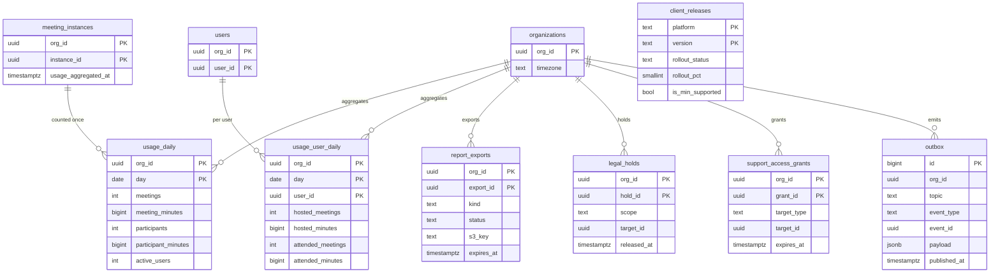
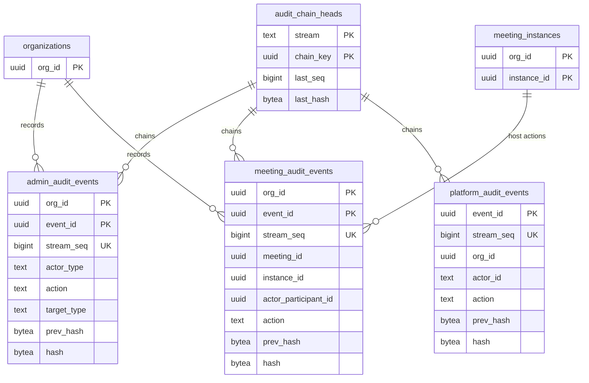

# Data model: 集計・監査・運用

[data-model.md](../data-model.md) の一部。規約は、そちらの 2 節に従う。振る舞いは [accounts-and-admin.md](../accounts-and-admin.md) の 6 節、[security.md](../security.md) の 6・7・9 節、[delivery.md](../delivery.md) の 5 節、[ADR-0040](../../decisions/0040-usage-reports.md)、[ADR-0046](../../decisions/0046-audit-logs-and-data-lifecycle.md)、[ADR-0056](../../decisions/0056-client-release-trains-and-meeting-scoped-flags.md) を正とする。

- `platform_audit_events`・`audit_chain_heads`・`outbox`・`client_releases` は `global` スキーマ。その他はテナントの表。

## 1. ER 図

### 1.1 集計と運用

### 1.2 監査ログ

## 2. 利用の集計

Worker が毎時、終わった開催を `instance_id` ごとに 1 回だけ集計して足す（I-23）。`meeting_instances.usage_aggregated_at` の設定と、集計の表への加算を同じトランザクションで行う。日は組織のタイムゾーン（`organizations.timezone`）で、開催の `started_at`（なければ `opened_at`）の日に数える。問い合わせは Aurora のリーダーに向ける。

### usage_daily

| 列 | 型 | NULL | 既定 | 説明 |
| --- | --- | --- | --- | --- |
| `org_id` | `uuid` | NO | | |
| `day` | `date` | NO | | |
| `meetings` | `integer` | NO | `0` | 開催の数 |
| `meeting_minutes` | `bigint` | NO | `0` | 開催の分（`started_at` から `ended_at`） |
| `participants` | `integer` | NO | `0` | 参加の数（入室した行） |
| `participant_minutes` | `bigint` | NO | `0` | 参加者・分（`admitted_at` から `left_at`） |
| `active_users` | `integer` | NO | `0` | 主催か参加をした自組織のユーザーの数（その日の近似。同じ日の 2 回目の集計で重ねて数えないよう、`usage_user_daily` の行の数から求め直す） |
| `updated_at` | `timestamptz` | NO | `now()` | |

- 主キー：`(org_id, day)`。
- 保持：36 か月。
- S1 の規模：約 700 万行（36 か月）。

### usage_user_daily

| 列 | 型 | NULL | 既定 | 説明 |
| --- | --- | --- | --- | --- |
| `org_id`、`day`、`user_id` | | NO | | 主キー（`uuid`、`date`、`uuid`） |
| `hosted_meetings`、`attended_meetings` | `integer` | NO | `0` | |
| `hosted_minutes`、`attended_minutes` | `bigint` | NO | `0` | |
| `updated_at` | `timestamptz` | NO | `now()` | |

- 主キー：`(org_id, day, user_id)`。
- 外部キー：張らない（ユーザーの削除の後も集計を残す。名前は画面で「削除されたユーザー」にする）。
- 対象：`meeting_participations.user_org_id = org_id` の人（自組織のユーザー）。
- 分割：`RANGE (day)`、1 か月。
- 保持：36 か月。
- S1 の規模：1 日約 20 万行、36 か月で約 2 億行（約 25 GB）。

### report_exports

大きなレポートの CSV の書き出し。Worker が S3 に書き、署名付きの URL（24 時間）を知らせる。

| 列 | 型 | NULL | 既定 | 説明 |
| --- | --- | --- | --- | --- |
| `org_id`、`export_id` | `uuid` | NO | | 主キー |
| `kind` | `text` | NO | | `usage` / `users` / `meetings` / `participants` / `recordings` / `security` / `admin_audit` |
| `params` | `jsonb` | NO | | 期間（最大 1 年）と絞り込み |
| `status` | `text` | NO | `'queued'` | `queued` / `running` / `succeeded` / `failed` |
| `s3_key` | `text` | YES | | `exports/{org}/{export_id}.csv.gz` |
| `requested_by` | `uuid` | NO | | → `users` |
| `created_at` | `timestamptz` | NO | `now()` | |
| `completed_at` | `timestamptz` | YES | | |
| `expires_at` | `timestamptz` | YES | | 完了＋ 7 日。S3 のライフサイクルでも消す |

- 索引：`(org_id, created_at DESC)`（画面の一覧）、`(expires_at)`。
- 書き出しは `admin_audit_events` に書く。
- 保持：7 日。
- S1 の規模：数千行。

## 3. 監査ログ

3 系統（[ADR-0046](../../decisions/0046-audit-logs-and-data-lifecycle.md)）。どれも outbox と同じトランザクションで書き、Worker（`audit_exporter`）が log-archive（S3 Object Lock、7 年）へ送る。会議の内容を含めない。

### 3.1 共通の列

| 列 | 型 | NULL | 説明 |
| --- | --- | --- | --- |
| `event_id` | `uuid` | NO | 主キーの一部 |
| `stream_seq` | `bigint` | NO | 連鎖の中の連番（`audit_chain_heads.last_seq + 1`） |
| `actor_type` | `text` | NO | `user` / `participant` / `app` / `operator` / `system` |
| `actor_id` | `text` | NO | 行為者の ID（外の形） |
| `action` | `text` | NO | `host.remove`、`settings.update`、`operator.shell_session` など（点で区切った名前） |
| `target_type`、`target_id` | `text` | YES | |
| `reason_code` | `text` | YES | |
| `detail` | `jsonb` | NO | 前と後の値など。内容・IP・秘密を含めない（書く関数が許可リストで絞る） |
| `occurred_at` | `timestamptz` | NO | |
| `prev_hash` | `bytea` | NO | 連鎖の前の行の `hash`（最初の行は 32 バイトの 0） |
| `hash` | `bytea` | NO | `SHA-256(prev_hash ‖ 正準化した行)` |
| `exported_at` | `timestamptz` | YES | log-archive へ送った時刻（`audit_exporter` だけが更新する） |

- **連鎖の単位**：組織の監査と会議の監査は組織ごと、プラットフォームの監査は 1 本（[data-model.md](../data-model.md) の 11.2 節の 5）。
- 採番：同じトランザクションで `audit_chain_heads` の行を `SELECT ... FOR UPDATE` し、`last_seq + 1` と `last_hash` を使って行を書き、先頭を更新する。
- 検証：毎日のジョブが連鎖を最初（か前回の検証の点）からたどる。失敗は呼び出しのアラート。
- `app` のロールは `INSERT` と `SELECT` だけ。`UPDATE`・`DELETE` はない（I-13）。古いパーティションは `partition_maint` が転送の済んだものだけ落とす。
- 分割：`RANGE (event_id)`、1 か月。保持：DB に 1 年（組織の管理者が画面で見る）、log-archive に 7 年。

### admin_audit_events

組織の監査。ユーザー、ロール、SSO、設定と鍵、録画の保全と削除、レポートの書き出し、E2EE の許可、アプリの承認とサーバー間のアプリ。

- 列：共通の列＋ `org_id`。
- 主キー：`(org_id, event_id)`。一意：`UNIQUE (org_id, stream_seq, event_id)`（分割キーを含む。`stream_seq` の一意は採番の行ロックで守る）。
- 索引：`(org_id, occurred_at DESC)`（組織の管理者の画面）。
- S1 の規模：年に数百万行。

### meeting_audit_events

会議の監査。主催者の操作（退出させる、ロック、活動の停止、役割、録画・字幕の開始と停止、E2EE の選択、会議の終了）。Actor が 2.10 節の形で書く。

- 列：共通の列＋ `org_id`、`meeting_id`、`instance_id`、`actor_participant_id`、`target_participant_id`（`uuid`、NULL 可）。
- 主キー：`(org_id, event_id)`。一意：`UNIQUE (org_id, stream_seq, event_id)`。
- 索引：`(org_id, instance_id, occurred_at)`（会議の詳細）、`(org_id, occurred_at DESC)`（安全のレポート）。
- 連鎖の注意：Actor の書き込みが組織ごとの 1 行ロックに集まる。S1 の 1 組織の同時の会議は多くても数百で、1 行あたり毎秒数件の見込み（**未検証**。E7 の負荷試験で見る。詰まるなら連鎖の単位を「組織 × 月」などに細かくする）。
- S1 の規模：1 日約 40 万行、1 年で約 1.5 億行。

### platform_audit_events（global）

運用者の本番・`media-prod` へのアクセス、防御のモード、EIP の保護の付け外し、Trust & Safety の措置、捜査機関への対応、リーガルホールド、組織の停止と削除、`ts_operator`（`BYPASSRLS`）の使用。

- 列：共通の列＋ `org_id`（`uuid`、NULL 可。組織に関わる操作）、`approved_by`（`text`、NULL 可。承認した人。シェルはインシデントの指揮者）。
- 主キー：`(event_id)`。一意：`UNIQUE (stream_seq, event_id)`。
- 索引：`(org_id, occurred_at) WHERE org_id IS NOT NULL`、`(occurred_at)`。
- S1 の規模：年に数万行。

### audit_chain_heads（global）

連鎖の先頭。

| 列 | 型 | NULL | 既定 | 説明 |
| --- | --- | --- | --- | --- |
| `stream` | `text` | NO | | `admin` / `meeting` / `platform` |
| `chain_key` | `uuid` | NO | | `org_id`。`platform` は全 0 の UUID |
| `last_seq` | `bigint` | NO | `0` | |
| `last_hash` | `bytea` | NO | | |
| `verified_seq` | `bigint` | NO | `0` | 毎日の検証が済んだ位置 |
| `updated_at` | `timestamptz` | NO | `now()` | |

- 主キー：`(stream, chain_key)`。
- `global` に置くのは、系統ごとに同じ形で 1 行を持ち、検証のジョブが組織をまたいで読むため。`app` のロールは、自分の文脈の `org_id` の行だけを更新するよう、書く関数を 1 つにする。
- S1 の規模：約 4 万行。

## 4. outbox（global）

外へ知らせる変更（Webhook、監査ログの転送、通知、カレンダーの書き戻し、録画の合成の依頼、チャットの保存）を、業務の変更と同じトランザクションで書く（I-14）。Worker が読んで topic ごとの SQS に入れる。封筒と topic は [stores.md](stores.md) の 6 節。

| 列 | 型 | NULL | 既定 | 説明 |
| --- | --- | --- | --- | --- |
| `id` | `bigint` | NO | identity | 読む順 |
| `org_id` | `uuid` | YES | | イベントの組織（プラットフォームの監査の転送では NULL） |
| `topic` | `text` | NO | | `webhook` / `audit_forward` / `notification` / `calendar` / `recording_compose` / `chat_save` |
| `event_type` | `text` | NO | | `meeting.started`、`recording.completed` など |
| `event_id` | `uuid` | NO | | `evt_`。Webhook の `id`・`webhook_deliveries.event_id` |
| `aggregate_type`、`aggregate_id` | `text`、`uuid` | NO | | もとの行 |
| `payload` | `jsonb` | NO | | 封筒の `data`（ID とメタデータだけ。16 KB まで） |
| `created_at` | `timestamptz` | NO | `now()` | |
| `published_at` | `timestamptz` | YES | | SQS に入れた時刻 |

- 主キー：`(id, created_at)`（分割キーを含む）。
- 索引：`(created_at, id) WHERE published_at IS NULL`（Worker が未送信を古い順に読む）。
- 分割：`RANGE (created_at)`、1 日。送った行は 24 時間後に消し、空になった日のパーティションを落とす。
- 書く主体：業務の処理（`app`）。Worker が `published_at` を更新する。
- S1 の規模：1 日約 150 万行。

## 5. 保全と参照の許可

### legal_holds

リーガルホールド（ADR-0046）。保持の期限に優先し、対象はどの経路でも物理削除しない（I-15）。組織の管理者の録画の「保全」は `recordings.legal_hold`（[recording.md](recording.md)）で、ここは運営が置くもの（捜査機関の要請、訴訟）。

| 列 | 型 | NULL | 既定 | 説明 |
| --- | --- | --- | --- | --- |
| `org_id`、`hold_id` | `uuid` | NO | | 主キー |
| `scope` | `text` | NO | | `org`（組織の全体）/ `user` / `meeting` / `recording` |
| `target_id` | `uuid` | YES | | `scope = 'org'` なら NULL |
| `reason_code` | `text` | NO | | 案件の番号（内容は書かない） |
| `created_by` | `text` | NO | | 運用者の ID |
| `created_at` | `timestamptz` | NO | `now()` | |
| `released_at` | `timestamptz` | YES | | |
| `released_by` | `text` | YES | | |

- CHECK：`(scope = 'org') = (target_id IS NULL)`。
- 索引：`(org_id, scope, target_id) WHERE released_at IS NULL`（保持のジョブが消す前に引く）。
- 書く主体：`ts_operator`。付け外しは `platform_audit_events`。
- 保持：解除から 7 年（既定案）。
- S1 の規模：数十行。

### support_access_grants

組織の `owner`・`admin` が、問い合わせごとにサポートへ与える、組織のデータ（録画、チャット）の参照の許可（[security.md](../security.md) の 7 節）。

| 列 | 型 | NULL | 既定 | 説明 |
| --- | --- | --- | --- | --- |
| `org_id`、`grant_id` | `uuid` | NO | | 主キー |
| `target_type` | `text` | NO | | `recording` / `chat` |
| `target_id` | `uuid` | NO | | `recording_id` か `instance_id` |
| `ticket_ref` | `text` | NO | | 問い合わせの番号 |
| `granted_by` | `uuid` | NO | | → `users`（`owner`・`admin`） |
| `created_at` | `timestamptz` | NO | `now()` | |
| `expires_at` | `timestamptz` | NO | | 最長 7 日 |
| `revoked_at` | `timestamptz` | YES | | |

- CHECK：`expires_at <= created_at + interval '7 days'`。
- 索引：`(org_id, target_type, target_id) WHERE revoked_at IS NULL`（サポートの参照の前の確認）。
- 書く主体：API（管理者）。許可と参照は `admin_audit_events` と `platform_audit_events` の両方に書く。
- 保持：期限から 1 年（既定案）。
- S1 の規模：数千行。

## 6. クライアントのバージョン

### client_releases（global）

デスクトップ・モバイルのアプリのバージョンと配布の状態、最低のバージョン（MVP の後）。Web のバージョンと最低のバージョンは AppConfig の `client-config`。

| 列 | 型 | NULL | 既定 | 説明 |
| --- | --- | --- | --- | --- |
| `platform` | `text` | NO | | `desktop_mac` / `desktop_win` / `ios` / `android` |
| `version` | `text` | NO | | セマンティックバージョン |
| `signaling_protocol` | `smallint` | NO | | 対応するシグナリングのバージョン（N−2 の判定） |
| `rollout_status` | `text` | NO | `'staged'` | `staged` / `rolling` / `complete` / `halted` / `withdrawn` |
| `rollout_pct` | `smallint` | NO | `0` | 0〜100 |
| `is_min_supported` | `boolean` | NO | `false` | これより古いバージョンは参加の前と `hello` で `upgrade_required`（`min_client_version`） |
| `released_at` | `timestamptz` | YES | | |
| `created_at` | `timestamptz` | NO | `now()` | |

- 主キー：`(platform, version)`。
- 一意：`UNIQUE (platform) WHERE is_min_supported`（プラットフォームごとに最低のバージョンは 1 つ）。
- CHECK：`rollout_pct BETWEEN 0 AND 100`。
- 書く主体：リリースの CI（[delivery.md](../delivery.md)）。API と Gateway は起動時と 60 秒ごとに読んでメモリに持つ。
- S1 の規模：数百行。
