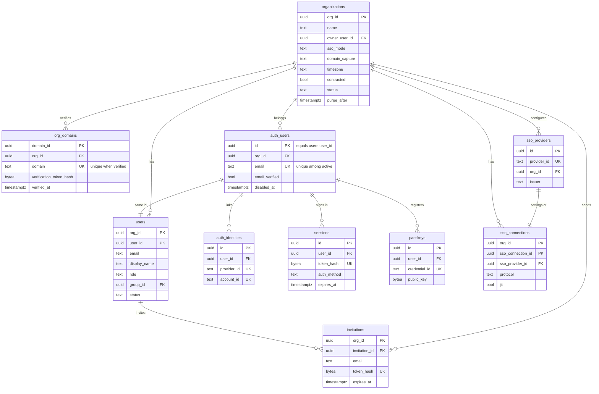
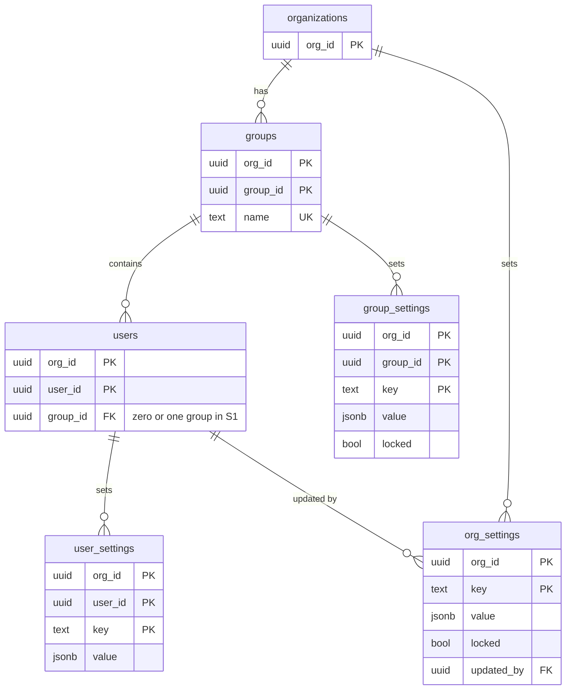

# Data model: 組織と認証

[data-model.md](../data-model.md) の一部。規約は、そちらの 2 節に従う。振る舞いは [accounts-and-admin.md](../accounts-and-admin.md)、[ADR-0038](../../decisions/0038-organizations-users-roles-and-sso.md)、[ADR-0039](../../decisions/0039-settings-hierarchy-and-locks.md) を正とする。

- `organizations`・`org_domains` と Better Auth の表（`auth_users`・`auth_identities`・`sessions`・`verifications`・`passkeys`・`sso_providers`）は `global` スキーマ（RLS の外）。
- `users`・`groups`・`invitations`・`sso_connections`・設定の 3 表はテナントの表（`org_id`、複合キー、FORCE RLS）。
- Better Auth の表に触れてよいのは `identity` のモジュールだけ（import の lint）。モジュールの外には `user_id`・`org_id`・`auth_context` だけを出す。

## 1. ER 図

### 1.1 組織、ユーザー、認証

### 1.2 グループと設定の階層

## 2. 組織

### organizations

組織。契約の単位で、会議・録画・設定・レポートの持ち主。個人で登録した人にも 1 人の組織を作る。

| 列 | 型 | NULL | 既定 | 説明 |
| --- | --- | --- | --- | --- |
| `org_id` | `uuid` | NO | | 主キー |
| `name` | `text` | NO | | 表示の名前。1〜100 文字 |
| `owner_user_id` | `uuid` | YES | | `owner` のユーザー。作成の同じトランザクションで設定する（作成の途中だけ NULL） |
| `sso_mode` | `text` | NO | `'off'` | `off` / `optional` / `required` |
| `domain_capture` | `text` | NO | `'off'` | `off` / `invite_only` / `auto`（確かめたドメインの新しい登録者を入れるか） |
| `timezone` | `text` | NO | `'Asia/Tokyo'` | IANA の名前。利用の集計の日付に使う（[data-model.md](../data-model.md) の 11.2 節の 12） |
| `contracted` | `boolean` | NO | `false` | 契約のある組織か。偽なら同時の会議 1 つ・1 会議 100 人・1 回 60 分（[security.md](../security.md) の 8.1 節） |
| `status` | `text` | NO | `'active'` | `active` / `suspended`（運営が停止）/ `deleting`（削除の猶予中） |
| `deleted_at` | `timestamptz` | YES | | `owner` が削除した時刻 |
| `purge_after` | `timestamptz` | YES | | `deleted_at + 30 日`。これを過ぎたら全行を消す |
| `created_at`、`updated_at` | `timestamptz` | NO | `now()` | |

- 主キー：`(org_id)`。
- 外部キー：`(org_id, owner_user_id)` → `app.users`（`DEFERRABLE INITIALLY DEFERRED`。作成の順のため）。`global` から `app` への外部キーはこれだけの例外で、同じ組織の行を指す。
- CHECK：`status = 'deleting'` と `deleted_at IS NOT NULL AND purge_after IS NOT NULL` は同値。
- 索引：主キー、`(purge_after) WHERE status = 'deleting'`（削除のジョブ）。
- 書く主体：API（`owner` の操作、管理の画面）、`ts_operator`（停止）。
- 削除：論理削除。`purge_after` を過ぎたら、テナントの全表と S3 を消し、この行を消す。消したことは `platform_audit_events`。
- S1 の規模：約 2 万行。

### org_domains

組織が DNS の TXT で確かめたドメイン。SSO の振り分けと `domain_capture` に使う。

| 列 | 型 | NULL | 既定 | 説明 |
| --- | --- | --- | --- | --- |
| `domain_id` | `uuid` | NO | | 主キー |
| `org_id` | `uuid` | NO | | |
| `domain` | `text` | NO | | 小文字、IDN は punycode |
| `verification_token_hash` | `bytea` | NO | | TXT レコード（`<brand>-verification=<乱数>`）の値の SHA-256 |
| `verified_at` | `timestamptz` | YES | | |
| `last_checked_at` | `timestamptz` | YES | | 再確認の時刻（毎日） |
| `created_at` | `timestamptz` | NO | `now()` | |

- 主キー：`(domain_id)`。
- 一意：`UNIQUE (domain) WHERE verified_at IS NOT NULL`（I-21）、`UNIQUE (org_id, domain)`。
- 外部キー：`org_id` → `organizations`。
- 索引：一意の索引（ログインの画面でメールのドメインから組織と IdP を引く）。
- 削除：その場で物理削除（`admin` が外す）。
- S1 の規模：約 1 万行。

## 3. 認証（Better Auth）

Better Auth（`emailOTP`、Google・Microsoft のソーシャル、`@better-auth/passkey`、`@better-auth/sso`）の表。パスワードは持たないので、パスワードの列と `two_factors` の表は作らない。バージョンを固定し、列は Better Auth のバージョンに合わせて見直す（E2 の `identity-better-auth`）。

### auth_users

Better Auth の `user`。ログインの主体。`app.users` と同じ ID で 1 対 1（[data-model.md](../data-model.md) の 11.2 節の 2）。

| 列 | 型 | NULL | 既定 | 説明 |
| --- | --- | --- | --- | --- |
| `id` | `uuid` | NO | | 主キー。`users.user_id` と同じ値 |
| `org_id` | `uuid` | NO | | 属する組織（1 つだけ）。組織を移るときに更新する |
| `email` | `text` | YES | | 正規化した小文字。削除で NULL |
| `email_verified` | `boolean` | NO | `false` | |
| `name` | `text` | YES | | Better Auth が求める表示の名前。組織の中の表示は `users.display_name` |
| `disabled_at` | `timestamptz` | YES | | `users.status` が `suspended`・`deleted` になったら同じトランザクションで設定する。ログインを拒否する |
| `deleted_at` | `timestamptz` | YES | | |
| `created_at`、`updated_at` | `timestamptz` | NO | `now()` | |

- 主キー：`(id)`。
- 一意：`UNIQUE (email) WHERE deleted_at IS NULL`（メールアドレスごとに 1 人。有効なユーザーの中で全体で一意）。
- 外部キー：`org_id` → `organizations`。
- 書く主体：`identity` のモジュールだけ。`users` と同じトランザクションで書く。
- 削除：論理削除（メールを NULL にする）。
- S1 の規模：約 50 万行。

### auth_identities

Better Auth の `account`。外部の IdP（Google、Microsoft、組織の SSO）の身元。

| 列 | 型 | NULL | 既定 | 説明 |
| --- | --- | --- | --- | --- |
| `id` | `uuid` | NO | | 主キー |
| `user_id` | `uuid` | NO | | → `auth_users.id` |
| `provider_id` | `text` | NO | | `google` / `microsoft` / `sso:<sso_providers.provider_id>` / `email-otp` |
| `account_id` | `text` | NO | | IdP の主体の ID（`sub`、SAML の `NameID`） |
| `access_token_ciphertext`、`refresh_token_ciphertext` | `bytea` | YES | | Better Auth の `encryptOAuthTokens`。カレンダーの連携のトークンとは別（[scheduling.md](scheduling.md) の `calendar_connections`） |
| `access_token_expires_at` | `timestamptz` | YES | | |
| `scope` | `text` | YES | | |
| `created_at`、`updated_at` | `timestamptz` | NO | `now()` | |

- 主キー：`(id)`。一意：`UNIQUE (provider_id, account_id)`。
- 索引：`(user_id)`。
- 既存のユーザーを SSO の身元に結び付けるのは、組織がメールのドメインを確かめている場合だけ（[accounts-and-admin.md](../accounts-and-admin.md) の 4.2 節）。
- 削除：ユーザーの削除で物理削除。
- S1 の規模：約 60 万行。

### sessions

Better Auth の `session`。アイドル 14 日、絶対 90 日。

| 列 | 型 | NULL | 既定 | 説明 |
| --- | --- | --- | --- | --- |
| `id` | `uuid` | NO | | 主キー |
| `user_id` | `uuid` | NO | | → `auth_users.id` |
| `token_hash` | `bytea` | NO | | Cookie の値の SHA-256 |
| `auth_method` | `text` | NO | | `email_otp` / `google` / `microsoft` / `passkey` / `sso_oidc` / `sso_saml`（`auth_context` の手段） |
| `sso_connection_id` | `uuid` | YES | | SSO でログインしたとき |
| `user_agent_family` | `text` | YES | | ブラウザの系統だけ（`chrome` など）。IP と User-Agent の全文は持たない（I-10） |
| `expires_at` | `timestamptz` | NO | | 絶対の期限 |
| `last_seen_at` | `timestamptz` | NO | `now()` | アイドルの判定 |
| `created_at`、`updated_at` | `timestamptz` | NO | `now()` | |

- 主キー：`(id)`。一意：`UNIQUE (token_hash)`。
- 索引：`(user_id)`（ユーザーのセッションの一覧と取り消し）、`(expires_at)`（期限切れの削除）。
- 削除：期限切れを毎日物理削除。
- S1 の規模：約 100 万行。

### verifications

Better Auth の `verification`。メールの OTP（6 桁、10 分、5 回まで）とメールアドレスの確認。

| 列 | 型 | NULL | 既定 | 説明 |
| --- | --- | --- | --- | --- |
| `id` | `uuid` | NO | | 主キー |
| `identifier` | `text` | NO | | 用途とメールアドレス（例：`sign-in-otp:<email>`） |
| `value_hash` | `bytea` | NO | | 値の SHA-256 |
| `attempts` | `smallint` | NO | `0` | 5 回で無効 |
| `expires_at` | `timestamptz` | NO | | |
| `created_at` | `timestamptz` | NO | `now()` | |

- 主キー：`(id)`。索引：`(identifier)`、`(expires_at)`。
- 削除：期限切れを毎時物理削除。
- S1 の規模：数万行。

### passkeys

`@better-auth/passkey` の表。

| 列 | 型 | NULL | 既定 | 説明 |
| --- | --- | --- | --- | --- |
| `id` | `uuid` | NO | | 主キー |
| `user_id` | `uuid` | NO | | → `auth_users.id` |
| `name` | `text` | YES | | 利用者が付けた名前 |
| `credential_id` | `text` | NO | | WebAuthn の資格情報の ID（base64url） |
| `public_key` | `bytea` | NO | | |
| `counter` | `bigint` | NO | `0` | |
| `device_type` | `text` | NO | | `singleDevice` / `multiDevice` |
| `backed_up` | `boolean` | NO | `false` | |
| `transports` | `text[]` | YES | | |
| `aaguid` | `uuid` | YES | | |
| `created_at` | `timestamptz` | NO | `now()` | |

- 主キー：`(id)`。一意：`UNIQUE (credential_id)`。索引：`(user_id)`。
- S1 の規模：約 10 万行。

### sso_providers

`@better-auth/sso` の表。組織の IdP の接続の技術的な設定。組織の側の設定は `sso_connections`。

| 列 | 型 | NULL | 既定 | 説明 |
| --- | --- | --- | --- | --- |
| `id` | `uuid` | NO | | 主キー |
| `provider_id` | `text` | NO | | Better Auth の中の名前 |
| `org_id` | `uuid` | NO | | 持ち主の組織（プラグインの `organizationId` に当たる） |
| `issuer` | `text` | NO | | |
| `domain` | `text` | NO | | 振り分けに使うドメイン。`org_domains` の確かめたドメインに限る（サービス関数で検査） |
| `oidc_config` | `jsonb` | YES | | OIDC のエンドポイント、クライアントの ID。クライアントの秘密は Secrets Manager の参照だけ |
| `saml_config` | `jsonb` | YES | | IdP のメタデータ、証明書（公開） |
| `created_at`、`updated_at` | `timestamptz` | NO | `now()` | |

- 主キー：`(id)`。一意：`UNIQUE (provider_id)`。索引：`(org_id)`、`(domain)`。
- CHECK：`oidc_config` と `saml_config` のどちらか 1 つだけが NULL でない。
- 書く主体：`identity` のモジュール。`admin` の権限を `authorize` で確かめてから Better Auth の API を呼ぶ（ライブラリの権限の判定に頼らない）。
- S1 の規模：約 1,000 行。

## 4. ユーザーと招待

### users

組織の中のユーザー。1 人は 1 つの組織だけに属する。ゲストはこの表に行を持たない。

| 列 | 型 | NULL | 既定 | 説明 |
| --- | --- | --- | --- | --- |
| `org_id`、`user_id` | `uuid` | NO | | 主キー。`user_id` は `auth_users.id` と同じ |
| `email` | `text` | YES | | `auth_users.email` の写し（管理の画面の一覧と検索）。同じトランザクションで更新する。削除で NULL |
| `display_name` | `text` | NO | | 64 文字まで。削除で「削除されたユーザー」 |
| `role` | `text` | NO | `'member'` | `owner` / `admin` / `member` |
| `group_id` | `uuid` | YES | | S1 は 0 か 1 つのグループ |
| `status` | `text` | NO | `'active'` | `active` / `suspended` / `deleted` |
| `suspended_reason` | `text` | YES | | `admin` / `trust_safety` |
| `hosting_suspended_until` | `timestamptz` | YES | | Trust & Safety による主催の停止（[meeting-security.md](../meeting-security.md) の 6.3 節） |
| `timezone` | `text` | NO | `'Asia/Tokyo'` | IANA の名前 |
| `deleted_at` | `timestamptz` | YES | | |
| `created_at`、`updated_at` | `timestamptz` | NO | `now()` | |

- 主キー：`(org_id, user_id)`。
- 一意：`UNIQUE (org_id, email) WHERE status <> 'deleted'`、`UNIQUE (org_id) WHERE role = 'owner' AND status <> 'deleted'`（I-20）。
- 外部キー：`(org_id, group_id)` → `groups`。`user_id` → `global.auth_users.id`。
- CHECK：`role IN (...)`、`status IN (...)`、`status = 'deleted'` と `deleted_at IS NOT NULL` は同値。
- 索引：主キー、`(org_id, lower(display_name))`（管理の画面の検索）、`(org_id, group_id)`（グループの設定の解決と一覧）。
- 書く主体：`identity` のモジュール（作成・移動）、API（管理の操作）、`ts_operator`（停止）。変更は `admin_audit_events`、停止は `platform_audit_events` にも。
- 削除：論理削除。行を残して、`email` を NULL、`display_name` を置き換える。会議と録画は、指定した別のユーザーに移すか消す（[accounts-and-admin.md](../accounts-and-admin.md) の 8 節）。
- 組織を移る（招待を受けて別の組織へ）：元の行を `deleted` にし、新しい組織に同じ `user_id` で行を作る。`auth_users.org_id` を更新する。元の組織の会議と録画は、元の組織の `owner` に移す。
- S1 の規模：約 50 万行。

### groups

組織の中のグループ。設定の階層の 1 段。

| 列 | 型 | NULL | 既定 | 説明 |
| --- | --- | --- | --- | --- |
| `org_id`、`group_id` | `uuid` | NO | | 主キー |
| `name` | `text` | NO | | 1〜100 文字 |
| `created_at`、`updated_at` | `timestamptz` | NO | `now()` | |

- 一意：`UNIQUE (org_id, name)`。
- 削除：物理削除。属するユーザーの `group_id` を NULL にし、`group_settings` を消す（同じトランザクション）。
- S1 の規模：約 5 万行。

### invitations

`admin` のメールアドレスでの招待。トークンは 128 ビットの乱数、7 日で失効。

| 列 | 型 | NULL | 既定 | 説明 |
| --- | --- | --- | --- | --- |
| `org_id`、`invitation_id` | `uuid` | NO | | 主キー |
| `email` | `text` | NO | | 正規化した小文字 |
| `role` | `text` | NO | `'member'` | `admin` / `member` |
| `token_hash` | `bytea` | NO | | トークンの SHA-256 |
| `invited_by` | `uuid` | NO | | → `users` |
| `expires_at` | `timestamptz` | NO | | 作成から 7 日 |
| `accepted_at`、`revoked_at` | `timestamptz` | YES | | |
| `accepted_user_id` | `uuid` | YES | | |
| `created_at` | `timestamptz` | NO | `now()` | |

- 一意：`UNIQUE (token_hash)`、`UNIQUE (org_id, email) WHERE accepted_at IS NULL AND revoked_at IS NULL`。
- 外部キー：`(org_id, invited_by)` → `users`。
- CHECK：`role IN ('admin', 'member')`（`owner` は招待で作らない）。
- 受諾：受けた人の組織が分からないので、`resolve_invitation(token_hash)`（[data-model.md](../data-model.md) の 2.3.2 節）で引く。
- 保持：失効・受諾・取り消しから 30 日で物理削除（既定案）。
- S1 の規模：約 10 万行。

### sso_connections

組織の SSO の接続の、組織の側の設定。

| 列 | 型 | NULL | 既定 | 説明 |
| --- | --- | --- | --- | --- |
| `org_id`、`sso_connection_id` | `uuid` | NO | | 主キー |
| `sso_provider_id` | `uuid` | NO | | → `global.sso_providers.id` |
| `protocol` | `text` | NO | | `oidc` / `saml` |
| `jit` | `boolean` | NO | `true` | IdP でログインした人が組織にいなければ `member` で作る |
| `attribute_map` | `jsonb` | NO | `'{}'` | IdP の属性（`groups` など）→ 組織のグループ |
| `bypass_user_ids` | `uuid[]` | NO | `'{}'` | `required` でも別の手段で入れる `admin`（2 人まで。`owner` は常に例外） |
| `cert_expires_at` | `timestamptz` | YES | | SAML の証明書の期限。30・7・1 日前に知らせる |
| `status` | `text` | NO | `'active'` | `active` / `disabled` |
| `created_at`、`updated_at` | `timestamptz` | NO | `now()` | |

- 一意：`UNIQUE (sso_provider_id)`。
- 外部キー：`sso_provider_id` → `global.sso_providers`。
- CHECK：`cardinality(bypass_user_ids) <= 2`、`protocol IN (...)`。
- 索引：`(cert_expires_at) WHERE protocol = 'saml' AND status = 'active'`（期限の通知のジョブ）。
- S1 の規模：約 1,000 行。

## 5. 設定の階層

[ADR-0039](../../decisions/0039-settings-hierarchy-and-locks.md)。項目の定義（型、既定、置ける階層、`security`）は `settingsRegistry`（コード）が正本。表には、既定から変えた値だけを置く。`key` の名前は [data-model.md](../data-model.md) の 7 節。会議の階層の値は `meetings.settings`（[scheduling.md](scheduling.md)）。

### org_settings

| 列 | 型 | NULL | 既定 | 説明 |
| --- | --- | --- | --- | --- |
| `org_id` | `uuid` | NO | | 主キー |
| `key` | `text` | NO | | 主キー。`settingsRegistry` の名前 |
| `value` | `jsonb` | NO | | `settingsRegistry` の型で検証してから書く |
| `locked` | `boolean` | NO | `false` | 下の階層で変えられない（S1 は固定だけ） |
| `updated_by` | `uuid` | NO | | → `users` |
| `updated_at` | `timestamptz` | NO | `now()` | |

- 主キー：`(org_id, key)`。外部キー：`(org_id, updated_by)` → `users`。
- 書く主体：API（`admin`）。変更は前と後の値を `admin_audit_events` に書く。保存の前に、解決の結果が「待合室もパスコードもない」にならないことを確かめる（I-3）。
- S1 の規模：約 40 万行（1 組織 20 項目）。

### group_settings

| 列 | 型 | NULL | 既定 | 説明 |
| --- | --- | --- | --- | --- |
| `org_id`、`group_id` / `key` | `uuid` / `text` | NO | | 主キー |
| `value` | `jsonb` | NO | | |
| `locked` | `boolean` | NO | `false` | 組織の鍵がないときだけ効く |
| `updated_by` | `uuid` | NO | | |
| `updated_at` | `timestamptz` | NO | `now()` | |

- 外部キー：`(org_id, group_id)` → `groups`（`ON DELETE CASCADE`）。
- S1 の規模：約 10 万行。

### user_settings

| 列 | 型 | NULL | 既定 | 説明 |
| --- | --- | --- | --- | --- |
| `org_id`、`user_id` / `key` | `uuid` / `text` | NO | | 主キー |
| `value` | `jsonb` | NO | | |
| `updated_at` | `timestamptz` | NO | `now()` | |

- `locked` を持たない。鍵を置けるのは組織とグループだけ（ADR-0039）。
- 外部キー：`(org_id, user_id)` → `users`。
- 書く主体：本人（鍵のない項目だけ）、`admin`。
- S1 の規模：約 250 万行。

- 解決：`resolveSettings(org, group, user, meeting)`（純粋な関数）が 3 表と `meetings.settings` を読む。開催の開始で `security: true` の項目を解決し直し、`meeting_instances.effective_settings` に写す（[meeting-runtime.md](meeting-runtime.md)）。
