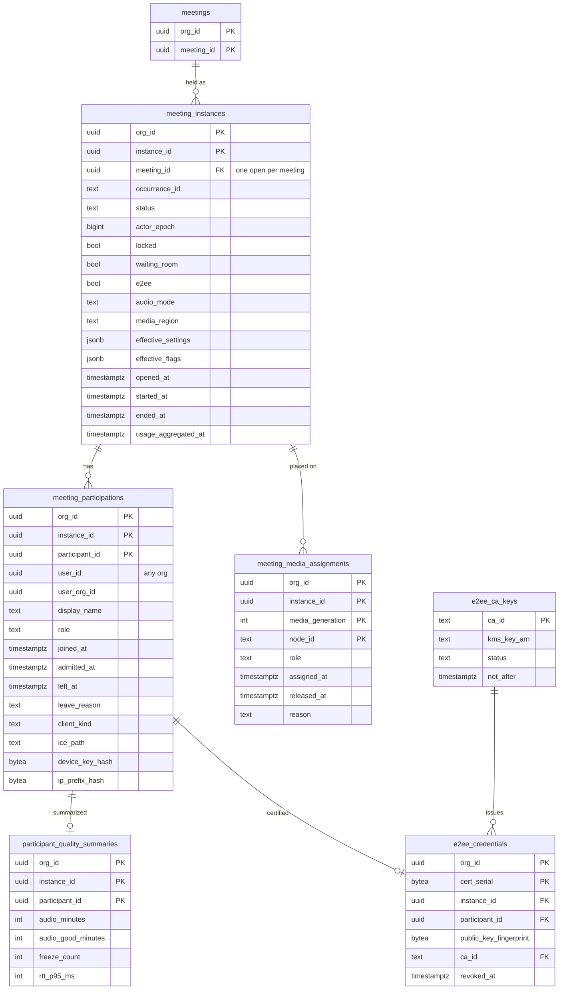
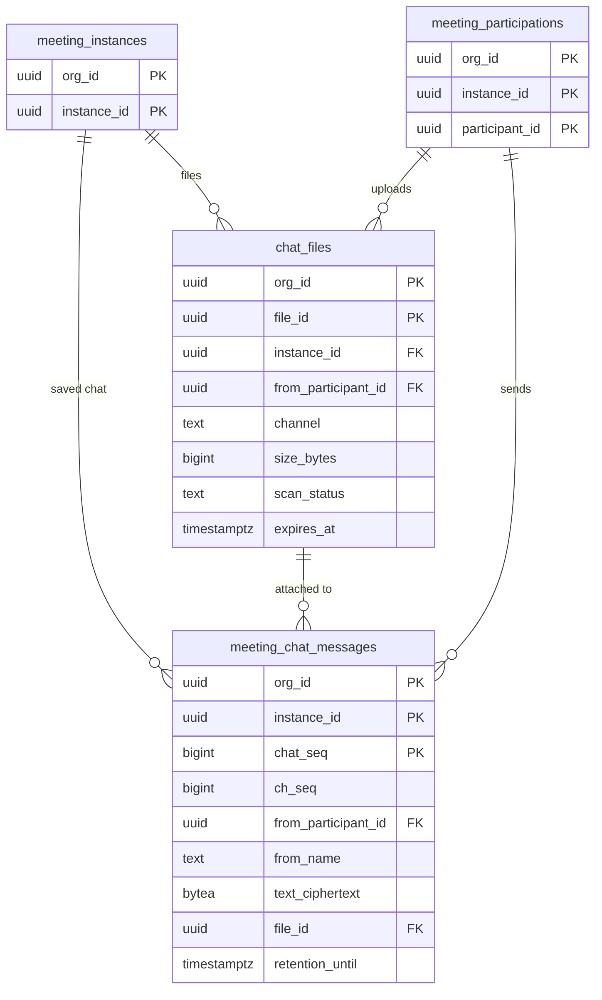

# Data model: 開催と参加

[data-model.md](../data-model.md) の一部。規約は、そちらの 2 節に従う。振る舞いは [signaling-and-meetings.md](../signaling-and-meetings.md)、[media-server-sfu.md](../media-server-sfu.md)、[e2ee.md](../e2ee.md)、[chat-and-reactions.md](../chat-and-reactions.md)、[observability.md](../observability.md)、[ADR-0005](../../decisions/0005-meeting-state-and-signaling.md)、[ADR-0007](../../decisions/0007-meeting-actor-lease-and-epoch.md) を正とする。

- 会議の中の状態の正本は Meeting Actor のメモリ（[stores.md](stores.md) の 7 節）。ここにある表は、残すべきもの（開催の開始と終了、参加の記録、失ってはならない変更、割り当て、資格情報、保存したチャット、品質の要約）だけ。
- Actor の書き込みは [data-model.md](../data-model.md) の 2.10 節の形（`actor_epoch` の条件つき）。
- `e2ee_ca_keys` は `global` スキーマ。その他はテナントの表。

## 1. ER 図

### 1.1 開催、参加、メディア、品質

### 1.2 チャットの保存とファイル

## 2. 開催

### meeting_instances

会議の 1 回の開催。最初の参加で Actor が Open にするときに作る。

| 列 | 型 | NULL | 既定 | 説明 |
| --- | --- | --- | --- | --- |
| `org_id`、`instance_id` | `uuid` | NO | | 主キー |
| `meeting_id` | `uuid` | NO | | |
| `occurrence_id` | `text` | YES | | 繰り返しの会議の、どの回か（予定の時刻に最も近い回。なければ NULL） |
| `status` | `text` | NO | `'open'` | `open` / `live` / `ending` / `ended`（[signaling-and-meetings.md](../signaling-and-meetings.md) の 5.1 節） |
| `actor_epoch` | `bigint` | NO | `0` | 最後に書いた Actor の `epoch`。2.10 節のフェンシング |
| `locked` | `boolean` | NO | `false` | `host.lock`。失ってはならない変更。次の回に持ち越さない |
| `waiting_room` | `boolean` | NO | | 開催の開始で解決した値。主催者の変更と `host.suspend` で更新する（失ってはならない変更） |
| `e2ee` | `boolean` | NO | `false` | 開催の開始で決まる。開催の間は変えない（[ADR-0030](../../decisions/0030-security-code-and-e2ee-feature-limits.md)） |
| `audio_mode` | `text` | NO | `'per_sender'` | `per_sender` / `slots`（100 人を超える会議。[ADR-0057](../../decisions/0057-audio-slots-for-large-meetings.md)） |
| `media_region` | `text` | NO | | `ap-northeast-1` など。S1 は東京だけ |
| `effective_settings` | `jsonb` | NO | | 開催の開始で解決した設定（[ADR-0039](../../decisions/0039-settings-hierarchy-and-locks.md)）。後から「どの設定で開かれたか」を答える |
| `effective_flags` | `jsonb` | NO | `'{}'` | 開催の開始で評価した meeting のフラグ（[ADR-0056](../../decisions/0056-client-release-trains-and-meeting-scoped-flags.md)） |
| `opened_at` | `timestamptz` | NO | `now()` | Open になった時刻 |
| `started_at` | `timestamptz` | YES | | Live になった時刻（主催者が入った、か `join_before_host`） |
| `ended_at` | `timestamptz` | YES | | |
| `end_reason` | `text` | YES | | `host_ended` / `api_ended` / `empty` / `time_limit` / `suspended_org` / `failover_lost` |
| `peak_participants` | `integer` | NO | `0` | 同時の参加者の最大 |
| `usage_aggregated_at` | `timestamptz` | YES | | 利用の集計に足した時刻（I-23） |
| `created_at` | `timestamptz` | NO | `now()` | |

- 主キー：`(org_id, instance_id)`。
- 一意：`UNIQUE (org_id, meeting_id) WHERE ended_at IS NULL`（I-1。同時に動く開催は 1 つ）。
- 外部キー：`(org_id, meeting_id)` → `meetings`。
- CHECK：`status = 'ended'` と `ended_at IS NOT NULL` は同値。`status IN (...)`、`audio_mode IN (...)`、`actor_epoch >= 0`、`e2ee` なら `audio_mode = 'per_sender'`（S1 の E2EE は 100 人まで）。
- 索引：
  - 部分一意の索引：Actor が開くときの競合の判定、参加の API が「今の開催」を引く。
  - `(org_id, meeting_id, opened_at DESC)`：会議の開催の一覧（`GET /v1/meetings/{id}/instances`）。
  - `(org_id, opened_at)`：レポートの会議の一覧（期間の指定）。
  - `(org_id, ended_at) WHERE ended_at IS NOT NULL AND usage_aggregated_at IS NULL`：毎時の集計。
- 書く主体：Actor（作成、状態、`locked`、`waiting_room`、`peak_participants`。2.10 節の形）、Worker（`usage_aggregated_at`、Actor が失われたまま残った開催の後始末）。
- 分割：しない（部分一意の索引のため。[data-model.md](../data-model.md) の 2.9 節）。
- 保持：12 か月（[security.md](../security.md) の 9 節）。録画・文字起こしが残る開催は、それらが消えるまで残す（I-16）。
- S1 の規模：1 日約 4 万行、12 か月で約 1,500 万行。

### meeting_participations

1 人の 1 回の参加（開催の中の 1 つの `participant_id`）。再接続（`resume`）は同じ行。統合の定義（codecs・clients・network-traversal の列をまとめたもの。[data-model.md](../data-model.md) の 11.1 節の 1）。

| 列 | 型 | NULL | 既定 | 説明 |
| --- | --- | --- | --- | --- |
| `org_id`、`instance_id`、`participant_id` | `uuid` | NO | | 主キー |
| `user_id` | `uuid` | YES | | ログインして入った人。他の組織のユーザーも入る。ゲストと電話は NULL |
| `user_org_id` | `uuid` | YES | | `user_id` の人が属する組織。会議の組織と同じなら同じ値（待合室を省く判定と、利用の集計で自組織の人を選ぶため） |
| `display_name` | `text` | NO | | 参加した時点の名前。64 文字まで。改名で更新する |
| `role` | `text` | NO | `'attendee'` | `host` / `cohost` / `attendee`。役割の変更は失ってはならない変更 |
| `joined_at` | `timestamptz` | NO | `now()` | `hello` を受けた時刻（待合室を含む） |
| `admitted_at` | `timestamptz` | YES | | 会議に入った時刻。待合室だけで終わった人は NULL |
| `left_at` | `timestamptz` | YES | | |
| `leave_reason` | `text` | YES | | `left` / `dropped` / `removed` / `denied` / `rejected_removed` / `rejected_locked` / `rejected_full` / `rejected_waiting_full` / `rejected_e2ee` / `client_unsupported` / `meeting_ended` |
| `client_kind` | `text` | NO | | `web` / `desktop` / `ios` / `android` / `phone`（`hello.client.kind`） |
| `client_version` | `text` | YES | | |
| `os` | `text` | YES | | OS の系統と主なバージョン |
| `browser`、`browser_version` | `text` | YES | | Web だけ |
| `video_codec` | `text` | YES | | 送った映像の符号器（`vp8` / `vp9` / `h264` / `av1`） |
| `ice_path` | `text` | YES | | `udp_direct` / `tcp_direct` / `turn_udp` / `turn_tcp` / `turn_tls` |
| `ip_family` | `text` | YES | | `ipv4` / `ipv6` |
| `device_key_hash` | `bytea` | YES | | ゲストの端末の鍵の HMAC（参加のトークンの値） |
| `ip_prefix_hash` | `bytea` | YES | | 回線（/32・/64）の HMAC |
| `ip_pepper_version` | `smallint` | YES | | `ip_prefix_hash` の pepper のバージョン |
| `asn` | `integer` | YES | | 回線の ASN（報告に添える） |
| `caller_id_hash` | `bytea` | YES | | 電話の参加者の発信者の番号の HMAC（[telephony.md](telephony.md)） |

- 主キー：`(org_id, instance_id, participant_id)`。
- 外部キー：`(org_id, instance_id)` → `meeting_instances`（`ON DELETE CASCADE`）。`user_id` には張らない（他の組織のユーザーがいるため）。
- CHECK：`(user_id IS NULL) = (user_org_id IS NULL)`、`client_kind IN (...)`、`role IN (...)`、`(ip_prefix_hash IS NULL) = (ip_pepper_version IS NULL)`、`client_kind = 'phone'` なら `caller_id_hash` 以外の端末の列は NULL でもよい。
- 索引：
  - 主キー：開催の参加者の一覧（`GET /v1/meeting-instances/{id}/participants`、会議の詳細の画面）、集計。
  - `(org_id, user_id, participant_id DESC) WHERE user_org_id = org_id`：自組織のユーザーごとの参加（`usage_user_daily`、ユーザーの削除で名前を置き換える）。
- 書く主体：Actor（2.10 節の形）。参加（`hello` の受理）、入室、役割の変更、退出で書く。ミュート・挙手は書かない（スナップショットだけ）。
- 分割：`RANGE (participant_id)`、1 か月。
- 保持：12 か月。`participant_quality_summaries` と同じ実行で消す。
- 報告と ban：会議の後の報告で、サーバーが自動で添える項目（端末の鍵、回線のハッシュ、ASN）はこの行から写す（[data-model.md](../data-model.md) の 11.2 節の 10）。
- S1 の規模：1 日約 25 万行、12 か月で約 9,000 万行（約 40 GB）。

### meeting_media_assignments

開催を置いた Media Node の履歴。診断と費用の集計に使う。今の割り当ての正本は Actor のメモリ（`media.generation`・`nodes`・`standby`）。

| 列 | 型 | NULL | 既定 | 説明 |
| --- | --- | --- | --- | --- |
| `org_id`、`instance_id` | `uuid` | NO | | |
| `media_generation` | `integer` | NO | | 付け替えで 1 上がる（[ADR-0013](../../decisions/0013-media-node-failover-and-reattach.md)） |
| `node_id` | `text` | NO | | `mn-tyo-a-017` など |
| `role` | `text` | NO | | `primary` / `secondary` / `standby` |
| `site` | `text` | NO | | `aws:apne1-az1`、`edge:tyo-1` など |
| `node_generation` | `text` | YES | | AMI の世代（[ADR-0055](../../decisions/0055-media-node-rolling-replacement.md) の比較） |
| `assigned_at` | `timestamptz` | NO | `now()` | |
| `released_at` | `timestamptz` | YES | | |
| `reason` | `text` | NO | | `initial` / `node_failed` / `worker_failed` / `drain` / `scale_out` / `under_attack` |

- 主キー：`(org_id, instance_id, media_generation, node_id)`。
- 外部キー：`(org_id, instance_id)` → `meeting_instances`（`ON DELETE CASCADE`）。
- 書く主体：Actor（2.10 節の形。書けなくても割り当ては進める。記録は後で書き直す）。
- 保持：開催と同じ（12 か月）。
- S1 の規模：開催の 1.1 倍程度、約 1,600 万行。

## 3. E2EE

### e2ee_credentials

E2EE の会議で AS が出した、会議の間だけ有効な X.509 の証明書の記録。失効の確認と監査に使う。秘密鍵は持たない（[ADR-0029](../../decisions/0029-mls-delivery-and-authentication-service.md)）。

| 列 | 型 | NULL | 既定 | 説明 |
| --- | --- | --- | --- | --- |
| `org_id` | `uuid` | NO | | 会議の組織 |
| `cert_serial` | `bytea` | NO | | 証明書のシリアル（全体で一意） |
| `instance_id`、`participant_id` | `uuid` | NO | | 証明書の主体 |
| `public_key_fingerprint` | `bytea` | NO | | 端末の Ed25519 の公開鍵の SHA-256。画面に先頭 8 桁を出す |
| `ca_id` | `text` | NO | | → `global.e2ee_ca_keys` |
| `issued_at` | `timestamptz` | NO | `now()` | |
| `not_after` | `timestamptz` | NO | | 会議の予定の終わり＋ 1 時間、最大 24 時間 |
| `revoked_at` | `timestamptz` | YES | | |
| `revoke_reason` | `text` | YES | | `removed` / `ca_compromised` / `superseded` |

- 主キー：`(org_id, cert_serial)`。一意：`UNIQUE (cert_serial)`。
- 外部キー：`(org_id, instance_id, participant_id)` → `meeting_participations`、`ca_id` → `global.e2ee_ca_keys`。
- 索引：`(org_id, instance_id)`（開催の名簿の確認）。
- 書く主体：API（発行）、Actor（退出での失効）、運用者（CA の失効での一括の失効）。
- 保持：1 年（[security.md](../security.md) の 9 節）。参加の行（12 か月）と同じ実行で消す。
- S1 の規模：E2EE の会議は少ない見込み。約 100 万行。

### e2ee_ca_keys（global）

AS の中間 CA。

| 列 | 型 | NULL | 既定 | 説明 |
| --- | --- | --- | --- | --- |
| `ca_id` | `text` | NO | | 主キー |
| `kms_key_arn` | `text` | NO | | `<brand>-e2ee-as` の鍵の ARN |
| `certificate` | `bytea` | NO | | 中間 CA の証明書（DER、公開） |
| `not_before`、`not_after` | `timestamptz` | NO | | |
| `status` | `text` | NO | `'active'` | `active` / `retiring` / `revoked` |
| `revoked_at` | `timestamptz` | YES | | |
| `created_at` | `timestamptz` | NO | `now()` | |

- 一意：`UNIQUE (status) WHERE status = 'active'`（発行に使う CA は 1 つ）。
- 書く主体：運用者（runbook の `e2ee-as-key-compromise.md`）。操作は `platform_audit_events`。
- S1 の規模：数行。

## 4. チャット

会議の間のチャットは Valkey の Stream（[stores.md](stores.md) の 2 節）。Aurora に書くのは、組織の設定 `chat.save_after_meeting`（`save_chat`）が真の会議の、全員へのメッセージだけ（[ADR-0036](../../decisions/0036-in-meeting-chat-ordering-and-retention.md)）。個別のメッセージと E2EE の会議のメッセージは書かない。

### meeting_chat_messages

| 列 | 型 | NULL | 既定 | 説明 |
| --- | --- | --- | --- | --- |
| `org_id`、`instance_id` | `uuid` | NO | | |
| `chat_seq` | `bigint` | NO | | 開催の中の番号（全員と個別で共通の列。保存するのは全員へのものだけなので飛ぶ） |
| `ch_seq` | `bigint` | NO | | `everyone` のチャンネルの番号 |
| `from_participant_id` | `uuid` | NO | | |
| `from_user_id` | `uuid` | YES | | アカウントのある人 |
| `from_name` | `text` | NO | | Actor が持つ送った時点の表示の名前 |
| `text_ciphertext` | `bytea` | YES | | 本文の暗号文（4,096 文字まで）。墓標で NULL |
| `reply_to_chat_seq` | `bigint` | YES | | |
| `file_id` | `uuid` | YES | | |
| `sent_at` | `timestamptz` | NO | | |
| `deleted_at` | `timestamptz` | YES | | |
| `deleted_by` | `text` | YES | | `sender` / `host` |
| `retention_until` | `timestamptz` | NO | | 会議の終了＋組織の保持の日数（既定 90 日） |

- 主キー：`(org_id, instance_id, chat_seq)`（I-18）。
- 一意：`UNIQUE (org_id, instance_id, ch_seq)`。
- 外部キー：`(org_id, instance_id, from_participant_id)` → `meeting_participations`、`(org_id, file_id)` → `chat_files`。
- CHECK：`(deleted_at IS NULL) = (text_ciphertext IS NOT NULL)`。
- 索引：主キー（会議の後に読む。主催者と会議の参加者（アカウントのある人））、`(org_id, retention_until)`（保持のジョブ）。
- 書く主体：Worker（会議の終了で Valkey の Stream から写す。outbox の `chat_save` で再試行）。会議の間の削除は、保存の前に Stream で済む。
- 保持：`retention_until`（[security.md](../security.md) の 9 節）。参加の行（12 か月）より短い既定。組織の設定で参加の行より長くした場合は、この表の外部キーのため参加の行を残す（保持のジョブが順を見る）。
- S1 の規模：`save_chat` の組織を 10% として、90 日で約 700 万行。

### chat_files

会議の中で送ったファイルの索引。実体は S3（[stores.md](stores.md) の 3 節）。

| 列 | 型 | NULL | 既定 | 説明 |
| --- | --- | --- | --- | --- |
| `org_id`、`file_id` | `uuid` | NO | | 主キー |
| `instance_id`、`from_participant_id` | `uuid` | NO | | |
| `channel` | `text` | NO | | `everyone` か `dm:<participant_id>:<participant_id>`（小さい順） |
| `name` | `text` | NO | | 元の名前（255 文字まで）。表示のときにエスケープする |
| `size_bytes` | `bigint` | NO | | 100 MB まで |
| `content_type` | `text` | NO | | 申告の型。配るときは `attachment` と `nosniff` |
| `s3_key` | `text` | NO | | `chat-files/{org}/{instance_id}/{file_id}` |
| `scan_status` | `text` | NO | `'pending'` | `pending` / `clean` / `infected` / `failed` |
| `created_at` | `timestamptz` | NO | `now()` | |
| `expires_at` | `timestamptz` | NO | | 会議の終了＋ 24 時間。`save_chat` なら `retention_until` と同じ |
| `deleted_at` | `timestamptz` | YES | | |

- 外部キー：`(org_id, instance_id, from_participant_id)` → `meeting_participations`。
- CHECK：`size_bytes BETWEEN 1 AND 104857600`、`scan_status IN (...)`。
- 索引：`(org_id, instance_id, from_participant_id)`（1 人 1 会議 20 ファイル・500 MB の検査）、`(expires_at) WHERE deleted_at IS NULL`（削除のジョブ）。
- 書く主体：API（作成）、Worker（検査の結果、削除）。`infected` は S3 から消して `deleted_at` を設定する。
- 保持：`expires_at`。
- S1 の規模：1 日約 1 万行。

## 5. 品質

### participant_quality_summaries

参加ごとの品質の要約。組織の管理者の会議の詳細の画面の「品質の要約」。生の記録は S3 と Athena（[stores.md](stores.md) の 4 節）。

| 列 | 型 | NULL | 既定 | 説明 |
| --- | --- | --- | --- | --- |
| `org_id`、`instance_id`、`participant_id` | `uuid` | NO | | 主キー |
| `audio_minutes`、`audio_good_minutes` | `integer` | NO | `0` | 音声を受けた分と、良い音声の分（[observability.md](../observability.md) の 5 節） |
| `mos_est_p50`、`mos_est_p10` | `real` | YES | | 受けた音声の `mos_est` の分布 |
| `video_minutes`、`freeze_free_minutes` | `integer` | NO | `0` | |
| `freeze_count` | `integer` | NO | `0` | |
| `freeze_seconds` | `real` | NO | `0` | |
| `rtt_p50_ms`、`rtt_p95_ms` | `integer` | YES | | |
| `loss_pct_p95` | `real` | YES | | |
| `ice_path`、`ip_family`、`browser`、`client_kind` | `text` | YES | | 条件（参加の行の写し。集計を 1 表で行うため） |
| `reattach_count`、`reconnect_count` | `integer` | NO | `0` | |
| `leave_reason` | `text` | YES | | |
| `quality_limitation` | `text` | YES | | `none` / `cpu` / `bandwidth` |
| `updated_at` | `timestamptz` | NO | `now()` | |

- 外部キー：`(org_id, instance_id, participant_id)` → `meeting_participations`（`ON DELETE CASCADE`）。
- 書く主体：Worker（SQS `qos-summary` から。再接続で Gateway が替わっても、同じ行に足す。`INSERT ... ON CONFLICT DO UPDATE` で加算）。
- 分割：`RANGE (participant_id)`、1 か月（参加の行と同じ境界）。
- 保持：12 か月。参加の行と同じ実行で消す。
- S1 の規模：参加の行と同じ、約 9,000 万行。
