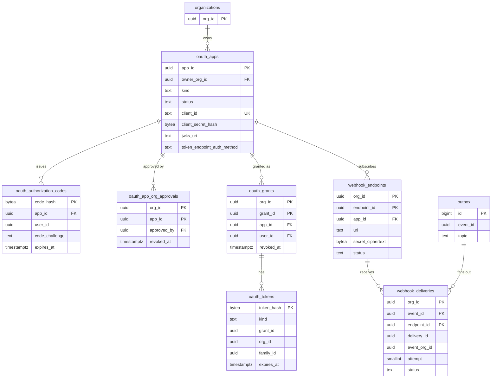

# Data model: 公開 API と Webhook

[data-model.md](../data-model.md) の一部。規約は、そちらの 2 節に従う。振る舞いは [api-and-webhooks.md](../api-and-webhooks.md)、[ADR-0043](../../decisions/0043-public-api-oauth-apps-and-rate-limits.md)、[ADR-0044](../../decisions/0044-signed-webhooks-standard-webhooks.md) を正とする。

- `oauth_apps`・`oauth_authorization_codes`・`oauth_tokens` は `global` スキーマ。`oauth_app_org_approvals`・`oauth_grants`・`webhook_endpoints`・`webhook_deliveries` はテナントの表。
- 認可サーバーは `identity` のモジュールの中にある（Better Auth の OAuth 2.1 の提供者のプラグインを使うかは E11 で確かめる。表はプラグインの形に合わせて見直す。[data-model.md](../data-model.md) の 10 節）。
- **Webhook の受け口と配送の記録は、アプリの持ち主の組織に属する**（[data-model.md](../data-model.md) の 11.2 節の 4）。許可した組織のイベントは、Worker が outbox から読んで配る。

## 1. ER 図

## 2. アプリとトークン

### oauth_apps（global）

OAuth のアプリ（開発者が作る）とサーバー間のアプリ（組織の `admin` が作る）。

| 列 | 型 | NULL | 既定 | 説明 |
| --- | --- | --- | --- | --- |
| `app_id` | `uuid` | NO | | 主キー |
| `owner_org_id` | `uuid` | NO | | 持ち主の組織。Webhook の受け口と配送の記録はこの組織に属する |
| `owner_user_id` | `uuid` | NO | | 作った人 |
| `kind` | `text` | NO | | `oauth` / `server` |
| `name` | `text` | NO | | 同意の画面に出す |
| `status` | `text` | NO | `'draft'` | `draft`（持ち主の組織だけ）/ `private`（許した組織だけ）/ `public`（審査の後、誰でも）/ `suspended` |
| `allowed_org_ids` | `uuid[]` | NO | `'{}'` | `private` のとき使える組織 |
| `client_id` | `text` | NO | | 公開の ID |
| `client_secret_hash` | `bytea` | YES | | `<brand>_cs_...` の SHA-256。入れ替えの間は `previous_client_secret_hash` にも持つ |
| `previous_client_secret_hash` | `bytea` | YES | | |
| `previous_secret_expires_at` | `timestamptz` | YES | | |
| `jwks_uri` | `text` | YES | | `private_key_jwt` のとき |
| `token_endpoint_auth_method` | `text` | NO | | `none`（PKCE の公開のクライアント）/ `client_secret_basic` / `private_key_jwt` |
| `redirect_uris` | `text[]` | NO | `'{}'` | 完全一致で比べる |
| `scopes` | `text[]` | NO | | 要求できるスコープ（[api-and-webhooks.md](../api-and-webhooks.md) の 4.3 節） |
| `created_at`、`updated_at` | `timestamptz` | NO | `now()` | |
| `deleted_at` | `timestamptz` | YES | | |

- 一意：`UNIQUE (client_id)`。
- 外部キー：`owner_org_id` → `organizations`。`owner_user_id` は列だけ（`global` からテナントの表へ張らない）。
- CHECK：`kind = 'server'` なら `redirect_uris = '{}'` かつ `token_endpoint_auth_method IN ('client_secret_basic', 'private_key_jwt')`。`kind = 'oauth'` なら `cardinality(redirect_uris) >= 1`。`token_endpoint_auth_method = 'private_key_jwt'` と `jwks_uri IS NOT NULL` は同値。
- 索引：`(owner_org_id)`（持ち主の画面）、`(status) WHERE status = 'public'`（公開のアプリの一覧）。
- 書く主体：`identity` のモジュールと開発者の画面。作成・秘密の入れ替え・削除は `admin_audit_events`（持ち主の組織）。
- 保持：論理削除の後 30 日で物理削除。関係するトークンはすぐに失効させる。
- S1 の規模：約 1,000 行。

### oauth_authorization_codes（global）

認可コード（PKCE の S256 が必須）。1 回限り、10 分。

| 列 | 型 | NULL | 既定 | 説明 |
| --- | --- | --- | --- | --- |
| `code_hash` | `bytea` | NO | | 主キー。コードの SHA-256 |
| `app_id` | `uuid` | NO | | |
| `user_id`、`org_id` | `uuid` | NO | | 同意した人とその組織 |
| `redirect_uri` | `text` | NO | | |
| `code_challenge` | `text` | NO | | S256 |
| `scopes` | `text[]` | NO | | |
| `expires_at` | `timestamptz` | NO | | 作成＋ 10 分 |
| `used_at` | `timestamptz` | YES | | 2 回目の使用で、同じコードから出したトークンを失効させる |
| `created_at` | `timestamptz` | NO | `now()` | |

- 外部キー：`app_id` → `oauth_apps`。
- 保持：期限から 1 日で物理削除。
- S1 の規模：数千行。

### oauth_app_org_approvals

組織の `admin` によるアプリの承認。組織の全体に効くスコープ（`:admin`）は、承認まで発行しない。

| 列 | 型 | NULL | 既定 | 説明 |
| --- | --- | --- | --- | --- |
| `org_id`、`app_id` | `uuid` | NO | | 主キー |
| `approved_scopes` | `text[]` | NO | | |
| `approved_by` | `uuid` | NO | | → `users`（`admin`） |
| `approved_at` | `timestamptz` | NO | `now()` | |
| `revoked_at` | `timestamptz` | YES | | 取り消しで、組織の許可とトークンを失効させる |

- 外部キー：`app_id` → `global.oauth_apps`、`(org_id, approved_by)` → `users`。
- 書く主体：API（`admin`）。変更は `admin_audit_events`。
- S1 の規模：約 1 万行。

### oauth_grants

利用者（OAuth のアプリ）か組織（サーバー間のアプリ）がアプリに与えた許可。トークンの系列のもと。

| 列 | 型 | NULL | 既定 | 説明 |
| --- | --- | --- | --- | --- |
| `org_id`、`grant_id` | `uuid` | NO | | 主キー |
| `app_id` | `uuid` | NO | | |
| `user_id` | `uuid` | YES | | OAuth のアプリの同意した人。サーバー間のアプリは NULL（組織が主体） |
| `scopes` | `text[]` | NO | | 同意したスコープ。`:admin` は `oauth_app_org_approvals.approved_scopes` との積 |
| `created_at` | `timestamptz` | NO | `now()` | |
| `revoked_at` | `timestamptz` | YES | | |

- 一意：`UNIQUE NULLS NOT DISTINCT (org_id, app_id, user_id) WHERE revoked_at IS NULL`。
- 外部キー：`app_id` → `global.oauth_apps`、`(org_id, user_id)` → `users`。
- 索引：`(org_id, app_id) WHERE revoked_at IS NULL`（Webhook の配り先の組織を決める。組織がアプリを許しているか）。
- Webhook の配り先：イベントの組織に、そのアプリの有効な許可があり、許可のスコープがイベントの資源を読めるときだけ配る（[api-and-webhooks.md](../api-and-webhooks.md) の 7.4 節）。
- 保持：取り消しから 30 日で物理削除（既定案）。
- S1 の規模：約 10 万行。

### oauth_tokens（global）

アクセストークン（1 時間）とリフレッシュトークン（90 日、使うたびに入れ替え）。不透明で、DB にはハッシュだけ。

| 列 | 型 | NULL | 既定 | 説明 |
| --- | --- | --- | --- | --- |
| `token_hash` | `bytea` | NO | | 主キー。SHA-256 |
| `kind` | `text` | NO | | `access` / `refresh` |
| `app_id` | `uuid` | NO | | |
| `grant_id` | `uuid` | NO | | 列だけ（テナントの表を指す） |
| `org_id` | `uuid` | NO | | 引いた後に設定する文脈 |
| `user_id` | `uuid` | YES | | |
| `family_id` | `uuid` | NO | | リフレッシュトークンの系列。古いものの再使用で系列ごと失効 |
| `last4` | `text` | NO | | ログと画面に出すのは接頭辞と末尾 4 文字だけ |
| `expires_at` | `timestamptz` | NO | | |
| `used_at` | `timestamptz` | YES | | リフレッシュトークンを入れ替えた時刻 |
| `revoked_at` | `timestamptz` | YES | | |
| `created_at` | `timestamptz` | NO | `now()` | |

- 外部キー：`app_id` → `oauth_apps`、`org_id` → `organizations`。
- 索引：`(family_id)`（系列ごとの失効）、`(grant_id)`（許可の取り消し）、`(expires_at)`（削除）。
- 検証：public-api は `token_hash` で引き、期限と失効を見て、`org_id` で文脈を設定し、`oauth_grants` を読み直す（取り消しがすぐ効く）。
- 保持：期限か失効から 30 日で物理削除（既定案）。
- S1 の規模：約 100 万行。

## 3. Webhook

### webhook_endpoints

Webhook の受け口。行はアプリの持ち主の組織に属する。1 つのアプリ・1 つの組織で 5 つまで（作るサービス関数で検査）。

| 列 | 型 | NULL | 既定 | 説明 |
| --- | --- | --- | --- | --- |
| `org_id`、`endpoint_id` | `uuid` | NO | | 主キー。`org_id` はアプリの持ち主の組織 |
| `app_id` | `uuid` | NO | | |
| `url` | `text` | NO | | `https` だけ。私的な IP に向く名前は登録と送るたびに拒否する |
| `events` | `text[]` | NO | | 受けるイベントの種類（[stores.md](stores.md) の 6.3 節） |
| `secret_ciphertext` | `bytea` | NO | | `whsec_...` の暗号文 |
| `previous_secret_ciphertext` | `bytea` | YES | | 入れ替えの 24 時間だけ。2 つの署名を付ける |
| `previous_secret_expires_at` | `timestamptz` | YES | | |
| `status` | `text` | NO | `'pending'` | `pending`（URL の確認の前）/ `active` / `disabled` |
| `validated_at` | `timestamptz` | YES | | |
| `next_validation_at` | `timestamptz` | YES | | 72 時間ごとの再確認 |
| `failing_since` | `timestamptz` | YES | | 最初の失敗から続く失敗の始まり。3 日で `disabled` |
| `disabled_at` | `timestamptz` | YES | | |
| `created_by` | `uuid` | NO | | |
| `created_at`、`updated_at` | `timestamptz` | NO | `now()` | |

- 外部キー：`app_id` → `global.oauth_apps`、`(org_id, created_by)` → `users`。
- CHECK：`url LIKE 'https://%'`、`status IN (...)`、`(previous_secret_ciphertext IS NULL) = (previous_secret_expires_at IS NULL)`。
- 索引：`(org_id, app_id)`（上限の検査、配送の宛先）、`(next_validation_at) WHERE status <> 'disabled'`（再確認のジョブ）。
- 書く主体：API（アプリの持ち主）、Worker（確認、失敗、停止）。
- S1 の規模：約 1,000 行。

### webhook_deliveries

1 つのイベントの 1 つの受け口への配送（I-19）。再送は同じ行の `attempt` を進める。`delivery_id` が `webhook-id` で、再送でも変わらない。

| 列 | 型 | NULL | 既定 | 説明 |
| --- | --- | --- | --- | --- |
| `org_id` | `uuid` | NO | | 受け口の組織（アプリの持ち主） |
| `event_id` | `uuid` | NO | | outbox のイベントの ID（`evt_`） |
| `endpoint_id` | `uuid` | NO | | |
| `delivery_id` | `uuid` | NO | | `webhook-id`（`msg_`） |
| `event_org_id` | `uuid` | NO | | イベントが起きた組織 |
| `event_type` | `text` | NO | | |
| `payload` | `jsonb` | NO | | 送った封筒（ID とメタデータだけ。[stores.md](stores.md) の 6.3 節）。送り直しに使う |
| `attempt` | `smallint` | NO | `0` | 最大 8（初回＋再送 7 回） |
| `status` | `text` | NO | `'pending'` | `pending` / `succeeded` / `failed`（再送を待つ）/ `gave_up`（再送を使い切った、か `4xx`） |
| `response_code` | `smallint` | YES | | |
| `error_code` | `text` | YES | | `timeout` / `connect_failed` / `tls` / `blocked_address`（本文は残さない） |
| `next_attempt_at` | `timestamptz` | YES | | |
| `created_at` | `timestamptz` | NO | `now()` | |
| `succeeded_at` | `timestamptz` | YES | | |

- 主キー：`(org_id, event_id, endpoint_id)`（I-19）。
- 外部キー：`(org_id, endpoint_id)` → `webhook_endpoints`。
- 索引：`(org_id, delivery_id)`（送り直しの API `POST /v1/webhooks/deliveries/{id}/redeliver`）、`(next_attempt_at) WHERE status = 'failed'`（再送のジョブ）、`(org_id, endpoint_id, created_at DESC)`（配送の一覧の画面）。
- 分割：`RANGE (event_id)`、1 日。
- 保持：7 日（[security.md](../security.md) の 9 節）。
- S1 の規模：1 日数十万行（`participant.*` を受けるアプリの数による）。
