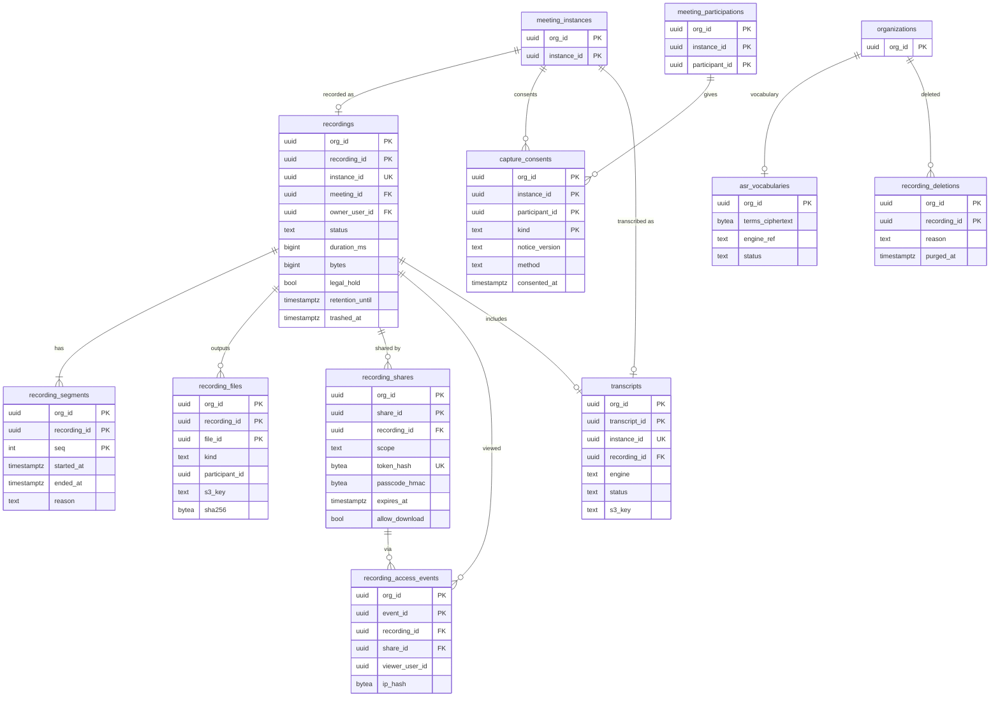

# Data model: 録画と文字起こし

[data-model.md](../data-model.md) の一部。規約は、そちらの 2 節に従う。振る舞いは [recording-and-transcription.md](../recording-and-transcription.md)、[ADR-0025](../../decisions/0025-recording-per-track-capture-and-offline-compose.md)、[ADR-0026](../../decisions/0026-asr-engine-amazon-transcribe-with-adapter.md)、[ADR-0027](../../decisions/0027-capture-consent-and-indicators.md) を正とする。

- すべてテナントの表（会議の組織）。
- 実体（生の区切り、成果物、文字起こし）は `media-prod` の S3（[stores.md](stores.md) の 3 節）。ここは索引と状態だけ。
- 録画の状態の正本は、会議の間は Actor（`off`・`starting`・`on`・`paused`・`stopping`・`failed`）。この表の `status` は、会議の後の処理を含む保存の状態で、別の列挙である。
- Recorder・Transcriber・Composer は Aurora に触れない。Actor（会議の間）と Worker（会議の後。Composer の結果は SQS `recording-events`）が書く（[data-model.md](../data-model.md) の 2.1 節）。

## 1. ER 図

## 2. 録画

### recordings

開催 1 回につき最大 1 つの録画の索引と保存の状態（I-17）。止めて始め直しても同じ行で、区間を `recording_segments` に持つ。

| 列 | 型 | NULL | 既定 | 説明 |
| --- | --- | --- | --- | --- |
| `org_id`、`recording_id` | `uuid` | NO | | 主キー |
| `meeting_id`、`instance_id` | `uuid` | NO | | |
| `owner_user_id` | `uuid` | NO | | 録画の持ち主（会議の主催者。ユーザーの削除で移す） |
| `started_by_participant_id` | `uuid` | NO | | 始めた主催者・共同主催者（自動の録画は主催者） |
| `status` | `text` | NO | `'recording'` | `recording` / `processing` / `completed` / `failed` / `compose_failed` / `trashed` |
| `started_at` | `timestamptz` | NO | | 最初の区間の開始 |
| `ended_at` | `timestamptz` | YES | | 最後の区間の終わり |
| `duration_ms` | `bigint` | YES | | 区間の合計 |
| `bytes` | `bigint` | NO | `0` | 成果物の合計（容量の計算） |
| `compose_attempts` | `smallint` | NO | `0` | 3 回で `compose_failed` |
| `legal_hold` | `boolean` | NO | `false` | 組織の管理者の「保全」。付いている間は消さない（I-15） |
| `legal_hold_by`、`legal_hold_at` | `uuid`、`timestamptz` | YES | | |
| `retention_until` | `timestamptz` | YES | | `completed` の時刻＋組織の `recording.retention_days`（既定 365 日）。無期限は NULL |
| `trashed_at` | `timestamptz` | YES | | ごみ箱に入れた時刻 |
| `trash_reason` | `text` | YES | | `user` / `retention` |
| `created_at`、`updated_at` | `timestamptz` | NO | `now()` | |

- 主キー：`(org_id, recording_id)`。一意：`UNIQUE (org_id, instance_id)`（I-17）。
- 外部キー：`(org_id, instance_id)` → `meeting_instances`（I-16 のため、録画がある間は開催の行を消さない）、`(org_id, meeting_id)` → `meetings`、`(org_id, owner_user_id)` → `users`。
- CHECK：`status IN (...)`、`status = 'trashed'` と `trashed_at IS NOT NULL` は同値、`bytes >= 0`。
- 索引：
  - `(org_id, owner_user_id, started_at DESC) WHERE status <> 'trashed'`：自分の録画の一覧（`GET /v1/users/{id}/recordings`、期間は 1 か月まで）。
  - `(org_id, retention_until) WHERE status = 'completed' AND NOT legal_hold`：期限のジョブ（ごみ箱へ）。
  - `(org_id, trashed_at) WHERE status = 'trashed' AND NOT legal_hold`：30 日を過ぎたものの完全な削除。
  - `(org_id) INCLUDE (bytes) WHERE status IN ('processing', 'completed', 'trashed')`：組織の保存の容量（開始の判定の 4 行目）。
- 書く主体：Actor（作成・`recording` の間。2.10 節の形）、Worker（`processing` 以降、成果物の登録、期限、ごみ箱、削除）、API（主催者・管理者のごみ箱・戻す・保全）。
- 状態の遷移と outbox：`completed` への更新と同じトランザクションで `recording.completed` を outbox に書く（Webhook と通知）。
- 削除：ごみ箱（30 日）の後、S3 の `final/`・`transcripts/` の実体（バージョンを含む）と、この行と子の行を消し、`recording_deletions` に記録する。
- 保持：組織の設定（既定 365 日）＋ごみ箱 30 日（[security.md](../security.md) の 9 節）。L6・L8 で見直す。
- S1 の規模：開催の 10% として 1 日約 4,000 行、1 年で約 150 万行。

### recording_segments

録画の区間。開始・再開・欠け（Recorder の障害）ごとに 1 行。

| 列 | 型 | NULL | 既定 | 説明 |
| --- | --- | --- | --- | --- |
| `org_id`、`recording_id` | `uuid` | NO | | |
| `seq` | `integer` | NO | | 1 から |
| `started_at` | `timestamptz` | NO | | |
| `ended_at` | `timestamptz` | YES | | 一時停止・停止・欠けの始まりで閉じる |
| `reason` | `text` | NO | | `start` / `resume` / `gap`（欠けの後の再開） |

- 主キー：`(org_id, recording_id, seq)`。
- 外部キー：`(org_id, recording_id)` → `recordings`（`ON DELETE CASCADE`）。
- 書く主体：Actor（2.10 節の形）。
- S1 の規模：録画の約 2 倍。

### recording_files

録画の成果物。

| 列 | 型 | NULL | 既定 | 説明 |
| --- | --- | --- | --- | --- |
| `org_id`、`recording_id`、`file_id` | `uuid` | NO | | 主キー |
| `kind` | `text` | NO | | `speaker_share` / `gallery` / `audio` / `audio_per_participant` / `chat` / `transcript_vtt` / `transcript_json` |
| `participant_id` | `uuid` | YES | | `audio_per_participant` だけ |
| `s3_key` | `text` | NO | | `final/{org}/{recording_id}/...`（[stores.md](stores.md) の 3 節） |
| `content_type` | `text` | NO | | `video/mp4`・`audio/mp4`・`text/plain`・`text/vtt`・`application/json` |
| `bytes` | `bigint` | NO | | |
| `duration_ms` | `bigint` | YES | | |
| `sha256` | `bytea` | NO | | 成果物の SHA-256 |
| `created_at` | `timestamptz` | NO | `now()` | |

- 一意：`UNIQUE NULLS NOT DISTINCT (org_id, recording_id, kind, participant_id)`。
- 外部キー：`(org_id, recording_id)` → `recordings`（`ON DELETE CASCADE`）。
- CHECK：`(kind = 'audio_per_participant') = (participant_id IS NOT NULL)`。
- 書く主体：Worker（Composer の結果から）。
- 署名付きの URL（10 分）は、API がこの行の `s3_key` から出す。本文では返さない。
- S1 の規模：録画の約 4 倍、1 年で約 600 万行。

### recording_shares

録画の共有。

| 列 | 型 | NULL | 既定 | 説明 |
| --- | --- | --- | --- | --- |
| `org_id`、`share_id` | `uuid` | NO | | 主キー |
| `recording_id` | `uuid` | NO | | |
| `scope` | `text` | NO | | `org`（組織の中）/ `link`（組織の外。組織の設定 `recording.external_share` で許したときだけ）。主催者だけの状態は行を作らない |
| `token_hash` | `bytea` | YES | | `link` のトークン（128 ビット）の SHA-256 |
| `passcode_hmac` | `bytea` | YES | | `link` のパスコード（必須）の HMAC |
| `passcode_pepper_version` | `smallint` | YES | | |
| `expires_at` | `timestamptz` | YES | | `link` は既定 7 日、最長 90 日 |
| `allow_download` | `boolean` | NO | `false` | |
| `created_by` | `uuid` | NO | | |
| `created_at` | `timestamptz` | NO | `now()` | |
| `revoked_at` | `timestamptz` | YES | | |

- 一意：`UNIQUE (token_hash)`。
- 外部キー：`(org_id, recording_id)` → `recordings`（`ON DELETE CASCADE`）、`(org_id, created_by)` → `users`。
- CHECK：`scope = 'link'` なら `token_hash`・`passcode_hmac`・`expires_at` が NULL でなく、`expires_at <= created_at + interval '90 days'`。`scope = 'org'` なら `token_hash IS NULL`。
- リンクの入口：`/rec/share/<token>` は `resolve_recording_share(token_hash)` で組織を引く。パスコードの誤りは Valkey の `rl:share:*` で数える。
- S1 の規模：約 50 万行。

### recording_access_events

再生・ダウンロードの記録（誰が、いつ）。主催者と管理者が見る。

| 列 | 型 | NULL | 既定 | 説明 |
| --- | --- | --- | --- | --- |
| `org_id`、`event_id` | `uuid` | NO | | 主キー |
| `recording_id` | `uuid` | NO | | |
| `share_id` | `uuid` | YES | | リンクで見たとき |
| `viewer_user_id` | `uuid` | YES | | ログインして見たとき（他の組織のユーザーも入る。外部キーなし） |
| `file_kind` | `text` | NO | | 見た成果物の種類 |
| `action` | `text` | NO | | `play` / `download` |
| `ip_hash` | `bytea` | YES | | リンクで見た人の IP の HMAC（生の IP は持たない） |
| `ip_pepper_version` | `smallint` | YES | | |
| `at` | `timestamptz` | NO | `now()` | |

- 外部キー：`(org_id, recording_id)` → `recordings`（`ON DELETE CASCADE`）。
- 索引：`(org_id, recording_id, at DESC)`（録画の再生の記録の画面）。
- 分割：`RANGE (event_id)`、1 か月。
- 保持：12 か月（既定案。L8 で確定。[security.md](../security.md) の 9 節）。
- S1 の規模：年に約 1,000 万行。

### recording_deletions

消した録画の記録（誰が、いつ、理由）。中身は残さない。録画の行を消した後も残るので、外部キーを持たない。

| 列 | 型 | NULL | 既定 | 説明 |
| --- | --- | --- | --- | --- |
| `org_id`、`recording_id` | `uuid` | NO | | 主キー |
| `meeting_id`、`instance_id` | `uuid` | NO | | |
| `deleted_by` | `uuid` | YES | | ごみ箱に入れた人。期限なら NULL |
| `deleted_at` | `timestamptz` | NO | | ごみ箱に入れた時刻 |
| `reason` | `text` | NO | | `user` / `retention` / `admin_purge`（管理者のすぐの完全な削除） |
| `purged_at` | `timestamptz` | YES | | S3 から消した時刻 |

- 書く主体：Worker・API。
- 保持：7 年（既定案。監査ログと同じ期間。L8 で確定）。組織の削除では消す。
- S1 の規模：年に約 150 万行。

## 3. 同意

### capture_consents

録画・文字起こしへの本人の同意（[ADR-0027](../../decisions/0027-capture-consent-and-indicators.md)）。Aurora に書けてから配り、購読に足す（I-5、I-11）。

| 列 | 型 | NULL | 既定 | 説明 |
| --- | --- | --- | --- | --- |
| `org_id`、`instance_id`、`participant_id` | `uuid` | NO | | |
| `kind` | `text` | NO | | `recording` / `transcription` |
| `notice_version` | `text` | NO | | 表示した文言（音声の案内を含む）のバージョン |
| `method` | `text` | NO | | `ui`（同意の画面）/ `dtmf`（電話の 1）/ `start_action`（録画を始めた本人） |
| `consented_at` | `timestamptz` | NO | `now()` | |

- 主キー：`(org_id, instance_id, participant_id, kind)`。
- 外部キー：`(org_id, instance_id)` → `meeting_instances`。参加の行（12 か月で消える）には張らない（録画が残る間は同意も残すため。I-16）。
- 書く主体：Actor（`consent.give`、録画・字幕の開始。2.10 節の形）。
- 保持：開催と同じ（12 か月。録画・文字起こしが残る間は残す）。L3 で見直す。
- S1 の規模：録画・字幕のある開催の参加者の数。年に約 1,000 万行。

## 4. 文字起こし

### transcripts

開催 1 回につき最大 1 つの文字起こし（ライブ字幕の確定した結果か、録画からの batch）。

| 列 | 型 | NULL | 既定 | 説明 |
| --- | --- | --- | --- | --- |
| `org_id`、`transcript_id` | `uuid` | NO | | 主キー |
| `instance_id` | `uuid` | NO | | |
| `recording_id` | `uuid` | YES | | 録画があれば。成果物は `recording_files` にも入る |
| `source` | `text` | NO | | `live`（字幕）/ `batch`（録画から） |
| `engine`、`engine_version` | `text` | NO | | `transcribe-streaming`・`2026-09` など（ASR Adapter の名前） |
| `language` | `text` | NO | `'ja-JP'` | |
| `status` | `text` | NO | | `live` / `processing` / `completed` / `failed` / `trashed` |
| `s3_key` | `text` | YES | | 確定した JSON（`transcripts/{org}/{instance_id}/transcript.json`） |
| `retention_until` | `timestamptz` | YES | | 録画があれば録画と同じ。なければ組織の設定 |
| `trashed_at` | `timestamptz` | YES | | |
| `created_at` | `timestamptz` | NO | `now()` | |
| `completed_at` | `timestamptz` | YES | | |

- 一意：`UNIQUE (org_id, instance_id)`（I-17）。
- 外部キー：`(org_id, instance_id)` → `meeting_instances`、`(org_id, recording_id)` → `recordings`。
- 索引：`(org_id, retention_until) WHERE status = 'completed'`。
- 書く主体：Actor（字幕の開始で `live`。2.10 節の形）、Worker（会議の後）。
- 保持：録画と同じ。録画がなければ組織の設定（[security.md](../security.md) の 9 節）。
- S1 の規模：年に約 100 万行。

### asr_vocabularies

組織の固有名詞の語彙。ASR Adapter がエンジンのカスタム語彙に写す。

| 列 | 型 | NULL | 既定 | 説明 |
| --- | --- | --- | --- | --- |
| `org_id` | `uuid` | NO | | 主キー（1 組織 1 つ） |
| `terms_ciphertext` | `bytea` | NO | | 語の一覧の暗号文 |
| `engine_ref` | `text` | YES | | エンジンの中の語彙の名前 |
| `status` | `text` | NO | `'pending'` | `pending` / `ready` / `failed` |
| `updated_by` | `uuid` | NO | | |
| `updated_at` | `timestamptz` | NO | `now()` | |

- 保持：組織が消すまで。
- S1 の規模：約 1 万行。
