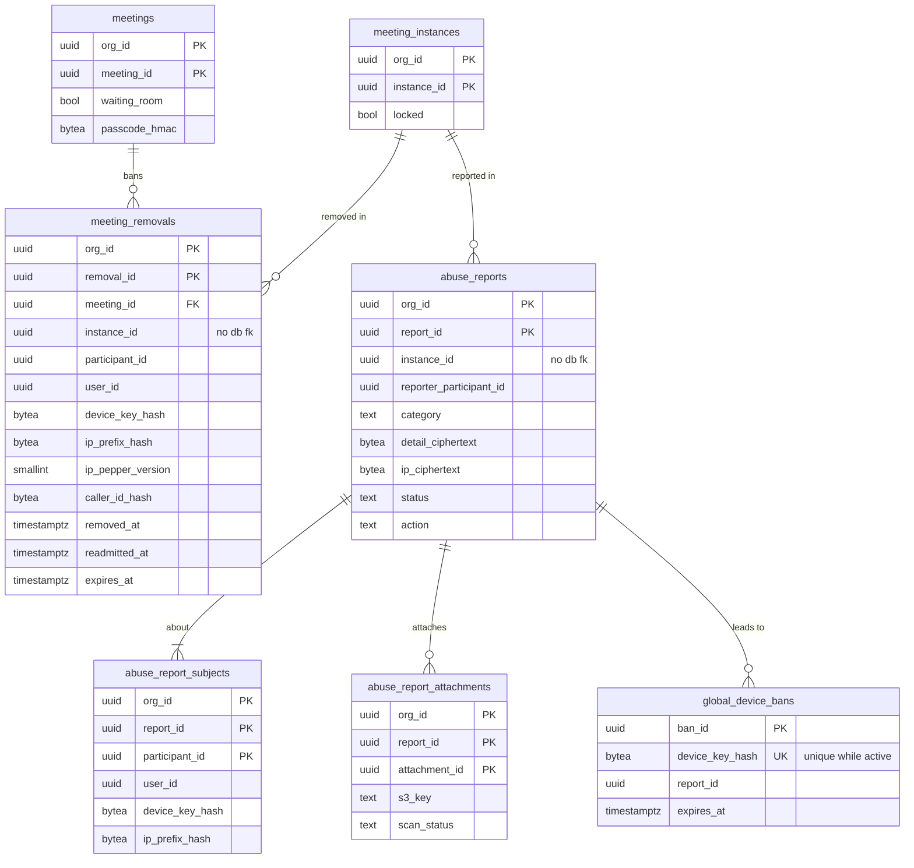

# Data model: 会議の安全

[data-model.md](../data-model.md) の一部。規約は、そちらの 2 節に従う。振る舞いは [meeting-security.md](../meeting-security.md)、[ADR-0031](../../decisions/0031-waiting-room-and-passcode-rules.md)、[ADR-0032](../../decisions/0032-removal-ban-suspend-and-reports.md)、[ADR-0033](../../decisions/0033-join-rate-limits-and-enumeration-defense.md) を正とする。

- 待合室とパスコードの列は `meetings`（[scheduling.md](scheduling.md)）、ロックと待合室の状態は `meeting_instances`（[meeting-runtime.md](meeting-runtime.md)）にある。
- 流量の制限とパスコードの誤りの数は Valkey（[stores.md](stores.md) の 2 節）。
- `global_device_bans` は `global` スキーマ。その他はテナントの表（会議の組織）。
- Trust & Safety の画面は `ts_operator`（`BYPASSRLS`）で組織をまたいで読む。使ったことを `platform_audit_events` に残す。

## 1. ER 図

## 2. 退出させた人

### meeting_removals

主催者・共同主催者の `host.remove` で書く ban。同じ `meeting_id`（繰り返しの会議と PMI の別の回を含む）に効く。Actor が書けてから `ack` と `you.removed` を送る（I-4、I-5）。

| 列 | 型 | NULL | 既定 | 説明 |
| --- | --- | --- | --- | --- |
| `org_id`、`removal_id` | `uuid` | NO | | 主キー |
| `meeting_id` | `uuid` | NO | | ban の範囲 |
| `instance_id` | `uuid` | NO | | 退出させた開催 |
| `participant_id` | `uuid` | NO | | 退出させた参加者 |
| `display_name` | `text` | NO | | 主催者の「退出させた人」の一覧に出す |
| `user_id` | `uuid` | YES | | ログインしていた人（他の組織のユーザーも入る。外部キーは張らない） |
| `device_key_hash` | `bytea` | YES | | ゲストの端末の鍵の HMAC |
| `ip_prefix_hash` | `bytea` | YES | | ゲストの回線の HMAC。一致しても拒否せず、待合室に回して印を付ける |
| `ip_pepper_version` | `smallint` | YES | | `ip_prefix_hash` を計算した pepper のバージョン。照合は今と前の pepper の両方で行う |
| `caller_id_hash` | `bytea` | YES | | 電話の参加者の発信者の番号の HMAC（[telephony.md](telephony.md)） |
| `removed_by_participant_id` | `uuid` | NO | | |
| `removed_at` | `timestamptz` | NO | `now()` | |
| `readmitted_at` | `timestamptz` | YES | | `host.readmit`。失ってはならない変更 |
| `readmitted_by_participant_id` | `uuid` | YES | | |
| `expires_at` | `timestamptz` | NO | | 最後の開催の終了＋ 30 日。開催が終わるたびに延ばす |

- 主キー：`(org_id, removal_id)`。
- 外部キー：`(org_id, meeting_id)` → `meetings`。`instance_id` は列だけ（開催の行は 12 か月で消えるが、ban は最後の開催から 30 日で消えるので、先に開催の行が消えることはない。念のため外部キーを張らない）。
- CHECK：`user_id`・`device_key_hash`・`caller_id_hash` の少なくとも 1 つが NULL でない（`ip_prefix_hash` だけの ban は作らない）。`(ip_prefix_hash IS NULL) = (ip_pepper_version IS NULL)`。
- 索引：
  - `(org_id, meeting_id) WHERE readmitted_at IS NULL`：Actor が開催の開始と回復で、会議の有効な ban をすべて読む（1 会議で多くても数十行）。
  - `(expires_at)`：削除のジョブ。
- 書く主体：Actor（`host.remove`・`host.readmit`。2.10 節の形）。Worker（開催の終了で `expires_at` を延ばす：`UPDATE ... SET expires_at = :ended_at + 30 日 WHERE meeting_id = :m AND readmitted_at IS NULL`）。
- 会議を作り直した（別の `meeting_id`）とき、ban は引き継がない。PMI の作り直しは同じ `meeting_id` なので引き継ぐ（[scheduling.md](scheduling.md) の `personal_meeting_ids`）。
- 保持：`expires_at` で物理削除（最後の開催から 30 日。[security.md](../security.md) の 9 節）。
- S1 の規模：常に数万行。

## 3. 報告

### abuse_reports

会議の参加者（ゲストを含む）が送る荒らしの報告。運営の Trust & Safety の待ち行列に入る。行は会議の組織に属する。

| 列 | 型 | NULL | 既定 | 説明 |
| --- | --- | --- | --- | --- |
| `org_id`、`report_id` | `uuid` | NO | | 主キー |
| `instance_id` | `uuid` | NO | | |
| `reporter_participant_id` | `uuid` | NO | | |
| `reporter_user_id` | `uuid` | YES | | ログインしていた人 |
| `reporter_device_key_hash` | `bytea` | YES | | ゲスト |
| `category` | `text` | NO | | `harassment` / `sexual_content` / `violence` / `spam` / `impersonation` / `other` |
| `detail_ciphertext` | `bytea` | YES | | 報告の本文（2,000 文字まで）の暗号文 |
| `context` | `jsonb` | NO | | サーバーが自動で添えた、報告した人の項目（表示の名前、参加・退出の時刻、ASN、参加のしかた）。会議の音声・映像・チャットの本文は入れない |
| `ip_ciphertext` | `bytea` | YES | | 報告した人と対象の人の生の IP の暗号文（Trust & Safety の対処のためだけ） |
| `ip_ciphertext_expires_at` | `timestamptz` | YES | | 作成＋ 90 日。過ぎたら `ip_ciphertext` を NULL にする |
| `status` | `text` | NO | `'new'` | `new` / `in_review` / `actioned` / `dismissed` |
| `action` | `text` | YES | | `none` / `account_suspended` / `device_banned` / `hosting_suspended`（複数は `platform_audit_events` に残す。ここは主なもの） |
| `assigned_to` | `text` | YES | | 担当の運用者の ID |
| `created_at` | `timestamptz` | NO | `now()` | |
| `resolved_at` | `timestamptz` | YES | | |

- 外部キー：張らない（`instance_id` は列だけ）。報告は会議の後に届くので、開催の行（12 か月）より後まで残りうる。
- CHECK：`category IN (...)`、`status IN (...)`、`(ip_ciphertext IS NULL) OR (ip_ciphertext_expires_at IS NOT NULL)`、`reporter_user_id` と `reporter_device_key_hash` の少なくとも 1 つ。
- 索引：`(status, created_at) WHERE status IN ('new', 'in_review')`（Trust & Safety の待ち行列。`ts_operator` が組織をまたいで読む）、`(org_id, instance_id)`（組織の管理者の「安全」のレポートの件数）、`(ip_ciphertext_expires_at) WHERE ip_ciphertext IS NOT NULL`。
- 書く主体：API（報告。1 人 1 会議 5 件は Valkey の `rl:report:*`）、`ts_operator`（状態と対処）。
- 保持：1 年。`ip_ciphertext` は 90 日（[ADR-0046](../../decisions/0046-audit-logs-and-data-lifecycle.md)）。開示の請求の扱いは L8、保持は L4・L8 で確定する。
- S1 の規模：年に約 10 万行。

### abuse_report_subjects

報告の対象の参加者（1 件の報告で複数）。サーバーが `meeting_participations` から写す。

| 列 | 型 | NULL | 既定 | 説明 |
| --- | --- | --- | --- | --- |
| `org_id`、`report_id`、`participant_id` | `uuid` | NO | | 主キー |
| `display_name` | `text` | NO | | |
| `user_id` | `uuid` | YES | | |
| `device_key_hash` | `bytea` | YES | | |
| `ip_prefix_hash` | `bytea` | YES | | |
| `ip_pepper_version` | `smallint` | YES | | |
| `caller_id_hash` | `bytea` | YES | | |
| `asn` | `integer` | YES | | |
| `client_kind` | `text` | NO | | |
| `joined_at`、`left_at` | `timestamptz` | YES | | |

- 外部キー：`(org_id, report_id)` → `abuse_reports`（`ON DELETE CASCADE`）。
- 索引：`(device_key_hash) WHERE device_key_hash IS NOT NULL`（Trust & Safety が同じ端末の報告を集める。`ts_operator`）。
- S1 の規模：報告の 1.2 倍程度。

### abuse_report_attachments

報告した人が自分の端末で撮って付けた画面の画像（3 枚まで、各 5 MB）。受けてよいかは L2 の結論に従う（それまで E3 の報告の Story の spec を承認しない）。

| 列 | 型 | NULL | 既定 | 説明 |
| --- | --- | --- | --- | --- |
| `org_id`、`report_id`、`attachment_id` | `uuid` | NO | | 主キー |
| `s3_key` | `text` | NO | | `reports/{org}/{report_id}/{attachment_id}` |
| `content_type` | `text` | NO | | `image/png` / `image/jpeg` / `image/webp` |
| `size_bytes` | `bigint` | NO | | 5 MB まで |
| `scan_status` | `text` | NO | `'pending'` | `pending` / `clean` / `infected` / `failed`（チャットのファイルと同じ検査） |
| `created_at` | `timestamptz` | NO | `now()` | |

- 外部キー：`(org_id, report_id)` → `abuse_reports`（`ON DELETE CASCADE`）。
- CHECK：`size_bytes BETWEEN 1 AND 5242880`、`content_type IN (...)`。3 枚までは作るサービス関数で検査する。
- 保持：報告と同じ（1 年）。S3 の実体も同時に消す。

## 4. 全体の ban

### global_device_bans（global）

Trust & Safety が報告への対処で置く、端末の鍵の全体の ban（90 日）。どの組織の会議にも効く。

| 列 | 型 | NULL | 既定 | 説明 |
| --- | --- | --- | --- | --- |
| `ban_id` | `uuid` | NO | | 主キー |
| `device_key_hash` | `bytea` | NO | | |
| `reason` | `text` | NO | | 報告の `category` か `other` |
| `report_id` | `uuid` | YES | | もとの報告（列だけ。`global` からテナントの表へ外部キーを張らない） |
| `report_org_id` | `uuid` | YES | | もとの報告の組織 |
| `created_by` | `text` | NO | | 運用者の ID |
| `created_at` | `timestamptz` | NO | `now()` | |
| `expires_at` | `timestamptz` | NO | | 作成＋ 90 日 |
| `lifted_at` | `timestamptz` | YES | | 早めの解除 |

- 一意：`UNIQUE (device_key_hash) WHERE lifted_at IS NULL`。
- 索引：一意の索引（参加の API がトークンを出す前に引く。期限は `expires_at > now()` で見る）、`(expires_at)`（削除のジョブ）。
- 書く主体：`ts_operator`。操作は `platform_audit_events`。
- 保持：`expires_at` から 30 日で物理削除（既定案）。
- S1 の規模：数千行。
