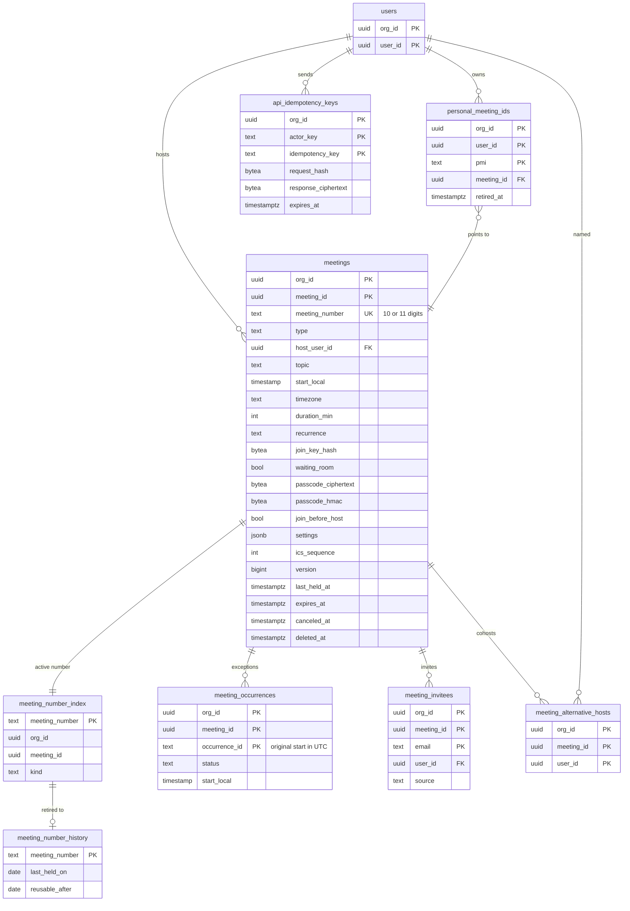
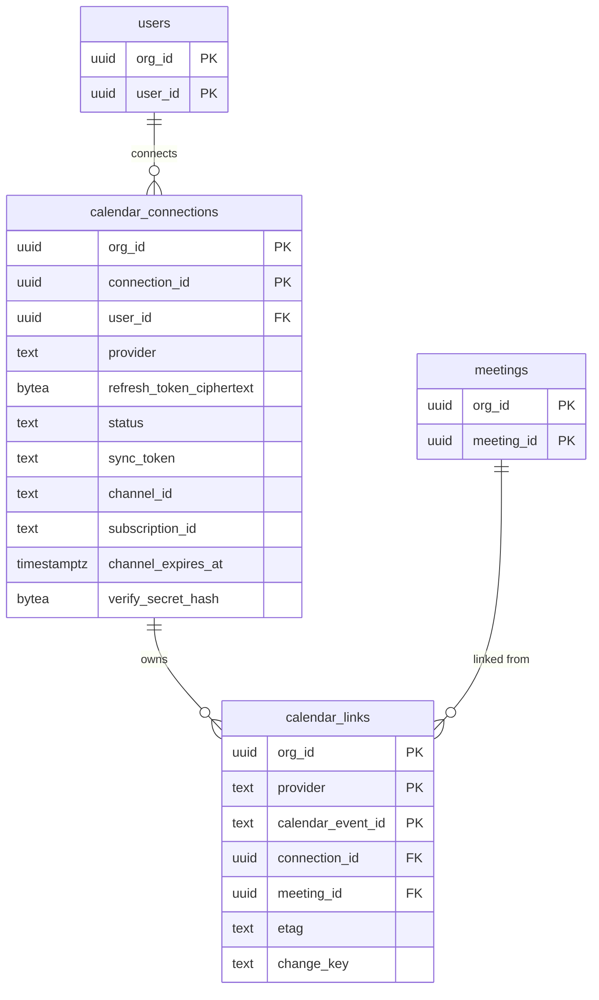

# Data model: 会議と予定

[data-model.md](../data-model.md) の一部。規約は、そちらの 2 節に従う。振る舞いは [signaling-and-meetings.md](../signaling-and-meetings.md) の 4 節、[meeting-security.md](../meeting-security.md) の 3〜4 節、[scheduling-and-calendar.md](../scheduling-and-calendar.md)、[ADR-0006](../../decisions/0006-meeting-id-and-join-url.md)、[ADR-0031](../../decisions/0031-waiting-room-and-passcode-rules.md)、[ADR-0034](../../decisions/0034-scheduled-recurring-meetings-and-pmi.md)、[ADR-0035](../../decisions/0035-calendar-integration-add-ons-and-oauth.md) を正とする。

- `meeting_number_index`・`meeting_number_history` は `global` スキーマ。`app` のロールは直接読めず、関数（[data-model.md](../data-model.md) の 2.3.2 節）だけを呼ぶ。
- その他はテナントの表（`org_id`、複合キー、FORCE RLS）。

## 1. ER 図

### 1.1 会議、番号、予定

### 1.2 カレンダーの連携

## 2. 会議

### meetings

会議の行。すぐの会議、予定の会議、繰り返しの会議、時刻の決まっていない繰り返しの会議、PMI の会議のすべて。開催（`meeting_instances`）はこの行から作る。

| 列 | 型 | NULL | 既定 | 説明 |
| --- | --- | --- | --- | --- |
| `org_id`、`meeting_id` | `uuid` | NO | | 主キー |
| `meeting_number` | `text` | NO | | 11 桁（PMI は 10 桁）。先頭は 1〜9。`allocate_meeting_number` で割り当てる |
| `type` | `text` | NO | | `instant` / `scheduled` / `recurring` / `recurring_no_fixed_time` / `pmi` |
| `host_user_id` | `uuid` | NO | | 主催者（作った人か、移された人） |
| `topic` | `text` | NO | | 題名。200 文字まで。組織の外の人の待合室には既定で出さない |
| `start_local` | `timestamp` | YES | | 予定の現地の時刻（秒まで、タイムゾーンなし）。`scheduled`・`recurring` だけ |
| `timezone` | `text` | YES | | IANA の名前。`start_local` と組 |
| `duration_min` | `integer` | YES | | 予定の長さ |
| `recurrence` | `text` | YES | | RRULE の文字列。受ける項目は [scheduling-and-calendar.md](../scheduling-and-calendar.md) の 4.2 節。`UNTIL` は UTC |
| `join_key_hash` | `bytea` | NO | | 参加の鍵（128 ビット）の SHA-256 |
| `join_key_rotated_at` | `timestamptz` | NO | `now()` | 主催者が「URL を作り直す」を行った時刻 |
| `waiting_room` | `boolean` | NO | `true` | 解決した値（会議の階層） |
| `passcode_ciphertext` | `bytea` | YES | | パスコードの暗号文（主催者と管理者の表示用） |
| `passcode_hmac` | `bytea` | YES | | `HMAC-SHA256(pepper, meeting_id ‖ passcode)`。照合用 |
| `passcode_pepper_version` | `smallint` | YES | | `passcode_hmac` の pepper の版 |
| `phone_passcode_ciphertext`、`phone_passcode_hmac` | `bytea` | YES | | 英数字のパスコードの会議の、電話用の数字のパスコード（[telephony.md](../telephony.md) の 4.2 節） |
| `join_before_host` | `boolean` | NO | `false` | 主催者の前に入れる。待合室が無効な会議でだけ真にできる |
| `bypass` | `jsonb` | NO | `'{}'` | 待合室を省く条件（`org`・`domains`・`invitees`）。解決した値 |
| `show_topic_in_waiting_room` | `boolean` | NO | `false` | |
| `settings` | `jsonb` | NO | `'{}'` | 会議の階層の設定の値。平らなオブジェクトで、キーは `settingsRegistry` の名前（`e2ee.enabled`、`meeting.share`、`meeting.allow_rename`、`meeting.allow_self_unmute`、`chat.mode`、`recording.auto`、`captions.auto` など。[data-model.md](../data-model.md) の 7 節）。解決の前の、主催者が選んだ値 |
| `ics_sequence` | `integer` | NO | `0` | iCalendar の `SEQUENCE`。予定を変えるたびに 1 上げる |
| `version` | `bigint` | NO | `1` | 行を変えるたびに 1 上げる。Webhook の `meeting.*` の `version` |
| `last_held_at` | `timestamptz` | YES | | 最後の開催の終了。開催の終了で Worker が更新する |
| `expires_at` | `timestamptz` | YES | | `recurring_no_fixed_time`・`pmi` だけ。`last_held_at`（なければ作成の時刻）＋ 365 日。開催の終了で延ばす |
| `canceled_at` | `timestamptz` | YES | | 予定の取り消し（カレンダーで予定を消した場合も）。行は残す |
| `deleted_at` | `timestamptz` | YES | | 主催者が消した |
| `created_at`、`updated_at` | `timestamptz` | NO | `now()` | |

- 主キー：`(org_id, meeting_id)`。
- 一意：`UNIQUE (meeting_number) WHERE deleted_at IS NULL`（全体で一意。I-7）。
- 外部キー：`(org_id, host_user_id)` → `users`。
- CHECK：
  - `waiting_room OR passcode_hmac IS NOT NULL`（I-3。[ADR-0031](../../decisions/0031-waiting-room-and-passcode-rules.md)）。
  - `type <> 'pmi' OR waiting_room`（PMI は待合室が常に有効）。
  - `NOT (join_before_host AND waiting_room)`。
  - `meeting_number ~ '^[1-9][0-9]{10}$'`（`type <> 'pmi'`）、`meeting_number ~ '^[1-9][0-9]{9}$'`（`type = 'pmi'`）。
  - `(passcode_ciphertext IS NULL) = (passcode_hmac IS NULL)`、`(passcode_hmac IS NULL) = (passcode_pepper_version IS NULL)`。
  - `type IN ('scheduled', 'recurring')` と `start_local IS NOT NULL AND timezone IS NOT NULL` は同値。`type = 'recurring'` と `recurrence IS NOT NULL` は同値。
  - `NOT (coalesce((settings ->> 'e2ee.enabled')::boolean, false) AND settings ->> 'recording.auto' = 'cloud')`（I-12。[ADR-0027](../../decisions/0027-capture-consent-and-indicators.md)）。
- 索引：
  - `(org_id, host_user_id, created_at DESC) WHERE deleted_at IS NULL`：自分の会議の一覧（`GET /v1/users/{id}/meetings`）。
  - `(org_id, expires_at) WHERE expires_at IS NOT NULL AND deleted_at IS NULL`：期限切れのジョブ。
  - `(org_id, deleted_at) WHERE deleted_at IS NOT NULL`：物理削除のジョブ。
- 書く主体：API・public-api・カレンダーの Worker。すべて `resolveSettings` → `assertJoinGuard` を通す 1 つのサービス関数（`saveMeeting`）で書く。Actor はこの表を書かない（`last_held_at` は Worker）。
- 番号：作成と同じトランザクションで `allocate_meeting_number` を呼び、`meeting_number_index` に行を作る。
- 削除：論理削除。`deleted_at` を設定し、`retire_meeting_number` で番号を `meeting_number_history` へ移す。行は、開催の行がなくなった後（12 か月）に物理削除する。
- 保持：主催者が消すまで。時刻の決まっていない会議は `expires_at` で論理削除する（[security.md](../security.md) の 9 節）。
- S1 の規模：約 1,000 万行（1 年）。

### meeting_number_index（global）

番号 → 会議の索引。参加の API と IVR の最初の引き。中身（題名など）を持たない。

| 列 | 型 | NULL | 既定 | 説明 |
| --- | --- | --- | --- | --- |
| `meeting_number` | `text` | NO | | 主キー |
| `org_id` | `uuid` | NO | | |
| `meeting_id` | `uuid` | NO | | |
| `kind` | `text` | NO | | `meeting`（11 桁）/ `pmi`（10 桁） |
| `created_at` | `timestamptz` | NO | `now()` | |

- 主キー：`(meeting_number)`（I-7）。一意：`UNIQUE (meeting_id)`。
- 外部キー：`org_id` → `organizations`。`meeting_id` は列だけ（`global` からテナントの表へ張らない）。
- 読む・書く：`number_resolver` の関数だけ。
- S1 の規模：約 1,000 万行。

### meeting_number_history（global）

使わなくなった番号。最後の開催から 2 年は再び使わない。

| 列 | 型 | NULL | 既定 | 説明 |
| --- | --- | --- | --- | --- |
| `meeting_number` | `text` | NO | | 主キー |
| `kind` | `text` | NO | | `meeting` / `pmi` |
| `retired_at` | `timestamptz` | NO | `now()` | |
| `last_held_on` | `date` | YES | | 最後の開催の日（開催がなければ予定の日か作成の日） |
| `reusable_after` | `date` | NO | | `last_held_on + 2 年` |

- 割り当ての規則：番号は、`meeting_number_index` になく、`meeting_number_history` にないか `reusable_after <= today` のときだけ使える。使ったら、この表の行を消して `meeting_number_index` に移す。
- 保持：`reusable_after` を過ぎた行は、そのまま残してよい（割り当ての判定が同じになる）。1 年ごとに `reusable_after` の過ぎた行を消す。
- S1 の規模：年に数百万行。

## 3. 予定

### meeting_occurrences

繰り返しの会議の、回ごとの例外。変更と取り消しのときだけ作る（[ADR-0034](../../decisions/0034-scheduled-recurring-meetings-and-pmi.md)）。

| 列 | 型 | NULL | 既定 | 説明 |
| --- | --- | --- | --- | --- |
| `org_id`、`meeting_id` | `uuid` | NO | | |
| `occurrence_id` | `text` | NO | | その回の元の開始の UTC（`YYYYMMDDTHHMMSSZ`）。時刻を変えても変えない |
| `status` | `text` | NO | | `modified` / `canceled` |
| `start_local` | `timestamp` | YES | | 変えた開始（会議の `timezone`） |
| `duration_min` | `integer` | YES | | |
| `topic` | `text` | YES | | |
| `created_at`、`updated_at` | `timestamptz` | NO | `now()` | |

- 主キー：`(org_id, meeting_id, occurrence_id)`。
- 外部キー：`(org_id, meeting_id)` → `meetings`（`ON DELETE CASCADE`）。
- CHECK：`occurrence_id ~ '^[0-9]{8}T[0-9]{6}Z$'`。`status = 'canceled'` なら `start_local`・`duration_min`・`topic` は NULL。
- 索引：主キー（回の計算で会議の例外をまとめて読む）。
- S1 の規模：約 50 万行。

### meeting_invitees

招待の一覧。招待のメールと、待合室を省く条件（「招待したアカウント」）に使う。

| 列 | 型 | NULL | 既定 | 説明 |
| --- | --- | --- | --- | --- |
| `org_id`、`meeting_id` | `uuid` | NO | | |
| `email` | `text` | NO | | 正規化した小文字 |
| `user_id` | `uuid` | YES | | 同じ組織のユーザーなら |
| `source` | `text` | NO | | `manual` / `calendar` |
| `created_at` | `timestamptz` | NO | `now()` | |

- 主キー：`(org_id, meeting_id, email)`。
- 外部キー：`(org_id, meeting_id)` → `meetings`（`ON DELETE CASCADE`）、`(org_id, user_id)` → `users`。
- 待合室を省く判定：参加の API が、ログインした人の確認済みのメールアドレスで主キーを引く。
- PMI の会議には行を作らない（招待で待合室を省かない。ADR-0034）。
- S1 の規模：約 2,000 万行。

### meeting_alternative_hosts

予定の会議で指名した共同主催者。参加のトークンの `role_hint = cohost` と `bypass_waiting` のもと。

| 列 | 型 | NULL | 既定 | 説明 |
| --- | --- | --- | --- | --- |
| `org_id`、`meeting_id`、`user_id` | `uuid` | NO | | 主キー |
| `created_at` | `timestamptz` | NO | `now()` | |

- 外部キー：`(org_id, meeting_id)` → `meetings`（`ON DELETE CASCADE`）、`(org_id, user_id)` → `users`。
- 同じ組織のユーザーだけ。
- S1 の規模：約 50 万行。

### personal_meeting_ids

PMI（10 桁）。利用者 1 人に 1 つ。初めて使うときに割り当てる。

| 列 | 型 | NULL | 既定 | 説明 |
| --- | --- | --- | --- | --- |
| `org_id`、`user_id` | `uuid` | NO | | |
| `pmi` | `text` | NO | | 10 桁 |
| `meeting_id` | `uuid` | NO | | `type = 'pmi'` の会議の行 |
| `created_at` | `timestamptz` | NO | `now()` | |
| `retired_at` | `timestamptz` | YES | | 作り直しで古くなった |

- 主キー：`(org_id, user_id, pmi)`。
- 一意：`UNIQUE (org_id, user_id) WHERE retired_at IS NULL`（I-22）。
- 外部キー：`(org_id, user_id)` → `users`、`(org_id, meeting_id)` → `meetings`。
- 作り直し：同じトランザクションで、古い行に `retired_at` を設定し、新しい番号を割り当てて行を作り、`meetings.meeting_number` を新しい番号に替え、`retire_meeting_number` で古い番号を `meeting_number_history` へ移す。`meeting_id` は変えない（ban と設定を引き継ぐ。[data-model.md](../data-model.md) の 11.2 節の 3）。
- 保持：`retired_at` の行は、番号の履歴のためだけに 2 年残す。
- S1 の規模：約 50 万行。

### api_idempotency_keys

予定の会議の作成（`idempotency_key`）と、公開 API の `POST` の `Idempotency-Key` の記録。24 時間、同じ鍵と同じ本文なら同じ応答を返す。

| 列 | 型 | NULL | 既定 | 説明 |
| --- | --- | --- | --- | --- |
| `org_id` | `uuid` | NO | | |
| `actor_key` | `text` | NO | | 要求の主体（`u:<user_id>`、`app:<app_id>`、`addon:<connection_id>`） |
| `idempotency_key` | `text` | NO | | 利用者が送った値（255 文字まで）。アドオンは予定の ID から作る |
| `request_hash` | `bytea` | NO | | メソッド・パス・本文の SHA-256。同じ鍵で違う本文は 422 |
| `response_status` | `smallint` | YES | | 処理中は NULL |
| `response_ciphertext` | `bytea` | YES | | 応答の本文の暗号文（パスコードと参加の URL が入るため） |
| `created_at` | `timestamptz` | NO | `now()` | |
| `expires_at` | `timestamptz` | NO | | `created_at + 24 時間` |

- 主キー：`(org_id, actor_key, idempotency_key)`。
- 索引：`(expires_at)`（毎時の削除）。
- 使い方：要求の処理と同じトランザクションで `INSERT ... ON CONFLICT DO NOTHING` し、既にあれば保存した応答を返す。
- 保持：24 時間。
- S1 の規模：数十万行。

## 4. カレンダーの連携

### calendar_connections

利用者の Google・Microsoft のカレンダーへの OAuth の接続。

| 列 | 型 | NULL | 既定 | 説明 |
| --- | --- | --- | --- | --- |
| `org_id`、`connection_id` | `uuid` | NO | | 主キー |
| `user_id` | `uuid` | NO | | |
| `provider` | `text` | NO | | `google` / `microsoft` |
| `scopes` | `text[]` | NO | | 同意した範囲 |
| `refresh_token_ciphertext` | `bytea` | YES | | `revoked` で NULL にする |
| `status` | `text` | NO | `'active'` | `active` / `revoked` / `error` |
| `sync_token` | `text` | YES | | Google の `syncToken`・Graph の `deltaLink`（秘密ではない） |
| `channel_id` | `text` | YES | | Google の push のチャンネルの ID |
| `subscription_id` | `text` | YES | | Graph の購読の ID |
| `channel_expires_at` | `timestamptz` | YES | | 期限の前に張り直す（Graph は 3 日ごと） |
| `verify_secret_hash` | `bytea` | NO | | `X-Goog-Channel-Token`・`clientState` の 32 バイトの乱数の SHA-256 |
| `last_full_sync_at` | `timestamptz` | YES | | 毎日の差分の取り込み |
| `created_at`、`updated_at` | `timestamptz` | NO | `now()` | |

- 一意：`UNIQUE (org_id, user_id, provider) WHERE status <> 'revoked'`。
- 外部キー：`(org_id, user_id)` → `users`。
- 索引：`(channel_expires_at) WHERE status = 'active'`（張り直しのジョブ）、`(org_id, last_full_sync_at) WHERE status = 'active'`（毎日の取り込み）。
- 通知の受け口：`/hooks/calendar/{provider}/{connection_id}`。`resolve_calendar_connection(connection_id)` で組織を引き、`verify_secret_hash` で確かめる。
- 保持：`revoked` から 30 日で物理削除（既定案）。
- S1 の規模：約 20 万行。

### calendar_links

本システムが作ったカレンダーの予定と、会議の対応。同じ予定から会議を 2 つ作らない。

| 列 | 型 | NULL | 既定 | 説明 |
| --- | --- | --- | --- | --- |
| `org_id` | `uuid` | NO | | |
| `provider` | `text` | NO | | `google` / `microsoft` |
| `calendar_event_id` | `text` | NO | | 予定の ID（Microsoft は `transactionId` で作った予定の ID） |
| `connection_id` | `uuid` | YES | | アドオン・アドインから作った場合は NULL |
| `meeting_id` | `uuid` | NO | | |
| `etag` | `text` | YES | | Google の `etag` |
| `change_key` | `text` | YES | | Microsoft の `changeKey` |
| `last_synced_at` | `timestamptz` | YES | | |
| `created_at` | `timestamptz` | NO | `now()` | |

- 主キー：`(org_id, provider, calendar_event_id)`。
- 一意：`UNIQUE (provider, calendar_event_id)`（全体。[scheduling-and-calendar.md](../scheduling-and-calendar.md) の 7 節）。
- 外部キー：`(org_id, connection_id)` → `calendar_connections`、`(org_id, meeting_id)` → `meetings`。
- 索引：`(org_id, meeting_id)`（会議の変更の書き戻し）。
- 自分の書き戻しが通知で戻ってきたら、`etag`・`change_key` を比べて無視する。
- S1 の規模：約 500 万行。
