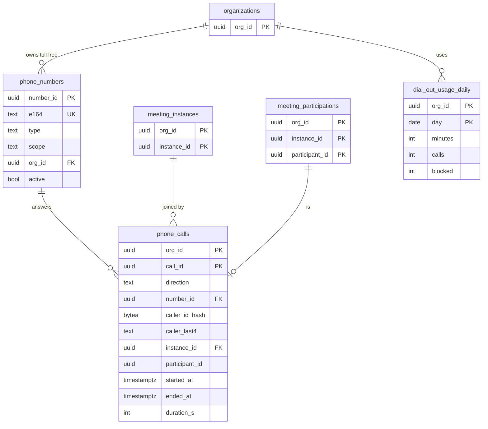

# Data model: 電話

[data-model.md](../data-model.md) の一部。規約は、そちらの 2 節に従う。振る舞いは [telephony.md](../telephony.md)、[ADR-0041](../../decisions/0041-pstn-via-carrier-sip-trunk-and-own-gateway.md)、[ADR-0042](../../decisions/0042-dial-in-numbers-ivr-and-dial-out-limits.md) を正とする。

- 電話は E14（MVP の後）。表は E14 のマイグレーションで作る。事業と番号に関わる部分は、法務の確認（L1・L7）の後に見直す。
- `phone_numbers` は `global` スキーマ。`phone_calls`・`dial_out_usage_daily` はテナントの表。
- 発信者の番号をそのまま持たない。`caller_id_hash`（HMAC）と下 4 桁だけ。
- **会議が分からないまま切れた呼（番号の入力の誤り、パスコードを 3 回誤った、E2EE の会議）は、`phone_calls` に書かない**（組織の文脈がない行を作らない。[data-model.md](../data-model.md) の 11.2 節の 8）。数はメトリクス、流量の制限は Valkey（`rl:{axis}:{value}` の `caller_id_hash` の軸）で扱う。

## 1. ER 図

## 2. 表

### phone_numbers（global）

ダイヤルインの番号。050 は全会議で共用する。0120・0800 は組織の選択（別の契約）。

| 列 | 型 | NULL | 既定 | 説明 |
| --- | --- | --- | --- | --- |
| `number_id` | `uuid` | NO | | 主キー |
| `e164` | `text` | NO | | `+8150...` の形 |
| `type` | `text` | NO | | `050` / `0120` / `0800` |
| `carrier` | `text` | NO | | 卸の事業者の名前 |
| `scope` | `text` | NO | | `shared` / `org` |
| `org_id` | `uuid` | YES | | `scope = 'org'` のとき |
| `active` | `boolean` | NO | `true` | |
| `created_at` | `timestamptz` | NO | `now()` | |
| `retired_at` | `timestamptz` | YES | | |

- 一意：`UNIQUE (e164)`。
- 外部キー：`org_id` → `organizations`。
- CHECK：`e164 ~ '^\+81[0-9]{9,10}$'`、`(scope = 'org') = (org_id IS NOT NULL)`、`type IN (...)`。
- 書く主体：運用者。
- S1 の規模：数十行。

### phone_calls

会議が分かった後の通話の記録（ダイヤルインは IVR で会議の番号が合った時点、ダイヤルアウトは発信の時点で作る）。

| 列 | 型 | NULL | 既定 | 説明 |
| --- | --- | --- | --- | --- |
| `org_id`、`call_id` | `uuid` | NO | | 主キー。`org_id` は会議の組織 |
| `direction` | `text` | NO | | `in` / `out` |
| `number_id` | `uuid` | NO | | ダイヤルインで受けた番号、ダイヤルアウトで通知した番号 |
| `caller_id_hash` | `bytea` | YES | | 相手の番号の HMAC。非通知は NULL |
| `caller_last4` | `text` | YES | | 表示に使う下 4 桁 |
| `instance_id` | `uuid` | NO | | |
| `participant_id` | `uuid` | YES | | 会議に入ったとき（パスコードを誤った、相手が 1 を押さなかった場合は NULL） |
| `dialed_by_user_id` | `uuid` | YES | | ダイヤルアウトを行った人 |
| `started_at` | `timestamptz` | NO | | |
| `answered_at` | `timestamptz` | YES | | ダイヤルアウトで相手が出た時刻 |
| `ended_at` | `timestamptz` | YES | | |
| `end_reason` | `text` | YES | | `hangup` / `passcode_failed` / `consent_declined` / `not_answered` / `not_accepted` / `removed` / `meeting_ended` / `bridge_failed` |
| `duration_s` | `integer` | YES | | |

- 外部キー：`(org_id, instance_id)` → `meeting_instances`、`number_id` → `global.phone_numbers`。
- CHECK：`direction = 'out'` なら `dialed_by_user_id IS NOT NULL`。`caller_last4 ~ '^[0-9]{4}$'`。
- 索引：`(org_id, instance_id)`（会議の詳細）、`(org_id, started_at)`（集計と組織の平均の 5 倍の検知）。
- 書く主体：API の内部の口（`/internal/phone/join`、ダイヤルアウト）。E2EE の会議では作らない（I-12。サービス関数で `meeting_instances.e2ee` を確かめる）。
- 保持：12 か月（[security.md](../security.md) の 9 節）。
- S1 の規模：E14 の実績で見積もる。

### dial_out_usage_daily

組織ごとの 1 日のダイヤルアウトの分数と拒否の数。組織の 1 日の上限（既定 3,000 分）と、不正な発信の検知に使う。

| 列 | 型 | NULL | 既定 | 説明 |
| --- | --- | --- | --- | --- |
| `org_id` | `uuid` | NO | | |
| `day` | `date` | NO | | 組織のタイムゾーンの日付 |
| `minutes` | `integer` | NO | `0` | |
| `calls` | `integer` | NO | `0` | |
| `blocked` | `integer` | NO | `0` | 宛先の規則・上限で拒否した数 |
| `updated_at` | `timestamptz` | NO | `now()` | |

- 主キー：`(org_id, day)`。
- 書く主体：API（発信の前に `minutes` を見る、終話で足す）。
- 保持：36 か月（利用の集計と同じ。既定案）。
